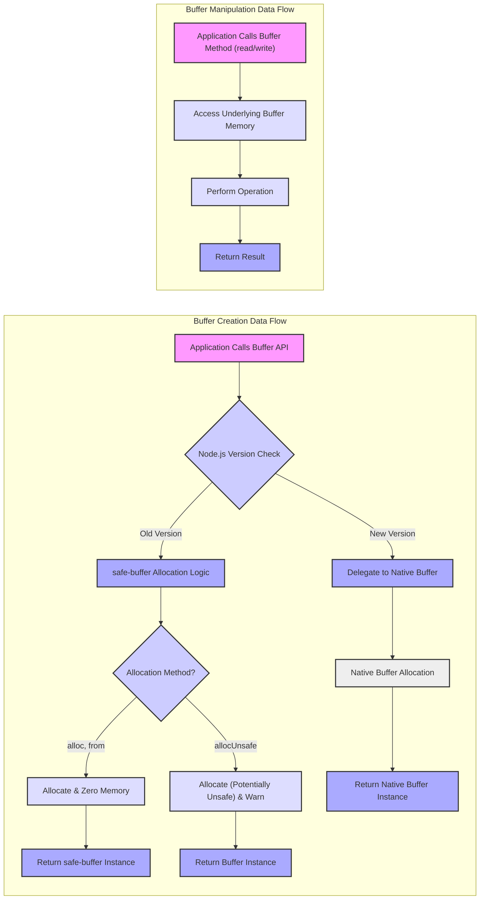

# Project Design Document: safe-buffer

**Version:** 1.1
**Date:** October 26, 2023
**Author:** AI Software Architect

## 1. Introduction

This document provides an enhanced design overview of the `safe-buffer` project, a JavaScript library hosted on GitHub at [https://github.com/feross/safe-buffer](https://github.com/feross/safe-buffer). This iteration builds upon the previous design, offering more granular details about the project's architecture, data flow, and security considerations. The primary goal remains to provide a clear and comprehensive understanding of the system for subsequent threat modeling activities.

## 2. Goals and Non-Goals

### 2.1. Goals

*   Provide a robust and reliable backport of the modern Node.js `Buffer` API for older Node.js environments (specifically versions prior to 4.5.0).
*   Ensure safer buffer creation by guaranteeing that newly allocated memory is initialized, thereby preventing the accidental exposure of sensitive data residing in uninitialized memory regions.
*   Maintain a high degree of API compatibility with the native `Buffer` object to minimize disruption and facilitate seamless integration into existing codebases.
*   Offer a performant and lightweight alternative to relying solely on potentially unsafe native `Buffer` implementations in older Node.js versions.
*   Serve as a dependable dependency for other Node.js modules, ensuring consistent and secure `Buffer` behavior across different Node.js versions.

### 2.2. Non-Goals

*   To introduce entirely new or extended `Buffer` functionalities beyond those present in contemporary Node.js versions.
*   To address performance limitations inherent in older JavaScript engines or the underlying Node.js runtime environment.
*   To meticulously polyfill every single edge case or newly introduced feature of the native `Buffer` API, particularly if these features do not directly impact the core goals of safety and fundamental functionality.
*   To incorporate advanced security features beyond safe buffer allocation and basic input validation. This excludes functionalities like cryptographic operations, advanced memory protection schemes, or sophisticated sanitization techniques.

## 3. Architectural Overview

The `safe-buffer` library operates as a conditional polyfill. Upon being required, it dynamically determines whether to utilize its own safe implementation or defer to the native `Buffer` provided by the current Node.js environment. This decision is primarily based on the detected Node.js version. For versions older than 4.5.0, the `safe-buffer` implementation is activated.

The central architectural element is the safe buffer allocation mechanism. This ensures that when a new buffer is created using `safe-buffer`, the underlying memory is explicitly initialized to zero. This mitigates the risk associated with reading potentially sensitive data from uninitialized memory.

```mermaid
graph LR
    subgraph "Node.js Application Environment"
        A["Application Code"] --> B("require('safe-buffer').Buffer");
        B --> C{Check Node.js Version (< 4.5.0)?};
    end

    C -- "Yes" --> D["safe-buffer Implementation Logic"];
    C -- "No" --> E["Native Buffer Implementation (Node.js)"];

    subgraph "safe-buffer Implementation Logic"
        D --> F["Buffer Constructor/Static Method Interception"];
        F --> G{Allocation Method (alloc, allocUnsafe, etc.)?};
        G -- "alloc, from, etc." --> H["Safe Memory Allocation (Zero-filled)"];
        G -- "allocUnsafe" --> I["Unsafe Memory Allocation (Passthrough with Warning)"];
        H --> J["Return safe-buffer Instance"];
        I --> K["Return Native Buffer Instance (if available, with warning)"];
    end

    subgraph "Native Buffer Implementation (Node.js)"
        E --> L["Native Buffer Allocation Logic"];
        L --> M["Return Native Buffer Instance"];
    end

    style A fill:#f9f,stroke:#333,stroke-width:2px
    style B fill:#ccf,stroke:#333,stroke-width:2px
    style C fill:#ccf,stroke:#333,stroke-width:2px
    style D fill:#aaf,stroke:#333,stroke-width:2px
    style E fill:#aaf,stroke:#333,stroke-width:2px
    style F fill:#ddf,stroke:#333,stroke-width:2px
    style G fill:#ccf,stroke:#333,stroke-width:2px
    style H fill:#ddf,stroke:#333,stroke-width:2px
    style I fill:#ddf,stroke:#333,stroke-width:2px
    style J fill:#aaf,stroke:#333,stroke-width:2px
    style K fill:#aaf,stroke:#333,stroke-width:2px
    style L fill:#eee,stroke:#333,stroke-width:2px
    style M fill:#aaf,stroke:#333,stroke-width:2px
```

**Key Architectural Components:**

*   **Entry Point and Version Detection (`index.js`):** This module serves as the primary entry point. It performs the crucial task of detecting the current Node.js version to determine whether to activate the `safe-buffer` implementation or delegate to the native `Buffer`.
*   **Conditional Logic:** The core decision-making process that dictates whether the `safe-buffer` implementation is used. This is based on the Node.js version check.
*   **Safe Allocation Implementation:** This component houses the logic for safely allocating buffer memory. It typically involves using `Uint8Array` or similar mechanisms to ensure that the allocated memory is initialized with zeros.
*   **`allocUnsafe` Handling:**  `safe-buffer` often provides a safer alternative even when `allocUnsafe` is called in older Node.js versions, potentially by issuing a warning or providing a safer fallback.
*   **API Compatibility Layer:** This layer ensures that the `safe-buffer` object exposes an API that is functionally equivalent to the native `Buffer`, allowing applications to interact with it without significant code modifications.
*   **Internal Utility Functions:** These are helper functions used for various internal tasks, such as type checking, argument validation, and potentially for performance optimizations within the `safe-buffer` implementation.
*   **Native Buffer Passthrough:** When running on newer Node.js versions, `safe-buffer` essentially acts as a passthrough, directly utilizing the native `Buffer` implementation for performance reasons.

## 4. Data Flow

The primary data flow within `safe-buffer` centers around the creation and subsequent manipulation of buffer objects.

**Buffer Creation Flow:**

1. Application code initiates buffer creation by calling `require('safe-buffer').Buffer(...)` or a static method like `Buffer.alloc(...)` or `Buffer.from(...)`.
2. The `safe-buffer` library intercepts this call and checks the current Node.js version.
3. **If the Node.js version is older than 4.5.0 (using `safe-buffer` implementation):**
    *   The requested buffer size and type are determined based on the arguments provided.
    *   For methods like `alloc` and `from`, memory is allocated, and crucially, it is initialized to zero.
    *   For `allocUnsafe`, a warning might be issued, and depending on the implementation, a safer allocation might be performed, or the native `allocUnsafe` might be used with its inherent risks.
    *   A `Buffer` object (or a compatible instance) is created, referencing this safely allocated memory.
4. **If the Node.js version is 4.5.0 or newer (using native `Buffer`):**
    *   The call is directly forwarded to the native `Buffer` constructor or the corresponding static method provided by Node.js.
    *   The native `Buffer` allocation logic is executed.

**Buffer Manipulation (Read/Write) Flow:**

1. Application code interacts with the buffer object using methods like `buffer.write(...)`, `buffer.readUInt8(...)`, `buffer.slice(...)`, etc.
2. These methods operate directly on the underlying memory associated with the buffer object.
3. For `safe-buffer` instances, these operations are designed to be fully compatible with the native `Buffer` API, ensuring consistent behavior when reading and writing data to the allocated memory.



## 5. Security Considerations

While the primary security benefit of `safe-buffer` lies in preventing the exposure of uninitialized memory, several other security aspects warrant consideration:

*   **Input Validation:**  The library must rigorously validate all inputs, such as buffer sizes, offsets, and data types, to prevent potential vulnerabilities like buffer overflows, out-of-bounds access, or type confusion issues.
*   **Memory Safety:** Although `safe-buffer` addresses uninitialized memory, general memory management practices in the consuming application are still crucial. Improper handling of buffer lifetimes can lead to memory leaks or dangling pointers, which could have security implications.
*   **Dependency Chain Security:**  While `safe-buffer` has minimal direct dependencies, the security of its transitive dependencies (if any are introduced in the future) must be continuously monitored to mitigate supply chain risks. The fewer dependencies, the smaller the attack surface.
*   **API Compatibility and Subtle Differences:** While striving for perfect API compatibility, subtle discrepancies between `safe-buffer`'s behavior and the native `Buffer` could potentially introduce unexpected behavior or vulnerabilities in applications that rely on specific, perhaps undocumented, quirks of the native implementation. Thorough testing is essential.
*   **Potential for Side-Channel Attacks:** Although less probable for a library focused on safe buffer allocation, theoretical side-channel attacks based on timing differences or memory access patterns could exist. This is a general concern for any code manipulating memory, but the risk is likely low for `safe-buffer`.
*   **Handling of `allocUnsafe`:** The way `safe-buffer` handles calls to `allocUnsafe` in older Node.js versions is a key security consideration. Ideally, it should either provide a safer alternative or clearly warn developers about the potential risks associated with uninitialized memory.

## 6. Dependencies

The `safe-buffer` library is designed to be lightweight and has very few external dependencies. This is a deliberate design choice to minimize the attack surface and reduce the risk of introducing vulnerabilities through third-party code. Its primary dependency is on:

*   **Node.js Built-in Modules:**  The library relies on core Node.js modules for essential functionalities such as:
    *   `process`: To determine the current Node.js version.
    *   Potentially other built-in modules for low-level memory manipulation or type checking.

The minimal dependency footprint is a significant security advantage.

## 7. Deployment

`safe-buffer` is typically deployed as a dependency within other Node.js projects. Its integration is seamless and generally requires no special configuration.

**Deployment Procedure:**

1. Add `safe-buffer` as a dependency to the `dependencies` or `devDependencies` section of the consuming project's `package.json` file.
2. Execute the appropriate package manager command (e.g., `npm install` or `yarn add safe-buffer`) to download and install the library.
3. Within the consuming application's code, use `require('safe-buffer')` to access the `Buffer` constructor. In older Node.js versions, this will automatically provide the safe implementation. In newer versions, it will generally pass through to the native `Buffer`.

**Deployment Considerations:**

*   Ensure the correct version of `safe-buffer` is specified in `package.json` to maintain consistency across environments.
*   Be mindful of potential conflicts if other libraries in the dependency tree also attempt to polyfill or modify the global `Buffer` object (though this is generally uncommon).

## 8. Future Considerations

*   **Adaptation to Node.js Evolution:** Continuously monitor changes and improvements in the native Node.js `Buffer` implementation. As older, vulnerable Node.js versions become less prevalent, the need for `safe-buffer` might eventually diminish, potentially leading to deprecation or a shift in focus.
*   **Performance Benchmarking and Optimization:** While safety is paramount, ongoing performance analysis and optimization of the `safe-buffer` implementation could be beneficial, especially for scenarios where it is actively used.
*   **Integration with Security Analysis Tools:** Ensure that `safe-buffer` does not negatively impact the functionality or accuracy of static analysis security testing (SAST) tools or other security scanning mechanisms.
*   **Exploration of Advanced Memory Safety Techniques:** While not a current goal, future exploration of more advanced memory safety techniques, if they become relevant and performant in JavaScript environments, could be considered.
*   **Community Feedback and Contributions:** Actively engage with the open-source community to gather feedback, address potential issues, and consider valuable contributions to the project.

This enhanced design document provides a more detailed and nuanced understanding of the `safe-buffer` project's architecture, data flow, and security considerations. This information will be crucial for conducting thorough threat modeling exercises and ensuring the security of applications that rely on this library, particularly in older Node.js environments.