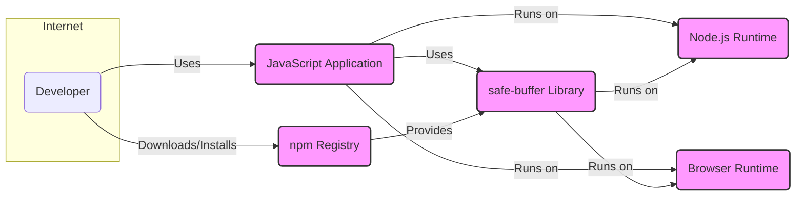
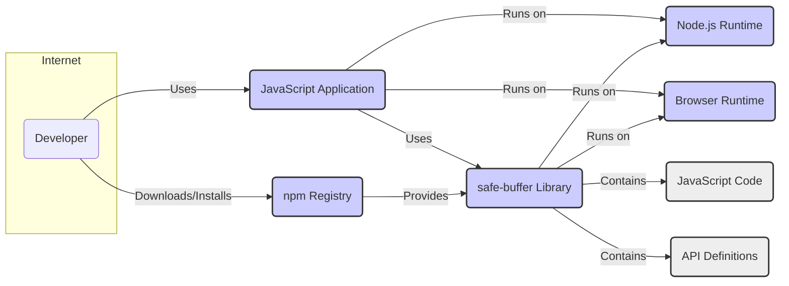
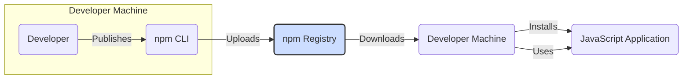
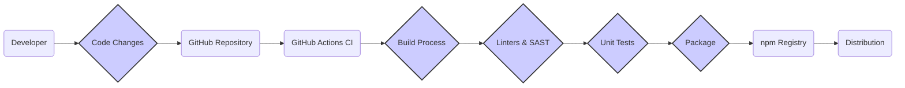

# BUSINESS POSTURE

- Business Priorities and Goals:
  - Provide a secure and reliable JavaScript library for handling buffers in Node.js and browser environments.
  - Mitigate common buffer-related security vulnerabilities such as buffer overflows and out-of-bounds access.
  - Offer a developer-friendly API that is easy to integrate into existing JavaScript projects.
  - Maintain compatibility with existing Node.js and browser buffer APIs where possible, while prioritizing security.
  - Ensure the library is performant and does not introduce significant overhead compared to native buffer implementations.

- Most Important Business Risks:
  - Security vulnerabilities in the library itself could undermine the security of applications that depend on it.
  - Performance regressions compared to native buffers could discourage adoption.
  - API incompatibility with existing buffer usage patterns could lead to integration challenges and developer frustration.
  - Lack of community adoption and maintenance could lead to the library becoming outdated and unsupported.
  - Supply chain attacks targeting the distribution channels (e.g., npm registry) could compromise the library's integrity.

# SECURITY POSTURE

- Existing Security Controls:
  - security control: Public code repository on GitHub (https://github.com/feross/safe-buffer) - provides transparency and allows for community review.
  - security control: GitHub's built-in dependency scanning - helps identify known vulnerabilities in dependencies.
  - security control: Open-source license (MIT) - encourages community contributions and scrutiny.

- Accepted Risks:
  - accepted risk: Potential for undiscovered vulnerabilities in the code, inherent in any software project.
  - accepted risk: Reliance on the security of the underlying JavaScript runtime environments (Node.js, browsers).
  - accepted risk: Risk of malicious contributions if the project accepts external contributions without thorough review.

- Recommended Security Controls:
  - security control: Implement automated Static Application Security Testing (SAST) in the CI/CD pipeline to identify potential code-level vulnerabilities.
  - security control: Conduct regular code reviews, especially for security-sensitive areas and external contributions.
  - security control: Establish a process for reporting and handling security vulnerabilities, including a security policy and contact information.
  - security control: Consider fuzz testing to identify potential buffer-related vulnerabilities and edge cases.
  - security control: Implement Software Composition Analysis (SCA) to continuously monitor dependencies for vulnerabilities and license compliance.

- Security Requirements:
  - Authentication: Not directly applicable to a JavaScript library. Authentication is relevant for systems that *use* the library, but not for the library itself.
  - Authorization: Not directly applicable to a JavaScript library. Authorization is relevant for systems that *use* the library, but not for the library itself.
  - Input Validation:
    - Requirement: Validate all input parameters related to buffer creation and manipulation (e.g., buffer sizes, offsets, lengths) to prevent out-of-bounds access and other buffer-related vulnerabilities.
    - Requirement: Ensure that input validation is performed consistently across all API entry points.
  - Cryptography:
    - Requirement: If the library is intended to be used in cryptographic contexts (e.g., handling cryptographic keys or data), ensure that cryptographic operations are performed securely using well-established and vetted cryptographic libraries and practices.
    - Requirement: Avoid implementing custom cryptography within the library if possible, and rely on established cryptographic modules provided by the runtime environment or dedicated libraries.

# DESIGN

- C4 CONTEXT

- C4 CONTEXT Elements:
  - - Name: Developer
    - Type: Person
    - Description: Software developers who use the `safe-buffer` library in their JavaScript applications.
    - Responsibilities: Integrate the `safe-buffer` library into their projects, use the API correctly, and ensure their applications are secure.
    - Security controls: security control: Secure development practices, input validation in their applications, dependency management.
  - - Name: safe-buffer Library
    - Type: Software System
    - Description: A JavaScript library providing a safer API for working with buffers in Node.js and browser environments.
    - Responsibilities: Provide secure buffer allocation and manipulation functions, mitigate buffer-related vulnerabilities, and offer a compatible API.
    - Security controls: security control: Input validation within the library, secure coding practices, vulnerability scanning, code review.
  - - Name: Node.js Runtime
    - Type: Software System
    - Description: The Node.js JavaScript runtime environment where JavaScript applications using `safe-buffer` can execute.
    - Responsibilities: Provide the underlying JavaScript execution environment, including buffer implementations and APIs.
    - Security controls: security control: Runtime environment security features, operating system security controls, regular updates and patching.
  - - Name: Browser Runtime
    - Type: Software System
    - Description: Web browser environments (e.g., Chrome, Firefox, Safari) where JavaScript applications using `safe-buffer` can execute.
    - Responsibilities: Provide the browser-based JavaScript execution environment, including buffer implementations and APIs.
    - Security controls: security control: Browser security features (sandboxing, Content Security Policy), regular browser updates, website security practices.
  - - Name: npm Registry
    - Type: Software System
    - Description: The npm public registry, a package repository where the `safe-buffer` library is published and distributed.
    - Responsibilities: Host and distribute JavaScript packages, including `safe-buffer`.
    - Security controls: security control: Package integrity checks, malware scanning, account security for package publishers.
  - - Name: JavaScript Application
    - Type: Software System
    - Description: Applications built by developers that depend on and utilize the `safe-buffer` library.
    - Responsibilities: Implement application logic, handle user input, and utilize libraries like `safe-buffer` to enhance security and functionality.
    - Security controls: security control: Application-level security controls (authentication, authorization, input validation), secure coding practices, dependency management.

- C4 CONTAINER

- C4 CONTAINER Elements:
  - - Name: safe-buffer Library
    - Type: Container - JavaScript Library
    - Description: The `safe-buffer` library as a deployable unit, consisting of JavaScript code and API definitions.
    - Responsibilities: Encapsulate the buffer manipulation logic, provide a well-defined API, and be distributable via package managers.
    - Security controls: security control: Code signing (if applicable for JavaScript libraries), vulnerability scanning during development, secure release process.
  - - Name: JavaScript Code
    - Type: Component - Code Module
    - Description: The actual JavaScript source code implementing the buffer functionalities of the library.
    - Responsibilities: Implement the core logic of safe buffer operations, handle input validation, and ensure correct and secure buffer manipulation.
    - Security controls: security control: Secure coding practices, code reviews, static analysis, unit testing, integration testing.
  - - Name: API Definitions
    - Type: Component - API Interface
    - Description: Defines the public API of the `safe-buffer` library, specifying the functions and interfaces available to developers.
    - Responsibilities: Provide a clear and consistent interface for developers to interact with the library, document API usage and security considerations.
    - Security controls: security control: API design review for security, clear documentation on secure usage, versioning of API changes.
  - - Name: Node.js Runtime
    - Type: Container - Runtime Environment
    - Description: The Node.js environment where the library and applications using it are executed.
    - Responsibilities: Provide the JavaScript engine, buffer APIs, and other runtime functionalities.
    - Security controls: security control: Node.js security updates, operating system security, process isolation.
  - - Name: Browser Runtime
    - Type: Container - Runtime Environment
    - Description: Web browser environments where the library and applications using it are executed.
    - Responsibilities: Provide the JavaScript engine, browser-specific buffer APIs, and web security features.
    - Security controls: security control: Browser security features (sandboxing, CSP), browser updates, website security practices.
  - - Name: npm Registry
    - Type: Container - Package Registry
    - Description: The npm registry for distributing and managing JavaScript packages.
    - Responsibilities: Host and distribute the `safe-buffer` package, manage package versions, and provide package metadata.
    - Security controls: security control: npm registry security measures, package verification, malware scanning.
  - - Name: JavaScript Application
    - Type: Container - Application
    - Description: The application that integrates and uses the `safe-buffer` library.
    - Responsibilities: Utilize the library to handle buffers securely within the application's context, implement application-specific security measures.
    - Security controls: security control: Application-level security controls, secure coding practices, dependency management, runtime environment security.

- DEPLOYMENT

- Deployment Architectures:
  - Distribution via npm: The primary deployment method is publishing the library to the npm registry, making it available for developers to install using package managers like npm or yarn.
  - CDN Delivery:  While less common for libraries like `safe-buffer`, it could potentially be hosted on a CDN for direct inclusion in browser-based applications via script tags.
  - Bundled with Applications: Developers bundle the library directly into their application's distribution package.

- Detailed Deployment Architecture (npm Distribution):

- DEPLOYMENT Elements:
  - - Name: npm Registry
    - Type: Deployment Node - Package Registry
    - Description: The npm registry server infrastructure that hosts and serves JavaScript packages, including `safe-buffer`.
    - Responsibilities: Store and distribute package files, manage package metadata, handle download requests, and ensure package availability.
    - Security controls: security control: Infrastructure security (firewalls, intrusion detection), access control, package integrity verification, malware scanning, DDoS protection.
  - - Name: Developer Machine (Publishing)
    - Type: Deployment Node - Developer Environment
    - Description: The developer's local machine used to build, test, and publish the `safe-buffer` library.
    - Responsibilities: Development, testing, packaging, and publishing of the library to the npm registry.
    - Security controls: security control: Secure development environment, code signing keys management, access control to publishing credentials, malware scanning on developer machine.
  - - Name: npm CLI
    - Type: Software - Command Line Interface
    - Description: The npm command-line tool used by developers to interact with the npm registry, including publishing packages.
    - Responsibilities: Package management, interaction with the npm registry API, handling authentication and authorization for publishing.
    - Security controls: security control: Secure communication with npm registry (HTTPS), credential management, software updates.
  - - Name: Developer Machine (Installation)
    - Type: Deployment Node - Developer Environment
    - Description: The developer's local machine where applications are being developed and dependencies are installed.
    - Responsibilities: Application development, dependency management, installation of `safe-buffer` and other packages.
    - Security controls: security control: Secure development environment, dependency vulnerability scanning, software updates, access control.
  - - Name: JavaScript Application (Runtime Environment)
    - Type: Deployment Node - Runtime Environment
    - Description: The target environment (Node.js server, browser) where the JavaScript application using `safe-buffer` is deployed and executed.
    - Responsibilities: Run the JavaScript application, execute the `safe-buffer` library code, and provide the runtime environment.
    - Security controls: security control: Runtime environment security controls (OS hardening, firewalls), application-level security controls, regular patching and updates.

- BUILD

- BUILD Elements:
  - - Name: Developer
    - Type: Person
    - Description: Software developer who writes and modifies the code for the `safe-buffer` library.
    - Responsibilities: Write secure and functional code, commit changes to the repository, and trigger the build process.
    - Security controls: security control: Secure coding practices, code review, local development environment security.
  - - Name: Code Changes
    - Type: Artifact - Source Code
    - Description: Modifications to the source code of the `safe-buffer` library.
    - Responsibilities: Represent the changes being introduced into the codebase.
    - Security controls: security control: Version control (Git), code review, commit signing.
  - - Name: GitHub Repository
    - Type: System - Version Control
    - Description: The GitHub repository hosting the source code of `safe-buffer`.
    - Responsibilities: Store and manage the source code, track changes, and trigger CI/CD pipelines.
    - Security controls: security control: Access control, branch protection, audit logs, vulnerability scanning (GitHub Dependabot, Code Scanning).
  - - Name: GitHub Actions CI
    - Type: System - CI/CD Platform
    - Description: GitHub Actions workflows configured to automate the build, test, and release process for `safe-buffer`.
    - Responsibilities: Automate the build process, run tests, perform security checks, and publish the package.
    - Security controls: security control: Secure workflow definitions, secrets management, isolated build environments, audit logs.
  - - Name: Build Process
    - Type: Process - Build Automation
    - Description: The automated steps involved in compiling, bundling, and preparing the `safe-buffer` library for distribution.
    - Responsibilities: Compile code (if necessary), bundle modules, generate distribution files, and prepare for publishing.
    - Security controls: security control: Build script security, dependency management, reproducible builds (ideally).
  - - Name: Linters & SAST
    - Type: Process - Security Checks
    - Description: Automated tools used to analyze the code for style issues, potential bugs, and security vulnerabilities.
    - Responsibilities: Identify code quality issues and potential security flaws early in the development process.
    - Security controls: security control: SAST tool configuration, rule customization, integration into CI pipeline, vulnerability reporting.
  - - Name: Unit Tests
    - Type: Process - Testing
    - Description: Automated unit tests to verify the functionality and correctness of individual components of the library.
    - Responsibilities: Ensure code quality, detect regressions, and validate the library's behavior.
    - Security controls: security control: Test coverage analysis, secure test data management, test environment isolation.
  - - Name: Package
    - Type: Artifact - Distribution Package
    - Description: The packaged and prepared version of the `safe-buffer` library ready for distribution (e.g., npm package).
    - Responsibilities: Contain all necessary files for distribution, including code, metadata, and documentation.
    - Security controls: security control: Package integrity checks (checksums, signatures), vulnerability scanning of packaged dependencies.
  - - Name: npm Registry
    - Type: System - Package Registry
    - Description: The npm registry where the `safe-buffer` package is published and made available for download.
    - Responsibilities: Host and distribute the package, manage versions, and provide package metadata.
    - Security controls: security control: Registry security measures, package verification, malware scanning, access control for publishers.
  - - Name: Distribution
    - Type: Process - Package Distribution
    - Description: The process of making the `safe-buffer` package available to developers through the npm registry.
    - Responsibilities: Ensure reliable and secure distribution of the package to developers worldwide.
    - Security controls: security control: Secure distribution channels (HTTPS), package integrity verification, monitoring for distribution anomalies.

# RISK ASSESSMENT

- Critical Business Processes:
  - Secure JavaScript application development: The primary business process being protected is the ability for developers to build secure JavaScript applications that rely on buffer operations. `safe-buffer` aims to enhance the security of this process.

- Data to Protect and Sensitivity:
  - Source code of the `safe-buffer` library: Publicly available on GitHub, but integrity and availability are important. Sensitivity: Public, Integrity: Medium, Availability: Medium.
  - Package published to npm registry: Publicly available, but integrity is critical to prevent supply chain attacks. Sensitivity: Public, Integrity: High, Availability: High.
  - Developer credentials for npm publishing: Private and highly sensitive. Sensitivity: High, Integrity: High, Availability: High (for authorized developers).

# QUESTIONS & ASSUMPTIONS

- BUSINESS POSTURE Questions & Assumptions:
  - Assumption: The primary goal is to provide a security-focused buffer library, even if it means slight performance trade-offs compared to native buffers in certain scenarios.
  - Assumption: Target users are JavaScript developers who are concerned about security and are willing to adopt a library that helps mitigate buffer-related vulnerabilities.
  - Question: What is the acceptable level of performance overhead compared to native buffers? Are there specific performance benchmarks or thresholds to consider?
  - Question: What is the target audience in terms of developer skill level and security awareness? Should the library cater to beginners or more experienced developers?

- SECURITY POSTURE Questions & Assumptions:
  - Assumption: The project is committed to maintaining a strong security posture and will prioritize addressing security vulnerabilities promptly.
  - Assumption: The project will leverage community contributions for security reviews and vulnerability reporting.
  - Question: What is the process for handling security vulnerability reports? Is there a dedicated security contact or security policy?
  - Question: What is the desired level of security assurance? Are there specific security certifications or compliance requirements to consider in the future?

- DESIGN Questions & Assumptions:
  - Assumption: The library is designed to be a drop-in replacement for native buffers in most common use cases, while providing enhanced security.
  - Assumption: The API should be as compatible as possible with existing buffer APIs to minimize integration effort for developers.
  - Question: Are there any specific compatibility requirements with different Node.js versions or browser environments?
  - Question: Are there any plans to extend the library's functionality beyond basic buffer operations in the future? If so, what are the security implications of those extensions?