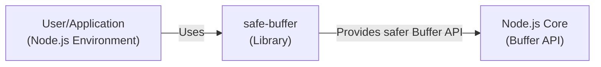
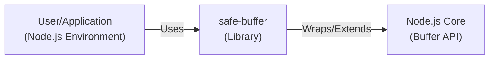
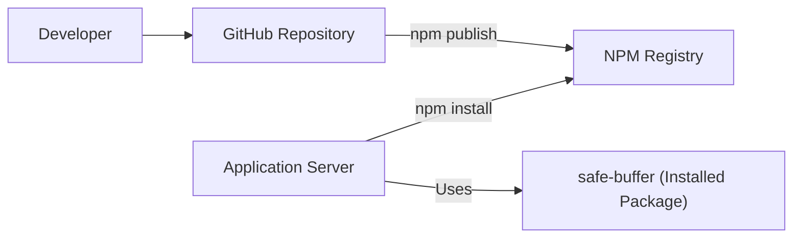
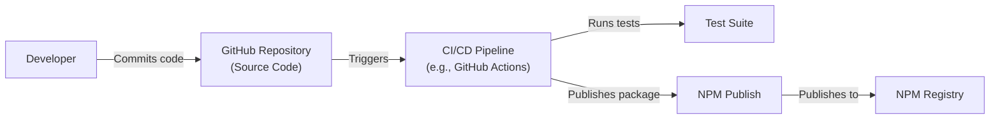

# BUSINESS POSTURE

Business Priorities and Goals:

The `safe-buffer` project aims to provide a safer and more reliable way to handle binary data in Node.js applications. It addresses the issues arising from the older `Buffer` constructor's behavior, which could lead to security vulnerabilities and unexpected application behavior. The primary goal is to enhance the security and stability of Node.js applications that deal with binary data by providing a drop-in replacement for the native `Buffer` API that eliminates the potential for uninitialized memory exposure.

Business Risks:

-   Data Leakage: Unintentional exposure of sensitive data due to the use of uninitialized buffers. This could include secrets, user data, or internal application state.
-   Application Instability: Unexpected behavior or crashes caused by incorrect buffer handling, leading to denial of service or data corruption.
-   Security Exploits: Attackers could potentially exploit the old `Buffer` constructor's behavior to gain access to sensitive information or compromise the application.
-   Reputational Damage: Security incidents or vulnerabilities related to buffer handling could damage the reputation of applications and services using the library.
-   Compliance Violations: Depending on the data being handled, exposure of uninitialized memory could lead to violations of data privacy regulations (e.g., GDPR, CCPA).

# SECURITY POSTURE

Existing Security Controls:

-   security control: Drop-in Replacement: `safe-buffer` is designed as a drop-in replacement for the native Node.js `Buffer` API, minimizing the need for extensive code changes and reducing the risk of introducing new vulnerabilities. (Implemented in the project's core design and API).
-   security control: Explicit Initialization: The library enforces explicit buffer initialization, preventing the accidental use of uninitialized memory. (Implemented in the API methods like `alloc`, `allocUnsafe`, and `from`).
-   security control: Deprecation Warnings: The project likely played a role in raising awareness about the security risks of the old `Buffer` constructor, contributing to its eventual deprecation in later Node.js versions. (Documented in the project's README and potentially in Node.js documentation).
-   security control: Community Scrutiny: As an open-source project, `safe-buffer` benefits from community scrutiny, with developers reviewing the code and identifying potential issues. (Visible on the GitHub repository).
-   security control: Unit Tests: The project includes a test suite to ensure the correct behavior of the library and prevent regressions. (Located in the `test` directory of the repository).

Accepted Risks:

-   accepted risk: Dependency on Node.js Version: The library's effectiveness and necessity depend on the Node.js version being used. Newer versions of Node.js have deprecated the problematic `Buffer` constructor, reducing the need for `safe-buffer`.
-   accepted risk: Limited Scope: `safe-buffer` specifically addresses buffer-related issues and does not provide comprehensive security for all aspects of an application.

Recommended Security Controls:

-   security control: Regular Updates: Ensure that the library is kept up-to-date to benefit from any bug fixes or security patches.
-   security control: Integration with Security Tooling: Integrate `safe-buffer` usage with static analysis tools and linters to detect potential misuses or vulnerabilities related to buffer handling.

Security Requirements:

-   Authentication: Not directly applicable to this library, as it focuses on buffer management, not authentication.
-   Authorization: Not directly applicable to this library.
-   Input Validation: While `safe-buffer` itself doesn't perform input validation, it's crucial for applications using the library to validate any data used to create or manipulate buffers. This prevents potential vulnerabilities like buffer overflows or injection attacks.
-   Cryptography: `safe-buffer` is not a cryptographic library, but it can be used to handle binary data that is part of cryptographic operations. It's important to use appropriate cryptographic libraries and practices when dealing with sensitive data.

# DESIGN

## C4 CONTEXT

Element Description:

-   Element:
    -   Name: User/Application
    -   Type: Node.js Environment
    -   Description: Represents the Node.js application or user code that utilizes the `safe-buffer` library.
    -   Responsibilities: Makes requests to allocate, manipulate, and access binary data using buffers.
    -   Security controls: Input validation, proper error handling, and secure coding practices.

-   Element:
    -   Name: safe-buffer
    -   Type: Library
    -   Description: The `safe-buffer` library, providing a safer alternative to the native Node.js `Buffer` API.
    -   Responsibilities: Provides methods for allocating, manipulating, and accessing buffers in a way that prevents uninitialized memory exposure.
    -   Security controls: Explicit buffer initialization, drop-in replacement for the native `Buffer` API.

-   Element:
    -   Name: Node.js Core
    -   Type: Buffer API
    -   Description: The native Node.js `Buffer` API, which `safe-buffer` wraps and extends.
    -   Responsibilities: Provides the underlying functionality for working with binary data in Node.js.
    -   Security controls: Native Node.js security features and updates.

## C4 CONTAINER

Element Description:

-   Element:
    -   Name: User/Application
    -   Type: Node.js Environment
    -   Description: Represents the Node.js application or user code that utilizes the `safe-buffer` library.
    -   Responsibilities: Makes requests to allocate, manipulate, and access binary data using buffers.
    -   Security controls: Input validation, proper error handling, and secure coding practices.

-   Element:
    -   Name: safe-buffer
    -   Type: Library
    -   Description: The `safe-buffer` library, providing a safer alternative to the native Node.js `Buffer` API.
    -   Responsibilities: Provides methods for allocating, manipulating, and accessing buffers in a way that prevents uninitialized memory exposure.
    -   Security controls: Explicit buffer initialization, drop-in replacement for the native `Buffer` API.

-   Element:
    -   Name: Node.js Core
    -   Type: Buffer API
    -   Description: The native Node.js `Buffer` API, which `safe-buffer` wraps and extends.
    -   Responsibilities: Provides the underlying functionality for working with binary data in Node.js.
    -   Security controls: Native Node.js security features and updates.

## DEPLOYMENT

Deployment Solutions:

1.  NPM Package: The primary deployment method is as an NPM package. Users install it via `npm install safe-buffer`.
2.  Bundled with Applications: The library can be bundled with Node.js applications using tools like Webpack, Browserify, or Parcel.
3.  Included in Node.js Core (Indirectly):  While not directly included, the principles and implementation of `safe-buffer` influenced the changes in later Node.js versions, making the native `Buffer` API safer.

Chosen Solution (NPM Package):

Element Description:

-   Element:
    -   Name: Developer
    -   Type: Human
    -   Description: The developer(s) of the `safe-buffer` library.
    -   Responsibilities: Writing code, maintaining the repository, publishing releases.
    -   Security controls: Code review, secure coding practices, access control to the repository.

-   Element:
    -   Name: GitHub Repository
    -   Type: Code Repository
    -   Description: The source code repository for `safe-buffer` hosted on GitHub.
    -   Responsibilities: Storing the code, managing versions, facilitating collaboration.
    -   Security controls: GitHub's built-in security features, access controls, branch protection rules.

-   Element:
    -   Name: NPM Registry
    -   Type: Package Registry
    -   Description: The public registry for Node.js packages.
    -   Responsibilities: Storing and distributing `safe-buffer` as an installable package.
    -   Security controls: NPM's security features, package signing (optional), vulnerability scanning.

-   Element:
    -   Name: Application Server
    -   Type: Server
    -   Description: The server where a Node.js application that uses `safe-buffer` is deployed.
    -   Responsibilities: Running the application and handling requests.
    -   Security controls: Server hardening, network security, access controls, regular security updates.

-   Element:
    -   Name: safe-buffer (Installed Package)
    -   Type: Library
    -   Description: The installed instance of the `safe-buffer` library within the application's environment.
    -   Responsibilities: Providing safer buffer handling functionality to the application.
    -   Security controls: Inherited from the library's design and implementation.

## BUILD

Build Process Description:

1.  Code Commit: Developers commit code changes to the GitHub repository.
2.  CI/CD Trigger:  A CI/CD pipeline (e.g., GitHub Actions, Travis CI, or similar) is triggered by the commit.
3.  Test Execution: The CI/CD pipeline runs the test suite to ensure the code changes haven't introduced any regressions.
4.  Package Publication: If the tests pass, the CI/CD pipeline publishes a new version of the `safe-buffer` package to the NPM registry. This typically involves running `npm publish`.

Security Controls in Build Process:

-   security control: Automated Testing: The test suite helps ensure the correctness and security of the library.
-   security control: CI/CD Pipeline: Automating the build and publication process reduces the risk of manual errors and ensures consistency.
-   security control: Version Control: Using Git and GitHub provides a clear history of changes and allows for easy rollback if necessary.
-   security control: Access Control:  Access to the GitHub repository and the NPM account used for publishing should be restricted to authorized developers.
-   security control: (Recommended) Dependency Analysis:  Use tools like `npm audit` or Dependabot to identify and address vulnerabilities in dependencies.
-   security control: (Recommended) Code Scanning: Integrate static analysis tools into the CI/CD pipeline to detect potential security issues in the code.

# RISK ASSESSMENT

Critical Business Processes:

-   Reliable execution of Node.js applications that handle binary data.
-   Protection of sensitive data processed by these applications.
-   Maintaining the integrity and availability of services relying on `safe-buffer`.

Data Sensitivity:

-   The `safe-buffer` library itself does not handle specific data. However, it is used to manage buffers, which *can* contain data of varying sensitivity levels, including:
    -   Low Sensitivity: Non-sensitive configuration data, publicly available information.
    -   Medium Sensitivity: Usernames, non-sensitive user preferences.
    -   High Sensitivity: Passwords, API keys, personally identifiable information (PII), financial data, cryptographic keys.

The sensitivity of the data depends entirely on how the application *using* `safe-buffer` utilizes it. `safe-buffer`'s role is to prevent *unintentional* exposure of *whatever* data is placed in the buffer.

# QUESTIONS & ASSUMPTIONS

Questions:

-   Are there any specific compliance requirements (e.g., GDPR, CCPA) that applications using `safe-buffer` need to adhere to? This would influence the recommendations for data handling and security practices.
-   What is the typical deployment environment for applications using this library (e.g., cloud-based, on-premise, serverless)? This helps tailor the deployment diagram and security recommendations.
-   What is the expected level of traffic and load for applications using `safe-buffer`? This can impact performance considerations and scaling strategies.

Assumptions:

-   BUSINESS POSTURE: The primary concern is preventing security vulnerabilities related to uninitialized buffer usage in Node.js applications.
-   SECURITY POSTURE: Developers using `safe-buffer` are aware of general secure coding practices and will implement appropriate input validation and data sanitization measures.
-   DESIGN: The library is primarily used as an NPM package and integrated into Node.js applications. The build process involves standard tools like GitHub Actions and NPM.