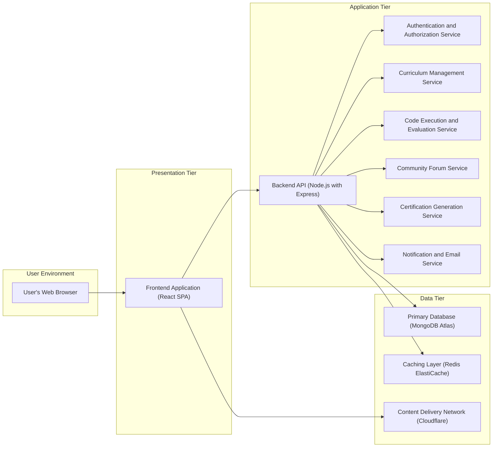
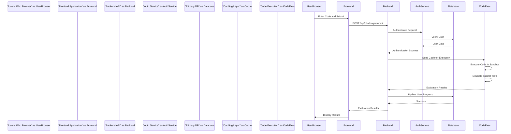

# Project Design Document: freeCodeCamp Platform

**Version:** 1.1
**Date:** October 26, 2023
**Author:** AI Software Architect

## 1. Introduction

This document provides a detailed design overview of the freeCodeCamp platform, an open-source initiative dedicated to offering free coding education. This document is intended to serve as a comprehensive reference for understanding the system's architecture, individual components, and the flow of data within the platform. It is specifically designed to be used as a foundation for subsequent threat modeling exercises.

## 2. Goals and Objectives

The core objectives of the freeCodeCamp platform are:

*   To democratize coding education, making it freely accessible to individuals worldwide.
*   To deliver a structured and comprehensive curriculum encompassing various facets of web development and related technologies.
*   To facilitate active learning through interactive coding challenges and practical projects.
*   To cultivate a vibrant and supportive community where learners can connect, collaborate, and seek assistance.
*   To provide recognized certifications upon successful completion of designated curriculum sections, validating acquired skills.

## 3. High-Level Architecture

The freeCodeCamp platform is structured using a layered architecture, separating concerns into distinct tiers:

*   **User Interface Layer:** Responsible for presenting information to the user and handling user interactions.
*   **Application Logic Layer:** Encompasses the core business logic and functionalities of the platform.
*   **Data Management Layer:** Handles the persistent storage and retrieval of data.

## 4. Component Breakdown

This section provides a detailed breakdown of the key components within the freeCodeCamp platform:

*   **Frontend Application (React SPA):**
    *   Purpose: To provide the interactive user interface for the platform.
    *   Functionality:
        *   Rendering dynamic web pages and handling user interactions using React components.
        *   Making asynchronous API calls to the Backend API to fetch and submit data.
        *   Managing client-side application state using a state management library (e.g., Redux or Zustand).
        *   Displaying curriculum content, interactive coding challenges, forum discussions, and user profiles.
    *   Technology: React, JavaScript (ES6+), HTML5, CSS3, potentially using libraries like `axios` for API calls and a UI framework like Material UI or Ant Design.

*   **Backend API (Node.js with Express):**
    *   Purpose: To handle the core application logic and data processing.
    *   Functionality:
        *   Receiving and routing HTTP requests from the Frontend Application.
        *   Implementing business logic for user authentication, curriculum access, challenge submission evaluation, forum management, and certification processing.
        *   Interacting with the Data Tier components (Database and Cache).
        *   Exposing a RESTful API for communication with the Frontend.
    *   Technology: Node.js, Express.js, potentially using libraries like `body-parser` for request parsing, `cors` for cross-origin handling, and a database driver for MongoDB.

*   **Authentication and Authorization Service:**
    *   Purpose: To securely manage user identities and control access to platform resources.
    *   Functionality:
        *   Handling user registration, login, and logout processes.
        *   Verifying user credentials (username/password) and managing password resets.
        *   Managing user sessions and issuing authentication tokens (e.g., JWT).
        *   Implementing role-based access control (RBAC) to authorize user actions.
        *   Supporting social login integrations (e.g., Google, GitHub authentication via OAuth 2.0).
    *   Technology: Potentially implemented as middleware within the Backend API or as a separate microservice, utilizing libraries like `passport.js` for authentication and `jsonwebtoken` for token management.

*   **Curriculum Management Service:**
    *   Purpose: To manage the structure and content of the freeCodeCamp curriculum.
    *   Functionality:
        *   Storing and retrieving curriculum sections, lessons, challenges, and projects.
        *   Managing the hierarchical structure and dependencies between curriculum items.
        *   Providing APIs for accessing and querying curriculum content.
        *   Potentially handling content updates and versioning.
    *   Technology: Likely integrated within the Backend API, interacting directly with the Primary Database. Content might be stored in a structured format (e.g., JSON or Markdown) within the database.

*   **Code Execution and Evaluation Service:**
    *   Purpose: To securely execute and evaluate user-submitted code for coding challenges.
    *   Functionality:
        *   Receiving code submissions from users via the Backend API.
        *   Executing the code in isolated and secure environments (sandboxes) to prevent malicious activity.
        *   Running predefined test cases against the submitted code.
        *   Evaluating the output and providing feedback (pass/fail, error messages) to the user.
        *   Potentially supporting multiple programming languages and environments.
    *   Technology: Likely utilizes containerization technologies like Docker to create isolated execution environments. Could involve a queueing system (e.g., RabbitMQ or Kafka) to manage execution requests and potentially serverless functions for scalability.

*   **Community Forum Service:**
    *   Purpose: To provide a platform for users to interact, ask questions, and share knowledge.
    *   Functionality:
        *   Managing user posts, threads, replies, and categories.
        *   Implementing search functionality to find relevant discussions.
        *   Providing features for user interaction like upvoting/downvoting, following threads, and direct messaging.
        *   Including moderation tools for managing content and user behavior.
    *   Technology: Could be a separate service or integrated within the Backend API. May utilize a dedicated forum software or a custom implementation with features like real-time updates using WebSockets.

*   **Certification Generation Service:**
    *   Purpose: To generate and manage digital certifications for users who complete curriculum sections.
    *   Functionality:
        *   Verifying user completion of all required challenges and projects within a certification track.
        *   Generating certification documents, typically in PDF format, containing user details and certification information.
        *   Providing a mechanism for verifying the authenticity of generated certifications (e.g., using unique identifiers or blockchain technology).
    *   Technology: Likely integrated within the Backend API, potentially using libraries like `pdfmake` or `jsPDF` for PDF generation.

*   **Notification and Email Service:**
    *   Purpose: To handle sending various types of notifications and emails to users.
    *   Functionality:
        *   Sending registration confirmation emails.
        *   Sending password reset instructions.
        *   Delivering notifications about forum activity, progress updates, and other relevant events.
        *   Potentially supporting different notification channels (e.g., in-app notifications).
    *   Technology: Integration with a third-party email service provider (e.g., SendGrid, Mailgun, AWS SES) via their APIs.

*   **Primary Database (MongoDB Atlas):**
    *   Purpose: To store persistent data for the platform.
    *   Functionality:
        *   Storing user accounts, profiles, learning progress, and forum posts.
        *   Storing curriculum content, challenges, and project definitions.
        *   Storing certification records and related data.
    *   Technology: MongoDB Atlas (likely), a cloud-based NoSQL database service.

*   **Caching Layer (Redis ElastiCache):**
    *   Purpose: To improve performance by caching frequently accessed data.
    *   Functionality:
        *   Caching user session data to reduce database load on authentication.
        *   Caching frequently accessed curriculum content and API responses.
        *   Potentially used for rate limiting and other temporary data storage.
    *   Technology: Redis, likely deployed using a managed service like AWS ElastiCache.

*   **Content Delivery Network (Cloudflare):**
    *   Purpose: To efficiently deliver static assets to users globally, reducing latency and improving loading times.
    *   Functionality:
        *   Caching and serving static files such as images, CSS stylesheets, JavaScript files, and potentially video content.
        *   Providing DDoS protection and other security features.
    *   Technology: Cloudflare (likely), a popular CDN provider.

## 5. Data Flow

Here are detailed data flow scenarios illustrating interactions between components:

*   **User Authentication Flow:**
    1. The "User's Web Browser" sends login credentials (username/email and password) to the "Frontend Application (React SPA)".
    2. The "Frontend Application (React SPA)" makes an HTTPS POST request to the `/api/auth/login` endpoint of the "Backend API (Node.js with Express)".
    3. The "Backend API (Node.js with Express)" forwards the credentials to the "Authentication and Authorization Service".
    4. The "Authentication and Authorization Service" queries the "Primary Database (MongoDB Atlas)" to verify the user's credentials.
    5. Upon successful verification, the "Authentication and Authorization Service" generates a JWT.
    6. The JWT is returned to the "Backend API (Node.js with Express)".
    7. The "Backend API (Node.js with Express)" may store session information in the "Caching Layer (Redis ElastiCache)".
    8. The "Backend API (Node.js with Express)" sends an HTTPS response containing the JWT to the "Frontend Application (React SPA)".
    9. The "Frontend Application (React SPA)" stores the JWT (e.g., in local storage or a cookie) for subsequent authenticated requests.

*   **Accessing Curriculum Content Flow:**
    1. The "User's Web Browser" navigates to a curriculum page, triggering a request from the "Frontend Application (React SPA)".
    2. The "Frontend Application (React SPA)" makes an HTTPS GET request to the `/api/curriculum/{section}` endpoint of the "Backend API (Node.js with Express)", potentially including an authentication token in the header.
    3. The "Backend API (Node.js with Express)" authenticates the request using the "Authentication and Authorization Service".
    4. The "Backend API (Node.js with Express)" retrieves the requested curriculum data from the "Curriculum Management Service", which fetches it from the "Primary Database (MongoDB Atlas)" or potentially the "Caching Layer (Redis ElastiCache)".
    5. The curriculum data is returned to the "Backend API (Node.js with Express)".
    6. The "Backend API (Node.js with Express)" sends the curriculum data as an HTTPS response to the "Frontend Application (React SPA)".
    7. The "Frontend Application (React SPA)" renders the curriculum content for the user.

*   **Submitting and Evaluating a Code Challenge Flow:**
    1. The user writes code in the challenge editor within the "Frontend Application (React SPA)".
    2. The "Frontend Application (React SPA)" sends the code submission via an HTTPS POST request to the `/api/challenge/submit` endpoint of the "Backend API (Node.js with Express)".
    3. The "Backend API (Node.js with Express)" authenticates the request.
    4. The "Backend API (Node.js with Express)" sends the code submission to the "Code Execution and Evaluation Service".
    5. The "Code Execution and Evaluation Service" executes the code in a sandboxed environment.
    6. The code is evaluated against predefined test cases.
    7. The results of the evaluation are returned to the "Code Execution and Evaluation Service".
    8. The "Code Execution and Evaluation Service" sends the results back to the "Backend API (Node.js with Express)".
    9. The "Backend API (Node.js with Express)" updates the user's progress in the "Primary Database (MongoDB Atlas)".
    10. The "Backend API (Node.js with Express)" sends the evaluation results back to the "Frontend Application (React SPA)".
    11. The "Frontend Application (React SPA)" displays the results to the user.

## 6. Security Considerations

This section expands on the security considerations for the platform, providing more specific examples:

*   **Authentication and Authorization:**
    *   **Threat:** Brute-force attacks on login forms.
    *   **Mitigation:** Implementing rate limiting on login attempts, using CAPTCHA, and potentially account lockout mechanisms.
    *   **Threat:** Stolen or compromised user credentials.
    *   **Mitigation:** Enforcing strong password policies, encouraging the use of password managers, and considering multi-factor authentication (MFA) via TOTP or email verification. Securely storing password hashes using strong hashing algorithms (e.g., bcrypt or Argon2) with unique salts.
    *   **Threat:** Unauthorized access to resources.
    *   **Mitigation:** Implementing robust role-based access control (RBAC) to ensure users only have access to the resources and functionalities they are authorized for. Verifying JWT signatures on every protected API endpoint.

*   **Input Validation:**
    *   **Threat:** Cross-Site Scripting (XSS) attacks.
    *   **Mitigation:** Implementing strict input validation on both the frontend and backend to sanitize user-provided data. Encoding output data before rendering it in the browser. Utilizing Content Security Policy (CSP) headers to control the sources from which the browser is allowed to load resources.
    *   **Threat:** SQL Injection attacks.
    *   **Mitigation:** Using parameterized queries or Object-Relational Mappers (ORMs) to prevent the injection of malicious SQL code. Implementing least privilege principles for database access.
    *   **Threat:** Command Injection attacks.
    *   **Mitigation:** Avoiding direct execution of system commands based on user input. If necessary, carefully sanitize and validate input before passing it to system commands.

*   **Data Protection:**
    *   **Threat:** Data breaches and unauthorized access to sensitive data.
    *   **Mitigation:** Encrypting sensitive data at rest in the database using encryption features provided by MongoDB Atlas. Encrypting data in transit using HTTPS for all communication between the client and server. Regularly backing up data and storing backups securely.
    *   **Threat:** Exposure of sensitive data through logging.
    *   **Mitigation:** Avoiding logging sensitive information (e.g., passwords, API keys). Implementing secure logging practices and access controls for log files.

*   **Code Execution Security:**
    *   **Threat:** Malicious code execution that could compromise the server or other users.
    *   **Mitigation:** Utilizing containerization technologies like Docker to create isolated and resource-limited environments for executing user code. Implementing strict resource limits (CPU, memory, time) to prevent denial-of-service attacks. Employing security scanning tools to identify potential vulnerabilities in the execution environment.

*   **Infrastructure Security:**
    *   **Threat:** Unauthorized access to servers and infrastructure components.
    *   **Mitigation:** Implementing strong firewall rules to restrict network access. Regularly patching servers and software to address known vulnerabilities. Using intrusion detection and prevention systems (IDPS). Securely configuring cloud services and following security best practices provided by the cloud provider.
    *   **Threat:** Distributed Denial of Service (DDoS) attacks.
    *   **Mitigation:** Utilizing a CDN like Cloudflare, which provides DDoS protection services. Implementing rate limiting on API endpoints.

*   **Dependency Management:**
    *   **Threat:** Vulnerabilities in third-party libraries and dependencies.
    *   **Mitigation:** Regularly updating dependencies to the latest stable versions. Using dependency scanning tools (e.g., Snyk or npm audit) to identify and address known vulnerabilities.

*   **Cross-Site Request Forgery (CSRF) Prevention:**
    *   **Threat:** Malicious websites or emails tricking authenticated users into performing unintended actions.
    *   **Mitigation:** Implementing anti-CSRF tokens (Synchronizer Tokens) for state-changing requests. Using the `SameSite` attribute for cookies to prevent cross-site request inclusion.

*   **Rate Limiting:**
    *   **Threat:** Abuse of API endpoints leading to resource exhaustion or denial of service.
    *   **Mitigation:** Implementing rate limits on API endpoints based on IP address or user identity.

*   **Logging and Monitoring:**
    *   **Importance:** Essential for detecting and responding to security incidents.
    *   **Implementation:** Implementing comprehensive logging of security-related events (e.g., login attempts, failed authentication, access to sensitive resources). Monitoring system health and security metrics. Setting up alerts for suspicious activity.

## 7. Deployment

The freeCodeCamp platform is likely deployed on a cloud infrastructure, leveraging various services for scalability, reliability, and security. A potential deployment architecture includes:

*   **Cloud Provider:** AWS, Google Cloud Platform (GCP), or Azure.
*   **Container Orchestration:** Kubernetes (e.g., Amazon EKS, Google Kubernetes Engine, Azure Kubernetes Service) for managing and scaling containerized application components.
*   **Container Registry:** Docker Hub, Amazon ECR, Google Container Registry, or Azure Container Registry for storing and managing Docker images.
*   **Load Balancers:** AWS Elastic Load Balancing (ELB), Google Cloud Load Balancing, or Azure Load Balancer to distribute traffic across multiple instances of the Backend API and Frontend Application.
*   **Database as a Service:** MongoDB Atlas for a managed NoSQL database.
*   **Caching as a Service:** Redis ElastiCache (AWS), Google Cloud Memorystore, or Azure Cache for Redis.
*   **CDN:** Cloudflare for content delivery, DDoS protection, and other security features.
*   **CI/CD Pipeline:** GitHub Actions, GitLab CI, Jenkins, or CircleCI for automated building, testing, and deployment of code changes.
*   **Infrastructure as Code (IaC):** Terraform or CloudFormation for managing and provisioning infrastructure resources.

## 8. Future Considerations

*   **Adopting a Microservices Architecture:** Further decomposing the Backend API into smaller, independent microservices to enhance scalability, fault isolation, and development agility.
*   **Enhancements to the Code Execution Environment:** Exploring more advanced sandboxing techniques and potentially supporting more programming languages and environments.
*   **Personalized Learning Experiences:** Implementing features to tailor the curriculum and learning paths based on individual user needs and progress.
*   **Integration with Educational Partners:** Collaborating with other educational platforms or institutions to expand the reach and impact of freeCodeCamp.
*   **Advanced Analytics and Reporting:** Implementing more sophisticated analytics to track user engagement, identify areas for improvement in the curriculum, and measure the effectiveness of the platform.
*   **Exploring Blockchain for Certifications:** Utilizing blockchain technology to create tamper-proof and verifiable digital certifications.

This revised document provides a more detailed and comprehensive design overview of the freeCodeCamp platform, offering a stronger foundation for subsequent threat modeling activities.