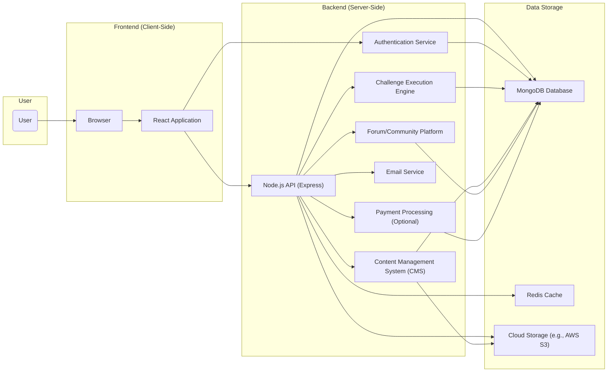
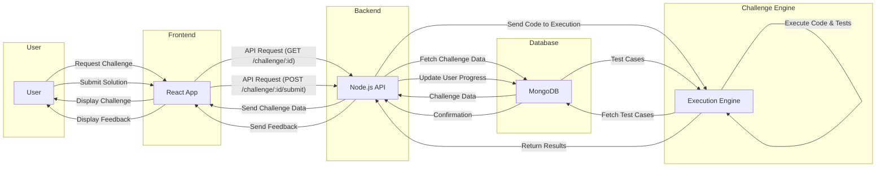

## Project Design Document: FreeCodeCamp Platform (Improved)

**1. Project Overview**

This document details the architecture of the FreeCodeCamp platform, an open-source initiative providing free coding education. The platform delivers an interactive curriculum encompassing coding challenges, projects, and informational articles, fostering a collaborative learning environment. This design serves as the basis for subsequent threat modeling activities.

**2. Goals and Objectives**

*   To offer a comprehensive and universally accessible platform for learning web development and related programming skills.
*   To provide a structured learning path through interactive coding exercises and practical projects.
*   To cultivate a supportive community where learners can connect, collaborate, and seek assistance.
*   To maintain a free and open-source model, ensuring inclusivity and accessibility.
*   To track individual learner progress and award certifications upon successful completion of curriculum sections.
*   To facilitate contributions to the platform's codebase and educational content by the community.

**3. High-Level Architecture**

The FreeCodeCamp platform employs a standard web application architecture, consisting of a frontend, backend, and data storage layers.

*   **User:** Represents individuals interacting with the platform via web browsers.
*   **Frontend (Client-Side):**
    *   **React Application:** The primary user interface, built with React, responsible for rendering the UI, handling user interactions, and communicating with the backend API. Potential vulnerabilities here include XSS through user-provided content or insecure component usage.
    *   **Browser:** The user's web browser, executing the frontend code and rendering the platform. Browser security features and potential vulnerabilities are relevant.
*   **Backend (Server-Side):**
    *   **Node.js API (Express):** The core backend application built using Node.js and the Express framework. It handles routing, business logic, and interacts with the database and other services. Vulnerabilities might include injection flaws, insecure dependencies, and improper error handling.
    *   **Authentication Service:** Manages user registration, login, session management, and potentially social authentication. Crucial for security; weaknesses here can lead to account takeovers. Consider vulnerabilities like brute-force attacks, credential stuffing, and insecure storage of credentials.
    *   **Challenge Execution Engine:** Executes user-submitted code against defined test cases for interactive challenges. This requires robust sandboxing to prevent malicious code execution. Sandbox escapes are a primary concern.
    *   **Content Management System (CMS):**  Manages the platform's educational content (lessons, articles, project descriptions). Vulnerabilities here could allow unauthorized content modification or injection of malicious scripts.
    *   **Forum/Community Platform:** Enables user interaction through discussions and posts. Requires careful input sanitization to prevent XSS and other attacks. Moderation features are important.
    *   **Email Service:** Handles transactional emails (password resets, account verification, notifications). Compromise could lead to phishing or account hijacking.
    *   **Payment Processing (Optional):** If the platform offers paid features (donations, merchandise), this component handles payment transactions. Requires PCI DSS compliance and secure handling of financial data.
*   **Data Storage:**
    *   **MongoDB Database:** The primary database storing user data, curriculum content, progress, and forum posts. Security considerations include access control, encryption at rest, and protection against injection attacks.
    *   **Redis Cache:** Used for caching frequently accessed data to improve performance. Security focuses on preventing unauthorized access to cached data.
    *   **Cloud Storage (e.g., AWS S3):** Stores static assets like images, videos, and potentially user-uploaded files. Security involves access controls and preventing unauthorized access or modification.

**4. Key Components and their Responsibilities**

*   **Authentication and Authorization:**
    *   Responsibilities: User registration, login, logout, session management, password management, and potentially multi-factor authentication (MFA). Implements role-based access control (RBAC) to manage permissions.
    *   Security Considerations: Vulnerable to brute-force attacks, credential stuffing, session fixation, session hijacking, and insecure password storage.
*   **Curriculum Delivery:**
    *   Responsibilities: Fetching and rendering interactive coding challenges, lessons, and project descriptions. Tracking user progress and awarding certifications.
    *   Security Considerations: Potential for content injection if the CMS is compromised. Ensure proper authorization for content modification.
*   **Challenge Execution Environment:**
    *   Responsibilities: Providing a secure and isolated environment for executing user-submitted code. Running code against test cases and providing feedback.
    *   Security Considerations: Critical for preventing sandbox escapes, resource exhaustion, and code injection attacks. Requires robust isolation mechanisms (e.g., containers, virtual machines).
*   **Content Management:**
    *   Responsibilities: Allowing authorized users to create, edit, and manage educational content. Handling content versioning and publishing.
    *   Security Considerations: Vulnerable to unauthorized content modification, deletion, or injection of malicious scripts (XSS). Requires strong access controls and input sanitization.
*   **Community Forum:**
    *   Responsibilities: Enabling users to create and participate in discussions, ask questions, and share solutions.
    *   Security Considerations: Prone to XSS attacks through user-generated content. Requires robust input sanitization and moderation features to prevent abuse and malicious content.
*   **User Profile Management:**
    *   Responsibilities: Allowing users to create and manage their profiles, storing user information and settings.
    *   Security Considerations: Potential for information disclosure if access controls are weak. Protecting personally identifiable information (PII) is crucial.
*   **API Gateway (Implicit within Node.js API):**
    *   Responsibilities: Acting as a single entry point for client requests, handling routing, authentication, and potentially rate limiting.
    *   Security Considerations: Needs protection against API abuse, unauthorized access, and injection attacks. Rate limiting is important to prevent denial-of-service.
*   **Background Jobs/Task Queue:**
    *   Responsibilities: Handling asynchronous tasks like sending emails, processing data, and generating reports.
    *   Security Considerations: Ensure proper authorization and input validation for background tasks to prevent abuse.

**5. Data Flow**

A typical user interaction flow for solving a coding challenge:

*   **Requesting a Challenge:** The user interacts with the frontend to request a specific coding challenge. The frontend sends an API request to the backend. The backend retrieves the challenge details from the database and sends them back to the frontend.
*   **Submitting a Solution:** The user submits their code solution through the frontend. The frontend sends an API request containing the solution to the backend. The backend forwards the code to the Challenge Execution Engine. The Execution Engine fetches test cases from the database, runs the user's code against them, and returns the results to the backend. The backend updates the user's progress in the database and sends feedback to the frontend for display.

**6. Security Considerations (Detailed for Threat Modeling)**

This section expands on potential security concerns, providing more specific examples relevant for threat modeling.

*   **Authentication and Authorization:**
    *   **Threats:** Brute-force attacks on login forms, credential stuffing using leaked credentials, session hijacking due to insecure cookie handling, session fixation vulnerabilities, insufficient password complexity requirements, lack of account lockout mechanisms, and authorization bypass allowing access to privileged resources.
    *   **Mitigations:** Implement strong password policies, enforce MFA, use secure session management techniques (HTTP-only, Secure flags), implement account lockout, and rigorously enforce authorization checks at every access point.
*   **Input Validation and Sanitization:**
    *   **Threats:** Cross-site scripting (XSS) attacks through user-generated content in forum posts, profile information, or challenge solutions. SQL injection attacks through unsanitized user input in database queries. Command injection vulnerabilities in the challenge execution engine if input is not properly sanitized before execution.
    *   **Mitigations:** Sanitize all user inputs on both the client-side and server-side. Use parameterized queries to prevent SQL injection. Implement robust input validation to reject unexpected or malicious input. Employ secure coding practices to avoid command injection.
*   **Data Protection:**
    *   **Threats:** Exposure of sensitive user data (passwords, personal information) due to insufficient encryption at rest and in transit. Data breaches due to unauthorized access to the database or cloud storage. Exposure of sensitive information in logs or error messages.
    *   **Mitigations:** Encrypt sensitive data at rest using appropriate encryption algorithms. Use HTTPS to encrypt data in transit. Implement strong access controls for databases and cloud storage. Avoid logging sensitive information.
*   **Challenge Execution Engine Security:**
    *   **Threats:** Sandbox escape vulnerabilities allowing malicious code to break out of the isolated environment and potentially compromise the server. Resource exhaustion attacks by submitting computationally intensive code. Code injection vulnerabilities if user-provided code is not properly isolated.
    *   **Mitigations:** Employ robust sandboxing technologies (e.g., containers with restricted privileges). Implement resource limits for execution time and memory usage. Regularly audit and patch the execution environment for vulnerabilities.
*   **API Security:**
    *   **Threats:** Denial-of-service (DoS) attacks due to lack of rate limiting. Unauthorized access to API endpoints due to weak authentication or authorization. Cross-site request forgery (CSRF) attacks exploiting authenticated sessions.
    *   **Mitigations:** Implement rate limiting to prevent abuse. Enforce authentication and authorization for all API endpoints. Use anti-CSRF tokens to protect against CSRF attacks.
*   **Third-Party Dependencies:**
    *   **Threats:** Vulnerabilities in third-party libraries and frameworks used in the frontend and backend.
    *   **Mitigations:** Regularly update dependencies to the latest secure versions. Conduct security audits of third-party libraries. Use dependency scanning tools to identify known vulnerabilities.
*   **Infrastructure Security:**
    *   **Threats:** Misconfigured cloud resources leading to unauthorized access. Lack of proper security patching and updates for servers and infrastructure components.
    *   **Mitigations:** Follow security best practices for cloud configuration. Implement automated security patching and updates. Regularly audit infrastructure security.

**7. Technologies Used**

*   **Frontend:**
    *   React (JavaScript framework for building user interfaces)
    *   JavaScript (ES6+)
    *   HTML (Markup language for structuring web content)
    *   CSS (Stylesheet language for styling web content)
    *   Redux or similar (State management library)
*   **Backend:**
    *   Node.js (JavaScript runtime environment)
    *   Express.js (Web application framework for Node.js)
    *   Passport.js (Authentication middleware for Node.js)
    *   Mongoose or similar (Object Data Modeling library for MongoDB)
*   **Database:**
    *   MongoDB (NoSQL document database)
    *   Redis (In-memory data store, often used for caching)
*   **Cloud Provider (Likely):**
    *   AWS, Google Cloud, or Azure (for hosting and infrastructure)
*   **Containerization (Likely):**
    *   Docker (Platform for building and running containers)
    *   Kubernetes (Container orchestration system)
*   **Testing Frameworks:**
    *   Jest, Mocha, Chai (for unit and integration testing)
*   **Other Tools:**
    *   Git (Version control system)
    *   npm or Yarn (Package managers for Node.js)

**8. Deployment Model**

The FreeCodeCamp platform likely utilizes a cloud-based deployment model for scalability and reliability.

*   **Containerized Applications:** Frontend and backend applications are packaged as Docker containers.
*   **Orchestration with Kubernetes:** Kubernetes manages the deployment, scaling, and operation of the containerized applications.
*   **Load Balancers:** Distribute incoming traffic across multiple instances of the frontend and backend applications for high availability.
*   **Managed Database Services:** Leveraging managed MongoDB and Redis services provided by the cloud provider to reduce operational overhead.
*   **CDN (Content Delivery Network):** Used to cache and deliver static assets to users from geographically closer locations, improving performance.

**9. Future Considerations**

*   Expansion of the curriculum to encompass a wider range of programming languages and technologies.
*   Integration with third-party learning platforms or services.
*   Enhancements to community features, such as improved user profiles and collaboration tools.
*   Refinements to the challenge execution engine for enhanced security and performance.
*   Implementation of personalized learning paths and recommendations based on user progress and interests.

This improved design document provides a more detailed and security-focused overview of the FreeCodeCamp platform's architecture, serving as a strong foundation for thorough threat modeling.