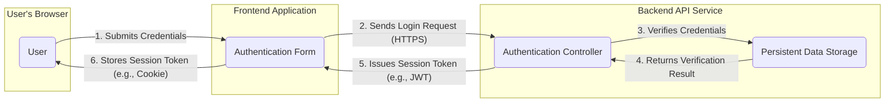
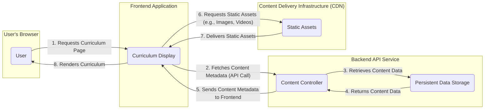
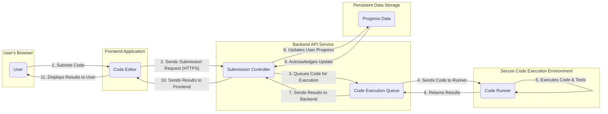

## Project Design Document: freeCodeCamp Platform (Improved)

**1. Project Overview**

This document provides an enhanced outline of the architecture and key components of the freeCodeCamp platform, an open-source community dedicated to providing free coding education. This improved design document aims to offer greater detail and clarity, serving as a more robust foundation for subsequent threat modeling activities.

**2. Goals and Objectives**

*   Provide universally accessible, no-cost coding education to a global learner base.
*   Offer a meticulously structured curriculum encompassing diverse web development and programming domains.
*   Cultivate a thriving and supportive community environment for learner interaction and collaboration.
*   Empower users to monitor their learning journey and achieve recognized certifications.
*   Maintain a transparent and community-driven development process through an open-source codebase.

**3. Target Audience**

*   Individuals aspiring to careers as software developers and programmers.
*   Those seeking to acquire new technical proficiencies and enhance their skill sets.
*   Educators and institutions leveraging freeCodeCamp's educational resources.
*   Contributors actively involved in the freeCodeCamp open-source project.

**4. High-Level Architecture**

The freeCodeCamp platform employs a standard multi-tier web application architecture, comprising the following core components:

*   **Frontend Application:** The user-facing interface facilitating learner interaction.
*   **Backend API Service:**  Provides the core business logic and data access functionalities via a RESTful API.
*   **Persistent Data Storage:**  Houses user data, curriculum details, and other essential persistent information.
*   **Content Delivery Infrastructure (CDN):**  Distributes static assets, ensuring efficient delivery and reduced latency.
*   **Authentication and Authorization Service:**  Manages user identities, authentication processes, and access control policies.
*   **Secure Code Execution Environment:**  Executes user-submitted code within isolated and secure containers for challenges and projects.
*   **Information Retrieval Service:**  Enables users to efficiently search and locate content within the platform's resources.
*   **Asynchronous Communication Service:**  Handles transactional emails and system notifications.

**5. Component Details**

This section offers a more granular description of each primary component, detailing their responsibilities and key features.

*   **Frontend Application:**
    *   Technology: Primarily React.js, potentially utilizing state management libraries like Redux or Zustand.
    *   Responsibilities:
        *   Rendering the user interface components and managing user interactions.
        *   Initiating API calls to the backend service to retrieve and manipulate data.
        *   Managing application state on the client-side.
        *   Presenting educational content, including lessons, articles, and embedded videos.
        *   Displaying coding challenges, project specifications, and interactive editors.
        *   Orchestrating user authentication and authorization workflows.
    *   Key Features:
        *   Interactive and engaging learning environment.
        *   Responsive design ensuring accessibility across various devices.
        *   Comprehensive user profile management capabilities.
        *   Visual representations of learning progress and achievements.

*   **Backend API Service:**
    *   Technology: Node.js (likely with the Express.js framework) implementing a RESTful API.
    *   Responsibilities:
        *   Receiving and processing API requests originating from the frontend application.
        *   Implementing core business logic related to user progress tracking, certification issuance, and community features.
        *   Interacting with the persistent data storage layer to retrieve and persist data.
        *   Enforcing authentication and authorization policies for incoming requests.
        *   Managing requests to the secure code execution environment.
        *   Serving metadata related to educational content and resources.
    *   Key Endpoints (Examples):
        *   `POST /api/auth/login`: Handles user login requests.
        *   `POST /api/auth/register`: Manages new user registration.
        *   `GET /api/user/profile`: Retrieves the authenticated user's profile information.
        *   `GET /api/progress`: Fetches the authenticated user's learning progress.
        *   `POST /api/challenges/{id}/submit`: Accepts user code submissions for specific challenges.
        *   `GET /api/certifications`: Retrieves available certifications and user achievements.
        *   `GET /api/forum/posts`: Fetches recent forum posts.

*   **Persistent Data Storage:**
    *   Technology: Likely MongoDB, chosen for its flexibility and suitability for evolving data structures. Potentially other databases for specific data needs.
    *   Responsibilities:
        *   Storing user account details and profile information.
        *   Persisting user progress data across the curriculum.
        *   Storing definitions and metadata for challenges and projects.
        *   Storing forum posts, comments, and community interactions.
        *   Storing data related to earned certifications.
        *   Potentially storing content for articles and news sections.
    *   Key Collections (Examples):
        *   `users`: Stores user authentication details and profile data.
        *   `progress`: Tracks individual user progress through learning modules.
        *   `challenges`: Contains definitions and test cases for coding challenges.
        *   `projects`: Stores specifications and requirements for coding projects.
        *   `forum_posts`: Holds content and metadata for forum discussions.
        *   `certifications`: Records user achievements and certification details.

*   **Content Delivery Infrastructure (CDN):**
    *   Technology:  Likely a service such as Cloudflare, AWS CloudFront, or Fastly.
    *   Responsibilities:
        *   Hosting and efficiently delivering static assets, including images, stylesheets (CSS), JavaScript bundles, and video content.
        *   Enhancing website performance by caching content geographically closer to users, reducing latency.
        *   Potentially providing Distributed Denial-of-Service (DDoS) mitigation and other security benefits.

*   **Authentication and Authorization Service:**
    *   Technology:  Likely integrated within the backend API, potentially leveraging libraries like Passport.js for authentication and authorization middleware.
    *   Responsibilities:
        *   Verifying user-provided credentials during the login process.
        *   Managing user sessions to maintain authenticated states.
        *   Handling password reset requests and account recovery procedures.
        *   Implementing role-based access control (RBAC) to manage permissions for administrative and other privileged functions.
        *   Potentially supporting integration with third-party authentication providers via OAuth 2.0 (e.g., Google, GitHub).
    *   Key Mechanisms:
        *   Secure password hashing algorithms (e.g., bcrypt, Argon2) for storing user credentials.
        *   Session management using secure cookies or JSON Web Tokens (JWTs).
        *   OAuth 2.0 flows for federated authentication with external providers.

*   **Secure Code Execution Environment:**
    *   Technology:  Likely employs containerization technologies like Docker and potentially serverless functions (e.g., AWS Lambda, Google Cloud Functions) for isolated execution.
    *   Responsibilities:
        *   Receiving user-submitted code from the backend API service.
        *   Executing the code within a secure and isolated containerized environment.
        *   Evaluating the executed code against predefined test cases and criteria.
        *   Returning the execution results (success/failure status, output, error messages) back to the backend API.
    *   Key Considerations:
        *   Robust security measures to prevent malicious code from compromising the platform or other users (sandboxing).
        *   Resource management and limitations to prevent denial-of-service scenarios due to excessive resource consumption.
        *   Support for a variety of programming languages relevant to the curriculum.

*   **Information Retrieval Service:**
    *   Technology:  Potentially Elasticsearch or a similar dedicated search engine for efficient indexing and querying of platform content. Database-integrated search solutions are also a possibility.
    *   Responsibilities:
        *   Indexing content from the persistent data storage, including challenges, articles, and forum posts.
        *   Providing search functionality to users, enabling them to find relevant learning materials and community discussions.
        *   Returning ranked and relevant search results based on user queries.

*   **Asynchronous Communication Service:**
    *   Technology:  Likely a third-party email service provider such as SendGrid, Mailgun, or AWS SES.
    *   Responsibilities:
        *   Sending transactional emails, such as account verification emails and password reset instructions.
        *   Dispatching notification emails related to forum activity, progress updates, and other relevant events.

**6. Data Flow Diagrams**

This section visually represents the flow of data between different components for critical functionalities.

*   **User Authentication Flow:**

*   **Accessing Curriculum Content Flow:**

*   **Submitting a Coding Challenge Flow:**

**7. Security Considerations (Detailed)**

This section outlines specific security considerations relevant to each component, providing a more targeted approach for threat modeling.

*   **Frontend Application:**
    *   **Cross-Site Scripting (XSS) Prevention:** Implement robust output encoding and utilize frameworks that mitigate XSS vulnerabilities.
    *   **Cross-Site Request Forgery (CSRF) Protection:** Employ anti-CSRF tokens for state-changing requests.
    *   **Secure Handling of Sensitive Data:** Avoid storing sensitive information in local storage or cookies without proper encryption.
    *   **Content Security Policy (CSP):** Implement a strict CSP to mitigate various attack vectors.
    *   **Dependency Vulnerability Management:** Regularly audit and update frontend dependencies to patch known security flaws.

*   **Backend API Service:**
    *   **Authentication and Authorization Enforcement:** Secure all API endpoints with appropriate authentication and authorization mechanisms.
    *   **Input Validation and Sanitization:** Thoroughly validate and sanitize all user inputs to prevent injection attacks (e.g., SQL injection, NoSQL injection, command injection).
    *   **Rate Limiting and Throttling:** Implement rate limits to prevent brute-force attacks and API abuse.
    *   **Secure Handling of Secrets:** Store API keys, database credentials, and other secrets securely (e.g., using environment variables or a secrets management service).
    *   **Output Encoding:** Encode data before sending it in responses to prevent injection vulnerabilities.
    *   **CORS Configuration:** Configure Cross-Origin Resource Sharing (CORS) policies appropriately to restrict unauthorized cross-origin requests.
    *   **Regular Security Audits and Penetration Testing:** Conduct periodic security assessments to identify and address potential vulnerabilities.

*   **Persistent Data Storage:**
    *   **Data Encryption at Rest:** Encrypt sensitive data stored in the database.
    *   **Data Encryption in Transit:** Ensure all communication with the database is encrypted (e.g., using TLS).
    *   **Access Control and Permissions:** Implement strict access control policies to limit access to sensitive data.
    *   **Regular Backups and Disaster Recovery:** Implement a robust backup and recovery strategy to protect against data loss.
    *   **Database Security Hardening:** Follow security best practices for the specific database technology being used.

*   **Content Delivery Infrastructure (CDN):**
    *   **HTTPS Enforcement:** Ensure all content is served over HTTPS.
    *   **Origin Protection:** Configure the CDN to protect the origin server from direct access.
    *   **DDoS Mitigation:** Leverage the CDN's DDoS protection capabilities.
    *   **Secure Configuration:** Follow security best practices for CDN configuration.

*   **Authentication and Authorization Service:**
    *   **Strong Password Policies:** Enforce strong password requirements and encourage the use of password managers.
    *   **Multi-Factor Authentication (MFA):** Consider implementing MFA for enhanced security.
    *   **Account Lockout Policies:** Implement account lockout mechanisms to prevent brute-force attacks.
    *   **Secure Session Management:** Use secure cookies with appropriate flags (HttpOnly, Secure, SameSite).
    *   **Regular Security Audits of Authentication Logic:** Review authentication and authorization code for potential vulnerabilities.

*   **Secure Code Execution Environment:**
    *   **Containerization and Sandboxing:** Utilize containerization technologies like Docker to isolate code execution environments.
    *   **Resource Limits:** Enforce resource limits (CPU, memory, time) to prevent resource exhaustion and denial-of-service.
    *   **Input Validation for Code Submissions:** Validate code submissions to prevent malicious code injection.
    *   **Secure Communication:** Ensure secure communication between the backend API and the code execution environment.
    *   **Regular Security Updates of Execution Environment:** Keep the underlying operating system and software within the execution environment up-to-date with security patches.

*   **Information Retrieval Service:**
    *   **Input Sanitization for Search Queries:** Sanitize user search queries to prevent injection attacks.
    *   **Access Control for Search Results:** Ensure that search results respect existing access control policies.
    *   **Secure Communication:** Encrypt communication with the search service.

*   **Asynchronous Communication Service:**
    *   **Secure API Keys:** Protect API keys for the email service provider.
    *   **SPF, DKIM, and DMARC Configuration:** Configure Sender Policy Framework (SPF), DomainKeys Identified Mail (DKIM), and Domain-based Message Authentication, Reporting & Conformance (DMARC) to prevent email spoofing.
    *   **Rate Limiting for Outgoing Emails:** Implement rate limits to prevent email abuse.

**8. Future Considerations**

*   Integration with advanced analytics platforms for deeper insights into user behavior and learning patterns.
*   Expansion of community features, such as direct messaging or collaborative coding environments.
*   Implementation of personalized learning paths and adaptive curriculum adjustments based on user progress.
*   Development of a mentorship program connecting experienced developers with learners.
*   Exploration of blockchain technologies for verifiable certifications and learning credentials.
*   Enhancements to the search functionality, incorporating natural language processing for more intuitive searches.
*   Further optimization of scalability and performance to accommodate a growing global user base.

This improved design document provides a more detailed and nuanced understanding of the freeCodeCamp platform's architecture and components. The enhanced security considerations section offers a more specific and actionable foundation for conducting thorough threat modeling activities.