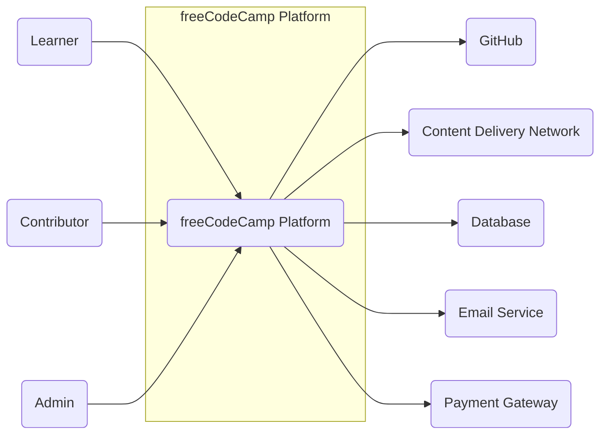
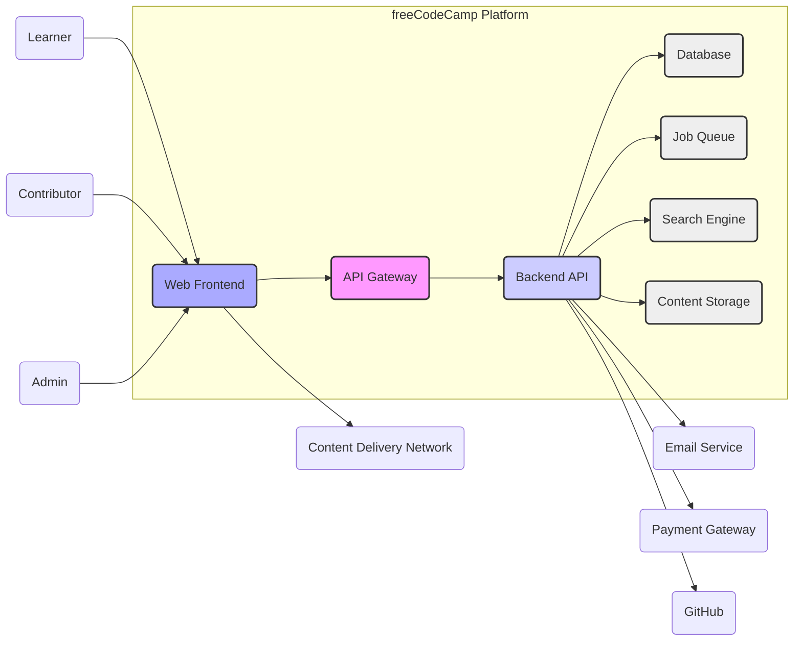
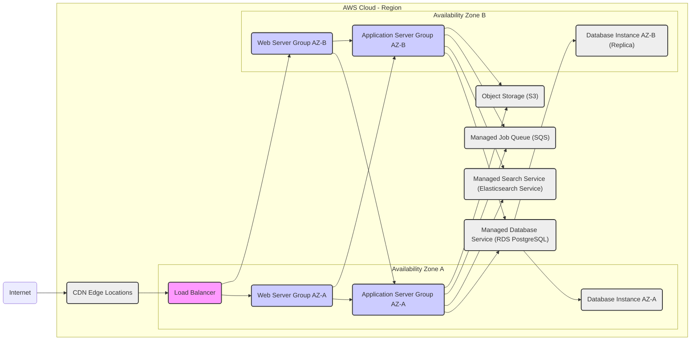

# BUSINESS POSTURE

- Business Priorities and Goals:
  - Provide free, accessible coding education to people worldwide.
  - Build a strong, supportive community of learners and contributors.
  - Offer a comprehensive curriculum covering various web development and technology topics.
  - Empower individuals to gain job-ready skills and improve their career prospects.
  - Operate as a non-profit organization, relying on donations and community support.
- Most Important Business Risks:
  - Data breaches compromising user data and privacy, leading to reputational damage and loss of user trust.
  - Platform downtime or unavailability, disrupting learning and community engagement, impacting user satisfaction.
  - Content integrity issues, such as malicious code injection or inaccurate learning materials, undermining the quality and trustworthiness of the platform.
  - Community moderation challenges, including spam, harassment, or inappropriate content, negatively affecting the user experience and community health.
  - Legal and regulatory compliance failures related to data privacy (e.g., GDPR, CCPA), accessibility (e.g., WCAG), and other relevant laws, resulting in fines and legal repercussions.

# SECURITY POSTURE

- Existing Security Controls:
  - security control: HTTPS enforcement for all website traffic, ensuring encrypted communication between users and the platform. Implemented at the CDN and web server level.
  - security control: User authentication and authorization system to manage user accounts and access to platform features. Implemented within the application backend.
  - security control: Input validation on user forms and API endpoints to prevent common injection attacks. Implemented within the application frontend and backend.
  - security control: Regular dependency updates for software libraries and frameworks to patch known vulnerabilities. Managed through dependency management tools and CI/CD pipelines.
  - security control: Code reviews for contributions to the codebase to identify potential security flaws before deployment. Implemented as part of the GitHub pull request process.
  - security control: Rate limiting on API endpoints to mitigate denial-of-service attacks and abuse. Implemented at the API gateway or web server level.
- Accepted Risks:
  - accepted risk: Reliance on community contributions for security vulnerability identification and patching, potentially leading to slower response times compared to dedicated security teams.
  - accepted risk: Limited budget for dedicated security tools and personnel, requiring prioritization of security measures and reliance on open-source or cost-effective solutions.
  - accepted risk: Potential for vulnerabilities in third-party dependencies despite regular updates, requiring ongoing monitoring and proactive patching.
- Recommended Security Controls:
  - security control: Implement a Web Application Firewall (WAF) to protect against common web attacks such as SQL injection, cross-site scripting (XSS), and cross-site request forgery (CSRF). To be implemented in front of the application infrastructure.
  - security control: Conduct regular penetration testing and vulnerability scanning to proactively identify and address security weaknesses in the platform. To be performed by internal or external security professionals.
  - security control: Implement a Security Information and Event Management (SIEM) system to monitor security logs and detect suspicious activities in real-time. To be integrated with application and infrastructure logs.
  - security control: Establish a formal Security Incident Response Plan (SIRP) to effectively handle security incidents and minimize their impact. To be documented and regularly tested.
  - security control: Implement Data Loss Prevention (DLP) measures to protect sensitive user data and prevent unauthorized data exfiltration. To be implemented at the application and data storage layers.
- Security Requirements:
  - Authentication:
    - Requirement: Secure user registration and login processes, including strong password policies and multi-factor authentication (MFA) as an option.
    - Requirement: Protection against brute-force attacks on login forms through rate limiting and account lockout mechanisms.
    - Requirement: Secure session management to prevent session hijacking and unauthorized access.
  - Authorization:
    - Requirement: Role-based access control (RBAC) to manage permissions for different user roles (e.g., learner, contributor, admin).
    - Requirement: Principle of least privilege applied to user access and system components.
    - Requirement: Secure API authorization to ensure only authorized users or applications can access specific API endpoints.
  - Input Validation:
    - Requirement: Comprehensive input validation on all user-provided data, both on the client-side and server-side.
    - Requirement: Sanitization of user inputs to prevent injection attacks (e.g., XSS, SQL injection, command injection).
    - Requirement: Use of secure coding practices to avoid common input validation vulnerabilities.
  - Cryptography:
    - Requirement: Secure storage of user passwords using strong hashing algorithms (e.g., bcrypt, Argon2).
    - Requirement: Encryption of sensitive data at rest and in transit.
    - Requirement: Use of TLS/SSL for all communication channels to protect data confidentiality and integrity.
    - Requirement: Secure key management practices for cryptographic keys.

# DESIGN

## C4 CONTEXT

- Context Diagram Elements:
  - Element:
    - Name: Learner
    - Type: Person
    - Description: Individuals who use the freeCodeCamp platform to learn coding and improve their skills.
    - Responsibilities: Access learning content, participate in coding challenges, interact with the community, track their progress.
    - Security controls: Authentication to access personalized content, authorization to access learning resources based on their progress.
  - Element:
    - Name: Contributor
    - Type: Person
    - Description: Volunteers who contribute to the freeCodeCamp platform by creating content, translating materials, moderating the forum, and developing the platform itself.
    - Responsibilities: Create and maintain learning content, translate materials, moderate community forums, contribute code to the platform.
    - Security controls: Authentication and authorization to access contributor tools and resources, input validation for contributed content, code review process for code contributions.
  - Element:
    - Name: Admin
    - Type: Person
    - Description: freeCodeCamp staff members who manage the platform, oversee content creation, handle user support, and maintain the infrastructure.
    - Responsibilities: Platform administration, content management, user management, infrastructure maintenance, security monitoring.
    - Security controls: Strong authentication and multi-factor authentication, role-based access control with elevated privileges, audit logging of administrative actions.
  - Element:
    - Name: GitHub
    - Type: External System
    - Description: Used for source code hosting, version control, issue tracking, and collaborative development of the freeCodeCamp platform. Also used for user authentication via OAuth.
    - Responsibilities: Hosting the codebase, managing code changes, tracking issues and feature requests, facilitating code contributions.
    - Security controls: GitHub's security controls for code repository access, branch protection, and vulnerability scanning. OAuth for authentication.
  - Element:
    - Name: CDN
    - Type: External System
    - Description: Content Delivery Network used to distribute static assets (e.g., images, CSS, JavaScript files) and potentially cached content to users globally, improving performance and availability.
    - Responsibilities: Caching and delivering static content, reducing latency for users, improving website performance.
    - Security controls: CDN's security controls for content delivery, DDoS protection, and access control. HTTPS for content delivery.
  - Element:
    - Name: Database
    - Type: External System
    - Description: Persistent storage for user data, learning progress, content metadata, forum posts, and other platform data.
    - Responsibilities: Storing and retrieving platform data, ensuring data persistence and availability.
    - Security controls: Database access controls, encryption at rest, regular backups, vulnerability patching, monitoring for database security events.
  - Element:
    - Name: Email Service
    - Type: External System
    - Description: Used for sending transactional emails such as user registration confirmations, password resets, notifications, and community updates.
    - Responsibilities: Sending emails to users for various platform interactions.
    - Security controls: Email service provider's security controls, SPF/DKIM/DMARC records to prevent email spoofing, secure API communication.
  - Element:
    - Name: Payment Gateway
    - Type: External System
    - Description: Used for processing donations to support freeCodeCamp's non-profit mission.
    - Responsibilities: Securely processing online donations.
    - Security controls: PCI DSS compliance of the payment gateway, secure API integration, handling of sensitive payment information.

## C4 CONTAINER

- Container Diagram Elements:
  - Element:
    - Name: Web Frontend
    - Type: Container - React Application
    - Description: Single-page application built with React, providing the user interface for learners, contributors, and admins to interact with the freeCodeCamp platform.
    - Responsibilities: Rendering user interface, handling user interactions, communicating with the Backend API, managing user sessions on the client-side.
    - Security controls: Client-side input validation, protection against XSS vulnerabilities, secure handling of user sessions (e.g., using HttpOnly cookies), integration with CDN for secure content delivery.
  - Element:
    - Name: API Gateway
    - Type: Container - Nginx/Kong
    - Description: Entry point for all API requests from the Web Frontend. Routes requests to the appropriate Backend API services, handles authentication and authorization, and can provide rate limiting and other cross-cutting concerns.
    - Responsibilities: Request routing, API security (authentication, authorization), rate limiting, load balancing, TLS termination.
    - Security controls: Authentication and authorization enforcement, rate limiting, WAF integration, TLS termination, input validation at the API entry point.
  - Element:
    - Name: Backend API
    - Type: Container - Node.js Application
    - Description: RESTful API built with Node.js (e.g., Express.js) providing the core business logic and data access for the freeCodeCamp platform. Handles user management, learning content delivery, community features, and integrations with external services.
    - Responsibilities: Business logic execution, data validation, data access, integration with databases and other services, user authentication and authorization (in conjunction with API Gateway).
    - Security controls: Server-side input validation, authorization checks for all API endpoints, secure data handling, protection against injection attacks, secure communication with databases and external services.
  - Element:
    - Name: Database
    - Type: Container - PostgreSQL
    - Description: Relational database used for persistent storage of user data, learning content metadata, forum posts, and other structured data.
    - Responsibilities: Data persistence, data integrity, data retrieval, data indexing.
    - Security controls: Database access controls, encryption at rest, regular backups, vulnerability patching, database monitoring, principle of least privilege for database access.
  - Element:
    - Name: Job Queue
    - Type: Container - Redis/RabbitMQ
    - Description: Message queue system used for asynchronous task processing, such as sending emails, processing background jobs, and handling resource-intensive operations.
    - Responsibilities: Asynchronous task processing, decoupling of application components, improving application responsiveness.
    - Security controls: Access controls for the job queue, secure communication between application components and the job queue, monitoring of job queue activity.
  - Element:
    - Name: Search Engine
    - Type: Container - Elasticsearch
    - Description: Search engine used for indexing and searching learning content, forum posts, and other platform data, providing fast and relevant search results to users.
    - Responsibilities: Indexing platform data, providing search functionality, improving content discoverability.
    - Security controls: Access controls for the search engine, secure data indexing, protection against search injection attacks, monitoring of search engine activity.
  - Element:
    - Name: Content Storage
    - Type: Container - AWS S3/Cloud Storage
    - Description: Object storage service used for storing large files such as learning content (videos, documents, images), user-uploaded files, and other static assets not served by CDN.
    - Responsibilities: Storing and retrieving large files, providing scalable and durable storage for platform content.
    - Security controls: Access controls for content storage, encryption at rest, versioning, backup and recovery, secure access policies.

## DEPLOYMENT

- Deployment Architecture Options:
  - Option 1: Cloud-based deployment on a single cloud provider (e.g., AWS, GCP, Azure) using managed services.
  - Option 2: Hybrid deployment, combining cloud services with on-premises infrastructure for specific components.
  - Option 3: Multi-cloud deployment, distributing components across multiple cloud providers for redundancy and resilience.

- Detailed Deployment Architecture (Option 1 - Cloud-based on AWS):

- Deployment Diagram Elements:
  - Element:
    - Name: Load Balancer
    - Type: Infrastructure - AWS ELB/ALB
    - Description: Distributes incoming traffic across multiple web servers for high availability and scalability.
    - Responsibilities: Traffic distribution, load balancing, health checks, TLS termination.
    - Security controls: DDoS protection, TLS termination, security groups to control inbound traffic, integration with WAF.
  - Element:
    - Name: Web Server Group (AZ-A & AZ-B)
    - Type: Infrastructure - EC2 Instances (Nginx/Apache)
    - Description: Group of web servers running in multiple availability zones to handle HTTP requests and serve static content or proxy requests to application servers.
    - Responsibilities: Serving static content, reverse proxy to application servers, web server security.
    - Security controls: Security groups to restrict inbound and outbound traffic, regular patching, hardening of web server configurations, access logging.
  - Element:
    - Name: Application Server Group (AZ-A & AZ-B)
    - Type: Infrastructure - EC2 Instances (Node.js Runtime)
    - Description: Group of application servers running in multiple availability zones to execute the Backend API code and handle application logic.
    - Responsibilities: Running application code, processing API requests, interacting with databases and other services.
    - Security controls: Security groups to restrict traffic, regular patching, application-level security controls, secure coding practices, monitoring and logging.
  - Element:
    - Name: Managed Database Service (RDS PostgreSQL)
    - Type: Infrastructure - AWS RDS
    - Description: Managed relational database service providing a highly available and scalable PostgreSQL database.
    - Responsibilities: Database management, data persistence, high availability, backups.
    - Security controls: Database access controls, encryption at rest and in transit, regular backups, vulnerability patching by the managed service provider, database monitoring.
  - Element:
    - Name: Managed Job Queue Service (SQS)
    - Type: Infrastructure - AWS SQS
    - Description: Managed message queue service for asynchronous task processing.
    - Responsibilities: Message queuing, reliable task delivery.
    - Security controls: Access controls for the queue, encryption in transit, managed service security.
  - Element:
    - Name: Managed Search Service (Elasticsearch Service)
    - Type: Infrastructure - AWS Elasticsearch Service
    - Description: Managed search service providing a scalable and reliable Elasticsearch cluster.
    - Responsibilities: Search indexing and querying.
    - Security controls: Access controls for the search service, encryption at rest and in transit, managed service security.
  - Element:
    - Name: Object Storage (S3)
    - Type: Infrastructure - AWS S3
    - Description: Scalable object storage service for storing large files.
    - Responsibilities: Object storage, content delivery.
    - Security controls: Access controls for S3 buckets, encryption at rest, bucket policies, versioning.
  - Element:
    - Name: CDN Edge Locations
    - Type: Infrastructure - AWS CloudFront
    - Description: Content Delivery Network edge locations globally distributed to cache and deliver content closer to users.
    - Responsibilities: Content caching, content delivery, reduced latency.
    - Security controls: CDN security controls, DDoS protection, HTTPS delivery, geographic restrictions.

## BUILD

```mermaid
graph LR
    Developer("Developer") --> CodeRepository("Code Repository (GitHub)")
    CodeRepository --> CI_CD_Pipeline("CI/CD Pipeline (GitHub Actions)")
    CI_CD_Pipeline --> BuildArtifacts("Build Artifacts (Container Images, Packages)")
    BuildArtifacts --> ContainerRegistry("Container Registry (Docker Hub/ECR)")
    ContainerRegistry --> DeploymentEnvironment("Deployment Environment (AWS)")

    subgraph "CI/CD Pipeline (GitHub Actions)"
        SourceCodeCheckout("Source Code Checkout")
        UnitTest("Unit Tests")
        IntegrationTest("Integration Tests")
        SAST("SAST Scanner")
        DependencyScan("Dependency Scanner")
        ContainerBuild("Container Build")
        ContainerPush("Container Push")
    end

    CI_CD_Pipeline --> SourceCodeCheckout
    SourceCodeCheckout --> UnitTest
    UnitTest --> IntegrationTest
    IntegrationTest --> SAST
    SAST --> DependencyScan
    DependencyScan --> ContainerBuild
    ContainerBuild --> ContainerPush
    ContainerPush --> BuildArtifacts

    style CI_CD_Pipeline fill:#f9f,stroke:#333,stroke-width:2px
    style SourceCodeCheckout fill:#eee,stroke:#333,stroke-width:2px
    style UnitTest fill:#eee,stroke:#333,stroke-width:2px
    style IntegrationTest fill:#eee,stroke:#333,stroke-width:2px
    style SAST fill:#eee,stroke:#333,stroke-width:2px
    style DependencyScan fill:#eee,stroke:#333,stroke-width:2px
    style ContainerBuild fill:#eee,stroke:#333,stroke-width:2px
    style ContainerPush fill:#eee,stroke:#333,stroke-width:2px
```

- Build Process Description:
  - Developers commit code changes to the GitHub repository.
  - A CI/CD pipeline, likely using GitHub Actions, is triggered on code commits or pull requests.
  - The pipeline performs the following steps:
    - Source Code Checkout: Retrieves the latest code from the repository.
    - Unit Tests: Executes unit tests to verify code functionality.
    - Integration Tests: Runs integration tests to ensure components work together correctly.
    - SAST Scanner: Static Application Security Testing (SAST) scanner analyzes the source code for potential security vulnerabilities.
    - Dependency Scanner: Scans project dependencies for known vulnerabilities.
    - Container Build: Builds container images (if applicable) for the application components.
    - Container Push: Pushes built container images to a container registry (e.g., Docker Hub, AWS ECR).
  - Build Artifacts (container images, packages) are stored in the container registry.
  - The deployment process pulls the build artifacts from the container registry and deploys them to the deployment environment (e.g., AWS).

- Build Process Security Controls:
  - security control: Automated CI/CD pipeline to ensure consistent and repeatable builds, reducing manual errors. Implemented using GitHub Actions.
  - security control: Source code hosted in a secure repository (GitHub) with access controls and audit logging. Implemented by GitHub.
  - security control: Unit and integration tests to verify code quality and functionality, reducing the likelihood of introducing vulnerabilities. Implemented as part of the CI/CD pipeline.
  - security control: Static Application Security Testing (SAST) scanner integrated into the CI/CD pipeline to identify potential security vulnerabilities in the source code early in the development lifecycle. Implemented using SAST tools in CI/CD.
  - security control: Dependency scanning to identify and alert on known vulnerabilities in project dependencies. Implemented using dependency scanning tools in CI/CD.
  - security control: Container image scanning for vulnerabilities before deployment (if using containers). Can be integrated into CI/CD or container registry.
  - security control: Secure storage of build artifacts in a container registry with access controls. Implemented by container registry (Docker Hub/ECR).
  - security control: Code review process for all code contributions to identify potential security flaws before merging into the main branch. Implemented as part of GitHub workflow.
  - security control: Principle of least privilege applied to CI/CD pipeline permissions and access to build artifacts and deployment environments. Implemented in CI/CD configuration and cloud provider IAM.

# RISK ASSESSMENT

- Critical Business Processes:
  - User Registration and Account Management: Essential for users to access the platform and track their progress.
  - Learning Content Delivery: Core function of the platform, providing educational resources to learners.
  - Community Forum and Interaction: Facilitates community engagement and peer support.
  - Donation Processing: Supports the non-profit mission and platform sustainability.
  - Content Creation and Contribution: Enables the growth and improvement of the learning resources.
- Data to Protect and Sensitivity:
  - User Personal Identifiable Information (PII):
    - Data: Usernames, email addresses, profile information, learning progress, forum posts, code submissions.
    - Sensitivity: Medium-High. Compromise can lead to privacy violations, identity theft, and reputational damage. Requires compliance with data privacy regulations (e.g., GDPR, CCPA).
  - Learning Content:
    - Data: Curriculum materials, coding challenges, articles, videos.
    - Sensitivity: Medium. Integrity and availability are important for platform credibility and user trust. Unauthorized modification or deletion can disrupt learning.
  - Platform Infrastructure and Code:
    - Data: Source code, configuration files, server credentials, database credentials.
    - Sensitivity: High. Compromise can lead to complete platform takeover, data breaches, and service disruption. Requires strong access controls and security measures.
  - Donation Information:
    - Data: Donation amounts, donor names (if provided), potentially limited payment information (depending on gateway integration).
    - Sensitivity: High. Requires PCI DSS compliance if payment information is handled or stored. Financial data breaches can lead to financial loss and legal repercussions.

# QUESTIONS & ASSUMPTIONS

- Questions:
  - What specific data privacy regulations (e.g., GDPR, CCPA) does freeCodeCamp need to comply with?
  - What is the current security team structure and resources dedicated to security?
  - Are there any existing security policies or standards that the project adheres to?
  - What is the process for handling security vulnerabilities reported by the community or identified through internal testing?
  - What is the budget allocated for security tools and services?
  - Are there any specific compliance requirements or certifications that freeCodeCamp is aiming for (e.g., SOC 2, ISO 27001)?
  - What is the disaster recovery and business continuity plan for the platform?
- Assumptions:
  - freeCodeCamp operates as a non-profit organization with limited financial resources compared to commercial entities.
  - Security is a priority, but resources may be constrained, requiring prioritization of security measures.
  - The platform relies heavily on open-source technologies and community contributions.
  - User data privacy and platform availability are critical concerns for maintaining user trust and achieving the organization's mission.
  - The deployment environment is likely cloud-based, leveraging managed services for scalability and resilience.
  - The development process incorporates security best practices, including code reviews and automated security checks in the CI/CD pipeline.