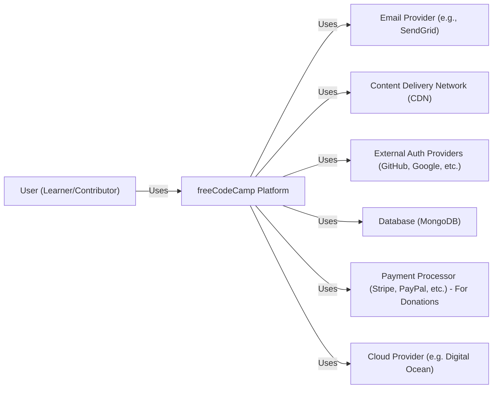
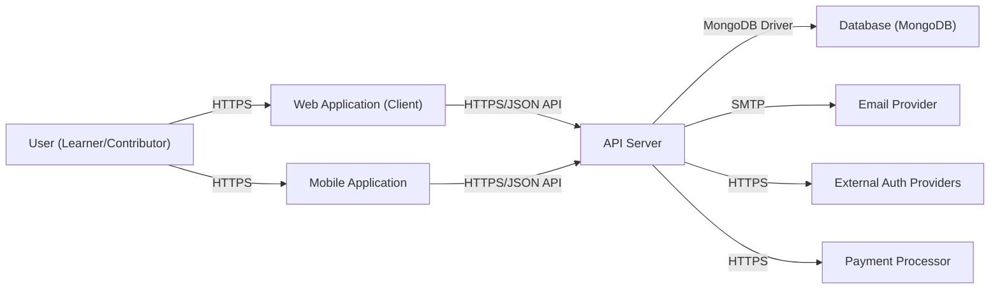
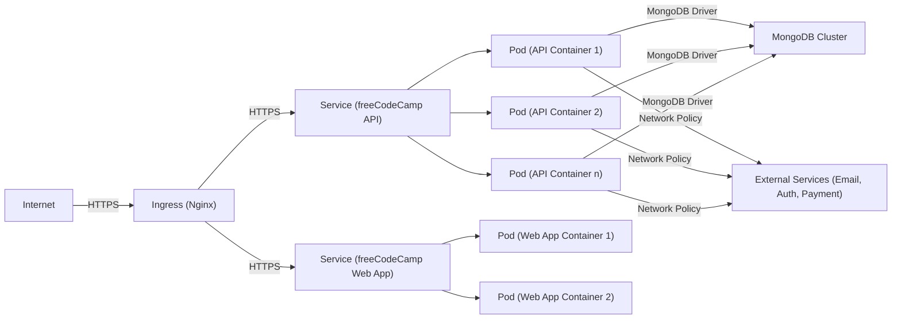
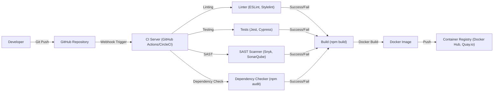

Okay, let's create a design document for the freeCodeCamp project based on the provided GitHub repository.

# BUSINESS POSTURE

freeCodeCamp is a non-profit organization that aims to make learning web development accessible to everyone. The project's primary goal is to provide a free, comprehensive, and interactive platform for learning various aspects of software development, including front-end, back-end, data science, and more.

Business Priorities:

*   Accessibility: Make learning available to anyone, regardless of their background or financial situation.
*   Comprehensiveness: Cover a wide range of relevant technologies and skills.
*   Community: Foster a supportive and collaborative learning environment.
*   Maintainability: Ensure the platform is easy to update and maintain.
*   Scalability: Handle a large number of concurrent users and learners.
*   Reputation: Maintain a positive reputation as a trusted source of learning.

Business Risks:

*   Data Breach: Unauthorized access to user data (even if limited) could damage reputation and user trust.
*   Platform Abuse: Malicious users could attempt to exploit the platform for spamming, phishing, or other harmful activities.
*   Content Integrity: Ensuring the accuracy and quality of learning materials is crucial.
*   Availability: Downtime or performance issues could disrupt learning and frustrate users.
*   Funding/Sustainability: As a non-profit, ensuring continued funding is a constant concern.
*   Legal and Compliance: Adhering to relevant data privacy regulations (e.g., GDPR, CCPA) is essential.

# SECURITY POSTURE

Existing Security Controls (based on observation of the GitHub repository and general knowledge of the platform):

*   security control: Authentication: Users can create accounts and log in using email/password or social login providers (GitHub, Google, etc.). Implemented in server and client components.
*   security control: Authorization: Basic role-based access control (user, moderator, admin) likely exists to manage content and user interactions. Implemented in server component.
*   security control: Input Validation: The platform likely implements input validation to prevent common web vulnerabilities like cross-site scripting (XSS) and SQL injection. Implemented in server and client components.
*   security control: Content Security Policy (CSP): Likely implemented to mitigate XSS and data injection attacks. Implemented in server component as HTTP headers.
*   security control: HTTPS: The platform uses HTTPS to encrypt communication between the client and server. Implemented in infrastructure.
*   security control: Rate Limiting: Likely implemented to prevent abuse and brute-force attacks. Implemented in infrastructure and server component.
*   security control: Regular Dependency Updates: The project appears to actively manage and update its dependencies, reducing the risk of known vulnerabilities. Implemented in build process.
*   security control: Code Reviews: The project uses a pull request system, suggesting code reviews are part of the development process. Implemented in development process.
*   security control: Static Code Analysis: Evidence of linters and other static analysis tools in the repository. Implemented in build process.

Accepted Risks:

*   accepted risk: Limited User Data: The platform collects relatively limited personal information, reducing the impact of a potential data breach.
*   accepted risk: Open Source Nature: While open source offers transparency and community contributions, it also means vulnerabilities can be publicly discovered.

Recommended Security Controls:

*   Implement a robust Web Application Firewall (WAF) to protect against common web attacks.
*   Introduce regular security audits and penetration testing.
*   Implement a bug bounty program to incentivize responsible disclosure of vulnerabilities.
*   Enhance monitoring and logging to detect and respond to security incidents quickly.
*   Implement Multi-Factor Authentication (MFA) for privileged accounts (moderators, admins).

Security Requirements:

*   Authentication:
    *   Support secure password storage using a strong hashing algorithm (e.g., bcrypt, Argon2).
    *   Implement secure session management.
    *   Provide options for social login and potentially multi-factor authentication.
*   Authorization:
    *   Implement granular role-based access control to restrict access to sensitive features and data.
    *   Ensure that users can only access their own data and resources.
*   Input Validation:
    *   Validate all user inputs on both the client-side and server-side.
    *   Use a whitelist approach to allow only known-good characters and patterns.
    *   Sanitize user input to prevent XSS and other injection attacks.
*   Cryptography:
    *   Use HTTPS for all communication.
    *   Store sensitive data (e.g., API keys, secrets) securely, preferably using a secrets management solution.
    *   Use strong, industry-standard cryptographic algorithms and libraries.

# DESIGN

## C4 CONTEXT

C4 Context Element Descriptions:

*   User (Learner/Contributor):
    *   Name: User
    *   Type: Person
    *   Description: A person who uses the freeCodeCamp platform to learn or contribute to the project.
    *   Responsibilities: Access learning materials, complete challenges, interact with the community, contribute code/content.
    *   Security controls: Strong password, MFA (optional), account recovery mechanisms.

*   freeCodeCamp Platform:
    *   Name: freeCodeCamp Platform
    *   Type: Software System
    *   Description: The core platform providing learning materials, interactive challenges, and community features.
    *   Responsibilities: Provide learning content, manage user accounts, facilitate community interaction, track progress.
    *   Security controls: Authentication, authorization, input validation, HTTPS, rate limiting, CSP.

*   Email Provider:
    *   Name: Email Provider
    *   Type: External System
    *   Description: A third-party service used for sending transactional emails (e.g., account verification, password resets).
    *   Responsibilities: Deliver emails reliably and securely.
    *   Security controls: API key authentication, secure communication (TLS).

*   CDN:
    *   Name: Content Delivery Network
    *   Type: External System
    *   Description: A distributed network of servers used to deliver static assets (e.g., images, CSS, JavaScript) quickly and efficiently.
    *   Responsibilities: Cache and deliver static content.
    *   Security controls: HTTPS, access controls.

*   External Auth Providers:
    *   Name: External Auth Providers
    *   Type: External System
    *   Description: Third-party services (e.g., GitHub, Google) used for user authentication.
    *   Responsibilities: Authenticate users and provide user information.
    *   Security controls: OAuth 2.0, OpenID Connect.

*   Database:
    *   Name: Database
    *   Type: External System
    *   Description: The database used to store user data, learning progress, forum posts, etc. (MongoDB).
    *   Responsibilities: Store and retrieve data reliably and securely.
    *   Security controls: Access controls, encryption at rest (if available), regular backups.

*   Payment Processor:
    *   Name: Payment Processor
    *   Type: External System
    *   Description: A third-party service used for processing donations (e.g., Stripe, PayPal).
    *   Responsibilities: Process payments securely and comply with PCI DSS standards.
    *   Security controls: Secure communication (TLS), tokenization, fraud prevention.

*   Cloud Provider:
    *   Name: Cloud Provider
    *   Type: External System
    *   Description: Infrastructure provider.
    *   Responsibilities: Provide compute, storage, and networking resources.
    *   Security controls: Infrastructure security, network security, access controls.

## C4 CONTAINER

C4 Container Element Descriptions:

*   Web Application (Client):
    *   Name: Web Application
    *   Type: Container (JavaScript, React)
    *   Description: The front-end application that runs in the user's browser.
    *   Responsibilities: Render UI, handle user interactions, communicate with the API server.
    *   Security controls: Input validation, CSP, secure communication (HTTPS).

*   Mobile Application:
    *   Name: Mobile Application
    *   Type: Container (React Native)
    *   Description: The front-end application that runs on user's device.
    *   Responsibilities: Render UI, handle user interactions, communicate with the API server.
    *   Security controls: Input validation, secure communication (HTTPS).

*   API Server:
    *   Name: API Server
    *   Type: Container (Node.js, Express)
    *   Description: The back-end server that handles API requests and interacts with the database and other services.
    *   Responsibilities: Authenticate users, authorize requests, process data, interact with external services.
    *   Security controls: Authentication, authorization, input validation, rate limiting, secure communication (HTTPS).

*   Database (MongoDB):
    *   Name: Database
    *   Type: Container (MongoDB)
    *   Description: The database used to store data.
    *   Responsibilities: Store and retrieve data.
    *   Security controls: Access controls, encryption at rest (if available), regular backups.

*   Email Provider, External Auth Providers, Payment Processor:  (Same descriptions as in the C4 Context diagram).

## DEPLOYMENT

Possible Deployment Solutions:

1.  Traditional Virtual Machines (VMs) on a cloud provider (e.g., DigitalOcean, AWS EC2).
2.  Containerized deployment using Docker and Kubernetes on a cloud provider (e.g., DigitalOcean Kubernetes, AWS EKS, Google GKE).
3.  Serverless deployment using functions (e.g., AWS Lambda, Netlify Functions) and a managed database service (e.g., MongoDB Atlas).

Chosen Solution (for detailed description): Containerized deployment using Docker and Kubernetes (DigitalOcean Kubernetes).

Deployment Element Descriptions:

*   Internet:
    *   Name: Internet
    *   Type: External
    *   Description: The global network.
    *   Responsibilities: Route traffic to the Kubernetes cluster.
    *   Security controls: Standard internet security protocols.

*   Ingress (Nginx):
    *   Name: Ingress
    *   Type: Node (Nginx Ingress Controller)
    *   Description: Handles incoming traffic and routes it to the appropriate services within the Kubernetes cluster.
    *   Responsibilities: TLS termination, request routing, load balancing.
    *   Security controls: HTTPS, WAF (if configured), access controls.

*   Service (freeCodeCamp API/Web App):
    *   Name: Service
    *   Type: Kubernetes Service
    *   Description: A Kubernetes Service provides a stable IP address and DNS name for accessing a set of Pods.  There are separate services for the API and the Web App.
    *   Responsibilities: Load balance traffic across Pods.
    *   Security controls: Network policies.

*   Pod (API/Web App Container):
    *   Name: Pod
    *   Type: Kubernetes Pod (Docker Container)
    *   Description:  A Pod is the smallest deployable unit in Kubernetes and contains one or more containers (in this case, likely one container per Pod).  Separate Pods run the API and Web App containers.
    *   Responsibilities: Run the application code.
    *   Security controls: Container security best practices (e.g., minimal base image, non-root user), resource limits.

*   MongoDB Cluster:
    *   Name: MongoDB Cluster
    *   Type: Database Cluster (Managed MongoDB)
    *   Description: A managed MongoDB cluster (e.g., MongoDB Atlas or a self-managed cluster on VMs).
    *   Responsibilities: Store and retrieve data.
    *   Security controls: Access controls, encryption at rest, regular backups, network isolation.

*   External Services:
    *   Name: External Services
    *   Type: External Systems
    *   Description:  The external services (Email Provider, Auth Providers, Payment Processor) as described in the C4 diagrams.
    *   Responsibilities:  Provide their respective services.
    *   Security controls:  As described in the C4 diagrams.

## BUILD

Build Process Description:

1.  Developer pushes code changes to the GitHub repository.
2.  A webhook triggers the CI server (e.g., GitHub Actions, CircleCI).
3.  The CI server runs a series of checks:
    *   Linting: Code style and quality checks using tools like ESLint and Stylelint.
    *   Testing: Unit tests, integration tests, and end-to-end tests using frameworks like Jest and Cypress.
    *   SAST: Static Application Security Testing using tools like Snyk or SonarQube to identify potential vulnerabilities in the code.
    *   Dependency Check: Checks for known vulnerabilities in project dependencies using tools like `npm audit`.
4.  If all checks pass, the CI server builds the application (e.g., `npm build`).
5.  A Docker image is built containing the application code and its dependencies.
6.  The Docker image is pushed to a container registry (e.g., Docker Hub, Quay.io).

Security Controls in Build Process:

*   security control: Code Reviews: Pull requests and code reviews on GitHub.
*   security control: Linting: Enforces code style and helps prevent common errors.
*   security control: Testing: Automated tests help ensure code quality and prevent regressions.
*   security control: SAST: Identifies potential security vulnerabilities in the code.
*   security control: Dependency Check: Identifies known vulnerabilities in project dependencies.
*   security control: Immutable Infrastructure: Docker images provide a consistent and immutable environment for the application.
*   security control: Least Privilege: CI server should have limited access to resources.

# RISK ASSESSMENT

Critical Business Processes:

*   Providing access to learning materials.
*   User account management.
*   Community forum interaction.
*   Tracking user progress.
*   Donation processing.

Data Sensitivity:

*   Usernames/Emails: Personally Identifiable Information (PII) - Medium sensitivity.
*   Learning Progress: Low sensitivity.
*   Forum Posts: Publicly visible, but could contain sensitive information if users share it. Medium sensitivity.
*   Donation Information: High sensitivity (handled by third-party payment processors).
*   IP Addresses: PII - Medium sensitivity.
*   Authentication Tokens: High sensitivity.

# QUESTIONS & ASSUMPTIONS

Questions:

*   What specific logging and monitoring solutions are currently in place?
*   What is the current process for handling security incidents?
*   Are there any existing security audit reports or penetration testing results?
*   What is the specific data retention policy?
*   What are the exact roles and permissions within the authorization system?
*   Is there a formal process for managing secrets (API keys, database credentials)?
*   What are the specific requirements for compliance (e.g., GDPR, CCPA)?
*   What is the disaster recovery plan?

Assumptions:

*   BUSINESS POSTURE: Assumed that maintaining a positive reputation and ensuring accessibility are the highest priorities.
*   SECURITY POSTURE: Assumed that basic security controls (HTTPS, input validation) are in place based on common web development practices. Assumed that dependency updates are performed regularly.
*   DESIGN: Assumed a containerized deployment using Docker and Kubernetes. Assumed the use of a managed MongoDB service. Assumed the use of a CI/CD pipeline. The specific cloud provider and container registry are assumptions.