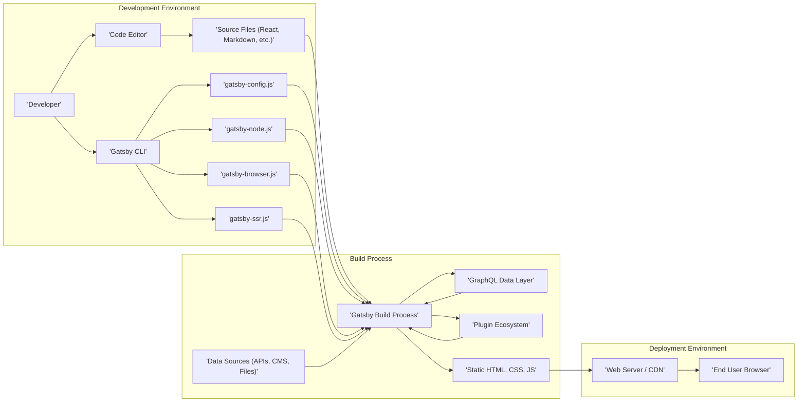
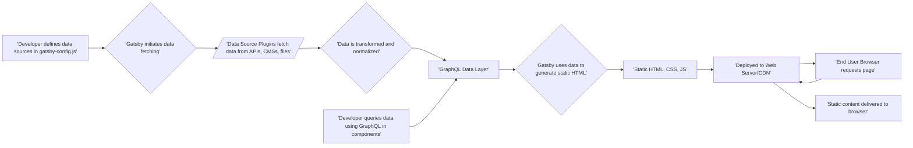

# Project Design Document: Gatsby.js

**Version:** 1.1
**Date:** October 26, 2023
**Author:** AI Software Architect

## 1. Introduction

This document provides a detailed architectural overview of the Gatsby.js project, a free and open-source framework based on React for building performant websites and applications. It focuses on the system's design to facilitate subsequent threat modeling activities, offering a clear understanding of its components, data flow, and interactions from a security perspective.

## 2. Goals and Objectives

The primary design goals of Gatsby.js are to:

* **Optimize website performance:** Achieve fast loading times through static HTML generation at build time.
* **Enable flexible data integration:** Support sourcing data from diverse locations including APIs, Content Management Systems (CMSs), databases, and local files.
* **Provide extensibility through a plugin ecosystem:** Allow developers to enhance functionality and integrate with external services.
* **Streamline the web development process:** Offer a developer-friendly experience for building and deploying web applications.
* **Promote modern web development practices:** Encourage the use of current best practices in web development.

## 3. Architectural Overview

Gatsby's architecture operates in three distinct phases: **Development**, **Build**, and **Deployment**. Understanding these phases is crucial for identifying potential threat vectors.

### 3.1. Development Phase

* **Developer:** Writes application code, configures Gatsby settings, and initiates the build process. This phase introduces potential vulnerabilities through coding errors or insecure dependencies.
* **Code Editor:** The Integrated Development Environment (IDE) used for coding. Security risks here are typically related to local machine security.
* **Gatsby CLI:** The command-line interface for interacting with Gatsby. Malicious commands executed through the CLI could compromise the development environment.
* **Source Files:** Contain the application's logic and content. Vulnerabilities like hardcoded secrets or insecure code can reside here.
* **`gatsby-config.js`:**  Configuration file defining plugins, site metadata, and build settings. Incorrect or malicious configurations can introduce security flaws.
* **`gatsby-node.js`:**  Allows developers to implement Node.js APIs to control the build process, including data sourcing and page creation. This file has significant power and vulnerabilities here can be critical.
* **`gatsby-browser.js`:**  Customizes Gatsby's behavior in the browser. Improper use can lead to client-side vulnerabilities.
* **`gatsby-ssr.js`:**  Customizes Gatsby's server-side rendering. Vulnerabilities here can impact initial page load and SEO.

### 3.2. Build Process

* **Gatsby Build Process:** The core process where Gatsby transforms source files and data into static assets. This is a critical phase where vulnerabilities in dependencies or plugins can be exploited.
* **Data Sources:** External systems or local files providing data. Compromised data sources can inject malicious content into the build. Examples include:
    * REST APIs
    * GraphQL APIs
    * Contentful, WordPress (Headless CMS)
    * Local Markdown files, JSON files
* **GraphQL Data Layer:** Gatsby's internal GraphQL layer exposes data for querying. While not directly accessible to end-users, vulnerabilities in data handling could be exploited during the build.
* **Plugin Ecosystem:**  Plugins extend Gatsby's functionality. Malicious or vulnerable plugins are a significant security concern. Examples include:
    * Data source plugins (e.g., `gatsby-source-filesystem`, `gatsby-source-graphql`)
    * Transformer plugins (e.g., `gatsby-transformer-remark`, `gatsby-transformer-sharp`)
    * Functionality plugins (e.g., analytics, SEO)
* **Static HTML, CSS, JS:** The output of the build process. If the build process is compromised, these assets can contain malicious code.

### 3.3. Deployment Phase

* **Web Server / CDN:** Hosts the generated static files. Security depends on the configuration and security measures of the chosen platform. Examples include:
    * Netlify
    * Vercel
    * AWS S3 with CloudFront
    * GitHub Pages
    * Traditional web servers (e.g., Nginx, Apache)
* **End User Browser:**  Renders the application. Client-side vulnerabilities in the generated code can be exploited here.

## 4. Key Components

* **Gatsby Core:** The central engine managing the build process, GraphQL data layer, and routing. Vulnerabilities here could have widespread impact.
* **Data Source Plugins:** Responsible for fetching data. Security considerations include:
    * Securely storing and using API keys or credentials.
    * Validating data received from external sources.
    * Handling potential errors and exceptions gracefully.
* **Transformer Plugins:** Process and transform data. Security considerations include:
    * Preventing injection attacks during data transformation (e.g., HTML injection).
    * Ensuring proper sanitization of user-generated content.
* **Plugin APIs:** Gatsby's APIs allow plugins to interact with the build process. Security considerations include:
    * `onCreateNode`: Plugins modifying nodes should avoid introducing vulnerabilities.
    * `createPages`: Programmatically created pages should follow security best practices.
    * `onCreateWebpackConfig`: Modifications to Webpack configuration can introduce security risks if not done carefully.
* **GraphQL:** Used for data management and querying during the build. While not directly exposed to the public, vulnerabilities in the GraphQL implementation or data handling could be exploited.
* **React:** The underlying UI library. Common React security best practices should be followed in the source code.
* **Webpack:** The module bundler. Misconfigurations or vulnerabilities in Webpack or its loaders can introduce security issues.

## 5. Data Flow

Understanding how data flows through Gatsby is crucial for identifying potential points of compromise.

1. **Configuration:** The developer specifies data sources and plugins in `gatsby-config.js`. This configuration itself can be a source of vulnerabilities if not managed carefully.
2. **Data Fetching:** Gatsby initiates data fetching using configured source plugins. This stage involves network communication and authentication, which are potential attack vectors.
3. **Data Transformation:** Data source plugins retrieve data, and transformer plugins process it. This is a critical point for input validation and sanitization to prevent injection attacks.
4. **GraphQL Layer:** Transformed data is ingested into Gatsby's internal GraphQL layer. While not directly public-facing, vulnerabilities in data handling here could be exploited during the build process.
5. **Data Querying:** Developers use GraphQL queries in components. While these queries are executed during the build, understanding how data is accessed is important for security analysis.
6. **Static Generation:** Gatsby uses the queried data to generate static HTML. If the data or build process is compromised, malicious content can be injected into the generated HTML.
7. **Output:** The build process produces static HTML, CSS, and JavaScript files. These are the final artifacts that need to be secured during deployment.
8. **Deployment:** Static files are deployed to a web server or CDN. The security of the deployment environment is crucial.
9. **Request:** An end-user requests a page.
10. **Delivery:** The web server/CDN serves the static content. Security measures like HTTPS and proper server configuration are essential here.

## 6. Security Considerations (Detailed)

Gatsby's static nature reduces some dynamic website vulnerabilities, but security remains crucial across all phases.

* **Development Phase Threats:**
    * **Vulnerable Dependencies:** Using outdated or vulnerable Node.js packages. Mitigation: Regularly update dependencies and use vulnerability scanning tools.
    * **Hardcoded Secrets:** Storing API keys or other sensitive information directly in the codebase. Mitigation: Utilize environment variables or dedicated secrets management solutions.
    * **Insecure Coding Practices:**  Introducing vulnerabilities like cross-site scripting (XSS) or insecure data handling in custom code within `gatsby-node.js`, `gatsby-browser.js`, or React components. Mitigation: Follow secure coding guidelines and perform code reviews.
    * **Compromised Development Environment:** Malware or unauthorized access to the developer's machine. Mitigation: Implement strong local security measures.

* **Build Process Threats:**
    * **Malicious Plugins:** Using compromised or intentionally malicious Gatsby plugins. Mitigation: Carefully vet plugins, check their reputation and maintenance status, and use dependency scanning tools.
    * **Build-Time Injection:**  Attackers compromising the build process to inject malicious code into the generated static files. Mitigation: Secure the build environment, use trusted CI/CD pipelines, and implement integrity checks.
    * **Data Source Compromise:**  If data sources are compromised, malicious content can be injected into the build. Mitigation: Secure data sources with proper authentication, authorization, and input validation.
    * **Secrets Exposure during Build:**  Improper handling of environment variables or secrets during the build process. Mitigation: Use secure secrets management practices specific to the build environment.

* **Deployment Phase Threats:**
    * **Insecure Server Configuration:** Misconfigured web servers or CDNs can expose vulnerabilities. Mitigation: Follow security best practices for server configuration, enable HTTPS, and configure appropriate security headers.
    * **Compromised Deployment Credentials:**  Unauthorized access to deployment credentials can allow attackers to replace legitimate files with malicious ones. Mitigation: Securely manage deployment credentials and use multi-factor authentication.
    * **Lack of Content Security Policy (CSP):**  Without a strong CSP, the site is more vulnerable to XSS attacks, even on static content. Mitigation: Implement and enforce a strict CSP.
    * **Missing Subresource Integrity (SRI):**  If external resources are compromised, SRI can prevent the browser from loading them. Mitigation: Use SRI for all external resources.

* **General Security Considerations:**
    * **Regular Security Audits:** Periodically review the codebase, dependencies, and infrastructure for potential vulnerabilities.
    * **Input Validation (Indirect):** While Gatsby generates static sites, if data sources accept user input, validation and sanitization at the source are crucial to prevent injection attacks that could be reflected in the static output.
    * **Monitoring and Logging:** Implement monitoring and logging to detect and respond to potential security incidents.

## 7. Deployment

Gatsby sites offer flexibility in deployment. Security considerations vary depending on the chosen platform.

* **Netlify & Vercel:** These platforms offer built-in security features like HTTPS, CDN, and sometimes even basic WAF capabilities. Ensure proper configuration of these features.
* **AWS S3 with CloudFront:** Requires careful configuration of bucket policies, CloudFront distributions, and potentially a Web Application Firewall (WAF).
* **GitHub Pages:** Suitable for public, non-sensitive content. Limited security configuration options.
* **Traditional Web Servers:** Requires manual configuration and management of security aspects like HTTPS, firewalls, and access controls.

The deployment process should include steps to verify the integrity of the built artifacts before they are deployed.

## 8. Technologies Used

* **JavaScript (ES6+)**
* **React**
* **GraphQL**
* **Node.js**
* **Webpack**
* **HTML**
* **CSS**
* **Various third-party libraries and plugins (specific dependencies vary by project)**

This improved document provides a more detailed and security-focused overview of the Gatsby.js architecture. It highlights potential threat vectors and mitigation strategies, serving as a solid foundation for subsequent threat modeling activities.
