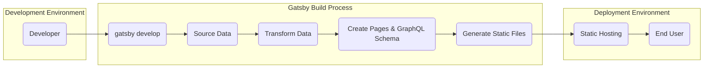
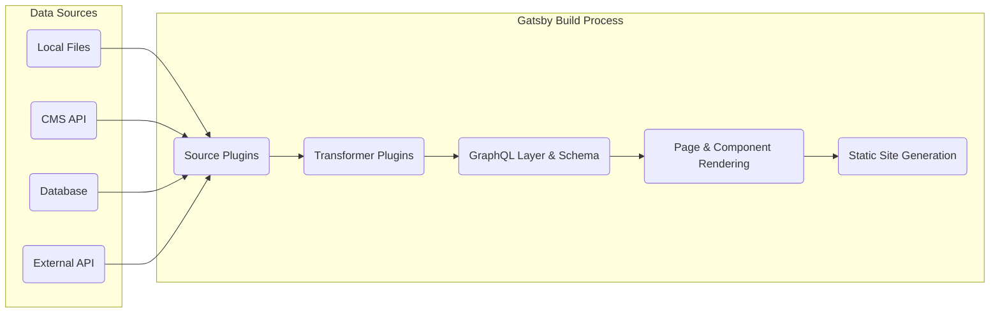

# Project Design Document: Gatsby.js

**Version:** 1.1
**Date:** October 26, 2023
**Prepared By:** AI Software Architect

## 1. Introduction

This document provides an enhanced architectural overview of the Gatsby.js open-source framework. It aims to clearly delineate the system's components, data flow, and key processes, serving as a robust foundation for subsequent threat modeling activities. This document focuses on the core Gatsby framework and its inherent functionalities, with specific attention to the role and structure of its plugin ecosystem as a critical architectural element. We will avoid detailed discussion of specific user implementations or individual plugins, except where necessary to illustrate core concepts.

## 2. Goals and Objectives

The fundamental goals underpinning the Gatsby project are:

* **Achieving exceptional website performance:** Through pre-rendering, intelligent code splitting, and optimized asset delivery.
* **Empowering developers with modern web technologies:** By leveraging the capabilities of React, the flexibility of GraphQL, and the extensibility of a rich plugin ecosystem.
* **Streamlining content integration from diverse sources:**  Offering seamless connectivity to Markdown files, various Content Management Systems (CMSs), Application Programming Interfaces (APIs), and databases.
* **Establishing a highly adaptable and extensible architecture:** Facilitated by its plugin system, enabling extensive customization and integration with a wide array of tools and services.
* **Prioritizing a superior developer experience:**  Offering features such as hot reloading for rapid development cycles, a comprehensive and user-friendly Command Line Interface (CLI), and thorough, accessible documentation.

## 3. Scope

This design document encompasses the following facets of the Gatsby framework:

* **Core Architectural Design:**  A detailed examination of the fundamental components and their interactions within the framework.
* **Detailed Build Process Breakdown:**  A step-by-step analysis of the processes involved in generating static websites from source code and data.
* **In-depth Data Handling Mechanisms:**  An explanation of how data is sourced, transformed, queried, and utilized within Gatsby.
* **Plugin Ecosystem Structure and Functionality:**  A comprehensive overview of the role, architecture, and different types of Gatsby plugins.
* **Deployment Strategies and Considerations:**  Common and recommended deployment methodologies for Gatsby-powered websites.
* **Underlying Technologies and Dependencies:**  Identification of the key technologies and libraries upon which Gatsby is built.

This document explicitly excludes:

* **Specific implementations of user websites or applications built using Gatsby.**
* **Detailed internal implementation specifics of individual Gatsby plugins.**
* **The intricacies of hosting infrastructure beyond Gatsby's direct operational scope.**
* **Detailed configurations or architectures of specific Content Management Systems (CMSs) or external data sources.**

## 4. Architectural Overview

Gatsby employs a build-time static site generation approach, producing static HTML, CSS, and JavaScript assets ready for deployment on any static hosting platform. The core architectural flow involves these distinct stages:

* **Development Phase:** Developers write code, create content, and configure the Gatsby project, utilizing features like hot reloading for immediate feedback.
* **Build Phase:** Gatsby processes the application code, content, and plugin configurations to generate optimized static assets. This involves data sourcing, transformation, and page rendering.
* **Deployment Phase:** The generated static assets are deployed to a hosting environment, where they are served directly to end-users with high performance.

## 5. Key Components

The Gatsby framework is structured around several essential components that work in concert:

* **Gatsby CLI (Command Line Interface):**  Provides developers with essential commands for project scaffolding (`gatsby new`), local development (`gatsby develop`), production builds (`gatsby build`), and local serving (`gatsby serve`).
* **Gatsby Core Engine:** The central orchestrator of the build process. It manages plugin execution, data flow, GraphQL schema creation, and page rendering.
* **Data Layer Powered by GraphQL:** Gatsby utilizes GraphQL as its internal data management layer. This allows components to efficiently query and access data sourced from various locations. Gatsby automatically infers the GraphQL schema based on the data sources and transformations.
* **Extensible Plugin Ecosystem:** A cornerstone of Gatsby's architecture. Plugins extend Gatsby's core functionality and can be categorized as:
    * **Source Plugins:** Responsible for fetching data from external sources (e.g., `gatsby-source-filesystem`, `gatsby-source-contentful`).
    * **Transformer Plugins:** Process and transform data (e.g., `gatsby-transformer-remark` for Markdown, `gatsby-plugin-image` for image optimization).
    * **Utility/Functional Plugins:** Add various features like SEO enhancements, analytics integration, and offline support (e.g., `gatsby-plugin-manifest`, `gatsby-plugin-robots-txt`).
* **React Framework Integration:** Gatsby is built upon React, leveraging its component-based architecture for building reusable UI elements and managing application state.
* **Webpack for Module Bundling:**  Webpack is used to bundle JavaScript modules, CSS, and other assets into optimized bundles for efficient delivery to the browser.
* **Node.js Runtime Environment:** Node.js provides the necessary runtime environment for Gatsby's development server and build processes.

## 6. Data Flow

The journey of data within a Gatsby project follows a well-defined path:

1. **Data Sourcing Initiation:**
    * The Gatsby build process begins by invoking source plugins.
    * These plugins connect to configured data sources, which can include:
        * Locally stored files (Markdown, MDX, JSON, YAML, CSV, images, etc.).
        * Headless Content Management Systems (CMSs) via their respective APIs (e.g., Contentful, WordPress, Strapi).
        * Relational and NoSQL databases.
        * Third-party APIs providing structured data.
2. **Data Transformation and Processing:**
    * Once data is sourced, transformer plugins are applied.
    * These plugins process the raw data into a more usable format. Examples include:
        * Parsing Markdown files into HTML structures.
        * Optimizing and resizing images.
        * Extracting metadata from files.
3. **GraphQL Schema Construction:**
    * Gatsby introspects the transformed data and automatically generates a GraphQL schema.
    * This schema defines the types and relationships of the available data, making it queryable by components.
4. **Page and Component Development:**
    * Developers create React components and page templates.
    * These components use GraphQL queries to fetch the necessary data for rendering.
5. **Static Site Generation and Rendering:**
    * During the build process, Gatsby executes the GraphQL queries defined in the components.
    * The fetched data is used to render each page into a static HTML file.
    * JavaScript code is bundled, and CSS is extracted and optimized.
    * Assets like images are processed and placed in the output directory.

## 7. Security Considerations (Detailed for Threat Modeling)

Given Gatsby's architecture, several security considerations are paramount for thorough threat modeling:

* **Node.js Dependency Vulnerabilities:** Gatsby relies on a vast ecosystem of Node.js packages managed by npm or yarn.
    * **Threat:**  Vulnerabilities in these dependencies (direct and transitive) can be exploited if not regularly updated. This could lead to various attacks, including remote code execution.
    * **Mitigation:** Employ dependency scanning tools, regularly update dependencies, and use lock files to ensure consistent dependency versions.
* **Plugin Ecosystem Security Risks:** The flexibility of the plugin ecosystem also introduces potential security vulnerabilities.
    * **Threat:** Malicious or poorly written plugins could introduce security flaws, such as cross-site scripting (XSS) vulnerabilities, data leaks, or backdoors.
    * **Mitigation:**  Exercise caution when selecting and installing plugins. Review plugin code if possible, and rely on reputable and well-maintained plugins. Implement Content Security Policy (CSP) to mitigate XSS risks.
* **Build Process Security Weaknesses:** The build process involves executing code and accessing external resources, making it a potential attack vector.
    * **Threat:** Compromised build environments or supply chain attacks could inject malicious code into the build output.
    * **Mitigation:** Secure the build environment, implement access controls, and verify the integrity of build tools and dependencies. Consider using isolated build environments.
* **Data Security During the Build Phase:** Sensitive data might be accessed during the build process (e.g., API keys, database credentials).
    * **Threat:**  Exposure of sensitive data during the build could lead to unauthorized access or data breaches.
    * **Mitigation:**  Store sensitive information securely (e.g., using environment variables or secrets management tools) and avoid hardcoding credentials. Ensure proper access controls to build artifacts and logs.
* **Server-Side Rendering (SSR) and Incremental Builds (if utilized):** When employing SSR or incremental builds, traditional web application security concerns become relevant for the server-side components.
    * **Threat:**  Vulnerabilities in the SSR implementation could lead to server-side request forgery (SSRF), injection attacks, or other server-side exploits.
    * **Mitigation:** Apply standard web application security best practices, including input validation, output encoding, and regular security audits.
* **Content Security Policy (CSP) Misconfiguration:** While CSP can enhance security, incorrect configuration can weaken its effectiveness or even break site functionality.
    * **Threat:**  A poorly configured CSP might not adequately protect against XSS attacks or could block legitimate resources.
    * **Mitigation:**  Carefully configure CSP directives and thoroughly test the implementation. Use tools to help generate and validate CSP policies.
* **Subresource Integrity (SRI) Neglect:** Failing to implement SRI for externally hosted resources can leave the site vulnerable to tampering.
    * **Threat:**  If a CDN or external resource is compromised, malicious code could be injected without the site owner's knowledge.
    * **Mitigation:**  Implement SRI tags for all externally hosted JavaScript and CSS files.

## 8. Deployment Strategies

Gatsby's static site output enables flexible deployment options:

* **Static Hosting Providers:** The most common deployment method, leveraging services designed for serving static files with high performance and scalability. Examples include:
    * **Netlify:** Offers tight integration with Gatsby, including automated builds and deployments.
    * **Vercel:** Another popular platform providing similar features and excellent Gatsby support.
    * **Amazon S3 with CloudFront:** A highly scalable and cost-effective solution for hosting static websites on AWS.
    * **GitHub Pages:** Suitable for smaller projects and personal websites hosted directly from GitHub repositories.
    * **Cloudflare Pages:** A platform offering global CDN and serverless functions for static sites.
* **Server-Side Rendering (SSR) Deployment:** For applications requiring dynamic content or server-side logic, Gatsby can be configured for SSR. This typically involves deploying to:
    * **Node.js server environments:** Utilizing platforms like Heroku, AWS EC2, or Google Cloud Run to run a Node.js server that renders pages on demand.
    * **Serverless functions:**  Deploying SSR logic as serverless functions on platforms like AWS Lambda or Netlify Functions.
* **Incremental Static Regeneration (ISR) Deployment:**  Allows for a hybrid approach where most pages are statically generated at build time, but specific pages can be regenerated on demand or at set intervals. Deployment options are similar to SSR, requiring a server environment to handle regeneration requests.

## 9. Technologies Utilized

* **Core Languages:**
    * **JavaScript (ES6+):** The primary language for development and client-side interactions.
    * **GraphQL:**  Used for data querying and manipulation within Gatsby.
* **Frameworks and Libraries:**
    * **React:** The foundation for building user interfaces and components.
* **Build and Development Tools:**
    * **Node.js:** The runtime environment for Gatsby's development and build processes.
    * **npm or Yarn:** Package managers for managing project dependencies.
    * **Webpack:**  A module bundler for optimizing and packaging assets.
    * **Babel:**  A JavaScript compiler for transpiling modern JavaScript code.
* **Testing and Quality Assurance:** (While not strictly architectural components, these are crucial for project health)
    * **Jest, Cypress, or similar testing frameworks.**
    * **Linters (e.g., ESLint) and formatters (e.g., Prettier).**

## 10. Future Development Directions

* **Enhancements to the Plugin API:**  Providing more robust and granular control for plugin developers.
* **Optimizations for Build Performance:**  Continuously improving build times and resource utilization.
* **Improved Support for Complex Data Architectures:**  Facilitating integration with more intricate data sources and relationships.
* **Advancements in Server-Side Rendering and Incremental Build Capabilities:**  Offering more flexible and performant options for dynamic content.
* **Increased Focus on Accessibility and Performance Best Practices:**  Integrating tools and features to promote web standards.

This enhanced design document provides a more detailed and nuanced understanding of the Gatsby.js framework's architecture, offering a solid foundation for conducting comprehensive threat modeling activities. By thoroughly examining the components, data flow, and potential security considerations, developers and security professionals can work together to build secure and performant websites with Gatsby.
