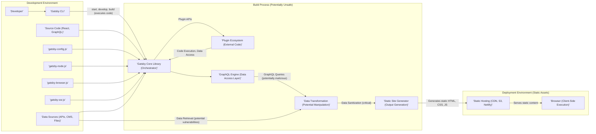
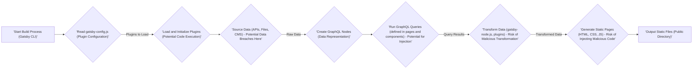

# Project Design Document: Gatsby (Improved)

**Version:** 1.1
**Date:** October 26, 2023
**Author:** AI Software Architect

## 1. Introduction

This document provides an enhanced architectural design of the Gatsby project, an open-source framework for building websites and web applications based on React. This improved version aims to provide a more detailed and security-focused understanding of Gatsby's components, data flow, and deployment model, specifically tailored for effective threat modeling.

## 2. Goals and Objectives

The primary goal of this document is to provide a clear and comprehensive architectural overview of Gatsby to facilitate robust threat modeling and security analysis. Specific objectives include:

- Clearly identifying all key components and their interactions, highlighting potential trust boundaries.
- Mapping the complete data flow within the Gatsby build process, pinpointing sensitive data handling points.
- Understanding the nuances of different deployment models for Gatsby sites and their respective security implications.
- Providing a solid foundation for identifying potential security vulnerabilities, attack vectors, and areas requiring security controls.

## 3. Scope

This document focuses on the core architecture of the Gatsby framework, with a strong emphasis on aspects relevant to security. This includes:

- The Gatsby CLI and its role in development and build processes, including potential security risks associated with command execution.
- The core Gatsby library and its functionalities, focusing on areas like data handling and plugin management.
- The plugin ecosystem and its impact on the build process, with a detailed look at potential plugin vulnerabilities.
- Data sourcing mechanisms and transformations, emphasizing the security of data retrieval and processing.
- The output of the Gatsby build process (static files) and potential client-side security concerns.
- Common deployment strategies for Gatsby sites and the security considerations for each.

This document explicitly excludes:

- Deep dives into the source code of individual Gatsby plugins unless directly relevant to illustrating a security concern.
- The internal implementation details of the React library itself.
- Security assessments of specific end-user website content or the unique application logic built with Gatsby.

## 4. High-Level Architecture

Gatsby operates on a build-time rendering principle, where data is sourced, transformed, and used to generate static assets. This architecture presents unique security considerations compared to traditional server-rendered applications.

**Key Stages with Security Focus:**

- **Development:** Developers introduce code and configurations, which can contain vulnerabilities. The Gatsby CLI executes commands, posing a risk if dependencies are compromised.
- **Build (Potentially Unsafe):** This is the most critical stage for security. External plugins execute code, data is fetched and transformed (potentially unsafely), and the final output is generated. Compromise at this stage can directly impact the deployed site.
- **Deployment:** The security of the deployed static assets depends on the hosting environment. Client-side vulnerabilities in the generated code can still be exploited.

## 5. Component Breakdown (Security Perspective)

This section details the key components with a focus on their security implications.

- **Gatsby CLI:**
    - **Security Implication:**  Vulnerable dependencies in the CLI or malicious commands executed through it could compromise the development environment or the build process.
    - **Threats:** Dependency confusion attacks, command injection.
- **Gatsby Core Library:**
    - **Security Implication:**  Bugs or vulnerabilities in the core library could be exploited by malicious plugins or through crafted data. It manages plugin execution, a critical trust boundary.
    - **Threats:** Privilege escalation, arbitrary code execution via plugins.
- **Plugin Ecosystem:**
    - **Security Implication:**  Plugins are third-party code and represent a significant attack surface. They have access to the build process, data, and can modify the output.
    - **Threats:** Malicious plugins injecting scripts, data exfiltration, build process manipulation, supply chain attacks.
- **`gatsby-config.js`:**
    - **Security Implication:**  This file configures plugins and can contain sensitive information (e.g., API keys). Improperly secured or exposed configuration can lead to data breaches.
    - **Threats:** Exposure of secrets, misconfiguration leading to vulnerabilities.
- **`gatsby-node.js`:**
    - **Security Implication:**  Allows arbitrary code execution during the build. Vulnerabilities here can lead to complete compromise of the build process.
    - **Threats:** Arbitrary code execution, backdoors injected into the build.
- **`gatsby-browser.js` and `gatsby-ssr.js`:**
    - **Security Implication:**  While primarily for customization, vulnerabilities here could lead to client-side attacks (XSS) or server-side issues if SSR is involved.
    - **Threats:** Cross-site scripting (XSS), server-side request forgery (SSRF) in SSR scenarios.
- **GraphQL Engine:**
    - **Security Implication:**  Improperly secured GraphQL endpoints or poorly written resolvers could expose sensitive data or allow unauthorized data manipulation during the build.
    - **Threats:** Information disclosure, denial of service, unauthorized data access.
- **Data Sources:**
    - **Security Implication:**  The security of the data sources directly impacts the integrity and confidentiality of the website content. Compromised data sources can lead to defacement or data breaches.
    - **Threats:** Data breaches, data manipulation, injection attacks against data sources.
- **Static Site Generator:**
    - **Security Implication:**  Vulnerabilities in the generator could lead to the creation of insecure output (e.g., including unintended scripts).
    - **Threats:** Introduction of vulnerabilities in the generated static files.

## 6. Data Flow (Security Analysis)

The data flow within Gatsby's build process is a critical area for security analysis. Understanding how data is sourced, transformed, and used is essential for identifying potential vulnerabilities.

**Detailed Steps with Security Considerations:**

1. **Start Build Process:** The build process initiation itself doesn't pose a direct security risk but sets the stage for subsequent operations.
2. **Read `gatsby-config.js`:**  Potential for secrets exposure if this file is not properly managed.
3. **Load and Initialize Plugins:** This is a high-risk step as it involves executing arbitrary code from potentially untrusted sources.
4. **Source Data:**  Data retrieval from external sources introduces risks of data breaches if connections are not secure or APIs are vulnerable.
5. **Create GraphQL Nodes:**  The process of creating nodes itself is generally safe, but the data being represented could be malicious.
6. **Run GraphQL Queries:**  Similar to database queries, GraphQL queries can be vulnerable to injection attacks if not properly handled.
7. **Transform Data:**  Custom transformations in `gatsby-node.js` or plugins can introduce vulnerabilities if not implemented securely. Malicious transformations could alter data or inject malicious code.
8. **Generate Static Pages:**  The process of generating static files needs to be secure to prevent the injection of malicious scripts or other vulnerabilities into the final output.
9. **Output Static Files:** The final static files need to be stored and served securely.

## 7. Security Considerations (Detailed)

This section expands on the initial security considerations, providing more specific examples and potential attack vectors.

- **Dependency Management:**
    - **Threat:**  Using outdated or vulnerable dependencies can introduce known security flaws that attackers can exploit. Supply chain attacks targeting dependencies are a growing concern.
    - **Mitigation:**  Regularly update dependencies, use tools like `npm audit` or `yarn audit`, and consider using dependency scanning services.
- **Plugin Security:**
    - **Threat:** Malicious or vulnerable plugins can execute arbitrary code during the build, steal secrets, or inject malicious content into the generated website.
    - **Mitigation:**  Carefully vet plugins before using them, review their code if possible, keep plugins updated, and consider using a Content Security Policy (CSP).
- **Data Source Security:**
    - **Threat:**  Compromised data sources can lead to data breaches, website defacement, or the injection of malicious content.
    - **Mitigation:**  Secure API keys and credentials, use secure connections (HTTPS), implement proper authentication and authorization for data sources, and sanitize data retrieved from external sources.
- **Build Process Integrity:**
    - **Threat:**  If the build process is compromised, attackers can inject malicious code or alter the website content without directly attacking the deployed site.
    - **Mitigation:**  Secure the development environment, use version control, implement CI/CD pipelines with security checks, and consider using reproducible builds.
- **Secrets Management:**
    - **Threat:**  Storing API keys or other sensitive information directly in code or configuration files can lead to exposure.
    - **Mitigation:**  Use environment variables, dedicated secrets management tools (e.g., HashiCorp Vault), and avoid committing secrets to version control.
- **Output Security:**
    - **Threat:**  Even static sites can be vulnerable to client-side attacks like XSS if user-generated content is involved or if there are vulnerabilities in the JavaScript code.
    - **Mitigation:**  Properly sanitize user-generated content, implement a strong Content Security Policy (CSP), and regularly audit client-side JavaScript code.
- **Deployment Environment Security:**
    - **Threat:**  Misconfigured or vulnerable hosting environments can expose the website to attacks.
    - **Mitigation:**  Choose reputable hosting providers with strong security measures, configure appropriate access controls, use HTTPS, and regularly update server software.

## 8. Deployment Model (Security Implications)

The chosen deployment model significantly impacts the security considerations for Gatsby sites.

- **Static Hosting Providers (Netlify, Vercel, GitHub Pages):**
    - **Security Implications:**  These providers typically handle server-side security concerns, such as OS patching and web server configuration. They often offer features like HTTPS by default and built-in CDNs, improving security posture. However, the security of the build process and the generated static files remains the responsibility of the developer.
    - **Considerations:**  Review the provider's security practices, ensure secure CI/CD integration, and implement client-side security measures.
- **Cloud Storage (Amazon S3, Google Cloud Storage, Azure Blob Storage) with CDN:**
    - **Security Implications:**  Requires careful configuration of access controls (e.g., bucket policies) to prevent unauthorized access to the static files. CDN configuration also needs to be secure to prevent attacks like cache poisoning.
    - **Considerations:**  Implement least privilege access, use secure bucket policies, configure CDN securely, and enable features like HTTPS.
- **Traditional Web Servers (Apache, Nginx):**
    - **Security Implications:**  Developers are responsible for the security of the entire stack, including OS patching, web server configuration, and access controls. This requires more expertise and ongoing maintenance.
    - **Considerations:**  Follow security best practices for web server configuration, keep software updated, implement firewalls and intrusion detection systems, and regularly audit the server.

## 9. Assumptions and Constraints

- It is assumed that developers have a foundational understanding of web security principles.
- The security considerations discussed are general and may need to be tailored based on the specific requirements and complexity of individual Gatsby projects.
- This document assumes the use of standard Gatsby configurations and practices. Deviations from these standards may introduce additional security risks.

## 10. Future Considerations (Security Focused)

- **Incremental Builds Security:**  Analyze the security implications of caching and reusing build artifacts in incremental builds. Ensure that vulnerabilities are not inadvertently carried over between builds.
- **Gatsby Cloud Security:**  A separate security assessment of Gatsby Cloud's architecture and features is recommended, focusing on build process isolation, data security, and access controls.
- **Server-Side Rendering (SSR) and Deferred Static Generation (DSG) Security:**  These features introduce dynamic aspects and require additional security considerations, such as protection against SSRF attacks and secure handling of server-side logic. Threat modeling should specifically address these scenarios if they are implemented.

This improved design document provides a more detailed and security-focused overview of the Gatsby architecture, intended to be a valuable resource for conducting thorough threat modeling and implementing appropriate security measures.