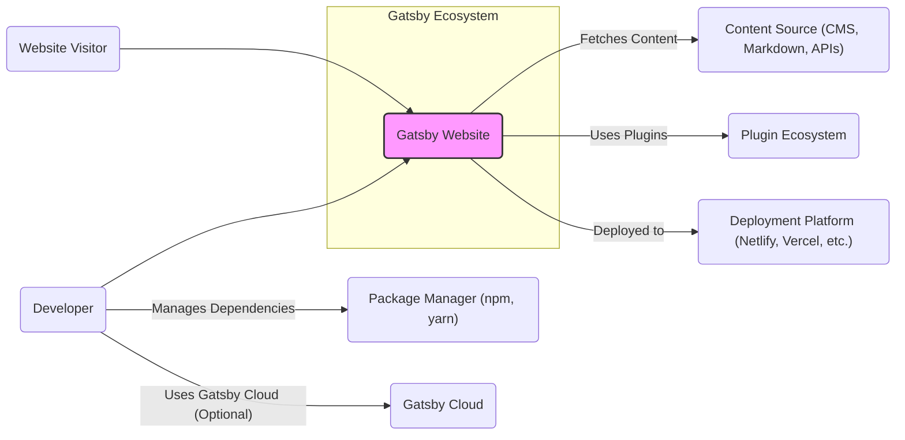
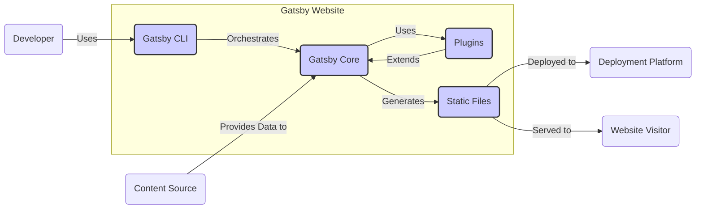
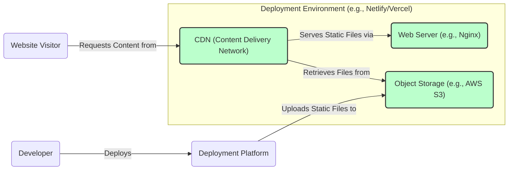

# BUSINESS POSTURE

- Business Priorities and Goals:
  - Gatsby is a free and open-source framework based on React that helps developers build blazing fast websites and apps.
  - Primary goal is to provide a performant, accessible, and user-friendly platform for building static websites and web applications.
  - Focus on developer experience, allowing for rapid development and easy content integration from various sources.
  - Aim to empower developers to create websites that are fast, secure, and scalable.
  - Support a large and active open-source community around the framework.

- Business Risks:
  - Security vulnerabilities in Gatsby core or plugins could lead to compromised websites built with Gatsby.
  - Reliance on open-source community for maintenance and security updates.
  - Potential for performance issues if websites are not properly optimized or plugins are inefficient.
  - Risk of supply chain attacks through compromised dependencies in the Gatsby ecosystem.
  - Misconfiguration during deployment can lead to security vulnerabilities or performance problems.

# SECURITY POSTURE

- Existing Security Controls:
  - security control: Gatsby core framework undergoes security reviews and bug fixes by the core team and community contributors. Described in GitHub repository issue tracking and pull requests.
  - security control: Dependency management using npm/yarn, allowing for dependency updates and vulnerability patching. Described in `package.json` and `yarn.lock` / `package-lock.json` files.
  - security control: Static site generation inherently reduces attack surface compared to dynamic server-rendered applications, as there is no server-side code to exploit in the deployed website. Implicit in Gatsby's architecture.
  - accepted risk: Reliance on third-party plugins, which may have their own security vulnerabilities. Risk acknowledged in Gatsby's plugin ecosystem nature.
  - accepted risk: Security of content sources (CMS, APIs) is outside of Gatsby's direct control. Risk assumed by users integrating external content sources.

- Recommended Security Controls:
  - security control: Implement automated dependency scanning for both Gatsby core and plugins used in projects to identify and address known vulnerabilities.
  - security control: Integrate Static Application Security Testing (SAST) tools into the development and build pipeline to detect potential security flaws in Gatsby plugins and custom code.
  - security control: Promote and enforce secure coding practices for plugin development within the Gatsby community.
  - security control: Provide guidelines and best practices for secure deployment of Gatsby sites, including secure hosting configurations and Content Security Policy (CSP) implementation.
  - security control: Encourage regular security audits and penetration testing of Gatsby core and popular plugins.

- Security Requirements:
  - Authentication:
    - Requirement: If Gatsby is used with a CMS or admin interface, ensure strong authentication mechanisms are in place to protect access to content management and site configuration.
    - Requirement: For Gatsby Cloud or similar services, secure authentication for user accounts and API access is crucial.
  - Authorization:
    - Requirement: Implement role-based access control (RBAC) for any CMS or admin interfaces to restrict access to sensitive functionalities based on user roles.
    - Requirement: Ensure proper authorization checks within plugins that handle user data or sensitive operations.
  - Input Validation:
    - Requirement: Plugins that accept user input or process external data must implement robust input validation to prevent injection attacks (e.g., XSS, SQL injection if applicable in plugin context).
    - Requirement: Sanitize and encode user-generated content before rendering it on the website to mitigate XSS risks.
  - Cryptography:
    - Requirement: If sensitive data is handled by Gatsby plugins or during build processes (e.g., API keys, secrets), ensure proper encryption at rest and in transit.
    - Requirement: Utilize HTTPS for all website traffic to protect data in transit between users and the deployed website.

# DESIGN

- C4 CONTEXT

  - C4 Context Elements:
    - Element:
      - Name: Gatsby Website
      - Type: Software System
      - Description: Websites and web applications built using the Gatsby framework.
      - Responsibilities: Presenting content to website visitors, providing user interface and user experience, leveraging Gatsby's performance optimizations.
      - Security controls: Content Security Policy (CSP), HTTPS, static site security best practices.
    - Element:
      - Name: Website Visitor
      - Type: Person
      - Description: End-users who access and interact with websites built using Gatsby.
      - Responsibilities: Accessing website content, interacting with website features.
      - Security controls: Browser security features, user awareness of phishing and malicious links.
    - Element:
      - Name: Developer
      - Type: Person
      - Description: Software developers who use Gatsby to build websites and applications.
      - Responsibilities: Developing website code, configuring Gatsby, selecting and integrating plugins, deploying websites.
      - Security controls: Secure coding practices, dependency management, secure configuration management, access control to development environments.
    - Element:
      - Name: Content Source (CMS, Markdown, APIs)
      - Type: External System
      - Description: Systems that provide content to be used by Gatsby websites, such as Content Management Systems (CMS), Markdown files, or external APIs.
      - Responsibilities: Storing and providing content, managing content updates.
      - Security controls: Authentication and authorization for content access, input validation for content, secure API communication (HTTPS).
    - Element:
      - Name: Plugin Ecosystem
      - Type: External System
      - Description: Collection of community-developed and official Gatsby plugins that extend Gatsby's functionality.
      - Responsibilities: Providing reusable components and functionalities, integrating with third-party services.
      - Security controls: Plugin review process (community-driven, not formally enforced by Gatsby), dependency scanning for plugins (recommended).
    - Element:
      - Name: Deployment Platform (Netlify, Vercel, etc.)
      - Type: External System
      - Description: Platforms used to host and serve Gatsby websites.
      - Responsibilities: Hosting website files, serving website content to visitors, providing CDN and other infrastructure services.
      - Security controls: Platform security controls (firewalls, DDoS protection, etc.), HTTPS termination, access control to deployment platform.
    - Element:
      - Name: Package Manager (npm, yarn)
      - Type: Tool
      - Description: Package managers used by developers to manage Gatsby dependencies and plugins.
      - Responsibilities: Downloading and installing dependencies, managing project dependencies.
      - Security controls: Dependency vulnerability scanning by package manager, using package lock files to ensure consistent dependency versions.
    - Element:
      - Name: Gatsby Cloud
      - Type: Optional External System
      - Description: Gatsby's commercial cloud platform offering features like build previews, incremental builds, and hosting.
      - Responsibilities: Providing optimized build and deployment pipeline, hosting Gatsby websites, offering Gatsby-specific cloud services.
      - Security controls: Gatsby Cloud security controls (authentication, authorization, infrastructure security), SOC 2 compliance (as a commercial service).

- C4 CONTAINER

  - C4 Container Elements:
    - Element:
      - Name: Gatsby CLI
      - Type: Application
      - Description: Command-line interface tool used by developers to create, develop, build, and manage Gatsby projects.
      - Responsibilities: Project scaffolding, development server, build process orchestration, plugin management.
      - Security controls: Secure installation of CLI (npm/yarn), secure handling of developer credentials (if any).
    - Element:
      - Name: Gatsby Core
      - Type: Library/Framework
      - Description: Core framework of Gatsby, providing the main functionalities for static site generation, routing, data fetching, and plugin integration.
      - Responsibilities: Managing build process, data processing, routing, rendering, plugin execution.
      - Security controls: Security reviews of core code, input validation within core functionalities, secure handling of data.
    - Element:
      - Name: Plugins
      - Type: Library/Components
      - Description: Collection of plugins that extend Gatsby's functionality, providing features like data sourcing, image processing, SEO enhancements, and integrations with third-party services.
      - Responsibilities: Extending Gatsby's capabilities, providing specific functionalities, integrating with external systems.
      - Security controls: Plugin-specific security controls (input validation, authorization), dependency management within plugins, community review (informal).
    - Element:
      - Name: Static Files
      - Type: Artifact
      - Description: Output of the Gatsby build process, consisting of HTML, CSS, JavaScript, and media files that form the deployed website.
      - Responsibilities: Representing the final website content, being served to website visitors.
      - Security controls: Content Security Policy (CSP) headers, immutable infrastructure for static files, secure storage and delivery.

- DEPLOYMENT

  - Deployment Elements:
    - Element:
      - Name: CDN (Content Delivery Network)
      - Type: Infrastructure Component
      - Description: Globally distributed network of servers that cache and deliver static website content to users based on their geographic location, improving performance and availability.
      - Responsibilities: Caching static files, serving content to users with low latency, providing DDoS protection.
      - Security controls: CDN provider's security controls (DDoS mitigation, edge security), HTTPS termination, CDN configuration security (cache policies, access control).
    - Element:
      - Name: Web Server (e.g., Nginx)
      - Type: Infrastructure Component
      - Description: Web server software responsible for serving static files to website visitors. In many CDN setups, the CDN edge servers act as web servers.
      - Responsibilities: Handling HTTP requests, serving static files, enforcing security headers (CSP, etc.).
      - Security controls: Web server configuration security (hardening, access control), security patches, HTTPS configuration, enforcing security headers.
    - Element:
      - Name: Object Storage (e.g., AWS S3)
      - Type: Infrastructure Component
      - Description: Cloud-based object storage service used to store the static files of the Gatsby website.
      - Responsibilities: Storing static files durably and reliably, providing access to CDN for content retrieval.
      - Security controls: Object storage access control (IAM policies), encryption at rest, bucket policies, secure API access.
    - Element:
      - Name: Deployment Platform
      - Type: Platform as a Service (PaaS)
      - Description: Platform like Netlify or Vercel that simplifies deployment and hosting of static websites, often automating the build and deployment process.
      - Responsibilities: Automating build and deployment, providing hosting infrastructure, managing CDN and web server configurations.
      - Security controls: Platform security controls (authentication, authorization, infrastructure security), secure deployment pipelines, access control to platform resources.

- BUILD

```mermaid
flowchart LR
    developer("Developer") -- "Code Changes" --> git_repository("Git Repository (GitHub)")
    git_repository -- "Triggers" --> ci_server("CI Server (GitHub Actions)")
    ci_server -- "Builds & Tests" --> build_process("Build Process (Gatsby CLI)")
    build_process -- "Dependency Scan, SAST" --> security_checks("Security Checks")
    security_checks -- "Generates" --> build_artifacts("Build Artifacts (Static Files)")
    build_artifacts -- "Pushes to" --> deployment_platform("Deployment Platform")

    style ci_server fill:#cfc,stroke:#333,stroke-width:2px
    style build_process fill:#cfc,stroke:#333,stroke-width:2px
    style security_checks fill:#cfc,stroke:#333,stroke-width:2px
    style build_artifacts fill:#cfc,stroke:#333,stroke-width:2px
```

  - Build Elements:
    - Element:
      - Name: Git Repository (GitHub)
      - Type: Code Repository
      - Description: Version control system (GitHub) where the Gatsby project code is stored and managed.
      - Responsibilities: Storing source code, tracking changes, facilitating collaboration.
      - Security controls: Access control to repository (authentication, authorization), branch protection, code review processes.
    - Element:
      - Name: CI Server (GitHub Actions)
      - Type: Automation Server
      - Description: Continuous Integration server (GitHub Actions) that automates the build, test, and deployment process when code changes are pushed to the repository.
      - Responsibilities: Automating build process, running tests, performing security checks, deploying artifacts.
      - Security controls: Secure CI/CD pipeline configuration, access control to CI/CD workflows, secret management for credentials, build environment security.
    - Element:
      - Name: Build Process (Gatsby CLI)
      - Type: Build Tool
      - Description: Gatsby CLI commands and scripts executed by the CI server to build the static website from the source code and content.
      - Responsibilities: Compiling code, processing data, generating static files, optimizing website assets.
      - Security controls: Secure build scripts, dependency management during build, minimizing build dependencies.
    - Element:
      - Name: Security Checks
      - Type: Security Tooling
      - Description: Automated security checks integrated into the build process, such as dependency scanning and Static Application Security Testing (SAST).
      - Responsibilities: Identifying vulnerabilities in dependencies, detecting potential security flaws in code.
      - Security controls: Configuration and management of security scanning tools, vulnerability reporting and remediation process.
    - Element:
      - Name: Build Artifacts (Static Files)
      - Type: Output Artifact
      - Description: The resulting static files (HTML, CSS, JavaScript, media) generated by the build process, ready for deployment.
      - Responsibilities: Representing the deployable website, being stored and deployed to the hosting platform.
      - Security controls: Integrity checks of build artifacts, secure storage of artifacts before deployment.
    - Element:
      - Name: Deployment Platform
      - Type: Deployment Target
      - Description: Platform where the build artifacts are deployed to be hosted and served to website visitors.
      - Responsibilities: Hosting website, serving content, providing infrastructure.
      - Security controls: Deployment platform security controls (as described in Deployment section).

# RISK ASSESSMENT

- Critical Business Processes:
  - Website Availability: Ensuring the website is accessible to users without interruption.
  - Content Integrity: Maintaining the accuracy and integrity of the website content.
  - Developer Productivity: Enabling developers to build and deploy websites efficiently and securely.

- Data to Protect and Sensitivity:
  - Website Content: Publicly accessible content, but integrity is important for brand reputation and user trust. Sensitivity: Low to Medium (depending on content type).
  - Source Code: Intellectual property, access control is important to prevent unauthorized modifications or disclosure. Sensitivity: Medium to High.
  - Build and Deployment Secrets: API keys, credentials for deployment platforms, need to be protected to prevent unauthorized access and deployments. Sensitivity: High.
  - User Data (if collected by plugins or CMS): Personal information collected through forms or user accounts (if applicable via plugins or integrated CMS). Sensitivity: Medium to High (depending on data type and regulations).

# QUESTIONS & ASSUMPTIONS

- Questions:
  - What is the specific use case for Gatsby? (e.g., blog, marketing website, e-commerce, application). This will influence the sensitivity of data and criticality of processes.
  - What is the risk appetite of the organization using Gatsby? (Startup vs. Fortune 500). This will determine the level of security controls required.
  - Are there any specific compliance requirements (e.g., GDPR, HIPAA, PCI DSS) that the Gatsby website needs to adhere to? This will dictate specific security requirements.
  - What is the process for managing and updating Gatsby core and plugins? Patching strategy and timelines.
  - Are there any plans to use Gatsby Cloud or other commercial Gatsby services? This might introduce additional security considerations and controls.

- Assumptions:
  - Gatsby is primarily used for building static websites with publicly accessible content.
  - The organization using Gatsby has a moderate risk appetite and is concerned about basic website security and availability.
  - Standard web security best practices are expected to be implemented.
  - Developers are responsible for selecting and securing plugins used in their Gatsby projects.
  - Deployment is assumed to be on a modern cloud platform with standard security features.