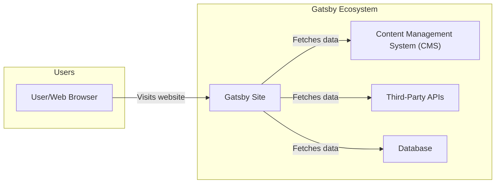
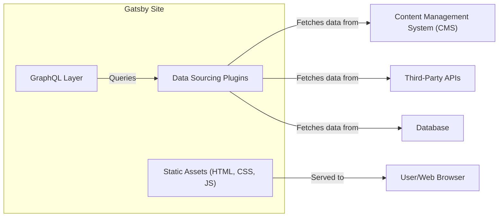
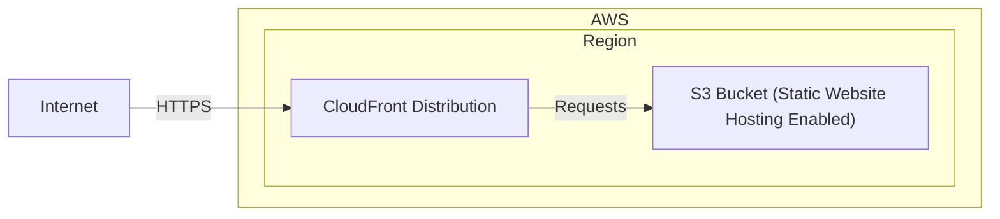
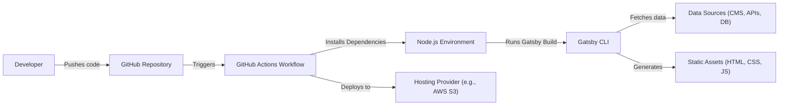

# BUSINESS POSTURE

Gatsby is a static site generator built on top of Node.js using React and GraphQL. It's used by individual developers and large companies to build a variety of websites, from personal blogs to large e-commerce platforms and company websites.

Business Priorities and Goals:

*   Provide a fast and efficient way to build static websites.
*   Offer a rich ecosystem of plugins and integrations.
*   Enable developers to easily manage content through various CMSs.
*   Ensure scalability and performance for websites of all sizes.
*   Maintain a strong and active community.
*   Provide excellent documentation and support.

Business Risks:

*   Vulnerabilities in Gatsby core or its dependencies could lead to website compromise.
*   Misconfiguration of plugins or integrations could expose sensitive data or create security loopholes.
*   Reliance on third-party services (CMSs, APIs) introduces external dependencies and potential points of failure.
*   Performance bottlenecks could impact user experience and SEO rankings.
*   Lack of proper security awareness among developers using Gatsby could lead to insecure website implementations.
*   Supply chain attacks targeting Gatsby's plugin ecosystem.

# SECURITY POSTURE

Existing Security Controls:

*   security control: Regular security audits and updates of Gatsby core and its dependencies. (Described in Gatsby's security documentation and release notes).
*   security control: Use of a strong typing system (TypeScript) in parts of the codebase to reduce errors. (Visible in the GitHub repository).
*   security control: Community-driven security vulnerability reporting and patching process. (Described in Gatsby's security documentation).
*   security control: Documentation promoting secure coding practices for Gatsby developers. (Available on the Gatsby website).
*   security control: Use of GraphQL, which can help prevent over-fetching of data. (Intrinsic to Gatsby's architecture).
*   security control: Support for Content Security Policy (CSP) headers. (Mentioned in Gatsby documentation).
*   security control: Support for HTTPS. (Mentioned in Gatsby documentation).

Accepted Risks:

*   accepted risk: Reliance on third-party plugins and integrations, which may have their own security vulnerabilities.
*   accepted risk: Potential for user misconfiguration, leading to security issues.
*   accepted risk: The complexity of the build process and the large number of dependencies increase the attack surface.

Recommended Security Controls:

*   Implement a robust Software Bill of Materials (SBOM) management system to track all dependencies and their vulnerabilities.
*   Introduce automated security scanning (SAST, DAST, SCA) into the CI/CD pipeline.
*   Develop a formal security training program for Gatsby developers.
*   Provide more detailed security guidance and best practices in the official documentation, specifically addressing common attack vectors like XSS, CSRF, and injection vulnerabilities.
*   Implement a bug bounty program to incentivize external security researchers to find and report vulnerabilities.

Security Requirements:

*   Authentication:
    *   Gatsby itself does not handle user authentication for the generated static sites. Authentication, if needed, is typically handled by integrating with external services (e.g., Netlify Identity, Auth0, or custom solutions).
    *   Requirement: If authentication is required, use a well-vetted and secure authentication service. Implement appropriate session management and protect against common authentication-related attacks (e.g., brute-force, credential stuffing).
*   Authorization:
    *   Similar to authentication, authorization for accessing content on a Gatsby site is typically managed externally.
    *   Requirement: If authorization is required, implement a robust authorization mechanism that enforces the principle of least privilege.
*   Input Validation:
    *   Gatsby uses GraphQL, which provides some level of input validation through its schema. However, additional validation may be needed depending on the data sources and plugins used.
    *   Requirement: Validate all user-supplied input, both on the client-side and server-side (during the build process if applicable), to prevent injection vulnerabilities. Sanitize data appropriately before displaying it to prevent XSS.
*   Cryptography:
    *   Gatsby supports HTTPS for secure communication.
    *   Requirement: Use HTTPS for all communication. If storing sensitive data, use strong encryption algorithms and manage keys securely.

# DESIGN

## C4 CONTEXT

Context Diagram Element Description:

*   Element:
    *   Name: User/Web Browser
    *   Type: User
    *   Description: Represents a user accessing the Gatsby-generated website through a web browser.
    *   Responsibilities: Initiates requests to the website, renders the received HTML, CSS, and JavaScript, and interacts with the website's interface.
    *   Security controls: Browser security features (e.g., same-origin policy, XSS protection), HTTPS.

*   Element:
    *   Name: Gatsby Site
    *   Type: System
    *   Description: The static website generated by Gatsby.
    *   Responsibilities: Serves static HTML, CSS, and JavaScript files to users.
    *   Security controls: Content Security Policy (CSP), HTTPS, secure coding practices during development.

*   Element:
    *   Name: Content Management System (CMS)
    *   Type: System
    *   Description: An external system (e.g., Contentful, WordPress, Drupal) used to manage the website's content.
    *   Responsibilities: Stores and manages content, provides an API for Gatsby to fetch content during the build process.
    *   Security controls: CMS's own security features, API authentication and authorization, input validation, secure configuration.

*   Element:
    *   Name: Third-Party APIs
    *   Type: System
    *   Description: External APIs used by the Gatsby site (e.g., payment gateways, analytics services).
    *   Responsibilities: Provides specific functionalities to the website.
    *   Security controls: API authentication and authorization, secure communication (HTTPS), input validation.

*   Element:
    *   Name: Database
    *   Type: System
    *   Description: A database used by the Gatsby site, potentially for storing data not managed by a CMS.
    *   Responsibilities: Stores and manages data.
    *   Security controls: Database security features, authentication and authorization, encryption at rest and in transit, input validation.

## C4 CONTAINER

Container Diagram Element Description:

*   Element:
    *   Name: Static Assets (HTML, CSS, JS)
    *   Type: Container
    *   Description: The compiled output of the Gatsby build process.
    *   Responsibilities: Rendered by the user's browser to display the website.
    *   Security controls: CSP, Subresource Integrity (SRI) if applicable.

*   Element:
    *   Name: GraphQL Layer
    *   Type: Container
    *   Description: Gatsby's internal GraphQL layer used to query data from various sources.
    *   Responsibilities: Provides a unified interface for accessing data.
    *   Security controls: Schema validation, query complexity limits, protection against introspection attacks if publicly exposed.

*   Element:
    *   Name: Data Sourcing Plugins
    *   Type: Container
    *   Description: Gatsby plugins that fetch data from various sources (CMS, APIs, databases).
    *   Responsibilities: Connect to data sources, retrieve data, and transform it into a format usable by Gatsby.
    *   Security controls: Secure handling of API keys and credentials, input validation, error handling.

*   Element:
    *   Name: User/Web Browser
    *   Type: User
    *   Description: Represents a user accessing the Gatsby-generated website through a web browser.
    *   Responsibilities: Initiates requests to the website, renders the received HTML, CSS, and JavaScript, and interacts with the website's interface.
    *   Security controls: Browser security features (e.g., same-origin policy, XSS protection), HTTPS.

*   Element:
    *   Name: Content Management System (CMS)
    *   Type: System
    *   Description: An external system (e.g., Contentful, WordPress, Drupal) used to manage the website's content.
    *   Responsibilities: Stores and manages content, provides an API for Gatsby to fetch content during the build process.
    *   Security controls: CMS's own security features, API authentication and authorization, input validation, secure configuration.

*   Element:
    *   Name: Third-Party APIs
    *   Type: System
    *   Description: External APIs used by the Gatsby site (e.g., payment gateways, analytics services).
    *   Responsibilities: Provides specific functionalities to the website.
    *   Security controls: API authentication and authorization, secure communication (HTTPS), input validation.

*   Element:
    *   Name: Database
    *   Type: System
    *   Description: A database used by the Gatsby site, potentially for storing data not managed by a CMS.
    *   Responsibilities: Stores and manages data.
    *   Security controls: Database security features, authentication and authorization, encryption at rest and in transit, input validation.

## DEPLOYMENT

Gatsby sites, being static, can be deployed to a variety of hosting providers. Common options include:

1.  Netlify
2.  AWS S3 + CloudFront
3.  Vercel
4.  GitHub Pages
5.  Traditional web servers (Apache, Nginx)

We'll describe deployment to **AWS S3 + CloudFront**, a common and robust solution.

Deployment Diagram Element Description:

*   Element:
    *   Name: AWS S3 Bucket (Static Website Hosting Enabled)
    *   Type: Infrastructure Node
    *   Description: An S3 bucket configured to host a static website.
    *   Responsibilities: Stores the static assets (HTML, CSS, JS) of the Gatsby site.
    *   Security controls: Bucket policies restricting public access, server-side encryption, versioning, access logging.

*   Element:
    *   Name: CloudFront Distribution
    *   Type: Infrastructure Node
    *   Description: A CloudFront distribution that serves the content from the S3 bucket.
    *   Responsibilities: Caches content at edge locations for faster delivery, provides HTTPS support, and can be configured with a Web Application Firewall (WAF).
    *   Security controls: HTTPS, WAF integration, access logging, origin access identity (OAI) to restrict direct access to the S3 bucket.

*   Element:
    *   Name: Internet
    *   Type: External Entity
    *   Description: Represents the public internet.
    *   Responsibilities: Connects users to the CloudFront distribution.
    *   Security controls: N/A

## BUILD

Gatsby's build process involves several steps, typically automated through a CI/CD pipeline. While Gatsby itself doesn't prescribe a specific CI/CD system, common choices include:

1.  GitHub Actions
2.  Netlify Build
3.  CircleCI
4.  Jenkins
5.  GitLab CI

We'll describe a build process using **GitHub Actions**.

Build Process Description:

1.  A developer pushes code changes to the GitHub repository.
2.  This triggers a GitHub Actions workflow.
3.  The workflow sets up a Node.js environment.
4.  It installs project dependencies (including Gatsby and its plugins) using npm or yarn.
5.  The workflow runs the `gatsby build` command.
6.  The Gatsby CLI fetches data from configured data sources (CMS, APIs, databases).
7.  Gatsby generates the static assets (HTML, CSS, JavaScript).
8.  The workflow deploys the static assets to the chosen hosting provider (e.g., AWS S3).

Security Controls in the Build Process:

*   Dependency Management: Use of `npm audit` or `yarn audit` to check for known vulnerabilities in dependencies.
*   Static Analysis: Integration of SAST tools (e.g., SonarQube, ESLint with security plugins) to scan the codebase for potential security issues.
*   Secret Management: Secure storage of API keys and other secrets using GitHub Actions secrets or a dedicated secrets management service.
*   Least Privilege: Running the build process with minimal necessary permissions.
*   Build Artifact Integrity: Ensuring the integrity of build artifacts through checksums or digital signatures (less common for static sites but applicable in some scenarios).
*   Supply Chain Security: Evaluating the security of third-party Gatsby plugins and themes before using them. Consider using tools like `npm-audit` or Snyk to scan for vulnerabilities in dependencies.

# RISK ASSESSMENT

Critical Business Processes:

*   Website availability and performance: Ensuring the website is accessible to users and loads quickly.
*   Content management: Enabling content editors to update the website content easily and securely.
*   Data integrity: Protecting the integrity of website content and any user data.

Data Sensitivity:

*   Website content: Generally public, but may include some restricted content depending on the site's purpose.
*   User data (if collected): Could range from low sensitivity (e.g., email addresses for newsletters) to high sensitivity (e.g., personal information, payment details) depending on the site's functionality.
*   API keys and credentials: Highly sensitive, as they provide access to external services and data.

# QUESTIONS & ASSUMPTIONS

Questions:

*   What specific CMSs and third-party APIs are being used?
*   Are there any specific compliance requirements (e.g., GDPR, CCPA, HIPAA)?
*   What is the expected traffic volume and growth rate?
*   Is there any user-generated content on the website?
*   Are there any plans to implement user authentication or authorization?
*   What is the process for reviewing and approving third-party plugins?
*   What level of detail is required for logging and monitoring?

Assumptions:

*   BUSINESS POSTURE: The primary goal is to build and maintain a performant and secure static website. The organization has a moderate risk appetite, balancing security with development speed and ease of use.
*   SECURITY POSTURE: Basic security measures are in place, but there is room for improvement. The organization is willing to invest in additional security controls.
*   DESIGN: The website uses a standard Gatsby setup with common plugins and integrations. Deployment is to a cloud-based static hosting provider. The build process is automated using a CI/CD pipeline.