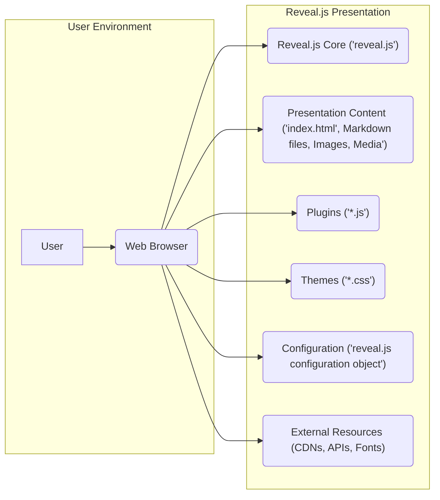

## Project Design Document: Reveal.js (Improved)

**1. Project Overview**

* **Project Name:** Reveal.js
* **Project Repository:** [https://github.com/hakimel/reveal.js](https://github.com/hakimel/reveal.js)
* **Project Description:** Reveal.js is a client-side, open-source HTML presentation framework. It empowers users to create visually appealing and interactive presentations using web technologies (HTML, CSS, JavaScript). Presentations are authored using markup languages (primarily Markdown or direct HTML) and are rendered dynamically within a web browser by the Reveal.js library.
* **Goal of this Document:** To provide a comprehensive and detailed architectural overview of Reveal.js, specifically tailored for subsequent threat modeling activities. This document aims to clearly delineate the core components, data flow pathways, and key interactions within the system to facilitate the identification of potential security vulnerabilities.

**2. Architecture Overview**

**3. Component Details**

* **User:** The individual who accesses and views the Reveal.js presentation using a web browser. The user is the primary actor interacting with the system.
* **Web Browser:** The software application (e.g., Chrome, Firefox, Safari, Edge) responsible for rendering the HTML, CSS, and executing the JavaScript code of the Reveal.js presentation. The browser provides the execution environment and enforces security policies (e.g., Same-Origin Policy, Content Security Policy).
* **Reveal.js Core ('reveal.js'):** The foundational JavaScript library (`reveal.js`) that provides the core functionality for creating and displaying presentations. Its responsibilities include:
    * **Initialization:** Setting up the presentation environment and event listeners.
    * **Slide Management:** Handling navigation between slides, transitions, and slide states.
    * **Rendering:** Dynamically manipulating the Document Object Model (DOM) to display slide content.
    * **Plugin Management:**  Loading, initializing, and coordinating with registered plugins.
    * **Theme Application:** Applying CSS themes to style the presentation.
    * **Configuration Handling:** Reading and applying user-defined configuration options.
* **Presentation Content ('index.html', Markdown files, Images, Media'):** The set of files that constitute the actual content of the presentation. This includes:
    * **'index.html':** The main entry point HTML file that loads the Reveal.js library, presentation content, themes, and plugins. It often contains the core structure of the presentation and the Reveal.js configuration.
    * **Markdown files:** Text files written in Markdown syntax that are parsed and converted into HTML slides by Reveal.js.
    * **Image files:**  Static image assets (e.g., PNG, JPG, GIF) embedded within the slides.
    * **Media files:** Video and audio files that can be embedded and played within the presentation.
* **Plugins ('*.js'):** Optional JavaScript files that extend the functionality of Reveal.js. Plugins can provide features such as:
    * Speaker notes.
    * Zoom controls.
    * Search functionality.
    * Math rendering (e.g., using MathJax).
    * Code highlighting (e.g., using Highlight.js).
    * Integration with external services or APIs.
* **Themes ('*.css'):** Cascading Style Sheets (CSS) files that define the visual appearance (styling, layout, colors, fonts) of the presentation. Themes can be built-in or custom.
* **Configuration ('reveal.js configuration object'):** A JavaScript object, typically defined within the 'index.html' file or a separate JavaScript file, that allows customization of Reveal.js behavior. Configuration options include:
    * Transition styles.
    * Navigation controls visibility.
    * Slide numbering.
    * Plugin activation and settings.
    * Keyboard bindings.
* **External Resources (CDNs, APIs, Fonts):** Resources loaded from external sources, potentially over a network. These can include:
    * **Content Delivery Networks (CDNs):** Hosting copies of Reveal.js core files, plugin files, theme files, or other libraries.
    * **External APIs:** Services accessed by plugins to fetch data or functionality.
    * **Web Fonts:** Font files loaded from services like Google Fonts.

**4. Data Flow**

```mermaid
graph LR
    A["User Requests Presentation ('index.html')"] --> B("Browser Fetches 'index.html'");
    B --> C("Browser Parses 'index.html'");
    C --> D("Browser Fetches CSS, JS (Reveal.js Core, Plugins), Images, Media");
    D --> E("Reveal.js Core Initializes");
    E --> F("Configuration Loaded and Applied");
    F --> G("Presentation Content (HTML from 'index.html' or Markdown) Rendered");
    G --> H("Plugins Initialized (Optional)");
    H --> I("External Resources Loaded (Optional)");
    I --> J("Presentation Displayed in Browser");
    J --> K["User Interaction (Navigation, Plugin Activation)"];
    K --> L("Reveal.js Core Responds to User Input (DOM Updates, Event Handling)");
    L --> J;
```

* **User Requests Presentation ('index.html'):** The user initiates the process by entering the URL of the presentation's 'index.html' file or opening it locally in their browser.
* **Browser Fetches 'index.html':** The browser sends a request to the server (or local file system) and retrieves the 'index.html' file.
* **Browser Parses 'index.html':** The browser parses the HTML content to understand the structure and identify linked resources.
* **Browser Fetches CSS, JS (Reveal.js Core, Plugins), Images, Media:** Based on the parsed HTML, the browser sends requests for linked CSS files (themes), JavaScript files (Reveal.js core and plugins), image files, and media files.
* **Reveal.js Core Initializes:** The `reveal.js` JavaScript library is loaded and executed. It begins the initialization process, setting up the necessary components and event listeners.
* **Configuration Loaded and Applied:** Reveal.js reads the configuration settings defined in the 'index.html' or a linked JavaScript file and applies these settings to customize its behavior.
* **Presentation Content (HTML from 'index.html' or Markdown) Rendered:** Reveal.js processes the slide content. If Markdown is used, it's converted to HTML. The core library then manipulates the DOM to render the slides within the browser window.
* **Plugins Initialized (Optional):** If plugins are configured, Reveal.js initializes and activates them, allowing them to extend the core functionality.
* **External Resources Loaded (Optional):** Plugins or the presentation content itself may trigger the loading of additional external resources, such as data from APIs or web fonts.
* **Presentation Displayed in Browser:** The fully rendered presentation is displayed to the user in the web browser.
* **User Interaction (Navigation, Plugin Activation):** The user interacts with the presentation through keyboard input, mouse clicks, or touch gestures. This can involve navigating between slides, triggering plugin actions, or interacting with embedded content.
* **Reveal.js Core Responds to User Input (DOM Updates, Event Handling):** The Reveal.js core library listens for user interactions and responds by updating the DOM (e.g., changing the visible slide), triggering animations, or invoking plugin functions.

**5. Key Interactions**

* **User - Web Browser:** The user interacts with the web browser through standard input methods (keyboard, mouse, touch). The browser interprets these actions and communicates them to the running JavaScript code.
* **Web Browser - Reveal.js Core:** The browser executes the JavaScript code of the Reveal.js core, which interacts with the browser's DOM API to manipulate the presentation's structure and appearance.
* **Reveal.js Core - Presentation Content:** The core library reads and interprets the presentation content (HTML or Markdown) and dynamically generates the HTML structure for the slides.
* **Reveal.js Core - Plugins:** The core library provides an API for plugins to register themselves and interact with the presentation lifecycle, allowing them to extend functionality and respond to events.
* **Reveal.js Core - Configuration:** The core library reads and applies the configuration settings to customize its behavior and the behavior of the presentation.
* **Web Browser - External Resources:** The browser makes HTTP requests to fetch external resources (CSS, JavaScript, images, fonts, data) based on links and scripts within the presentation content.
* **Plugins - External Resources:** Plugins may initiate their own requests to external APIs or services to fetch data or functionality. This interaction is mediated by the browser's networking capabilities.

**6. Security Considerations (Detailed for Threat Modeling)**

This section outlines potential security considerations, categorized for clarity, that should be thoroughly examined during the threat modeling process.

* **Cross-Site Scripting (XSS):**
    * **Presentation Content Injection:** Malicious JavaScript code could be injected into the presentation content (HTML or Markdown), allowing attackers to execute arbitrary scripts in the victim's browser when the presentation is viewed. This could lead to session hijacking, data theft, or redirection to malicious sites.
    * **Plugin Vulnerabilities:**  Flaws in third-party plugins could allow attackers to inject and execute malicious scripts.
    * **Configuration Exploitation:**  Improperly handled or unsanitized configuration settings could be manipulated to introduce XSS vectors.
* **Content Security Policy (CSP) Weaknesses:**
    * **Missing or Permissive CSP:** A lack of a strong CSP or a CSP with overly broad directives could allow attackers to bypass browser security measures and load malicious external resources or execute inline scripts.
    * **CSP Bypasses:**  Vulnerabilities in Reveal.js or its plugins could potentially be exploited to bypass the intended restrictions of the CSP.
* **Dependency Vulnerabilities:**
    * **Outdated Reveal.js Core:** Using an older version of the Reveal.js core library with known security vulnerabilities could expose users to attacks.
    * **Vulnerable Plugins:**  Utilizing outdated or insecure plugins can introduce vulnerabilities into the presentation.
    * **Third-Party Library Vulnerabilities:**  If Reveal.js or its plugins rely on other third-party libraries, vulnerabilities in those libraries could also pose a risk.
* **Insecure Handling of External Resources:**
    * **Loading from Untrusted Sources:**  Fetching resources (JavaScript, CSS, images) from untrusted CDNs or origins could lead to the execution of malicious code or the serving of compromised content.
    * **Man-in-the-Middle (MITM) Attacks:**  If resources are loaded over insecure HTTP connections, attackers could intercept and modify the content.
* **Client-Side Data Security:**
    * **Exposure of Sensitive Information:**  Presentation content or plugin logic might inadvertently expose sensitive data within the client-side code or browser memory.
    * **Insecure Data Storage:**  If plugins store data locally (e.g., using local storage), this data could be vulnerable to access by other scripts or browser extensions.
* **Open Redirects:**
    * If the presentation logic or plugins involve redirects based on user input or configuration, vulnerabilities could allow attackers to redirect users to malicious websites.
* **Information Disclosure:**
    * **Source Code Exposure:**  While client-side, improper configuration or vulnerabilities could inadvertently expose parts of the presentation's source code or internal logic.
    * **Configuration Details:**  Revealing sensitive configuration details could aid attackers in identifying potential weaknesses.
* **Denial of Service (DoS):**
    * **Malicious Content:**  Crafted presentation content or plugin interactions could potentially cause the browser to become unresponsive or consume excessive resources, leading to a denial of service for the user.
* **Plugin Security (Broader Considerations):**
    * **Lack of Vetting:**  The security of the overall system heavily relies on the security of the plugins used. Unvetted or poorly written plugins can introduce a wide range of vulnerabilities.
    * **Privilege Escalation:**  Vulnerabilities in plugins could potentially allow them to gain unauthorized access or privileges within the browser environment.

This improved design document provides a more detailed and security-focused overview of the Reveal.js architecture. It should serve as a robust foundation for conducting a comprehensive threat modeling exercise.