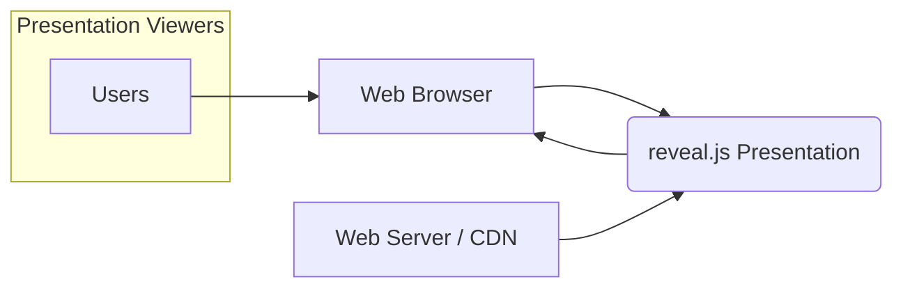
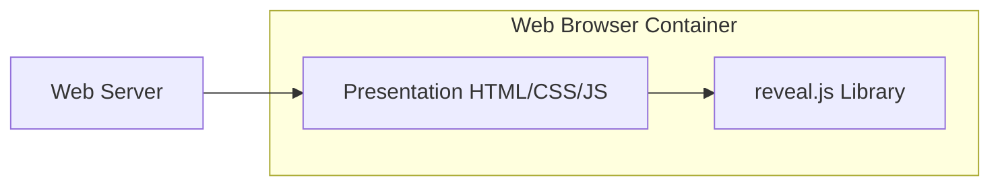
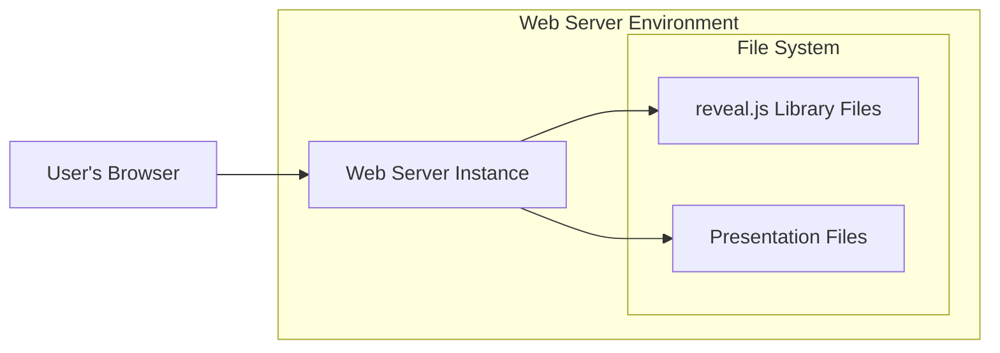
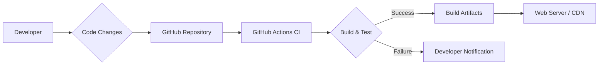

# BUSINESS POSTURE

- Business priorities and goals:
 - Goal: Provide a free, open-source HTML presentation framework for developers and presenters.
 - Priority: Ease of use and customization to enable users to create and deliver engaging web-based presentations.
 - Goal: Maintain a lightweight and performant library that works across modern web browsers.
 - Priority: Ensure compatibility and responsiveness across different devices and browsers.

- Most important business risks:
 - Risk: Security vulnerabilities in reveal.js could be exploited to compromise presentations or user systems.
 - Risk: Lack of maintenance and updates could lead to incompatibility with newer browsers or security issues.
 - Risk: Dependence on open-source community support might result in slower response times for bug fixes or feature requests compared to commercial solutions.
 - Risk: Potential misuse of reveal.js for malicious purposes, such as phishing or distributing harmful content within presentations.

# SECURITY POSTURE

- Existing security controls:
 - security control: Reliance on browser security model for execution of JavaScript and rendering of HTML and CSS.
 - security control: Use of HTTPS for serving reveal.js library and presentation content, ensuring data in transit encryption. (Assumed, as best practice for web content delivery).
 - security control: Security scanning of dependencies using automated tools during development (Likely, as common practice in open-source projects, but not explicitly stated in the repository).
 - security control: Input sanitization and output encoding are the responsibility of the user creating presentation content. (Implicit, as reveal.js itself doesn't handle user-generated content directly, but renders user-provided HTML).

- Accepted risks:
 - accepted risk: Client-side execution of JavaScript inherently trusts the browser environment.
 - accepted risk: Vulnerabilities in browser itself can affect reveal.js execution.
 - accepted risk: Security of presentation content is the responsibility of the user creating and hosting the presentation.
 - accepted risk: Open-source nature implies reliance on community for security vulnerability discovery and patching.

- Recommended security controls:
 - security control: Implement Content Security Policy (CSP) to mitigate risks of Cross-Site Scripting (XSS) attacks by controlling resources the browser is allowed to load.
 - security control: Utilize Subresource Integrity (SRI) to ensure that resources fetched from CDNs or external sources have not been tampered with.
 - security control: Regularly perform dependency scanning and update dependencies to address known vulnerabilities in third-party libraries.
 - security control: Encourage users to follow secure content creation practices, including input validation and output encoding when embedding external content or user-provided data in presentations.
 - security control: Implement automated security testing (SAST/DAST) in the development pipeline to identify potential vulnerabilities early in the development lifecycle.

- Security requirements:
 - Authentication: Not applicable for reveal.js library itself, as it's a client-side framework. Authentication might be relevant for systems that host and manage reveal.js presentations if access control is needed.
 - Authorization: Not applicable for reveal.js library itself. Authorization might be relevant for systems that host and manage reveal.js presentations to control who can access or modify presentations.
 - Input validation: Reveal.js renders HTML, CSS, and JavaScript provided in presentation files. Input validation is crucial at the stage of presentation content creation to prevent XSS and other injection attacks. This is primarily the responsibility of the user creating the presentation. Reveal.js itself does not handle user input directly in runtime.
 - Cryptography: Reveal.js itself does not handle sensitive data or require cryptography. HTTPS should be used for serving presentations to protect data in transit. If presentations contain sensitive data at rest, encryption should be handled at the storage level, outside of reveal.js scope.

# DESIGN

- C4 CONTEXT

- C4 CONTEXT elements:
 - - Name: Users
   - Type: Person
   - Description: Individuals who view presentations created with reveal.js.
   - Responsibilities: Viewing presentations, interacting with presentation controls.
   - Security controls: Browser security controls, user awareness of safe browsing practices.
 - - Name: reveal.js Presentation
   - Type: Software System
   - Description: Web-based presentation created using reveal.js framework. Consists of HTML, CSS, and JavaScript files.
   - Responsibilities: Rendering presentation content, handling user navigation, providing presentation features (e.g., speaker notes, plugins).
   - Security controls: Content Security Policy (CSP), Subresource Integrity (SRI), input validation and output encoding of presentation content (user responsibility).
 - - Name: Web Browser
   - Type: Software System
   - Description: User's web browser (e.g., Chrome, Firefox, Safari) used to access and render reveal.js presentations.
   - Responsibilities: Fetching presentation files, executing JavaScript code, rendering HTML and CSS, enforcing browser security policies.
   - Security controls: Browser security features (e.g., sandboxing, XSS protection, same-origin policy), browser updates and security patches.
 - - Name: Web Server / CDN
   - Type: Software System
   - Description: Web server or Content Delivery Network (CDN) that hosts and serves reveal.js library files and presentation assets.
   - Responsibilities: Storing and serving presentation files, handling HTTP requests, ensuring availability and performance.
   - Security controls: HTTPS encryption, web server security configuration, access controls to server infrastructure, DDoS protection (CDN).

- C4 CONTAINER

- C4 CONTAINER elements:
 - - Name: reveal.js Library
   - Type: Container - JavaScript Library
   - Description: Collection of JavaScript, CSS, and image files that constitute the reveal.js framework. Provides core presentation functionality and API.
   - Responsibilities: Core presentation logic, slide rendering, transition effects, plugin management, API for customization.
   - Security controls: Subresource Integrity (SRI) if loaded from CDN, dependency scanning during development, code review.
 - - Name: Presentation HTML/CSS/JS
   - Type: Container - Web Application
   - Description: HTML, CSS, and JavaScript files that define the specific content and structure of a presentation created using reveal.js.
   - Responsibilities: Defining presentation slides, content, layout, and any custom JavaScript logic.
   - Security controls: Input validation and output encoding of presentation content, Content Security Policy (CSP) configuration.
 - - Name: Web Server
   - Type: Container - Web Server
   - Description: Web server (e.g., Nginx, Apache, Node.js server) responsible for serving static files, including reveal.js library and presentation assets.
   - Responsibilities: Handling HTTP requests, serving files, managing server configuration, logging.
   - Security controls: HTTPS configuration, web server hardening, access controls, security monitoring, regular security updates.

- DEPLOYMENT

- Deployment options:
 - Option 1: Static hosting on a web server. Presentation files and reveal.js library are deployed to a web server and served directly to users' browsers.
 - Option 2: CDN hosting. Reveal.js library and presentation assets are hosted on a Content Delivery Network (CDN) for improved performance and availability.
 - Option 3: Embedded within a web application. Reveal.js is integrated into a larger web application, and presentations are served as part of the application's functionality.

- Selected deployment option: Option 1: Static hosting on a web server.

- DEPLOYMENT elements:
 - - Name: Web Server Instance
   - Type: Infrastructure - Server
   - Description: Instance of a web server software (e.g., Nginx, Apache) running on a server (physical or virtual).
   - Responsibilities: Hosting and serving web files, handling HTTP requests, managing connections.
   - Security controls: Operating system hardening, web server configuration hardening, firewall rules, intrusion detection system, regular security patching.
 - - Name: reveal.js Library Files
   - Type: Artifact - Files
   - Description: Static files comprising the reveal.js library (JavaScript, CSS, images, etc.) stored on the web server's file system.
   - Responsibilities: Providing the core functionality of reveal.js when served to the browser.
   - Security controls: File system access controls, integrity monitoring.
 - - Name: Presentation Files
   - Type: Artifact - Files
   - Description: HTML, CSS, JavaScript, and media files that constitute a specific reveal.js presentation, stored on the web server's file system.
   - Responsibilities: Defining the content and structure of the presentation.
   - Security controls: File system access controls, integrity monitoring, input validation and output encoding of content during creation.
 - - Name: User's Browser
   - Type: Client - Application
   - Description: User's web browser accessing the presentation.
   - Responsibilities: Requesting and rendering presentation files, executing JavaScript.
   - Security controls: Browser security features, user awareness.

- BUILD

- BUILD elements:
 - - Name: Developer
   - Type: Person
   - Description: Software developer contributing to the reveal.js project or creating presentations.
   - Responsibilities: Writing code, committing changes, creating presentation content.
   - Security controls: Secure coding practices, code review, access control to repository.
 - - Name: Code Changes
   - Type: Artifact - Code
   - Description: Modifications to the reveal.js codebase or presentation files.
   - Responsibilities: Implementing features, fixing bugs, creating presentation content.
   - Security controls: Version control (Git), code review, commit signing.
 - - Name: GitHub Repository
   - Type: Tool - Version Control System
   - Description: GitHub repository hosting the reveal.js source code and potentially presentation files.
   - Responsibilities: Storing code, managing versions, facilitating collaboration.
   - Security controls: Access control, branch protection, audit logs, vulnerability scanning (GitHub Dependabot).
 - - Name: GitHub Actions CI
   - Type: Tool - CI/CD System
   - Description: GitHub Actions workflows configured for automated build, test, and potentially deployment of reveal.js.
   - Responsibilities: Automating build process, running tests, performing security checks, publishing artifacts.
   - Security controls: Secure workflow configuration, secret management, access control to workflows, build environment security.
 - - Name: Build & Test
   - Type: Process
   - Description: Automated process of compiling, bundling, and testing the reveal.js code. Includes security checks like linting and dependency scanning.
   - Responsibilities: Ensuring code quality, identifying bugs, detecting vulnerabilities.
   - Security controls: SAST/DAST tools integration, dependency scanning, linting, unit tests, integration tests.
 - - Name: Build Artifacts
   - Type: Artifact - Files
   - Description: Compiled and bundled files of reveal.js library, ready for deployment.
   - Responsibilities: Deployable version of reveal.js.
   - Security controls: Artifact signing, integrity checks, secure storage of artifacts.
 - - Name: Web Server / CDN
   - Type: Infrastructure - Server/CDN
   - Description: Target deployment environment where build artifacts are deployed.
   - Responsibilities: Hosting and serving reveal.js library and presentations.
   - Security controls: Deployment process security, infrastructure security controls (as described in Deployment section).
 - - Name: Developer Notification
   - Type: Notification
   - Description: Communication to developers about build failures or other issues.
   - Responsibilities: Alerting developers to problems in the build process.
   - Security controls: Secure communication channels.

# RISK ASSESSMENT

- Critical business process we are trying to protect:
 - Process: Delivery of information and presentations using reveal.js.
 - Impact of failure: Inability to deliver presentations, potential reputational damage if presentations are unavailable or compromised.

- Data we are trying to protect and their sensitivity:
 - Data: Presentation content (HTML, CSS, JavaScript, media files).
 - Sensitivity: Varies greatly depending on the content of the presentation. Could range from public information to confidential business data, personal information, or intellectual property.
 - Data: Reveal.js library code itself.
 - Sensitivity: Publicly available open-source code, but integrity is important to ensure no malicious modifications are introduced.

# QUESTIONS & ASSUMPTIONS

- Questions:
 - What is the intended use case for reveal.js presentations? Are they primarily for public presentations or internal use with sensitive data?
 - Are there any specific compliance requirements (e.g., GDPR, HIPAA) that apply to the presentations created with reveal.js?
 - Are there any existing security policies or guidelines within the organization that need to be considered for reveal.js deployments?
 - Is there a need for access control or authentication for presentations created with reveal.js?
 - What is the organization's risk appetite regarding open-source software and client-side vulnerabilities?

- Assumptions:
 - BUSINESS POSTURE: The primary goal is to provide a widely accessible and customizable presentation framework. Security is important but balanced with ease of use and open-source principles.
 - SECURITY POSTURE: Basic web security best practices are assumed (HTTPS). More advanced security controls like CSP and SRI are recommended for enhanced security. Security of presentation content is primarily the user's responsibility.
 - DESIGN: Reveal.js is deployed as static files on web servers or CDNs. Build process uses standard CI/CD practices with some level of automated security checks.