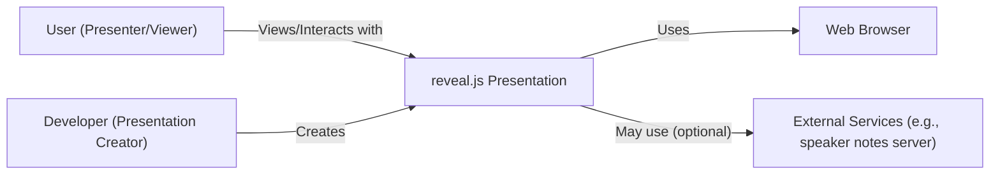
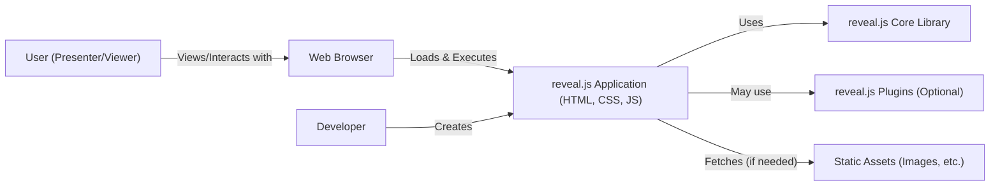
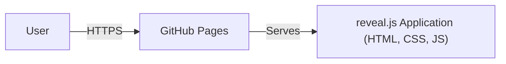

# BUSINESS POSTURE

Business Priorities and Goals:

*   Enable users to create and deliver presentations easily using web technologies.
*   Provide a flexible and customizable presentation framework.
*   Foster a large and active open-source community.
*   Maintain a lightweight and performant core library.
*   Offer extensive features through plugins and integrations.

Most Important Business Risks:

*   Compromise of the reveal.js library, leading to malicious presentations.
*   Data breaches affecting presentation content or user data (if any is collected).
*   Reputational damage due to security vulnerabilities.
*   Loss of user trust and adoption.
*   Intellectual property theft or unauthorized use.

# SECURITY POSTURE

Existing Security Controls:

*   security control: The project is open-source, allowing for community review and contributions (Mentioned in the GitHub repository).
*   security control: Basic Content Security Policy (CSP) example is provided, though not enforced by the framework itself (Mentioned in documentation: https://revealjs.com/config/).
*   security control: Dependencies are managed, and presumably, updates are applied (though no specific process is described in the provided information).
*   security control: The project uses a static site generator approach, reducing the attack surface compared to dynamic server-side applications.

Accepted Risks:

*   accepted risk: The framework itself does not enforce strict security policies, relying on users to implement them correctly.
*   accepted risk: The wide range of plugins and integrations introduces a larger attack surface, and their security is not centrally managed.
*   accepted risk: The project does not appear to have a formal vulnerability disclosure program.
*   accepted risk: No mention of regular security audits or penetration testing.

Recommended Security Controls:

*   security control: Implement a robust and well-documented Content Security Policy (CSP) by default, with options for user customization.
*   security control: Establish a formal vulnerability disclosure program and security contact.
*   security control: Conduct regular security audits and penetration testing, especially for core functionality and official plugins.
*   security control: Provide clear security guidelines and best practices for users and plugin developers.
*   security control: Implement dependency management best practices, including regular updates and vulnerability scanning.
*   security control: Consider signing releases to ensure integrity.
*   security control: Provide sandboxing options for untrusted content or plugins.

Security Requirements:

*   Authentication:
    *   Not directly applicable to the core framework, as it primarily deals with presentation display. Authentication might be relevant for authoring tools or integrations, but those are outside the scope of this core project.
*   Authorization:
    *   Similar to authentication, authorization is not a primary concern of the core framework. Access control might be relevant for specific deployments or integrations.
*   Input Validation:
    *   Crucial for preventing XSS vulnerabilities. The framework should sanitize any user-provided input that is rendered in the presentation. This includes HTML, JavaScript, and CSS.  The documentation should clearly state what level of sanitization is performed and what responsibilities fall on the user.
*   Cryptography:
    *   If the framework handles sensitive data (which it ideally shouldn't), appropriate cryptographic measures should be used for storage and transmission. HTTPS should be enforced for any network communication.  The framework itself doesn't seem to handle sensitive data directly.

# DESIGN

## C4 CONTEXT

Element Descriptions:

*   Element:
    *   Name: User (Presenter/Viewer)
    *   Type: Person
    *   Description: The person presenting or viewing the reveal.js presentation.
    *   Responsibilities: Interacts with the presentation, navigates slides, triggers events.
    *   Security controls: Relies on browser security and user-implemented security measures (e.g., strong passwords if authentication is involved in a related system).

*   Element:
    *   Name: reveal.js Presentation
    *   Type: Software System
    *   Description: The presentation created using the reveal.js framework.
    *   Responsibilities: Displays content, handles user input, manages presentation flow.
    *   Security controls: Input sanitization (user-implemented and potentially some framework-level), CSP (user-implemented).

*   Element:
    *   Name: Web Browser
    *   Type: Software System
    *   Description: The web browser used to render and display the presentation.
    *   Responsibilities: Executes JavaScript, renders HTML and CSS, handles network requests.
    *   Security controls: Browser's built-in security mechanisms (e.g., same-origin policy, XSS protection).

*   Element:
    *   Name: External Services
    *   Type: Software System
    *   Description: Optional external services that the presentation might interact with (e.g., a server for speaker notes, a backend for interactive elements).
    *   Responsibilities: Varies depending on the service.
    *   Security controls: Dependent on the specific service; should implement appropriate security measures.

*   Element:
    *   Name: Developer (Presentation Creator)
    *   Type: Person
    *   Description: The person who creates the presentation using reveal.js.
    *   Responsibilities: Writes the presentation content, configures reveal.js, integrates plugins.
    *   Security controls: Responsible for implementing security best practices in the presentation content and configuration.

## C4 CONTAINER

Element Descriptions:

*   Element:
    *   Name: User (Presenter/Viewer)
    *   Type: Person
    *   Description: The person presenting or viewing the reveal.js presentation.
    *   Responsibilities: Interacts with the presentation.
    *   Security controls: Relies on browser security.

*   Element:
    *   Name: Web Browser
    *   Type: Software System
    *   Description: Standard web browser.
    *   Responsibilities: Renders HTML, CSS, and JavaScript.
    *   Security controls: Standard browser security features.

*   Element:
    *   Name: reveal.js Application (HTML, CSS, JS)
    *   Type: Web Application
    *   Description: The specific instance of a presentation, including user content and configuration.
    *   Responsibilities: Displays the presentation content, handles user interaction.
    *   Security controls: User-implemented CSP, input sanitization.

*   Element:
    *   Name: reveal.js Core Library
    *   Type: JavaScript Library
    *   Description: The core reveal.js framework code.
    *   Responsibilities: Provides the presentation functionality.
    *   Security controls: Should include basic input sanitization, but primarily relies on user-implemented security.

*   Element:
    *   Name: Plugins (Optional)
    *   Type: JavaScript Libraries
    *   Description: Optional plugins that extend reveal.js functionality.
    *   Responsibilities: Varies depending on the plugin.
    *   Security controls: Security is the responsibility of the plugin developer and the user who integrates them.

*   Element:
    *   Name: Static Assets (Images, etc.)
    *   Type: Static Files
    *   Description: Images, videos, and other static assets used in the presentation.
    *   Responsibilities: Provide visual content.
    *   Security controls: Should be served with appropriate headers (e.g., Content-Type).

*   Element:
    *   Name: Developer
    *   Type: Person
    *   Description: Creates presentation.
    *   Responsibilities: Writes content, configures reveal.js.
    *   Security controls: Responsible for secure coding practices.

## DEPLOYMENT

Possible Deployment Solutions:

1.  Static Web Hosting (e.g., GitHub Pages, Netlify, AWS S3, Azure Blob Storage).
2.  Web Server (e.g., Apache, Nginx).
3.  Containerized Deployment (e.g., Docker, Kubernetes) - less common for purely static sites, but possible.

Chosen Solution: Static Web Hosting (GitHub Pages)

Element Descriptions:

*   Element:
    *   Name: User
    *   Type: Person
    *   Description: The person accessing the presentation.
    *   Responsibilities: Views the presentation in their browser.
    *   Security controls: Relies on browser security and HTTPS.

*   Element:
    *   Name: GitHub Pages
    *   Type: Infrastructure
    *   Description: GitHub's static site hosting service.
    *   Responsibilities: Serves the static files of the presentation.
    *   Security controls: GitHub Pages provides HTTPS by default, ensuring encrypted communication.  Relies on GitHub's infrastructure security.

*   Element:
    *   Name: reveal.js Application (HTML, CSS, JS)
    *   Type: Web Application
    *   Description: The presentation files.
    *   Responsibilities: Displays the presentation.
    *   Security controls: User-implemented CSP and input sanitization.

## BUILD

```mermaid
graph LR
    Developer["Developer"] -- "Writes code" --> SourceCode["Source Code (GitHub Repository)"]
    SourceCode -- "git push" --> GitHub["GitHub"]
    GitHub -- "GitHub Actions (Optional)" --> BuildServer["Build Server (GitHub Actions Runner)"]
    BuildServer -- "npm install & npm build (if needed)" --> BuildProcess["Build Process"]
    BuildProcess -- "Creates" --> BuildArtifacts["Build Artifacts (HTML, CSS, JS, Assets)"]
    BuildArtifacts -- "Deployed to" --> GitHubPages["GitHub Pages"]
```

Build Process Description:

1.  Developer writes the presentation content and configuration (HTML, Markdown, CSS, JavaScript).
2.  The source code is stored in a GitHub repository.
3.  A `git push` to the repository triggers a build process (optional, if using a build system like GitHub Actions).
4.  If using GitHub Actions, a workflow is triggered. This workflow might:
    *   Install dependencies (e.g., `npm install`).
    *   Run a build script (e.g., `npm run build`) to compile or process the presentation files. This could involve tasks like minifying JavaScript and CSS, optimizing images, etc.
    *   Run linters and static analysis tools (e.g., ESLint, HTMLHint) to check for code quality and potential security issues.
    *   Run security scanners (e.g., Snyk, Dependabot) to identify vulnerabilities in dependencies.
5.  The build process produces the final build artifacts (HTML, CSS, JavaScript, and other assets).
6.  These artifacts are deployed to the hosting environment (e.g., GitHub Pages).

Security Controls in Build Process:

*   security control: Dependency management (using `package.json` and `package-lock.json` or `yarn.lock`).
*   security control: Automated builds (using GitHub Actions or similar) ensure consistency and reproducibility.
*   security control: Linters and static analysis tools can identify potential code quality and security issues.
*   security control: Dependency vulnerability scanning (using tools like Snyk or Dependabot) can detect known vulnerabilities in dependencies.
*   security control: Code review (through pull requests) allows for peer review of code changes before they are merged.

# RISK ASSESSMENT

Critical Business Processes:

*   Presentation delivery: Ensuring that presentations can be reliably delivered to the audience.
*   Content creation: Enabling users to easily create and modify presentations.
*   Community engagement: Maintaining a vibrant and active open-source community.

Data to Protect:

*   Presentation content: This may contain sensitive information, depending on the user's content. Sensitivity: Variable (from public to highly confidential).
*   User data (if any is collected by integrations or plugins): This could include email addresses, names, or other personal information. Sensitivity: Potentially high, depending on the data collected.
*   Source code: Protecting the integrity of the reveal.js codebase. Sensitivity: Medium (impacts all users).

# QUESTIONS & ASSUMPTIONS

Questions:

*   Are there any specific compliance requirements (e.g., GDPR, HIPAA) that apply to the use cases of reveal.js?
*   What level of support is provided for different web browsers and versions?
*   What is the process for handling security vulnerabilities reported by the community?
*   Are there any plans to introduce features that would require more robust security measures (e.g., user authentication, data storage)?
*   What is the expected usage of external services and plugins, and how are their security implications managed?

Assumptions:

*   BUSINESS POSTURE: The primary goal is to provide a free and open-source presentation framework. Revenue generation is not a primary concern.
*   SECURITY POSTURE: Users are responsible for implementing most security measures, including CSP and input sanitization. The core framework provides minimal built-in security.
*   DESIGN: The typical deployment model is static web hosting. Users are expected to have basic knowledge of web technologies.