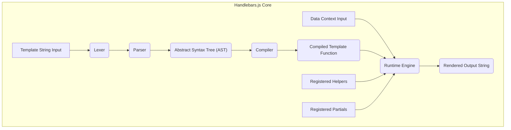
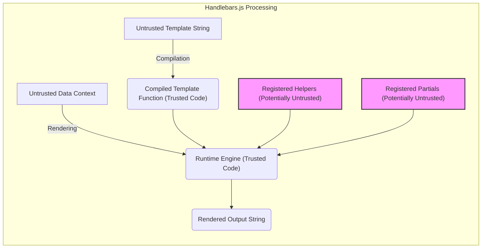

# Project Design Document: Handlebars.js

**Version:** 1.1
**Date:** October 26, 2023
**Author:** AI Software Architect

## 1. Introduction

This document provides an enhanced and more detailed design overview of the Handlebars.js templating engine, specifically tailored for threat modeling. It aims to clearly articulate the architecture, components, data flow, and potential security considerations within the system. This document serves as the foundation for subsequent threat modeling activities.

Handlebars.js is a semantic web templating engine based on the Mustache template language. It enables developers to generate dynamic HTML and other text-based formats by embedding expressions within templates. These expressions are evaluated and replaced with data at runtime. Its logic-less nature encourages separation of concerns, making templates more readable and maintainable.

## 2. Project Goals

The primary goals of Handlebars.js are:

* **Simplicity:** Offer an intuitive and easy-to-learn templating syntax, minimizing the learning curve for developers.
* **Logic-less Templates:** Promote a clear separation between presentation and logic by limiting the amount of conditional and iterative logic within templates.
* **Extensibility:** Provide mechanisms for extending functionality through custom helpers and reusable partials.
* **Performance:** Achieve efficient template compilation and rendering to minimize performance overhead.
* **Security:** Offer built-in protection against common web vulnerabilities, such as Cross-Site Scripting (XSS).
* **Cross-Environment Compatibility:** Function consistently across both browser (client-side) and Node.js (server-side) JavaScript environments.

## 3. Architecture Overview

Handlebars.js core functionality can be broken down into the following key stages and components:

* **Template String Input:** The raw template string containing HTML markup and Handlebars expressions.
* **Lexer:**  The lexical analyzer that breaks down the input template string into a stream of tokens (e.g., HTML tags, Handlebars expressions, text).
* **Parser:**  Analyzes the token stream from the Lexer and constructs an Abstract Syntax Tree (AST) representing the template's structure.
* **Abstract Syntax Tree (AST):** A hierarchical tree structure that represents the parsed template, making it easier for the Compiler to process.
* **Compiler:**  Traverses the AST and generates executable JavaScript code in the form of a Compiled Template Function. This function is optimized for performance.
* **Compiled Template Function:** A JavaScript function generated by the Compiler. It accepts a data context as input and returns the rendered output.
* **Data Context Input:** The JavaScript object containing the data that will be used to populate the template during rendering.
* **Runtime Engine:** Executes the Compiled Template Function, resolving Handlebars expressions, invoking helpers, and including partials using the provided data context.
* **Registered Helpers:**  A collection of JavaScript functions that extend the functionality of Handlebars templates and are registered with the Handlebars instance.
* **Registered Partials:**  A collection of reusable template snippets that are registered with the Handlebars instance and can be included within other templates.
* **Rendered Output String:** The final output, typically an HTML string, generated by the Runtime Engine.

## 4. Component Details

### 4.1. Template String Input

* The initial input to the Handlebars.js process.
* Contains HTML markup interleaved with Handlebars expressions enclosed in double curly braces `{{...}}` or triple curly braces `{{{...}}}`.
* Can be sourced from various locations, including:
    * String literals within JavaScript code
    * Content loaded from external files
    * Data received from external sources (e.g., APIs)

### 4.2. Lexer

* Responsible for the lexical analysis of the Template String Input.
* Scans the input character by character and groups them into meaningful tokens.
* Identifies different types of tokens, such as:
    * HTML tags and attributes
    * Handlebars expressions (variables, helpers, block helpers, partials)
    * Literal text
    * Whitespace
* Passes the stream of tokens to the Parser.

### 4.3. Parser

* Takes the stream of tokens from the Lexer as input.
* Analyzes the token sequence according to the grammar of the Handlebars template language.
* Constructs an Abstract Syntax Tree (AST) that represents the hierarchical structure of the template.
* Enforces the syntax rules of Handlebars and reports syntax errors if the template is invalid.

### 4.4. Abstract Syntax Tree (AST)

* A tree-like representation of the parsed template.
* Each node in the AST represents a specific element of the template, such as:
    * HTML elements and their attributes
    * Handlebars expressions (e.g., `MustacheNode`, `BlockStatement`, `PartialStatement`)
    * Text nodes
* The AST provides a structured and organized representation of the template, making it easier for the Compiler to process and optimize.

### 4.5. Compiler

* Takes the AST as input and transforms it into executable JavaScript code.
* Generates a JavaScript function (the Compiled Template Function) that will perform the rendering.
* Optimizes the generated code for performance by:
    * Minimizing string concatenation operations
    * Pre-resolving helper and partial references
* Handles different types of Handlebars expressions and generates the corresponding JavaScript logic to evaluate them at runtime.

### 4.6. Compiled Template Function

* A JavaScript function dynamically generated by the Compiler.
* Accepts a single argument, which is the Data Context Input.
* Contains the logic to iterate through the template structure and evaluate Handlebars expressions.
* When executed, it accesses properties of the Data Context to populate the template.
* Calls registered helper functions and includes registered partials as needed.
* Returns the final rendered output string.

### 4.7. Data Context Input

* A JavaScript object that provides the data to be rendered into the template.
* Properties of this object are accessed within Handlebars expressions using their names (e.g., `{{propertyName}}`).
* Can be a simple object, an array, or a more complex nested data structure.
* The data context is passed as an argument to the Compiled Template Function during the rendering process.

### 4.8. Registered Helpers

* JavaScript functions that extend the functionality of Handlebars templates.
* Registered with the Handlebars instance using `Handlebars.registerHelper('helperName', function() { ... });`.
* Can be invoked from within templates using the `{{helperName argument1 argument2}}` syntax.
* Used for various tasks, including:
    * Formatting data (e.g., dates, numbers)
    * Performing logical operations
    * Generating dynamic content
* Helpers receive the current data context and any arguments passed from the template.

### 4.9. Registered Partials

* Reusable template snippets that can be included within other templates.
* Registered with the Handlebars instance using `Handlebars.registerPartial('partialName', 'template string');`.
* Included in templates using the `{{> partialName data}}` syntax.
* Promote code reuse and improve the maintainability of templates.
* Can receive an optional data context to customize their rendering.

### 4.10. Runtime Engine

* The core component responsible for executing the Compiled Template Function and generating the final output.
* Receives the Compiled Template Function and the Data Context Input.
* Executes the JavaScript code within the Compiled Template Function.
* Resolves Handlebars expressions by looking up values in the Data Context.
* Invokes registered helpers when encountered in the template.
* Includes registered partials and renders them with their respective data contexts.
* Performs HTML escaping by default for `{{expression}}` to prevent XSS attacks.
* Handles the `{{{unescaped}}}` syntax for cases where unescaped HTML is intentionally required (use with caution).

### 4.11. Rendered Output String

* The final output generated by the Runtime Engine.
* Typically an HTML string, but can also be other text-based formats depending on the template content.
* The result of merging the template structure with the data from the Data Context.

## 5. Data Flow with Trust Boundaries

Understanding the flow of data and identifying trust boundaries is crucial for threat modeling.

* **Untrusted Template String:** If the template source is derived from user input or an untrusted source, it represents a potential attack vector for template injection.
* **Compilation:** The process of converting the template string into a Compiled Template Function. The Compiler itself is generally considered trusted code.
* **Compiled Template Function (Trusted Code):** The generated JavaScript function. While derived from the template, it is executed within the Handlebars environment.
* **Untrusted Data Context:** Data provided for rendering can originate from various sources, including user input or external APIs, and should be treated as potentially untrusted.
* **Rendering:** The process of executing the Compiled Template Function with the Data Context. The Runtime Engine is generally considered trusted code.
* **Registered Helpers (Potentially Untrusted):** Custom helper functions can introduce vulnerabilities if they are not carefully written and validated, especially if they interact with external systems or process user input.
* **Registered Partials (Potentially Untrusted):** Similar to helpers, partials from untrusted sources can contain malicious code or introduce vulnerabilities.
* **Rendered Output String:** The final output. If not properly sanitized, it can contain malicious scripts or content, leading to XSS vulnerabilities.

**Trust Boundaries:**

* **Between the Template String and the Compiler:** The Compiler must treat the Template String as potentially untrusted input to prevent template injection vulnerabilities.
* **Between the Data Context and the Runtime Engine:** The Runtime Engine must handle the Data Context carefully to prevent injection attacks.
* **Between Registered Helpers/Partials and the Runtime Engine:**  Helpers and Partials should be reviewed for security vulnerabilities as they execute within the rendering process.

## 6. Key Technologies and Dependencies

* **JavaScript:** The core programming language for Handlebars.js.
* **npm (Node Package Manager) or Yarn:** Used for package management and dependency installation.
* **No external runtime dependencies:** Handlebars.js is designed to be lightweight and has no mandatory external runtime dependencies.

## 7. Deployment Considerations

Handlebars.js can be deployed in various environments, each with its own security implications:

* **Browser (Client-side):**
    * Handlebars library is included via `<script>` tag.
    * Templates can be inline or loaded externally.
    * Security depends on the origin of the templates and data. Ensure templates are served securely (HTTPS). Be cautious about loading templates or data from untrusted domains due to potential CORS issues and XSS risks.
* **Node.js (Server-side):**
    * Handlebars is installed as a Node.js module.
    * Templates are typically stored on the server.
    * Server-side rendering can help mitigate some client-side XSS risks, but server-side vulnerabilities (e.g., template injection if templates are dynamically generated based on user input) need to be addressed.
* **Build Processes (Precompilation):**
    * Templates can be precompiled during the build process. This improves performance and can potentially reduce the attack surface by removing the need for runtime compilation. Ensure the build environment is secure.

## 8. Security Considerations (Detailed)

This section provides a more detailed analysis of potential security considerations:

* **Cross-Site Scripting (XSS):**
    * **Mitigation:** Handlebars.js provides built-in HTML escaping for `{{expression}}`. Use `{{{unescaped}}}` only when necessary and with extreme caution after careful sanitization of the data.
    * **Attack Vectors:**
        * Injecting malicious scripts through unescaped user-provided data.
        * Using `{{{...}}}` with unsanitized user input.
        * Vulnerabilities in custom helper functions that return unsanitized HTML.
* **Template Injection:**
    * **Description:** An attacker injects malicious Handlebars code into the template string itself, potentially leading to arbitrary code execution on the server or client.
    * **Mitigation:** Never allow user input to directly influence the template source. Treat template sources as trusted code. Implement strict input validation if template names or paths are derived from user input.
    * **Attack Vectors:**
        * Allowing users to upload or modify template files.
        * Dynamically constructing template strings based on user-provided data without proper sanitization.
* **Helper Function Security:**
    * **Description:** Vulnerabilities in custom helper functions can introduce security risks.
    * **Mitigation:**
        * Thoroughly review and test all custom helper functions.
        * Sanitize any user input processed by helpers.
        * Avoid performing sensitive operations or accessing external resources directly within helpers without proper authorization and security measures.
    * **Attack Vectors:**
        * Helpers that execute arbitrary code based on user input.
        * Helpers that make insecure API calls.
        * Helpers vulnerable to injection attacks (e.g., command injection).
* **Partial Security:**
    * **Description:** Similar to helpers, partials from untrusted sources can introduce vulnerabilities.
    * **Mitigation:** Treat partials as potentially untrusted if their source is not fully controlled. Sanitize data passed to partials.
    * **Attack Vectors:**
        * Including malicious scripts or code within partial templates.
        * Partial templates that exploit vulnerabilities in the rendering process.
* **Denial of Service (DoS):**
    * **Description:** Maliciously crafted or excessively complex templates can consume significant resources during compilation or rendering, leading to a denial of service.
    * **Mitigation:**
        * Implement limits on template complexity and nesting levels.
        * Monitor resource consumption during template processing.
        * Consider precompiling templates to shift resource usage to the build phase.
    * **Attack Vectors:**
        * Providing extremely large or deeply nested templates.
        * Templates with infinite loops or excessive recursion (though Handlebars' logic-less nature mitigates this).
* **Information Disclosure:**
    * **Description:** Sensitive information present in the data context might be unintentionally exposed if not handled carefully in templates or helpers.
    * **Mitigation:**
        * Avoid including sensitive data in the data context if it's not needed for rendering.
        * Ensure helpers do not inadvertently expose sensitive information.
        * Review templates to ensure sensitive data is handled appropriately.

## 9. Input Validation and Output Encoding

These are critical security controls when working with Handlebars.js:

* **Input Validation:** Sanitize and validate all data before passing it to the Handlebars rendering engine. This helps prevent various injection attacks. Server-side validation is crucial, but client-side validation can provide an additional layer of defense.
* **Output Encoding:** Handlebars.js provides automatic HTML escaping for `{{expression}}`, which is the primary defense against XSS. Ensure this default behavior is understood and leveraged. Use `{{{unescaped}}}` with extreme caution and only after explicitly sanitizing the data. Consider context-aware encoding if rendering for different output formats (e.g., JSON, XML).

## 10. Future Considerations

* **Security Audits:** Conduct regular security audits of the Handlebars.js codebase and its usage in projects.
* **Content Security Policy (CSP):**  Ensure Handlebars.js usage is compatible with Content Security Policy to further mitigate XSS risks. Avoid inline styles and scripts within templates where possible.
* **Subresource Integrity (SRI):** Encourage the use of SRI when including Handlebars.js from CDNs to ensure the integrity of the library.
* **Static Analysis Tools:** Utilize static analysis tools to identify potential security vulnerabilities in Handlebars templates and helper functions.

This improved design document provides a more detailed and security-focused overview of Handlebars.js, making it a more effective foundation for subsequent threat modeling activities. The inclusion of trust boundaries and a deeper analysis of security considerations will aid in identifying and mitigating potential risks.
