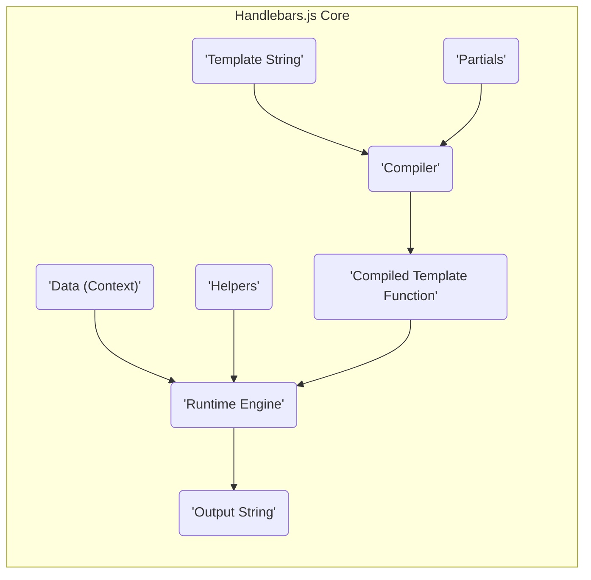

# Project Design Document: Handlebars.js

**Version:** 1.1
**Date:** October 26, 2023
**Author:** AI Software Architect

## 1. Introduction

This document provides an enhanced architectural design of the Handlebars.js project, a minimal templating language. This design will serve as the foundation for subsequent threat modeling activities. The document outlines the key components, data flow, and deployment scenarios of Handlebars.js with improved clarity and detail.

### 1.1. Project Overview

Handlebars.js is a semantic web templating engine. It enables developers to generate dynamic HTML or other text-based formats by embedding expressions within templates. These expressions are evaluated against provided data to produce the final output. Its versatility makes it a popular choice for both client-side and server-side JavaScript environments.

### 1.2. Goals of this Document

*   Clearly and concisely define the architecture and core components of Handlebars.js.
*   Illustrate the data flow within the templating engine with greater detail.
*   Identify key technologies and dependencies involved in the project.
*   Describe common deployment scenarios and their architectural implications.
*   Provide a robust and detailed foundation for identifying potential security vulnerabilities during subsequent threat modeling exercises.

### 1.3. Scope

This document focuses on the core templating engine functionality of Handlebars.js. This includes the template compilation process, the runtime rendering mechanism, and the interaction between templates, data, helpers, and partials. While integrations with other libraries or frameworks are acknowledged, the primary focus remains on the internal workings of Handlebars.js itself.

## 2. System Architecture

Handlebars.js operates through a well-defined set of interacting components:

*   **Template String:** The raw template markup containing Handlebars expressions (e.g., `{{variable}}`, `{{#if condition}}`). This is the input to the compilation process.
*   **Data (Context Object):** A JavaScript object or data structure that provides the values to be substituted into the template expressions during rendering.
*   **Compiler:** The core component responsible for transforming the template string into an executable JavaScript function. This involves parsing the template and generating optimized code.
*   **Runtime Engine:** The component that executes the compiled template function. It takes the compiled template and the data context as input and produces the final output.
*   **Helpers:** Custom JavaScript functions that extend the functionality of Handlebars expressions. They can be invoked within templates to perform specific logic or formatting tasks.
*   **Partials:** Reusable template snippets that can be dynamically included within other templates, promoting code reuse and modularity.

### 2.1. Component Diagram



### 2.2. Data Flow

The lifecycle of a Handlebars template involves the following detailed steps:

1. **Template Acquisition:** The template string is obtained, either embedded directly in code, loaded from a file, or fetched from a remote source.
2. **Compilation Initiation:** The template string is passed to the `Compiler`.
3. **Lexical Analysis (Tokenization):** The `Compiler` first performs lexical analysis, breaking down the template string into a stream of tokens, identifying Handlebars expressions and plain text.
4. **Parsing:** The token stream is then parsed to build an Abstract Syntax Tree (AST). The AST represents the hierarchical structure of the template, including expressions, blocks, and plain text.
5. **AST Optimization (Optional):**  The `Compiler` may perform optimizations on the AST to improve rendering performance.
6. **Code Generation:** The `Compiler` traverses the AST and generates an executable JavaScript function. This function encapsulates the logic for rendering the template with provided data.
7. **Compiled Template Storage (Optional):** The compiled template function can be cached for subsequent use, avoiding repeated compilation.
8. **Rendering Invocation:** The compiled template function is invoked by the `Runtime Engine`, along with the `Data (Context)` object.
9. **Expression Evaluation:** During rendering, the `Runtime Engine` encounters Handlebars expressions within the compiled template. These expressions are evaluated against the provided data context.
10. **Helper Resolution and Invocation:** If a helper is referenced in an expression, the `Runtime Engine` resolves the helper function and invokes it with the appropriate arguments.
11. **Partial Resolution and Rendering:** If a partial is referenced, the `Runtime Engine` retrieves the corresponding partial template (which may also need compilation if not already compiled) and recursively renders it within the current context.
12. **Output Accumulation:** The `Runtime Engine` accumulates the results of expression evaluations and plain text to build the final output string.
13. **Output Delivery:** The generated output string is returned.

### 2.3. Key Technologies

*   **JavaScript:** Handlebars.js is implemented entirely in JavaScript, making it portable and executable in various JavaScript environments.
*   **Regular Expressions:** Used extensively within the `Compiler` for pattern matching and parsing of template syntax.
*   **Abstract Syntax Tree (AST):** A fundamental data structure used during the compilation process to represent the template's structure in a way that facilitates code generation.

## 3. Deployment Scenarios

Handlebars.js's flexibility allows for deployment in diverse scenarios:

*   **Client-Side Rendering (Browser):**
    *   The Handlebars.js library is included directly in the HTML page, typically via a `<script>` tag.
    *   Templates can be embedded within `<script>` tags with a specific type (e.g., `text/x-handlebars-template`) or fetched dynamically using AJAX.
    *   Data is usually retrieved from APIs or is available within the client-side JavaScript code.
    *   Template compilation and rendering occur within the user's web browser.
    *   ```mermaid
        graph LR
            A("'Browser'") --> B("'Handlebars.js Library'");
            C("'Template (in HTML or fetched)'") --> B;
            D("'Data (from API or JS)'") --> B;
            B --> E("'Rendered HTML'");
            E --> A;
        ```
*   **Server-Side Rendering (Node.js):**
    *   Handlebars.js is integrated into a Node.js application using `npm` or `yarn`.
    *   Templates are typically stored as files on the server's file system.
    *   Data is fetched from databases, internal services, or external APIs on the server.
    *   Template compilation and rendering are performed on the server, and the resulting HTML is sent to the client's browser.
    *   ```mermaid
        graph LR
            A("'Node.js Server'") --> B("'Handlebars.js Library'");
            C("'Template Files'") --> B;
            D("'Data (from DB, APIs)'") --> B;
            B --> E("'Rendered HTML'");
            E --> F("'Client Browser'");
        ```
*   **Build-Time Rendering (Static Site Generators):**
    *   Handlebars.js is utilized as part of a build process, often within static site generators.
    *   Templates and data sources are processed during the build phase.
    *   Static HTML files are generated as the final output, which are then deployed to a web server.
    *   ```mermaid
        graph LR
            A("'Build Process'") --> B("'Handlebars.js Library'");
            C("'Template Files'") --> B;
            D("'Data Sources'") --> B;
            B --> E("'Static HTML Files'");
            E --> F("'Web Server'");
        ```

## 4. Security Considerations

This section outlines potential security considerations that are crucial for threat modeling.

*   **Cross-Site Scripting (XSS) via Template Injection:** If an attacker can influence the content of the Handlebars template itself (e.g., through a vulnerability in how templates are stored or retrieved), they can inject malicious JavaScript code that will be executed in the user's browser.
*   **Cross-Site Scripting (XSS) via Unsafe Data Rendering:** If user-provided data is directly rendered into templates without proper encoding or escaping, it can lead to XSS vulnerabilities. For example, rendering HTML tags from user input without escaping them.
*   **Helper Function Security:** Custom helpers have full access to the JavaScript environment. If a helper is poorly written or contains vulnerabilities, it could be exploited to perform malicious actions. This includes potential for arbitrary code execution on the server in server-side rendering scenarios.
*   **Partial Security:** If the source of partial templates is not trusted or if partials are loaded dynamically based on user input without proper sanitization, it could lead to template injection vulnerabilities.
*   **Denial of Service (DoS) through Complex Templates:**  Extremely complex templates with deeply nested structures or inefficient helper logic could potentially lead to excessive processing time and resource consumption, resulting in a denial of service.
*   **Information Disclosure:**  Careless use of helpers or template logic might inadvertently expose sensitive information that should not be rendered in the output.

## 5. Threat Modeling Scope

The subsequent threat modeling exercise will specifically focus on the following areas of Handlebars.js to identify potential security vulnerabilities:

*   **Template Compilation Phase:**  Analyzing the parsing and code generation stages for vulnerabilities that could allow injection of malicious code during compilation.
*   **Runtime Rendering Engine:** Examining how data is processed and rendered, with a strong focus on preventing XSS vulnerabilities through proper output encoding and escaping mechanisms.
*   **Security of Helper Functions:**  Assessing the potential risks associated with custom helper functions, including input validation, output sanitization, and access control.
*   **Partial Handling Mechanisms:** Investigating the security implications of how partials are loaded, included, and rendered, particularly concerning potential template injection risks.
*   **Data Handling and Sanitization:**  Analyzing how Handlebars.js handles and processes data from various sources and identifying potential areas where data sanitization is necessary.
*   **Error Handling:**  Examining how Handlebars.js handles errors during compilation and rendering, and whether error messages could reveal sensitive information.

## 6. Conclusion

This improved design document provides a more detailed and comprehensive overview of the architecture and key components of Handlebars.js. It serves as a robust foundation for the upcoming threat modeling process, enabling a more thorough and systematic identification and analysis of potential security vulnerabilities. By clearly understanding the system's design, data flow, and potential attack vectors, we can effectively assess and mitigate risks associated with using Handlebars.js in various deployment scenarios.