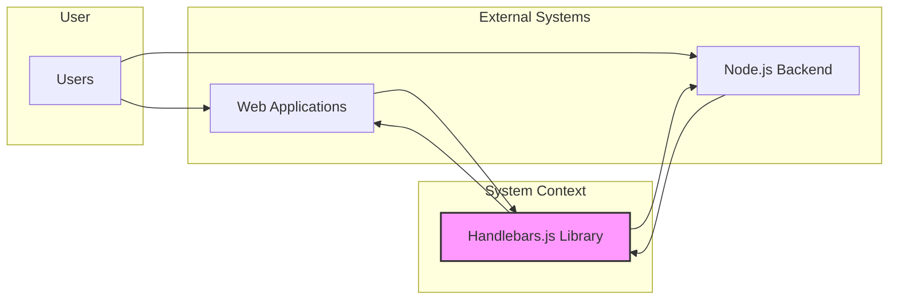
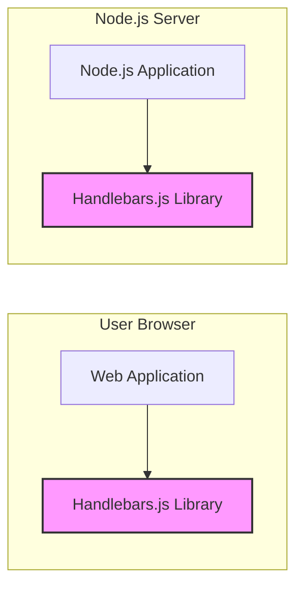
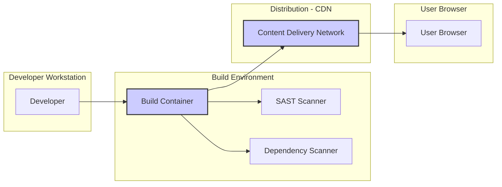

# BUSINESS POSTURE

- Business priorities and goals:
  - Provide a robust and flexible templating engine for JavaScript environments.
  - Enable developers to efficiently create dynamic web pages and applications.
  - Maintain a widely adopted and actively supported open-source templating library.
- Most important business risks:
  - Security vulnerabilities in the Handlebars.js library could be exploited in applications that use it, leading to data breaches, cross-site scripting (XSS) attacks, or other security incidents.
  - Performance issues or inefficiencies in the templating engine could negatively impact the performance of applications using Handlebars.js.
  - Lack of maintenance or community support could lead to the library becoming outdated, insecure, or incompatible with newer technologies.

# SECURITY POSTURE

- Existing security controls:
  - security control: Open source code review. Implemented: Publicly available GitHub repository allows for community review and contributions.
  - security control: Unit and integration testing. Implemented: Comprehensive test suite within the repository ensures functionality and helps prevent regressions.
  - security control: Regular dependency updates. Implemented: Project maintains dependencies and updates them to address known vulnerabilities.
- Accepted risks:
  - accepted risk: Potential for undiscovered vulnerabilities in the codebase due to complexity and ongoing development.
  - accepted risk: Risk of vulnerabilities being introduced through community contributions, despite code review processes.
  - accepted risk: Reliance on the security of third-party dependencies.
- Recommended security controls:
  - Recommended security control: Implement Static Application Security Testing (SAST) in the CI/CD pipeline to automatically detect potential code vulnerabilities.
  - Recommended security control: Integrate Dependency Vulnerability Scanning into the CI/CD pipeline to identify and manage vulnerabilities in third-party libraries.
  - Recommended security control: Conduct periodic security audits and penetration testing by security experts to identify and address potential weaknesses.
  - Recommended security control: Implement Content Security Policy (CSP) in applications using Handlebars.js to mitigate the risk of XSS attacks.
- Security requirements:
  - Authentication: Not directly applicable to the Handlebars.js library itself, as it is a client-side and server-side templating engine. Authentication is the responsibility of the applications that utilize Handlebars.js.
  - Authorization: Not directly applicable to the Handlebars.js library itself. Authorization is the responsibility of the applications that utilize Handlebars.js to control access to data and functionality rendered by templates.
  - Input validation: Handlebars.js must ensure proper encoding and escaping of template variables to prevent injection attacks, particularly Cross-Site Scripting (XSS). The library should provide mechanisms for developers to safely handle user inputs within templates.
  - Cryptography: Cryptographic functionalities are not a core requirement for Handlebars.js as a templating engine. However, if Handlebars.js is used in contexts requiring cryptographic operations (e.g., within helper functions), it should rely on well-established and secure cryptographic libraries provided by the underlying JavaScript environment.

# DESIGN

- C4 CONTEXT



- C4 CONTEXT elements:
  - - Name: Users
    - Type: Person
    - Description: End-users who interact with web applications or systems that utilize Handlebars.js for dynamic content rendering.
    - Responsibilities: Accessing and interacting with web applications or systems.
    - Security controls: User authentication and authorization are handled by the Web Applications and Node.js Backends, not directly by Handlebars.js.
  - - Name: Handlebars.js Library
    - Type: Software System
    - Description: A JavaScript templating engine that allows developers to create dynamic HTML, XML, or other text formats by embedding expressions and logic within templates.
    - Responsibilities: Processing templates and data to generate output strings. Ensuring safe handling of inputs to prevent injection vulnerabilities.
    - Security controls: Input validation and output encoding within the Handlebars.js library to prevent XSS. Code review and testing during development.
  - - Name: Web Applications
    - Type: Software System
    - Description: Client-side web applications running in users' browsers that use Handlebars.js to render dynamic user interfaces.
    - Responsibilities: Fetching data, using Handlebars.js to render views, handling user interactions, implementing application-level security controls.
    - Security controls: User authentication, authorization, input validation, Content Security Policy (CSP), secure session management.
  - - Name: Node.js Backend
    - Type: Software System
    - Description: Server-side applications built with Node.js that use Handlebars.js to generate dynamic content for server-rendered web pages, emails, or other outputs.
    - Responsibilities: Handling business logic, data storage, server-side rendering using Handlebars.js, implementing server-side security controls.
    - Security controls: Server-side authentication, authorization, input validation, secure API design, protection of sensitive data at rest and in transit.

- C4 CONTAINER



- C4 CONTAINER elements:
  - - Name: Web Application
    - Type: Container - JavaScript Application
    - Description: Client-side JavaScript application that runs in a user's web browser. It fetches data from backend services and uses Handlebars.js to dynamically render the user interface.
    - Responsibilities: Client-side routing, UI rendering, user interaction handling, calling backend APIs.
    - Security controls: Client-side input validation, implementation of Content Security Policy (CSP), secure handling of user sessions (if applicable). Relies on Handlebars.js for secure template rendering.
  - - Name: Handlebars.js Library (Browser)
    - Type: Container - JavaScript Library
    - Description: The Handlebars.js library loaded and executed within the user's web browser. It processes templates and data provided by the Web Application to generate HTML or other text-based output.
    - Responsibilities: Template parsing, data binding, output encoding to prevent XSS, providing helper functions for template logic.
    - Security controls: Input validation and output encoding within the library itself. Regular updates to address potential vulnerabilities.
  - - Name: Node.js Application
    - Type: Container - Node.js Application
    - Description: Server-side Node.js application that handles backend logic, data storage, and potentially server-side rendering. It can use Handlebars.js to generate dynamic content for server-rendered pages or other outputs.
    - Responsibilities: Business logic, data access, API endpoints, server-side rendering, user authentication and authorization.
    - Security controls: Server-side input validation, secure API design, protection of sensitive data, server-side authentication and authorization mechanisms.
  - - Name: Handlebars.js Library (Server)
    - Type: Container - JavaScript Library
    - Description: The Handlebars.js library used within the Node.js server environment. It performs the same templating functions as in the browser environment but on the server-side.
    - Responsibilities: Server-side template parsing, data binding, output generation.
    - Security controls: Same as the browser-side library - input validation and output encoding. Secure dependency management in the server environment.

- DEPLOYMENT



- DEPLOYMENT elements:
  - - Name: Developer Workstation
    - Type: Environment
    - Description: The local machine used by developers to write code, run tests, and build the Handlebars.js library.
    - Responsibilities: Code development, local testing, committing code changes to version control.
    - Security controls: Developer workstation security practices (OS hardening, antivirus, etc.). Code review before committing changes.
  - - Name: Build Container
    - Type: Environment - Containerized Build Environment
    - Description: A containerized environment used for automated building, testing, and packaging of the Handlebars.js library. This environment is part of the CI/CD pipeline.
    - Responsibilities: Automated build process, running unit and integration tests, performing static analysis and dependency scanning, creating distributable packages.
    - Security controls: Secure build environment configuration, access control to build systems, SAST and dependency scanning tools integrated into the pipeline, secure storage of build artifacts.
  - - Name: SAST Scanner
    - Type: Tool - Static Application Security Testing
    - Description: A tool integrated into the build pipeline to automatically analyze the Handlebars.js source code for potential security vulnerabilities without executing the code.
    - Responsibilities: Identifying potential security flaws in the code, reporting vulnerabilities to developers.
    - Security controls: Regularly updated vulnerability rules, secure configuration and integration within the CI/CD pipeline.
  - - Name: Dependency Scanner
    - Type: Tool - Dependency Vulnerability Scanner
    - Description: A tool used to scan the dependencies of Handlebars.js for known security vulnerabilities.
    - Responsibilities: Identifying vulnerable dependencies, reporting vulnerabilities and suggesting updates.
    - Security controls: Regularly updated vulnerability database, secure configuration and integration within the CI/CD pipeline.
  - - Name: Content Delivery Network (CDN)
    - Type: Environment - CDN
    - Description: A network of geographically distributed servers used to host and deliver the Handlebars.js library to end-users efficiently.
    - Responsibilities: Hosting and distributing the Handlebars.js library, ensuring high availability and fast delivery.
    - Security controls: CDN security features (DDoS protection, access controls), secure configuration of CDN, HTTPS for delivery, integrity checks (e.g., SRI - Subresource Integrity).
  - - Name: User Browser
    - Type: Environment - Web Browser
    - Description: The end-user's web browser where web applications using Handlebars.js are executed.
    - Responsibilities: Downloading and executing JavaScript code, rendering web pages, interacting with web applications.
    - Security controls: Browser security features (sandboxing, same-origin policy, etc.), user-installed browser extensions, operating system security.

- BUILD

```mermaid
flowchart LR
    subgraph "Developer"
        DEV[Developer Workstation]
    end
    subgraph "Version Control"
        VCS[GitHub Repository]
    end
    subgraph "CI/CD Pipeline"
        BC[Build Container]
        TEST[Automated Tests]
        SAST[SAST Scanner]
        DEP_SCAN[Dependency Scanner]
        PUBLISH[Publish Artifacts]
    end
    DEV --> VCS
    VCS --> BC
    BC --> TEST & SAST & DEP_SCAN
    TEST --> PUBLISH
    SAST --> PUBLISH
    DEP_SCAN --> PUBLISH
    PUBLISH --> ARTIFACTS[Build Artifacts (npm package, CDN files)]
    style BC fill:#ccf,stroke:#333,stroke-width:2px
    style PUBLISH fill:#ccf,stroke:#333,stroke-width:2px
```

- BUILD elements:
  - - Name: Developer Workstation
    - Type: Environment
    - Description: Developer's local machine where code changes are made and initially tested.
    - Responsibilities: Writing code, running local builds and tests, committing changes.
    - Security controls: Local security practices, code review before commit.
  - - Name: GitHub Repository
    - Type: Service - Version Control System
    - Description: Central repository for source code, used for version control and collaboration.
    - Responsibilities: Storing source code, managing versions, tracking changes, facilitating collaboration.
    - Security controls: Access control to the repository, branch protection, audit logs.
  - - Name: Build Container
    - Type: Environment - Containerized Build Environment
    - Description: Automated build environment within the CI/CD pipeline, responsible for compiling, testing, and packaging the library.
    - Responsibilities: Automated build process, running tests, security scans, packaging artifacts.
    - Security controls: Secure build environment, access control, isolated environment, immutable build images.
  - - Name: Automated Tests
    - Type: Process - Testing
    - Description: Unit and integration tests executed automatically during the build process to ensure code quality and functionality.
    - Responsibilities: Verifying code functionality, detecting regressions, ensuring code quality.
    - Security controls: Comprehensive test suite, regular test execution, test coverage analysis.
  - - Name: SAST Scanner
    - Type: Tool - Static Application Security Testing
    - Description: Static analysis tool integrated into the build pipeline to scan source code for potential vulnerabilities.
    - Responsibilities: Identifying potential security flaws in the code.
    - Security controls: Regularly updated rules, accurate vulnerability detection, integration with build pipeline.
  - - Name: Dependency Scanner
    - Type: Tool - Dependency Vulnerability Scanner
    - Description: Tool to scan project dependencies for known vulnerabilities.
    - Responsibilities: Identifying vulnerable dependencies, suggesting updates.
    - Security controls: Up-to-date vulnerability database, accurate dependency scanning, integration with build pipeline.
  - - Name: Publish Artifacts
    - Type: Process - Artifact Publishing
    - Description: Process of publishing build artifacts (npm package, CDN files) to distribution channels.
    - Responsibilities: Making the library available for consumption, versioning and release management.
    - Security controls: Secure artifact storage, access control to publishing channels, signing artifacts, integrity checks.
  - - Name: Build Artifacts (npm package, CDN files)
    - Type: Data - Software Artifacts
    - Description: The packaged and distributable versions of the Handlebars.js library.
    - Responsibilities: Providing the library for developers and applications to use.
    - Security controls: Integrity protection (e.g., checksums, signatures), secure storage and distribution.

# RISK ASSESSMENT

- Critical business process we are trying to protect:
  - The critical business process is the secure and reliable execution of web applications and systems that depend on Handlebars.js for dynamic content generation. This includes ensuring the integrity and confidentiality of data processed and displayed by these applications.
- Data we are trying to protect and their sensitivity:
  - The data being protected is primarily the data processed and rendered by Handlebars.js templates within web applications. The sensitivity of this data varies greatly depending on the application. It can range from publicly available information to highly sensitive personal or financial data. The primary security concern is preventing unauthorized access, modification, or disclosure of this data, especially through vulnerabilities like XSS. Handlebars.js itself does not store data, but it processes data provided by the applications using it.

# QUESTIONS & ASSUMPTIONS

- Questions:
  - What are the specific use cases and contexts where Handlebars.js is primarily used? (Assumption: Web application development, both client-side and server-side rendering).
  - Are there any specific security guidelines or best practices recommended by the Handlebars.js project maintainers? (Assumption: Following general secure coding practices and addressing reported vulnerabilities).
  - What is the process for reporting and addressing security vulnerabilities in Handlebars.js? (Assumption: Standard open-source vulnerability reporting and patching process via GitHub).
- Assumptions:
  - BUSINESS POSTURE: The primary business goal is to provide a secure, reliable, and performant templating engine for the JavaScript ecosystem. Security is a high priority due to the potential impact of vulnerabilities on user applications.
  - SECURITY POSTURE: Existing security controls include open-source review and testing. Recommended controls like SAST and dependency scanning are not explicitly mentioned but are considered best practices for modern software development and should be implemented. The main security requirement is to prevent XSS vulnerabilities.
  - DESIGN: The design is relatively straightforward for a JavaScript library. The focus is on the library's integration into web applications and the build and deployment process for the library itself. The C4 diagrams represent a simplified view, and more detailed diagrams could be created for specific application architectures using Handlebars.js.