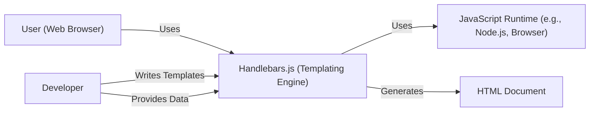
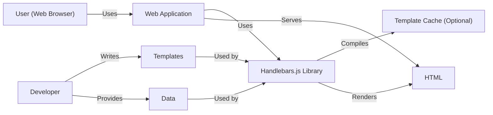
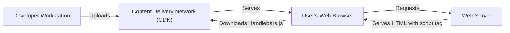
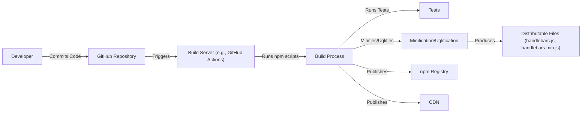

# Project Design Document: Handlebars.js

## BUSINESS POSTURE

Handlebars.js is a widely-used, mature, open-source templating engine. Its primary business goal is to provide a simple, yet powerful, way to create dynamic HTML content in web applications. It aims to separate the presentation layer (HTML) from the application logic, improving maintainability and readability. The project's success is tied to its adoption rate, ease of use, and performance.

Business Priorities:

*   Maintainability: Ensure the codebase remains clean, well-documented, and easy to contribute to.
*   Performance: Provide fast template compilation and rendering.
*   Compatibility: Support a wide range of browsers and JavaScript environments.
*   Ease of Use: Offer a simple and intuitive API for developers.
*   Community: Foster a vibrant and active community of users and contributors.
*   Security: Minimize the risk of vulnerabilities, especially Cross-Site Scripting (XSS).

Business Risks:

*   XSS Vulnerabilities: If not used correctly, Handlebars.js could be vulnerable to XSS attacks, allowing attackers to inject malicious scripts into web pages. This is the most significant risk.
*   Performance Bottlenecks: Poorly written templates or inefficient use of the library could lead to performance issues in applications.
*   Compatibility Issues: Changes in browser standards or JavaScript environments could lead to compatibility problems.
*   Loss of Community Support: If the project is not actively maintained, it could lose community support and become obsolete.
*   Supply Chain Attacks: Compromised dependencies or build processes could introduce vulnerabilities.

## SECURITY POSTURE

Existing Security Controls:

*   security control: Input Sanitization: Handlebars.js automatically escapes HTML entities in input data by default, mitigating the risk of XSS. This is a core feature of the library. (Implemented in the core library logic).
*   security control: Context-Aware Escaping: Handlebars.js provides helpers for different contexts (e.g., HTML attributes, JavaScript), ensuring proper escaping. (Implemented in the core library logic and helper functions).
*   security control: Safe String Handling: Handlebars.js provides a `SafeString` type to indicate that a string has already been escaped and should not be escaped again. (Implemented in the core library logic).
*   security control: Regular Security Audits: The project maintainers and community perform regular security audits and address reported vulnerabilities. (Described in the project's security policy and GitHub issue tracker).
*   security control: Community Vigilance: A large and active community helps identify and report potential security issues. (Evidenced by the project's GitHub issue tracker and community forums).
*   security control: Content Security Policy (CSP) Compatibility: Handlebars.js can be used in environments with strict CSP settings, although precompilation may be required. (Described in the project's documentation).

Accepted Risks:

*   accepted risk: User Error: Developers can bypass escaping mechanisms (e.g., using triple-stashes `{{{` or the `noEscape` helper) or misuse the `SafeString` type, potentially introducing XSS vulnerabilities. This is considered an accepted risk, as it is the developer's responsibility to use the library correctly.
*   accepted risk: Limited DoS Protection: Handlebars.js does not have built-in protection against Denial-of-Service (DoS) attacks caused by excessively large or complex templates. This is considered an accepted risk, as it is typically mitigated at the application or infrastructure level.

Recommended Security Controls:

*   security control: Implement a robust Content Security Policy (CSP) on applications using Handlebars.js to further mitigate XSS risks, even if escaping is bypassed.
*   security control: Provide clear and comprehensive documentation on secure usage of Handlebars.js, emphasizing the risks of bypassing escaping and the importance of proper input validation.
*   security control: Consider adding optional features for template size limits or complexity analysis to mitigate potential DoS attacks.
*   security control: Integrate with static analysis tools to detect potential security issues in templates during development.

Security Requirements:

*   Authentication: Not directly applicable to Handlebars.js, as it is a templating engine and does not handle authentication.
*   Authorization: Not directly applicable to Handlebars.js.
*   Input Validation:
    *   All user-provided data should be treated as untrusted.
    *   Data should be validated against expected types and formats before being passed to Handlebars.js templates.
    *   Developers should avoid using triple-stashes (`{{{`) or the `noEscape` helper unless absolutely necessary and with extreme caution.
    *   Use the appropriate escaping helpers for different contexts (e.g., HTML attributes, JavaScript).
*   Cryptography: Not directly applicable to Handlebars.js, as it is a templating engine and does not handle cryptography. However, if sensitive data is used in templates, it should be encrypted before being passed to Handlebars.js.

## DESIGN

### C4 CONTEXT

Element Descriptions:

*   Element:
    *   Name: User (Web Browser)
    *   Type: Person
    *   Description: The end-user interacting with a web application that utilizes Handlebars.js.
    *   Responsibilities: Interacts with the web application, views rendered HTML content.
    *   Security controls: Browser security features (e.g., same-origin policy, CSP).

*   Element:
    *   Name: Handlebars.js (Templating Engine)
    *   Type: Software System
    *   Description: The Handlebars.js library, responsible for compiling and rendering templates.
    *   Responsibilities: Compiles templates, renders HTML content based on provided data and templates.
    *   Security controls: Input sanitization, context-aware escaping, safe string handling.

*   Element:
    *   Name: JavaScript Runtime (e.g., Node.js, Browser)
    *   Type: Software System
    *   Description: The environment in which Handlebars.js executes (e.g., Node.js, a web browser).
    *   Responsibilities: Executes JavaScript code, provides APIs for interacting with the environment.
    *   Security controls: Runtime environment security features.

*   Element:
    *   Name: HTML Document
    *   Type: Data
    *   Description: The output of Handlebars.js, the rendered HTML content.
    *   Responsibilities: Displayed to the user in the web browser.
    *   Security controls: Dependent on how the HTML is used and displayed; CSP is a relevant control.

*   Element:
    *   Name: Developer
    *   Type: Person
    *   Description: The developer who writes Handlebars.js templates and integrates the library into an application.
    *   Responsibilities: Writes templates, provides data to Handlebars.js, ensures secure usage of the library.
    *   Security controls: Secure coding practices, understanding of Handlebars.js security features.

### C4 CONTAINER

Element Descriptions:

*   Element:
    *   Name: User (Web Browser)
    *   Type: Person
    *   Description: The end-user interacting with the web application.
    *   Responsibilities: Interacts with the web application, views rendered HTML content.
    *   Security controls: Browser security features (e.g., same-origin policy, CSP).

*   Element:
    *   Name: Web Application
    *   Type: Software System
    *   Description: The application that uses Handlebars.js to generate dynamic content.
    *   Responsibilities: Handles user requests, interacts with business logic, uses Handlebars.js to render views.
    *   Security controls: Application-level security controls (e.g., authentication, authorization, input validation).

*   Element:
    *   Name: Handlebars.js Library
    *   Type: Library
    *   Description: The Handlebars.js library code.
    *   Responsibilities: Compiles templates, renders HTML content.
    *   Security controls: Input sanitization, context-aware escaping, safe string handling.

*   Element:
    *   Name: Template Cache (Optional)
    *   Type: Cache
    *   Description: An optional cache for compiled templates, improving performance.
    *   Responsibilities: Stores compiled templates for faster retrieval.
    *   Security controls: Access controls to the cache.

*   Element:
    *   Name: HTML
    *   Type: Data
    *   Description: The rendered HTML output.
    *   Responsibilities: Displayed to the user.
    *   Security controls: Dependent on how the HTML is used; CSP is relevant.

*   Element:
    *   Name: Developer
    *   Type: Person
    *   Description: The developer writing templates and integrating Handlebars.js.
    *   Responsibilities: Writes templates, provides data, ensures secure usage.
    *   Security controls: Secure coding practices.

*   Element:
    *   Name: Templates
    *   Type: Data
    *   Description: Handlebars.js template files.
    *   Responsibilities: Define the structure and layout of the HTML output.
    *   Security controls: Template content review, static analysis.

*   Element:
    *   Name: Data
    *   Type: Data
    *   Description: Data passed to Handlebars.js for rendering.
    *   Responsibilities: Provides the dynamic content for the templates.
    *   Security controls: Input validation, data sanitization.

### DEPLOYMENT

Handlebars.js is a JavaScript library, and its deployment depends on the environment where it's used. Here are a few common scenarios:

1.  **Client-Side (Browser):**  Handlebars.js is typically included as a JavaScript file in the HTML page.  It can be loaded from a local file or a CDN.
2.  **Server-Side (Node.js):** Handlebars.js is installed as a package using npm (or yarn) and then required in the Node.js application.
3.  **Precompiled Templates:** Templates can be precompiled into JavaScript functions, which are then deployed as part of the application's JavaScript code. This improves performance by avoiding runtime compilation.

We'll describe the **Client-Side (Browser) with CDN** deployment in detail:

Element Descriptions:

*   Element:
    *   Name: Developer Workstation
    *   Type: Device
    *   Description: The developer's computer used to write code and deploy the application.
    *   Responsibilities: Code development, deployment.
    *   Security controls: Local security measures (e.g., antivirus, firewall).

*   Element:
    *   Name: Content Delivery Network (CDN)
    *   Type: Infrastructure
    *   Description: A network of servers that deliver Handlebars.js to users' browsers.
    *   Responsibilities: Serving static assets (Handlebars.js library).
    *   Security controls: CDN provider's security measures (e.g., DDoS protection, HTTPS).

*   Element:
    *   Name: User's Web Browser
    *   Type: Device
    *   Description: The end-user's browser.
    *   Responsibilities: Rendering HTML, executing JavaScript.
    *   Security controls: Browser security features (e.g., same-origin policy, CSP).

*   Element:
    *   Name: Web Server
    *   Type: Server
    *   Description: The server hosting the web application.
    *   Responsibilities: Serving HTML pages.
    *   Security controls: Server-side security measures (e.g., firewall, intrusion detection).

### BUILD

Handlebars.js itself has a build process for creating the distributable files (e.g., `handlebars.js`, `handlebars.min.js`).  This process typically involves:

1.  **Source Code (GitHub):** Developers contribute to the source code on GitHub.
2.  **Build Script (npm):**  The project uses npm scripts (defined in `package.json`) to manage the build process.
3.  **Testing:**  The build process includes running unit tests and integration tests to ensure code quality and prevent regressions.
4.  **Minification/Uglification:**  The JavaScript code is minified and uglified to reduce file size and improve loading performance.
5.  **Distribution:** The built files are published to npm and often made available on CDNs.

Security Controls in the Build Process:

*   security control: Version Control (Git): The source code is managed using Git, providing a history of changes and allowing for code review.
*   security control: Automated Build: The build process is automated using npm scripts, reducing the risk of manual errors.
*   security control: Testing: Automated tests help ensure code quality and prevent the introduction of vulnerabilities.
*   security control: Dependency Management (npm): npm is used to manage dependencies, and tools like `npm audit` can be used to identify known vulnerabilities in dependencies.
*   security control: Code Review: Pull requests on GitHub are typically reviewed by other developers before being merged, providing an additional layer of security.
*   security control: GitHub Actions (or similar CI/CD): The build process can be run on a CI/CD platform like GitHub Actions, providing a controlled and auditable environment.

## RISK ASSESSMENT

Critical Business Processes:

*   Dynamic content generation for web applications.
*   Separation of presentation logic from application logic.
*   Efficient template rendering.

Data to Protect:

*   **Template Files:** Sensitivity: Low to Medium (depending on whether templates contain any sensitive information, such as API keys or configuration details, which they should not).
*   **Data Passed to Templates:** Sensitivity: Varies greatly. Can range from public data (low sensitivity) to highly sensitive user data (high sensitivity). The *application* providing the data is responsible for protecting it; Handlebars.js simply renders it.
*   **Source Code:** Sensitivity: Low (it's open source). However, compromised source code could lead to the distribution of malicious versions of the library.
*   **Build Artifacts (Distributable Files):** Sensitivity: Medium. Compromised build artifacts could be used to distribute malicious code to many users.

## QUESTIONS & ASSUMPTIONS

Questions:

*   Are there any specific compliance requirements (e.g., PCI DSS, GDPR) that apply to applications using Handlebars.js? This would influence the data handling and security measures required.
*   What is the expected scale of usage (number of users, requests per second)? This would impact performance considerations and potential DoS mitigation strategies.
*   Are there any existing security tools or practices in place within the development workflow that could be integrated with Handlebars.js development (e.g., static analysis tools)?
*   What level of support is provided for older browsers? This could impact compatibility and security considerations.

Assumptions:

*   BUSINESS POSTURE: We assume that the primary use case for Handlebars.js is in web applications, both client-side and server-side.
*   BUSINESS POSTURE: We assume that developers using Handlebars.js have a basic understanding of web security principles, including XSS.
*   SECURITY POSTURE: We assume that the Handlebars.js project maintainers follow secure coding practices and address reported vulnerabilities promptly.
*   SECURITY POSTURE: We assume that users of Handlebars.js are responsible for validating and sanitizing the data they pass to templates.
*   DESIGN: We assume that the most common deployment scenario is client-side, using a CDN to deliver the library.
*   DESIGN: We assume that the build process is automated and includes testing.