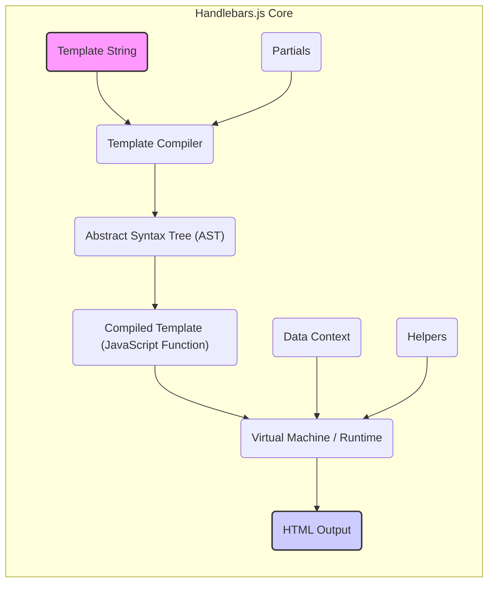

# Project Design Document: Handlebars.js

**Version:** 1.1
**Date:** October 26, 2023
**Author:** AI Software Architect

## 1. Introduction

This document provides an enhanced design overview of the Handlebars.js templating engine, building upon the previous version. It details the system's architecture, key components, data flow, and security considerations with greater clarity and depth. This document serves as a refined foundation for subsequent threat modeling activities.

## 2. Project Overview

Handlebars.js is a lightweight and semantic templating language inspired by Mustache. It enables developers to generate dynamic HTML by embedding expressions within templates. These expressions are evaluated against a provided data context to produce the final output. Primarily used in client-side web development, Handlebars can also function on the server-side.

## 3. System Architecture

Handlebars.js operates as a client-side library, typically integrated into web applications. Its core functionality centers around compiling templates and rendering them with data.

### 3.1. Key Components

*   **Template Compiler:**  Responsible for parsing a Handlebars template string into an Abstract Syntax Tree (AST). This AST is then transformed into executable JavaScript code representing the compiled template function.
*   **Virtual Machine (VM) / Runtime:** Executes the JavaScript code generated by the compiler. It takes the compiled template function and a data context as input, producing the final HTML output.
*   **Helpers:**  JavaScript functions that extend the functionality of the templating language. They can be invoked within Handlebars templates to perform custom logic, data formatting, or other transformations.
*   **Partials:** Reusable template fragments that can be included within other templates. They promote modularity and reduce code duplication.
*   **Data Context:** A JavaScript object containing the data that will be dynamically inserted into the template during the rendering process.

### 3.2. Data Flow

*   **Template String:** The input, consisting of HTML markup interspersed with Handlebars expressions.
*   **Template Compiler:** Parses the template string, generating an AST.
*   **Abstract Syntax Tree (AST):** A hierarchical representation of the template's structure, used for code generation.
*   **Compiled Template (JavaScript Function):** The executable JavaScript code derived from the AST.
*   **Virtual Machine / Runtime:** Executes the compiled template function, merging the data context.
*   **Data Context:** The JavaScript object providing the data for rendering.
*   **Helpers:** Custom JavaScript functions invoked within the template for specific logic.
*   **Partials:** Reusable template snippets included during compilation.
*   **HTML Output:** The final rendered HTML string produced by the runtime.

### 3.3. External Interfaces

*   **Input:**
    *   Handlebars template strings (defined directly in JavaScript or loaded externally).
    *   Data context objects (JavaScript objects passed to the rendering function).
    *   Helper functions (JavaScript functions registered with the Handlebars instance).
    *   Partial templates (strings or pre-compiled templates registered with Handlebars).
*   **Output:**
    *   Rendered HTML strings.

## 4. Detailed Design

### 4.1. Template Compilation Process

1. **Lexing (Tokenization):** The template string is scanned and broken down into a sequence of tokens. These tokens represent HTML tags, Handlebars expressions (e.g., `{{variable}}`, `{{#if}}`), and plain text.
2. **Parsing:** The stream of tokens is then parsed to construct the Abstract Syntax Tree (AST). The AST represents the grammatical structure of the template, including the relationships between different elements and expressions.
3. **Code Generation:** The AST is traversed, and JavaScript code is generated. This generated code, when executed by the runtime, will perform the necessary operations to render the template with the provided data. This often involves string concatenation, conditional logic based on Handlebars expressions, and calls to helper functions.

### 4.2. Virtual Machine / Runtime Execution

1. **Function Invocation:** The compiled template function (generated during compilation) is invoked with the data context as an argument.
2. **Expression Evaluation:** Handlebars expressions within the template are evaluated against the provided data context. This involves looking up properties in the data context object and executing any associated helper functions.
3. **Partial Inclusion:** When a partial is encountered in the template (using the `{{> partialName}}` syntax), the corresponding partial template is retrieved and recursively rendered with the appropriate data context (which may be inherited or explicitly passed).
4. **Output Buffering:** The runtime efficiently builds the final HTML output string by concatenating static HTML content and the results of evaluating Handlebars expressions.

### 4.3. Helpers

*   Helpers are registered with the Handlebars environment using methods like `Handlebars.registerHelper()`.
*   Helpers can accept arguments passed directly from the template expressions.
*   Helpers have access to the current data context through the `this` keyword or options parameters.
*   Helpers return values that are inserted into the rendered output. It's crucial that helper functions are designed with security in mind, especially when dealing with potentially untrusted data.

### 4.4. Partials

*   Partials are registered using methods like `Handlebars.registerPartial()`.
*   They are included in templates using the `{{> partialName }}` syntax.
*   Partials inherit the data context of the parent template by default but can also be passed a specific data context using the `with` keyword (e.g., `{{> partialName data}}`).

## 5. Security Considerations (Pre-Threat Modeling)

This section outlines potential security vulnerabilities and considerations relevant to Handlebars.js, which will be further analyzed during the threat modeling process.

*   **Cross-Site Scripting (XSS):**
    *   **Unescaped Output:** If user-provided data is directly rendered into the template without proper escaping, it can lead to XSS attacks. Attackers can inject malicious scripts that will be executed in the victim's browser. Handlebars provides mechanisms for escaping output (e.g., `{{expression}}` escapes by default, `{{{unescaped}}}` for raw output), but developers must be aware of when and how to use them.
    *   **Helper Vulnerabilities:**  Malicious or poorly written helper functions can introduce XSS vulnerabilities if they return unescaped HTML containing user input.
*   **Server-Side Template Injection (SSTI):**
    *   While primarily a client-side library, if Handlebars is used on the server-side to render templates based on user input, it can be vulnerable to SSTI. Attackers might inject malicious Handlebars expressions to execute arbitrary code on the server or access sensitive information. Proper input sanitization and output encoding are crucial in server-side scenarios.
*   **Denial of Service (DoS):**
    *   **Complex Templates:**  Extremely complex templates with deep nesting or excessive use of loops and helpers can consume significant resources during rendering, potentially leading to a DoS.
    *   **Recursive Partials:**  Careless use of partials, especially recursive inclusions without proper limits, can lead to stack overflow errors and DoS.
*   **Information Disclosure:**
    *   **Accidental Data Exposure:** If sensitive data is inadvertently included in the data context and not properly handled or filtered in the template, it could be exposed in the rendered output.
    *   **Error Messages:** Verbose error messages during template rendering might reveal sensitive information about the application's internal structure or data.
*   **Dependency Vulnerabilities:**  Like any JavaScript library, Handlebars.js relies on its own dependencies. Vulnerabilities in these dependencies could indirectly affect the security of applications using Handlebars. Keeping dependencies up-to-date is essential.

## 6. Deployment Considerations

Handlebars.js is commonly deployed in the following scenarios:

*   **Client-Side Rendering:** The most prevalent use case involves including the Handlebars library in the browser and rendering templates directly within the user's web browser using JavaScript.
*   **Server-Side Rendering (SSR):** Handlebars can also be used on the server-side (e.g., with Node.js) to pre-render HTML before sending it to the client. This can improve initial page load times and SEO.
*   **Build Processes:** Templates are often pre-compiled during the build process to improve runtime performance. This involves using the Handlebars command-line interface (CLI) or build tools like Webpack or Parcel.
*   **Content Security Policy (CSP):** When deploying Handlebars in a browser environment, it's important to configure a strong Content Security Policy to mitigate the risk of XSS attacks. This might involve allowing `unsafe-eval` if runtime compilation is used, but pre-compilation can help avoid this.

## 7. Assumptions and Constraints

*   This design document focuses on the core functionality and architecture of the Handlebars.js library itself.
*   It assumes a basic understanding of web development principles, including HTML, JavaScript, and templating concepts.
*   The security considerations outlined are intended to highlight potential risks and will be further investigated during the threat modeling phase.
*   This document does not cover specific implementation details or optimizations within the Handlebars.js codebase.

## 8. Glossary

*   **Template:** A string containing HTML markup and Handlebars expressions that define the structure of the output.
*   **Data Context:** A JavaScript object that provides the data to be dynamically inserted into the template during rendering.
*   **Expression:** A Handlebars construct enclosed in double curly braces `{{ ... }}` used to access data, invoke helpers, or perform control flow operations.
*   **Helper:** A custom JavaScript function that can be called from within a Handlebars template to perform specific logic or data transformations.
*   **Partial:** A reusable template snippet that can be included within other templates to promote modularity.
*   **AST (Abstract Syntax Tree):** A tree-like representation of the template's structure, generated during the compilation process.
*   **Compilation:** The process of transforming a Handlebars template string into executable JavaScript code.
*   **Rendering:** The process of executing a compiled template with a data context to produce the final output (typically HTML).
*   **Lexing (Tokenization):** The process of breaking down the template string into a sequence of meaningful units called tokens.
*   **Parsing:** The process of analyzing the sequence of tokens to build a structured representation of the template (the AST).
