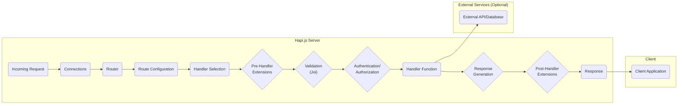
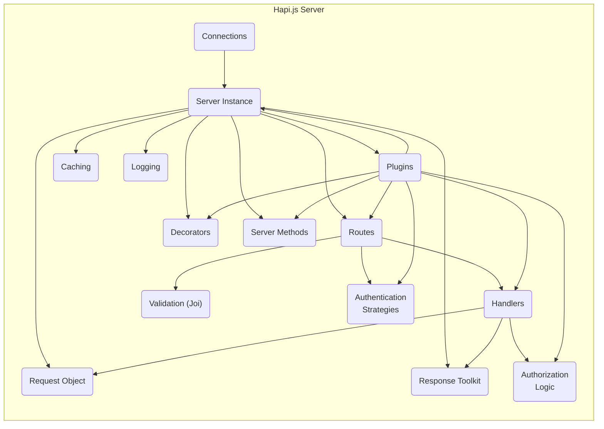
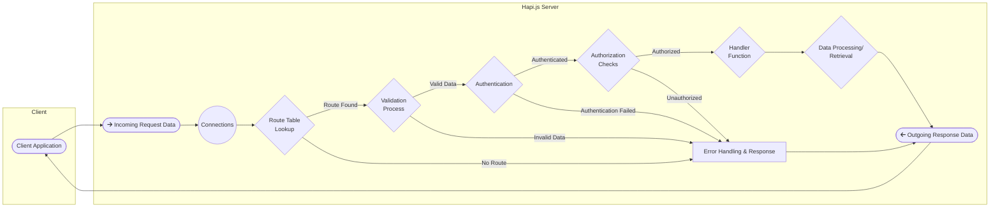

## Project Design Document: Hapi.js Framework (Improved)

**1. Introduction**

This document provides a detailed architectural design of the Hapi.js framework, specifically tailored for use in threat modeling activities. It outlines the core components, their interactions, and the flow of requests and data, highlighting potential areas of security concern. This document aims to provide a comprehensive understanding of the framework's structure to facilitate the identification of potential vulnerabilities and attack vectors.

**2. Goals and Objectives**

*   Provide a clear and detailed architectural overview of the Hapi.js framework.
*   Identify and describe the key components and their specific responsibilities within the framework.
*   Illustrate the complete lifecycle of an HTTP request within Hapi.js, emphasizing data flow and transformations.
*   Explicitly highlight potential security considerations and attack surfaces within each component and interaction, serving as a direct input for threat modeling.
*   Serve as a definitive reference for developers, security analysts, and anyone involved in assessing the security posture of applications built with Hapi.js.

**3. Architectural Overview**

Hapi.js is a modular and extensible, open-source HTTP server framework built for Node.js. Its design emphasizes configuration over convention, providing developers with fine-grained control over the request lifecycle. The framework's plugin system allows for extending its core functionality, making it highly adaptable for various application needs. Understanding this modularity is crucial for identifying potential security risks introduced by plugins.

**4. Key Components**

*   **'Server' Instance:** The central orchestrator of the framework. It manages connections, registers routes and plugins, and oversees the request lifecycle.
*   **'Connections':**  Represent the network interfaces on which the server listens for incoming requests. Each connection can have its own settings, including protocol (HTTP/HTTPS), host, and port.
*   **'Routes':** Define the mapping between incoming request URIs and HTTP methods to specific handler functions. Route configurations include path matching, HTTP method restrictions, validation rules, authentication strategies, and more.
*   **'Handlers':**  Asynchronous functions responsible for processing incoming requests and generating responses. They contain the core business logic of the application.
*   **'Plugins':** Independent modules that extend the functionality of the Hapi.js server. They can register routes, handlers, server methods, decorators, authentication strategies, and more, significantly impacting the server's behavior and security profile.
*   **'Request' Object:**  An object representing the incoming HTTP request, providing access to headers, parameters (path, query, payload), authentication credentials, and other request-specific information.
*   **'Response Toolkit':**  An interface provided to handlers for constructing and sending HTTP responses. It allows setting status codes, headers, payloads, and managing response lifecycle events.
*   **'Validation (using Joi)':** Hapi.js integrates with the Joi library for defining and enforcing data validation schemas on incoming requests. This is a critical component for preventing injection attacks and ensuring data integrity.
*   **'Authentication Strategies':**  Mechanisms for verifying the identity of users making requests. Hapi.js supports various authentication strategies (e.g., Basic, Bearer, Cookie-based) and allows for custom implementations.
*   **'Authorization':**  The process of determining if an authenticated user has permission to access a specific resource or perform an action. This is often implemented within handler functions or through dedicated authorization plugins.
*   **'Caching':**  Hapi.js provides mechanisms for caching responses to improve performance. Understanding the caching configuration is important for assessing potential cache poisoning vulnerabilities.
*   **'Logging':**  The framework provides facilities for logging events and errors. Proper logging is essential for security monitoring and incident response.
*   **'Decorators':**  Functions that add custom properties or methods to the server, request, or response objects, providing a way to extend their functionality.
*   **'Server Methods':**  Reusable functions registered with the server instance, accessible throughout the application.

**5. High-Level Architecture Diagram**

**6. Detailed Request Flow**

1. **Incoming Request:** A client application sends an HTTP request to the Hapi.js server.
2. **Connections:** The request is received by the 'Connections' component, which manages the underlying network communication. This is a potential point for network-level attacks.
3. **Router:** The 'Router' analyzes the request method and path to find a matching 'Route Configuration'. Incorrectly configured routes can lead to unintended access.
4. **Route Configuration:** The matched route configuration defines the processing steps for the request, including validation rules, authentication requirements, and the associated handler.
5. **Handler Selection:** Based on the route configuration, the appropriate 'Handler Function' is selected to process the request.
6. **Pre-Handler Extensions:**  Plugins or server configurations can register pre-handler extensions, which are executed before the main handler. These extensions can modify the request or response, presenting potential injection points if not carefully implemented.
7. **Validation (Joi):** If configured in the route, the request payload and parameters are validated against the defined Joi schema. This step is crucial for preventing data injection and ensuring data integrity. Failure to validate inputs is a major vulnerability.
8. **Authentication/Authorization:**  The configured authentication strategy is applied to verify the user's identity. Subsequently, authorization checks determine if the authenticated user has permission to access the requested resource. Weak authentication or authorization mechanisms are significant security risks.
9. **Handler Function:** The 'Handler Function' executes, containing the core application logic. This is where vulnerabilities in business logic can reside. The handler may interact with external services or databases.
10. **Response Generation:** The 'Handler Function' uses the 'Response Toolkit' to construct the HTTP response, setting status codes, headers, and the response payload. Improperly set headers can lead to security issues.
11. **Post-Handler Extensions:** Similar to pre-handler extensions, post-handler extensions can modify the response before it's sent to the client.
12. **Response:** The final HTTP response is sent back to the client application.

**7. Component Interaction Diagram**

**8. Data Flow Diagram (Detailed)**

**9. Security Considerations and Potential Threats**

*   **Input Validation (Joi):**
    *   **Threat:** Injection attacks (SQL, NoSQL, Command Injection, XSS), data corruption, unexpected application behavior.
    *   **Considerations:** Ensure all user-supplied data is validated against strict schemas. Pay attention to data types, formats, and allowed values. Regularly review and update validation rules.
*   **Authentication Strategies:**
    *   **Threat:** Brute-force attacks, credential stuffing, session hijacking, impersonation.
    *   **Considerations:** Use strong and proven authentication mechanisms (e.g., multi-factor authentication). Securely store and manage credentials. Implement proper session management with appropriate timeouts and security flags.
*   **Authorization Logic:**
    *   **Threat:** Privilege escalation, unauthorized access to resources, data breaches.
    *   **Considerations:** Implement a robust authorization model (e.g., role-based access control). Ensure that authorization checks are consistently applied throughout the application. Avoid relying solely on client-side authorization.
*   **Plugin Security:**
    *   **Threat:** Introduction of vulnerabilities through malicious or poorly written plugins, dependency confusion attacks.
    *   **Considerations:** Carefully evaluate and audit third-party plugins before using them. Keep plugins updated to patch known vulnerabilities. Implement security policies for plugin development if creating custom plugins. Utilize dependency scanning tools.
*   **Session Management:**
    *   **Threat:** Session fixation, session hijacking, replay attacks.
    *   **Considerations:** Use secure session identifiers (cryptographically random). Protect session cookies with `HttpOnly` and `Secure` flags. Implement session timeouts and consider mechanisms for invalidating sessions.
*   **Cross-Site Scripting (XSS):**
    *   **Threat:** Injection of malicious scripts into web pages, leading to data theft, session hijacking, and defacement.
    *   **Considerations:** Sanitize user-generated content before rendering it in web pages. Use appropriate templating engines and security headers (e.g., Content-Security-Policy).
*   **Cross-Site Request Forgery (CSRF):**
    *   **Threat:** Unauthorized actions performed on behalf of an authenticated user.
    *   **Considerations:** Implement CSRF protection mechanisms (e.g., synchronizer tokens, SameSite cookies).
*   **Data Protection:**
    *   **Threat:** Data breaches, unauthorized access to sensitive information.
    *   **Considerations:** Use HTTPS to encrypt data in transit. Encrypt sensitive data at rest. Follow secure coding practices to prevent data leaks.
*   **Error Handling and Logging:**
    *   **Threat:** Information disclosure through verbose error messages, insufficient logging for security monitoring.
    *   **Considerations:** Implement secure error handling that avoids revealing sensitive information. Maintain comprehensive and secure logs for auditing and incident response.
*   **Rate Limiting and Throttling:**
    *   **Threat:** Denial-of-service (DoS) attacks, brute-force attacks.
    *   **Considerations:** Implement rate limiting to restrict the number of requests from a single source within a given timeframe.
*   **Configuration Security:**
    *   **Threat:** Exposure of sensitive information (API keys, database credentials) through insecure configuration.
    *   **Considerations:** Store configuration data securely (e.g., using environment variables or dedicated configuration management tools). Avoid hardcoding sensitive information.
*   **Denial of Service (DoS):**
    *   **Threat:** Overwhelming the server with requests, making it unavailable to legitimate users.
    *   **Considerations:** Implement rate limiting, input validation, and consider using a web application firewall (WAF).

**10. Assumptions and Constraints**

*   This document provides a general architectural overview. Specific implementations and configurations may vary.
*   The security considerations listed are not exhaustive and should be further explored during dedicated threat modeling sessions.
*   The diagrams are simplified representations and focus on key interactions relevant to security.

**11. Future Considerations**

*   Detailed threat modeling sessions for specific application features and plugins.
*   Security code reviews of critical components and custom plugins.
*   Implementation of security testing (e.g., penetration testing, static and dynamic analysis).
*   Development of security guidelines and best practices for Hapi.js development within the organization.
*   Regularly reviewing and updating this design document to reflect changes in the framework and security landscape.
