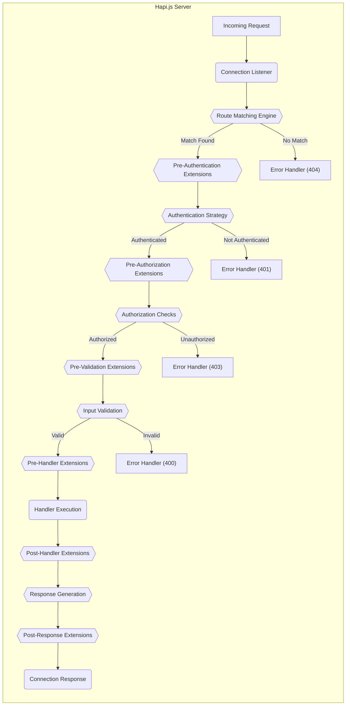

# Project Design Document: Hapi.js Framework - Enhanced for Threat Modeling

**Version:** 1.1
**Date:** October 26, 2023
**Author:** AI Software Architect

## 1. Introduction

This document provides an enhanced design overview of the Hapi.js framework, specifically tailored for security threat modeling. Building upon the foundational understanding of Hapi.js architecture, this version offers a more granular perspective on key components, data flow, and security considerations to facilitate a more comprehensive and effective threat analysis. This document aims to serve as a robust reference for identifying potential vulnerabilities and security risks associated with applications built using Hapi.js.

## 2. Goals and Objectives

The primary goals of this enhanced design document are:

* To provide a detailed and precise description of the Hapi.js framework's architecture, focusing on security-relevant aspects.
* To identify the key components and their intricate interactions, including sub-components where necessary.
* To illustrate the typical request lifecycle within a Hapi.js application with greater detail, highlighting security checkpoints.
* To provide specific and actionable security considerations to guide threat modeling efforts.
* To serve as a comprehensive and reliable reference point for developers, security engineers, and other stakeholders involved in securing Hapi.js applications.

## 3. Target Audience

This document is intended for:

* Security engineers responsible for performing detailed threat modeling on Hapi.js applications.
* Developers building applications using the Hapi.js framework, with a focus on secure development practices.
* Architects designing systems that incorporate Hapi.js and need to understand its security implications.
* Penetration testers and security auditors evaluating the security of Hapi.js applications.
* Anyone requiring an in-depth understanding of the Hapi.js architecture from a security perspective.

## 4. System Overview

Hapi.js is a robust, open-source HTTP server and framework for Node.js, designed for building scalable and maintainable web applications and services. Its core principles emphasize:

* **Configuration-centric approach:** Defining application behavior through declarative configuration, promoting clarity and predictability.
* **Extensible plugin architecture:**  Leveraging a powerful plugin system to enhance functionality and customize the framework.
* **Adherence to web development best practices:** Encouraging the use of established patterns and security principles.
* **Vibrant and active ecosystem:** Benefiting from a wide array of community-developed plugins and resources.

## 5. Key Components

The Hapi.js framework comprises several interconnected components that manage the processing of HTTP requests. A more detailed breakdown includes:

* **Server:** The central orchestrator, managing the HTTP listener, routing logic, plugin registration, and request lifecycle.
    * **Connection Manager:** Handles incoming connections and delegates them to the appropriate connection listener.
    * **Plugin Registrar:**  Manages the registration and lifecycle of plugins.
    * **State Manager:**  Handles state management, including cookies and sessions.
* **Routes:** Define the application's API endpoints, mapping specific paths and HTTP methods to handler functions.
    * **Route Table:**  Stores the defined routes and their associated configurations.
    * **Route Matching Engine:**  Evaluates incoming requests against the route table to find a matching route.
    * **Route Configuration:**  Defines properties for each route, including path, method, handler, authentication strategy, validation rules, and caching policies.
* **Handlers:**  Functions responsible for processing requests associated with specific routes and generating the corresponding responses.
    * **Pre-handler Extensions:** Functions executed before the main handler logic, allowing for pre-processing tasks.
    * **Post-handler Extensions:** Functions executed after the main handler logic, allowing for post-processing tasks.
    * **Response Toolkit:** Provides utilities for constructing and sending responses.
* **Plugins:** Independent modules that extend or modify the core functionality of the Hapi server.
    * **Core Plugins:**  Plugins provided by the Hapi.js team that offer essential features.
    * **Community Plugins:** Plugins developed and maintained by the Hapi.js community.
    * **Internal Plugins:** Plugins developed specifically for a particular application.
* **Connections:** Represent the underlying transport layer for the server. A server can have multiple connections.
    * **HTTP Listener:**  Listens for incoming HTTP requests on a specified port and interface.
    * **TLS/SSL Configuration:**  Handles the configuration for secure HTTPS connections.
* **Request Lifecycle:** The ordered sequence of steps an incoming request undergoes within the Hapi.js framework.
* **Authentication:** Mechanisms for verifying the identity of the client making the request.
    * **Authentication Schemes:**  Different methods for authenticating users (e.g., Basic, Bearer, Cookie-based).
    * **Authentication Strategies:**  Named configurations for applying specific authentication schemes to routes.
    * **Credentials Validation:**  The process of verifying the provided credentials against a user database or authentication service.
* **Authorization:** Mechanisms for determining if an authenticated client has the necessary permissions to access a specific resource or perform an action.
    * **Scope Validation:**  Checking if the authenticated user possesses the required scopes or permissions.
    * **Role-Based Access Control (RBAC):**  Authorizing access based on the user's assigned roles.
* **Validation:** Processes for ensuring that incoming request data conforms to defined schemas and constraints, typically using the `joi` library.
    * **Request Payload Validation:** Validating the data sent in the request body.
    * **Query Parameter Validation:** Validating parameters passed in the URL.
    * **Header Validation:** Validating specific request headers.
* **Error Handling:** Mechanisms for gracefully managing errors that occur during request processing.
    * **Error Interceptors:** Functions that can intercept and modify error responses.
    * **Custom Error Responses:**  Defining specific responses for different error conditions.
    * **Error Logging:**  Recording error details for debugging and monitoring.
* **Caching:** Mechanisms for storing and retrieving frequently accessed data to improve performance.
    * **Server-Side Caching:** Caching responses on the server.
    * **Client-Side Caching:**  Setting headers to instruct clients to cache responses.
* **Logging:** The process of recording events and activities within the server for monitoring, debugging, and auditing.
    * **Event Emitters:**  Hapi uses event emitters to broadcast various server events.
    * **Logging Plugins:**  Plugins that integrate with external logging services.

## 6. Data Flow

The following diagram provides a more detailed illustration of the data flow for an incoming HTTP request within a Hapi.js application:

**Detailed Request Lifecycle:**

1. **Incoming Request:** A client initiates an HTTP request to the server.
2. **Connection Listener:** The server's connection listener receives the incoming request.
3. **Route Matching Engine:** Hapi's router analyzes the request's method and path to find a matching route definition in the route table.
    * **Match Found:** If a matching route is identified, the request proceeds to the pre-authentication extensions.
    * **No Match:** If no matching route is found, the request is directed to the error handler, typically resulting in a 404 Not Found response.
4. **Pre-Authentication Extensions:** Registered extensions that execute before the authentication strategy is applied. These can perform tasks like request modification or early rejection.
5. **Authentication Strategy:** If the matched route has an authentication strategy configured, the specified authentication scheme is applied to verify the client's identity.
    * **Authenticated:** If authentication is successful, the request proceeds to the pre-authorization extensions.
    * **Not Authenticated:** If authentication fails, the request is passed to the error handler, typically resulting in a 401 Unauthorized response.
6. **Pre-Authorization Extensions:** Registered extensions that execute before authorization checks are performed.
7. **Authorization Checks:** If the route requires authorization, the framework verifies if the authenticated client has the necessary permissions or roles to access the resource.
    * **Authorized:** If the client is authorized, the request proceeds to the pre-validation extensions.
    * **Unauthorized:** If the client is not authorized, the request is passed to the error handler, typically resulting in a 403 Forbidden response.
8. **Pre-Validation Extensions:** Registered extensions that execute before input validation.
9. **Input Validation:** If validation rules are defined for the route, the request payload, query parameters, and headers are validated against these rules.
    * **Valid:** If the input is valid, the request proceeds to the pre-handler extensions.
    * **Invalid:** If the input is invalid, the request is passed to the error handler, typically resulting in a 400 Bad Request response.
10. **Pre-Handler Extensions:** Registered extensions that execute before the route's handler function.
11. **Handler Execution:** The handler function associated with the matched route is executed. This function contains the core application logic for processing the request.
12. **Post-Handler Extensions:** Registered extensions that execute after the route's handler function has completed.
13. **Response Generation:** The handler function generates a response, including data, headers, and a status code.
14. **Post-Response Extensions:** Registered extensions that execute after the response has been generated but before it is sent to the client.
15. **Connection Response:** The server sends the generated response back to the client through the connection.

## 7. Security Considerations (Pre-Threat Modeling)

This section outlines specific security considerations within the Hapi.js framework that should be prioritized during threat modeling:

* **Plugin Security:**
    * **Vulnerable Third-Party Plugins:**  Dependencies on plugins with known security vulnerabilities. Regularly audit and update plugin dependencies.
    * **Malicious Plugins:**  The risk of using intentionally malicious plugins that could compromise the application or server. Implement code review processes for plugins.
    * **Plugin Privilege Escalation:**  Plugins potentially gaining access to resources or functionalities beyond their intended scope. Enforce principle of least privilege for plugin permissions.
* **Authentication and Authorization:**
    * **Weak Authentication Schemes:**  Using insecure authentication methods susceptible to brute-force or credential stuffing attacks. Implement multi-factor authentication where appropriate.
    * **Authorization Bypass Vulnerabilities:**  Flaws in authorization logic allowing unauthorized access to protected resources. Implement thorough testing of authorization rules.
    * **Insecure Session Management:**  Vulnerabilities in session handling, such as session fixation or predictable session IDs. Utilize secure session management practices and libraries.
    * **Insufficient Credential Validation:**  Weak password policies or inadequate validation of authentication credentials. Enforce strong password policies and proper credential validation.
* **Input Validation:**
    * **Cross-Site Scripting (XSS):**  Failure to sanitize user-supplied input leading to the execution of malicious scripts in the victim's browser. Implement robust output encoding.
    * **SQL Injection:**  Improperly sanitized input being used in database queries, potentially allowing attackers to manipulate or extract data. Use parameterized queries or ORM features.
    * **Command Injection:**  Unsanitized input being used in system commands, potentially allowing attackers to execute arbitrary commands on the server. Avoid executing system commands with user input.
    * **Path Traversal:**  Vulnerabilities allowing attackers to access files or directories outside the intended scope. Implement strict input validation and avoid constructing file paths directly from user input.
* **Error Handling:**
    * **Sensitive Information Disclosure in Error Messages:**  Revealing internal server details or sensitive data in error responses. Implement custom error pages and avoid verbose error messages in production.
    * **Denial of Service (DoS) through Error Conditions:**  Exploiting error handling logic to cause resource exhaustion or application crashes. Implement rate limiting and proper resource management.
* **Route Configuration:**
    * **Unprotected Administrative Endpoints:**  Exposing administrative or sensitive endpoints without proper authentication and authorization. Secure all administrative interfaces.
    * **Incorrect HTTP Method Handling:**  Not properly restricting HTTP methods for specific routes, potentially leading to unintended actions. Enforce appropriate HTTP method restrictions.
* **Server Configuration:**
    * **Insecure TLS/SSL Configuration:**  Using weak ciphers or outdated protocols for HTTPS, making communication vulnerable to eavesdropping. Implement strong TLS/SSL configurations.
    * **Missing Security Headers:**  Not setting security-related HTTP headers like `Content-Security-Policy`, `Strict-Transport-Security`, and `X-Frame-Options`, leaving the application vulnerable to various attacks. Configure appropriate security headers.
* **Dependencies:**
    * **Known Vulnerabilities in Dependencies:**  Using outdated or vulnerable versions of Hapi.js or its dependencies. Regularly update dependencies and use vulnerability scanning tools.

## 8. Deployment Considerations

The security of a Hapi.js application is significantly influenced by its deployment environment. Key considerations include:

* **Secure Infrastructure:**  Deploying the application on a hardened and secure infrastructure, including the operating system, network configuration, and cloud provider settings.
* **Network Segmentation:**  Isolating the application server from other less trusted networks using firewalls and network policies.
* **Regular Security Audits and Penetration Testing:**  Conducting periodic security assessments to identify and address potential vulnerabilities in the deployed environment.
* **Container Security:**  If using containers (e.g., Docker), ensuring the container images are secure and following container security best practices.
* **Load Balancer and Reverse Proxy Security:**  Properly configuring load balancers and reverse proxies to prevent attacks like DDoS or header injection.
* **Secrets Management:**  Securely managing sensitive credentials and API keys used by the application, avoiding hardcoding them in the codebase.

## 9. Future Considerations

This enhanced design document provides a more detailed understanding of the Hapi.js architecture for security analysis. Future iterations may include:

* More detailed diagrams illustrating specific security mechanisms within Hapi.js.
* Specific examples of common vulnerabilities and their mitigations in Hapi.js applications.
* Integration with threat modeling methodologies and tools.
* Guidance on secure coding practices for Hapi.js development.

## Appendix

This section contains supplementary information, such as diagrams and detailed specifications. The enhanced data flow diagram is included above.
