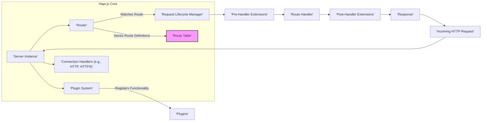
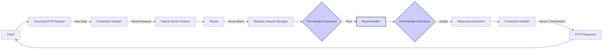
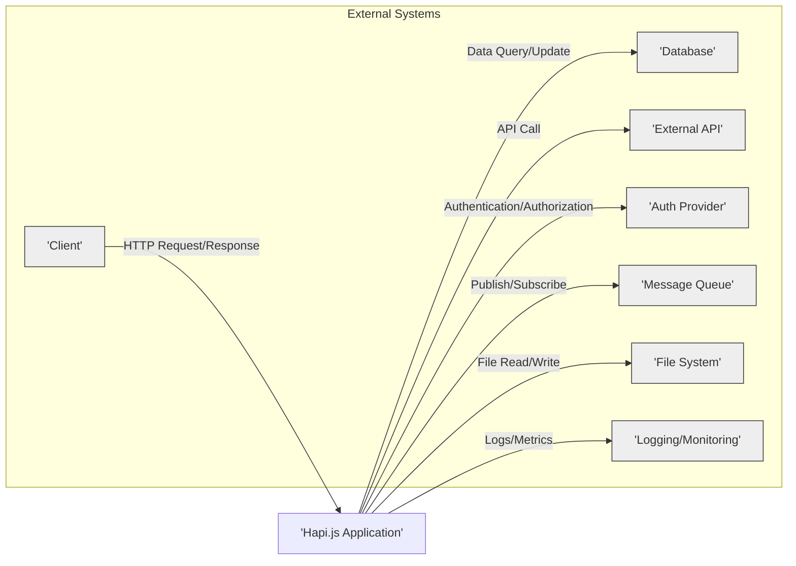

## Project Design Document: Hapi.js Framework (Improved)

**1. Introduction**

This document provides a detailed architectural design overview of the Hapi.js framework, specifically tailored for threat modeling. It aims to capture the key components, data flows, and interactions within the framework to facilitate the identification of potential security vulnerabilities. This document focuses on the core functionalities and common usage patterns of Hapi.js, highlighting areas relevant to security.

**2. Goals and Objectives**

*   Provide a clear and comprehensive description of the Hapi.js architecture, emphasizing security-relevant aspects.
*   Identify the major components and their responsibilities, with a focus on potential attack surfaces.
*   Illustrate the typical request/response lifecycle within the framework, highlighting points of interaction and data transformation.
*   Detail key data flows and interactions with external systems, identifying trust boundaries and potential data exposure.
*   Serve as a robust foundation for identifying and analyzing potential security threats during threat modeling exercises.

**3. System Architecture**

Hapi.js is a modular and extensible HTTP server framework built for developing web applications and services. Its architecture is centered around a plugin system, promoting code organization and reusability. The core framework handles fundamental HTTP request and response processing, while plugins extend its capabilities. This architecture allows for granular control but also introduces potential security considerations depending on the plugins used.

**4. Component Breakdown**

*   **Server Instance:** The central object managing the server's lifecycle, including starting, stopping, and configuring network connections. It acts as the entry point for all incoming requests and holds references to other core components. *Security Consideration:* Misconfiguration of the server instance (e.g., insecure TLS settings) can introduce vulnerabilities.
*   **Router:** Responsible for mapping incoming requests to specific route handlers based on the HTTP method and path. It maintains a route table containing the defined routes. *Security Consideration:* Improperly defined or overly permissive routes can expose unintended functionality. Vulnerabilities in the routing logic itself could lead to bypasses.
*   **Request Lifecycle Manager:** Orchestrates the processing of an incoming request through a series of stages. This includes routing, executing extensions, handling the request, and generating the response. *Security Consideration:* Each stage in the lifecycle presents an opportunity for security checks and potential vulnerabilities if not handled correctly.
*   **Plugin System:** Enables extending Hapi.js functionality through independent modules. Plugins can register routes, handlers, server methods, decorators, and more. *Security Consideration:* The security of the application heavily relies on the security of the installed plugins. Malicious or vulnerable plugins can introduce significant risks.
*   **Connection Handlers:** Manage the underlying network connections, handling the raw data transfer. Common handlers include HTTP and HTTPS. *Security Consideration:* The choice and configuration of the connection handler (e.g., ensuring HTTPS is used) are critical for securing communication.
*   **Route Table:** Stores the defined routes, mapping HTTP methods and paths to their corresponding handlers. *Security Consideration:*  A poorly managed or exposed route table could reveal application structure and potential attack vectors.
*   **Pre-Handler Extensions:** Functions executed before the route handler. They can modify the request, response, or short-circuit the request. *Security Consideration:*  Pre-handler extensions are a crucial point for implementing authentication, authorization, and input validation. Vulnerabilities here can have significant impact.
*   **Route Handler:** The core logic that processes the incoming request and generates the response. It interacts with application data, business logic, and potentially external services. *Security Consideration:* Route handlers are prime targets for attacks like injection flaws (SQL, command), business logic vulnerabilities, and insecure data handling.
*   **Post-Handler Extensions:** Functions executed after the route handler but before the response is sent. They can modify the response or perform logging. *Security Consideration:* Post-handler extensions can be used to add security headers or sanitize output, but vulnerabilities here could lead to information leakage or manipulation.

**5. Data Flow**

The typical data flow for an incoming HTTP request in Hapi.js, highlighting security-relevant stages, is as follows:

1. **Incoming HTTP Request:** A client sends an HTTP request to the server. This is the initial point of interaction and a potential attack vector.
2. **Connection Handler:** The connection handler receives the raw request data. *Security Consideration:* This stage should handle potential malformed requests and enforce protocol-level security (e.g., TLS).
3. **Hapi.js Server Instance:** The server instance receives the parsed request.
4. **Router:** The router matches the request's method and path against the route table. *Security Consideration:*  Bypassing the router could lead to unauthorized access.
5. **Request Lifecycle Manager:** The lifecycle manager orchestrates the subsequent steps.
6. **Pre-Handler Extensions:** Registered `onPreHandler` extensions are executed. *Security Consideration:* This is a critical point for authentication, authorization, input validation, and preventing common attacks.
7. **Route Handler:** The appropriate route handler is executed to process the request. *Security Consideration:* This is where application-specific logic resides and is a primary target for attacks exploiting business logic or data handling flaws.
8. **Post-Handler Extensions:** Registered `onPostHandler` extensions are executed. *Security Consideration:* This stage can be used for adding security headers, logging, and sanitizing output.
9. **Response Generation:** The response is generated based on the route handler's output and any modifications by post-handler extensions. *Security Consideration:* Ensure sensitive information is not inadvertently included in the response.
10. **Connection Handler:** The connection handler sends the response back to the client. *Security Consideration:* Ensure the response is sent securely (e.g., with appropriate headers).
11. **HTTP Response:** The client receives the response.

**6. External Interfaces**

Hapi.js applications commonly interact with external systems, each representing a potential trust boundary:

*   **Clients (Web Browsers, Mobile Apps, APIs):** Send requests and receive responses. *Security Consideration:* Client-side vulnerabilities can be exploited to attack the Hapi.js application.
*   **Databases (SQL, NoSQL):** Store and retrieve persistent data. *Security Consideration:*  Ensure secure database connections and protect against SQL injection or NoSQL injection attacks.
*   **External APIs (REST, GraphQL):** Hapi.js applications may consume or provide data through external APIs. *Security Consideration:* Securely authenticate with external APIs and validate data received from them. Be aware of potential vulnerabilities in the external APIs themselves.
*   **Authentication and Authorization Providers (OAuth 2.0, OpenID Connect):** Verify user identities and control access. *Security Consideration:*  Properly configure and integrate with authentication providers to avoid authentication bypasses or vulnerabilities.
*   **Message Queues (RabbitMQ, Kafka):** Facilitate asynchronous communication. *Security Consideration:* Secure communication channels with message queues and validate messages to prevent injection or manipulation.
*   **File Systems:** Used for storing and retrieving files. *Security Consideration:* Implement proper access controls and sanitize file names and content to prevent path traversal or other file-related vulnerabilities.
*   **Logging and Monitoring Systems:** Collect logs and metrics. *Security Consideration:* Secure the logging pipeline to prevent unauthorized access or tampering with logs.

**7. Security Considerations (Detailed)**

This section expands on the high-level security considerations, providing more specific examples:

*   **Input Validation:**
    *   Utilize `joi` or similar validation libraries to rigorously validate all incoming data (request parameters, headers, payloads).
    *   Enforce data type, format, and length constraints.
    *   Sanitize input to prevent cross-site scripting (XSS) and other injection attacks.
*   **Authentication and Authorization:**
    *   Implement robust authentication mechanisms (e.g., JWT, session-based authentication).
    *   Use strong password hashing algorithms (e.g., bcrypt).
    *   Implement fine-grained authorization controls to restrict access based on user roles and permissions.
    *   Protect authentication credentials and session tokens.
*   **HTTPS/TLS:**
    *   Enforce HTTPS for all communication to encrypt data in transit.
    *   Use strong TLS configurations and keep certificates up-to-date.
    *   Consider using HTTP Strict Transport Security (HSTS) headers.
*   **Rate Limiting and Throttling:**
    *   Implement rate limiting to prevent brute-force attacks and denial-of-service (DoS) attacks.
    *   Throttle requests based on IP address or user identity.
*   **Error Handling and Logging:**
    *   Implement secure error handling to prevent sensitive information leakage in error messages.
    *   Log security-relevant events (authentication attempts, authorization failures, suspicious activity).
    *   Securely store and manage log data.
*   **Security Headers:**
    *   Utilize security headers like Content-Security-Policy (CSP), X-Frame-Options, and X-Content-Type-Options to mitigate client-side attacks.
*   **Dependency Management:**
    *   Regularly audit and update dependencies to patch known vulnerabilities.
    *   Use tools like `npm audit` or `yarn audit` to identify and address vulnerabilities.
*   **Plugin Security:**
    *   Carefully evaluate the security of third-party plugins before installation.
    *   Keep plugins updated to their latest versions.
    *   Consider the principle of least privilege when granting permissions to plugins.
*   **CORS Configuration:**
    *   Configure Cross-Origin Resource Sharing (CORS) carefully to restrict which origins can access the API.
    *   Avoid using wildcard (`*`) for allowed origins in production.
*   **Protection Against Common Web Attacks:**
    *   Implement measures to prevent common web attacks such as CSRF, clickjacking, and injection vulnerabilities.

**8. Deployment Considerations**

The deployment environment significantly impacts the security posture of a Hapi.js application:

*   **Bare Metal Servers:** Requires careful manual configuration and security hardening.
*   **Virtual Machines (VMs):** Offers some isolation but still requires OS-level security management.
*   **Containers (Docker):** Provides better isolation and simplifies deployment, but container images and orchestration need to be secured.
*   **Serverless Environments (AWS Lambda, Azure Functions):** Reduces operational overhead but introduces new security considerations related to the serverless platform.

**9. Conclusion**

This improved design document provides a more detailed and security-focused overview of the Hapi.js framework's architecture. By understanding the components, data flows, and potential security considerations outlined here, security professionals and developers can effectively perform threat modeling and build more secure Hapi.js applications. This document serves as a crucial starting point for identifying vulnerabilities and implementing appropriate security controls throughout the application development lifecycle.