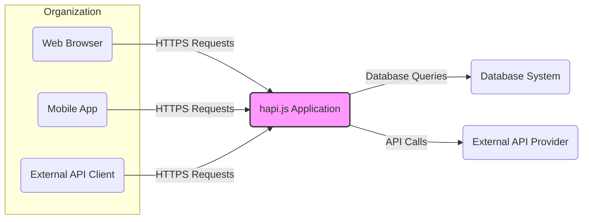
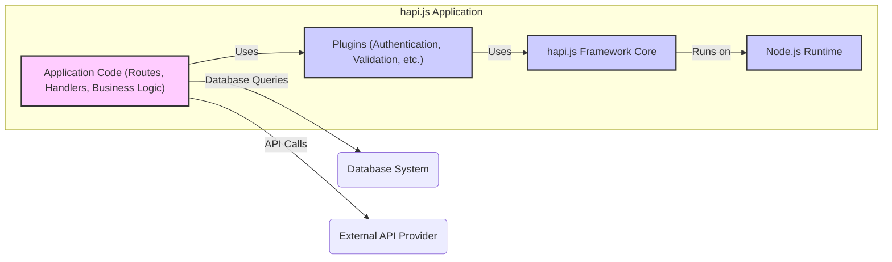
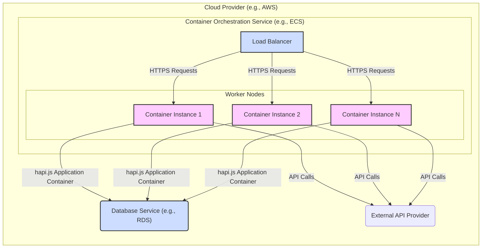
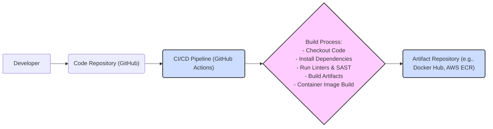

# BUSINESS POSTURE

- Business Priorities and Goals:
  - Hapi.js is an open-source, high-quality, configuration-centric framework for building web applications and services.
  - The primary goal is to provide a robust, reliable, and extensible platform that simplifies the development of scalable and maintainable backend systems.
  - Key priorities include developer experience, performance, security, and community support.
  - Hapi.js aims to be a framework of choice for developers building mission-critical applications, emphasizing stability and predictability.

- Most Important Business Risks:
  - Security vulnerabilities in the framework could lead to widespread application security breaches, damaging the reputation and trust in hapi.js.
  - Lack of community support or maintainership could lead to stagnation and eventual obsolescence of the framework.
  - Performance issues or scalability limitations could hinder the adoption of hapi.js for large-scale applications.
  - Breaking changes in new versions without proper migration paths could frustrate developers and reduce adoption.
  - Dependency on vulnerable or unmaintained third-party libraries could introduce security and stability risks.

# SECURITY POSTURE

- Existing Security Controls:
  - security control: Code reviews are likely performed by maintainers and community contributors as part of the open-source development process. (Location: GitHub Pull Request reviews)
  - security control: Static code analysis and linters are likely used to enforce code quality and identify potential issues. (Location: Project's development workflow, potentially CI/CD pipelines)
  - security control: Dependency scanning is likely performed to identify known vulnerabilities in third-party libraries. (Location: Project's development workflow, potentially CI/CD pipelines)
  - security control: Regular updates to dependencies are likely performed to address known vulnerabilities. (Location: Project's maintenance practices)
  - security control: Public vulnerability reporting process is in place, allowing security researchers to report issues. (Location: GitHub repository, security policy if available)
  - accepted risk: Open-source nature means vulnerabilities might be publicly disclosed before a patch is available.
  - accepted risk: Reliance on community contributions for security fixes might lead to delays in patching vulnerabilities.

- Recommended Security Controls:
  - security control: Implement automated security testing as part of the CI/CD pipeline, including SAST and DAST tools.
  - security control: Establish a formal security incident response plan to handle reported vulnerabilities efficiently.
  - security control: Conduct periodic security audits and penetration testing by external security experts.
  - security control: Provide security guidelines and best practices for developers using hapi.js to build secure applications.
  - security control: Implement a Software Bill of Materials (SBOM) to track dependencies and facilitate vulnerability management.

- Security Requirements:
  - Authentication:
    - Requirement: Hapi.js should provide mechanisms and best practices for implementing various authentication strategies (e.g., session-based, token-based, OAuth).
    - Requirement: The framework should not enforce any specific authentication mechanism, allowing developers flexibility in choosing the most appropriate method for their application.
    - Requirement: Hapi.js should offer plugins or middleware to simplify the integration of authentication libraries and services.
  - Authorization:
    - Requirement: Hapi.js should provide mechanisms and best practices for implementing fine-grained authorization controls.
    - Requirement: The framework should allow developers to define roles and permissions and enforce access control policies based on user roles or attributes.
    - Requirement: Hapi.js should offer plugins or middleware to simplify the integration of authorization libraries and services (e.g., RBAC, ABAC).
  - Input Validation:
    - Requirement: Hapi.js should encourage and facilitate robust input validation to prevent common vulnerabilities like injection attacks (SQL injection, XSS, command injection).
    - Requirement: The framework should provide tools or libraries for defining input schemas and validating request data.
    - Requirement: Hapi.js should offer built-in protection against common web attacks, such as preventing directory traversal or path manipulation.
  - Cryptography:
    - Requirement: Hapi.js should provide secure and easy-to-use APIs for cryptographic operations when needed (e.g., hashing passwords, encrypting sensitive data).
    - Requirement: The framework should recommend and integrate with well-vetted and secure cryptographic libraries.
    - Requirement: Hapi.js should avoid implementing custom cryptography and rely on established standards and libraries.
    - Requirement: Hapi.js should provide guidance on secure storage of sensitive data, including encryption at rest and in transit.

# DESIGN

## C4 CONTEXT

- Context Diagram Elements:
  - - Name: Web Browser
    - Type: User
    - Description: Represents users accessing the hapi.js application through a web browser.
    - Responsibilities: Interacting with the application's user interface, sending requests, and displaying responses.
    - Security controls: Browser-based security features (e.g., Content Security Policy, Same-Origin Policy), user authentication (handled by the hapi.js application).
  - - Name: Mobile App
    - Type: User
    - Description: Represents users accessing the hapi.js application through a mobile application.
    - Responsibilities: Interacting with the application's API, sending requests, and displaying data.
    - Security controls: Mobile app security best practices, user authentication (handled by the hapi.js application), secure communication channels (HTTPS).
  - - Name: External API Client
    - Type: System
    - Description: Represents other systems or services that interact with the hapi.js application's API.
    - Responsibilities: Consuming API endpoints, sending requests, and processing responses.
    - Security controls: API authentication and authorization (handled by the hapi.js application), secure communication channels (HTTPS), API rate limiting.
  - - Name: hapi.js Application
    - Type: Software System
    - Description: The web application or service built using the hapi.js framework. This is the system being designed.
    - Responsibilities: Handling user requests, processing business logic, interacting with databases and external APIs, and returning responses.
    - Security controls: Input validation, authentication, authorization, session management, output encoding, error handling, logging, monitoring, secure configuration management.
  - - Name: Database System
    - Type: System
    - Description: A database system used by the hapi.js application to store and retrieve data.
    - Responsibilities: Persisting application data, providing data access and retrieval.
    - Security controls: Database access controls, encryption at rest and in transit, regular backups, vulnerability patching, database auditing.
  - - Name: External API Provider
    - Type: System
    - Description: External APIs or services that the hapi.js application integrates with.
    - Responsibilities: Providing external data or functionality to the hapi.js application.
    - Security controls: API authentication (required by the external API provider), secure communication channels (HTTPS), input validation of data received from external APIs.

## C4 CONTAINER

- Container Diagram Elements:
  - - Name: Node.js Runtime
    - Type: Container
    - Description: The JavaScript runtime environment that executes the hapi.js application.
    - Responsibilities: Providing the execution environment for the hapi.js framework and application code.
    - Security controls: Operating system security hardening, Node.js version management, runtime security configurations.
  - - Name: hapi.js Framework Core
    - Type: Container
    - Description: The core hapi.js framework libraries providing routing, request handling, plugin system, and other core functionalities.
    - Responsibilities: Managing request lifecycle, routing requests to handlers, providing plugin interfaces, and core framework functionalities.
    - Security controls: Secure coding practices, input validation within the framework, vulnerability management, regular updates.
  - - Name: Plugins (Authentication, Validation, etc.)
    - Type: Container
    - Description: Hapi.js plugins that extend the framework's functionality, such as authentication, input validation, logging, and more.
    - Responsibilities: Providing reusable modules for common application functionalities, enhancing framework capabilities.
    - Security controls: Plugin security reviews, dependency management for plugins, secure configuration of plugins.
  - - Name: Application Code (Routes, Handlers, Business Logic)
    - Type: Container
    - Description: The custom application code developed by the user, including route definitions, request handlers, and business logic.
    - Responsibilities: Implementing specific application functionalities, handling user requests, interacting with data stores and external services.
    - Security controls: Secure coding practices, input validation in application code, authorization logic, output encoding, error handling, secure configuration management.
  - - Name: Database System
    - Type: External System
    - Description: (Same as in Context Diagram) A database system used by the hapi.js application to store and retrieve data.
    - Responsibilities: (Same as in Context Diagram) Persisting application data, providing data access and retrieval.
    - Security controls: (Same as in Context Diagram) Database access controls, encryption at rest and in transit, regular backups, vulnerability patching, database auditing.
  - - Name: External API Provider
    - Type: External System
    - Description: (Same as in Context Diagram) External APIs or services that the hapi.js application integrates with.
    - Responsibilities: (Same as in Context Diagram) Providing external data or functionality to the hapi.js application.
    - Security controls: (Same as in Context Diagram) API authentication (required by the external API provider), secure communication channels (HTTPS), input validation of data received from external APIs.

## DEPLOYMENT

Deployment Solution: Cloud-based Containerized Deployment (e.g., AWS ECS, Google Kubernetes Engine, Azure Kubernetes Service)

- Deployment Diagram Elements:
  - - Name: Load Balancer
    - Type: Infrastructure
    - Description: Distributes incoming HTTPS requests across multiple container instances of the hapi.js application.
    - Responsibilities: Load balancing, SSL termination, health checks, traffic routing.
    - Security controls: DDoS protection, SSL/TLS configuration, access control lists, security monitoring.
  - - Name: Container Instance 1, 2, N
    - Type: Infrastructure
    - Description: Virtual machines or containers running instances of the hapi.js application container.
    - Responsibilities: Running the hapi.js application, processing requests, interacting with databases and external APIs.
    - Security controls: Container image security scanning, runtime security policies, resource isolation, security updates, monitoring and logging.
  - - Name: hapi.js Application Container
    - Type: Container
    - Description: Docker container image containing the Node.js runtime, hapi.js framework, application code, and dependencies.
    - Responsibilities: Packaging and running the hapi.js application in a consistent and isolated environment.
    - Security controls: Base image security hardening, minimal container image, vulnerability scanning of container image, secure build process.
  - - Name: Database Service (e.g., RDS)
    - Type: Managed Service
    - Description: Managed database service provided by the cloud provider, used by the hapi.js application.
    - Responsibilities: Providing a scalable and reliable database backend, managing database infrastructure.
    - Security controls: Managed database security features (access control, encryption, backups, patching), network security rules, database auditing.
  - - Name: External API Provider
    - Type: External System
    - Description: (Same as in Context Diagram) External APIs or services that the hapi.js application integrates with.
    - Responsibilities: (Same as in Context Diagram) Providing external data or functionality to the hapi.js application.
    - Security controls: (Same as in Context Diagram) API authentication (required by the external API provider), secure communication channels (HTTPS), input validation of data received from external APIs.

## BUILD

- Build Process Description:
  - Developer commits code changes to the Code Repository (GitHub).
  - CI/CD Pipeline (GitHub Actions) is triggered on code changes (e.g., push, pull request).
  - Build Process steps within CI/CD Pipeline:
    - Checkout Code: Retrieves the latest code from the repository.
    - Install Dependencies: Installs project dependencies using a package manager (e.g., npm, yarn).
    - Run Linters & SAST: Executes linters and Static Application Security Testing (SAST) tools to identify code quality and security issues.
    - Build Artifacts: Builds the application artifacts (e.g., bundled JavaScript files, static assets).
    - Container Image Build: Builds a Docker container image containing the application and its dependencies.
  - Artifact Repository (e.g., Docker Hub, AWS ECR): Stores the built container image and other artifacts.

- Build Process Security Controls:
  - security control: Secure Code Repository: Access control to the code repository, branch protection, code review process. (Location: GitHub repository settings, development workflow)
  - security control: CI/CD Pipeline Security: Secure CI/CD environment, access control to pipeline configurations, secret management for credentials, audit logging. (Location: GitHub Actions settings, CI/CD configuration files)
  - security control: Dependency Scanning: Automated scanning of dependencies for known vulnerabilities during the build process. (Location: CI/CD pipeline, dependency scanning tools)
  - security control: Static Application Security Testing (SAST): Automated SAST tools integrated into the CI/CD pipeline to identify potential security vulnerabilities in the code. (Location: CI/CD pipeline, SAST tools configuration)
  - security control: Container Image Scanning: Automated scanning of container images for vulnerabilities before pushing to the artifact repository. (Location: CI/CD pipeline, container image scanning tools)
  - security control: Artifact Repository Security: Access control to the artifact repository, vulnerability scanning of stored images, secure storage and retrieval of artifacts. (Location: Artifact repository settings, repository security policies)
  - security control: Build Provenance: Generating and storing build provenance information to verify the integrity and origin of build artifacts. (Location: CI/CD pipeline, artifact repository)

# RISK ASSESSMENT

- Critical Business Processes:
  - For hapi.js itself, the critical business process is maintaining the framework's integrity, security, and availability to ensure its continued adoption and trust within the developer community.
  - For applications built with hapi.js, critical business processes will vary depending on the application's purpose. Examples include e-commerce transactions, data processing, content delivery, API services, etc. The security of hapi.js directly impacts the security of these downstream business processes.

- Data Sensitivity:
  - Hapi.js framework itself does not directly handle sensitive data. However, applications built using hapi.js will likely handle various types of data, including:
    - User credentials (passwords, API keys) - Highly sensitive, requiring strong protection.
    - Personal Identifiable Information (PII) - Sensitive, requiring protection according to privacy regulations (e.g., GDPR, CCPA).
    - Business-critical data - Sensitivity depends on the nature of the business and data.
    - Application configuration data - May contain sensitive information like database credentials, API keys.

# QUESTIONS & ASSUMPTIONS

- BUSINESS POSTURE:
  - Assumption: The primary business goal for hapi.js is to be a widely adopted and trusted open-source framework for building web applications and services.
  - Question: Are there specific target industries or application types that hapi.js is primarily focused on?
  - Question: What are the key performance indicators (KPIs) for the success of hapi.js (e.g., download numbers, community contributions, adoption rate)?

- SECURITY POSTURE:
  - Assumption: Security is a high priority for the hapi.js project, given its use in building potentially mission-critical applications.
  - Question: Is there a formal security policy or security team for the hapi.js project?
  - Question: What is the process for handling and disclosing security vulnerabilities in hapi.js?
  - Question: Are there any specific compliance requirements that hapi.js aims to meet (e.g., OWASP ASVS, PCI DSS)?

- DESIGN:
  - Assumption: Hapi.js is designed to be flexible and adaptable to various deployment environments and application architectures.
  - Question: Are there recommended deployment architectures or best practices for deploying hapi.js applications securely?
  - Question: What are the key considerations for scaling hapi.js applications in different deployment environments?
  - Question: Are there specific plugins or modules recommended for enhancing the security of hapi.js applications (e.g., rate limiting, security headers)?