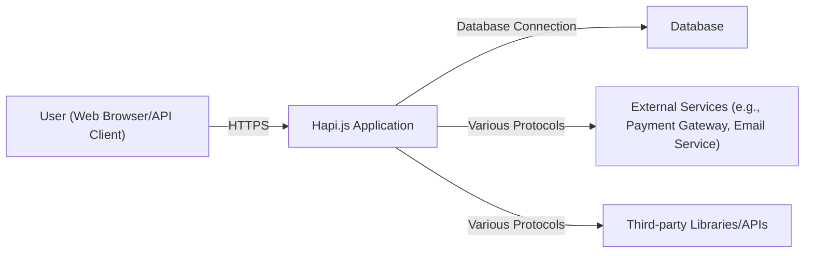
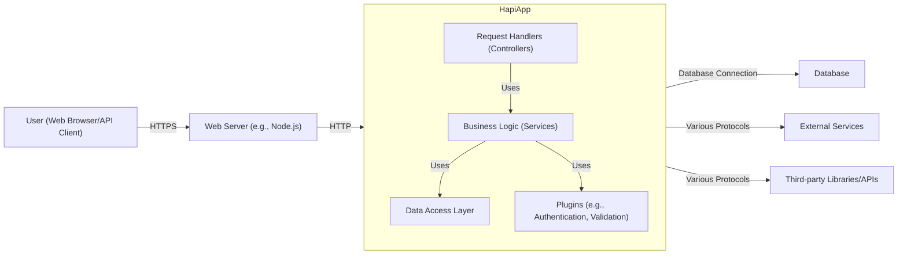

Okay, let's create a design document for the Hapi.js framework, focusing on aspects relevant for threat modeling.

# BUSINESS POSTURE

Hapi.js is a rich framework for building applications and services. It's designed to enable developers to focus on writing reusable application logic instead of spending time building infrastructure.  Given its nature as a web framework, the primary business goals and priorities revolve around:

*   Reliability:  Ensuring the framework itself is stable and dependable, minimizing crashes and unexpected behavior.  Applications built with Hapi.js should be able to handle expected and unexpected loads gracefully.
*   Maintainability:  The framework's codebase should be easy to understand, modify, and extend.  This is crucial for long-term viability and community contributions.
*   Developer Productivity:  Hapi.js aims to simplify web application development, allowing developers to build features quickly and efficiently.
*   Security:  Providing built-in mechanisms and encouraging secure coding practices to protect applications built with the framework from common web vulnerabilities.
*   Scalability: Allowing applications built with it to scale to handle increasing traffic and data volumes.
*   Extensibility: Providing a robust plugin system to allow developers to easily add or customize functionality.

Most important business risks that need to be addressed:

*   Framework Vulnerabilities:  Vulnerabilities within Hapi.js itself could expose all applications built using it to attacks. This is the most critical risk.
*   Supply Chain Attacks:  Dependencies of Hapi.js could be compromised, leading to vulnerabilities in the framework.
*   Improper Use:  Developers might misuse Hapi.js features or fail to implement proper security measures in their applications, leading to vulnerabilities.
*   Lack of Adoption: If the framework is perceived as insecure or difficult to use, it may lose adoption, impacting its long-term viability.
*   Outdated Dependencies: Failure to keep dependencies up-to-date could introduce known vulnerabilities.

# SECURITY POSTURE

Existing security controls and accepted risks (based on the GitHub repository and general knowledge of web frameworks):

*   security control: Input Validation: Hapi.js uses Joi for input validation. This is a core feature and helps prevent many common vulnerabilities like injection attacks. (Described in documentation and implemented in the core framework).
*   security control: Plugin System: Hapi.js's plugin architecture allows for modular security features. Security-focused plugins can be added as needed. (Described in documentation and implemented in the core framework).
*   security control: Route Configuration: Security-related settings can be configured at the route level, allowing for granular control over authentication, authorization, and other security aspects. (Described in documentation and implemented in the core framework).
*   security control: Community Scrutiny: Being an open-source project, Hapi.js benefits from community scrutiny, which can help identify and address security issues. (Implicit in the open-source nature of the project).
*   security control: Regular Updates: The Hapi.js team releases updates to address bugs and security vulnerabilities. (Evidenced by the release history on GitHub).
*   security control: Documentation: Hapi.js provides extensive documentation, including security best practices. (Available on the official website and GitHub).
*   security control: Secure development lifecycle: Hapi project use GitHub features to manage project, including security features. (Described in GitHub project).
*   accepted risk: Third-Party Plugin Risks: While the plugin system is a strength, it also introduces the risk of vulnerabilities in third-party plugins. The core Hapi.js team may not have control over the security of these plugins.
*   accepted risk: Developer Error: Despite the framework's features, developers can still introduce vulnerabilities through improper implementation or configuration.
*   accepted risk: Zero-Day Vulnerabilities: Like any software, Hapi.js is susceptible to zero-day vulnerabilities that are unknown and unpatched.

Recommended security controls (high priority):

*   Implement a robust Security Development Lifecycle (SDL) process, including regular security audits, penetration testing, and threat modeling.
*   Establish a clear vulnerability disclosure program to encourage responsible reporting of security issues.
*   Provide more detailed security guidance and examples in the documentation, covering common web application vulnerabilities and how to mitigate them using Hapi.js.
*   Consider integrating automated security scanning tools into the CI/CD pipeline to detect vulnerabilities early in the development process.
*   Implement a Content Security Policy (CSP) by default or provide easy configuration options for developers to enable CSP.
*   Provide built-in protection against Cross-Site Request Forgery (CSRF) attacks.
*   Offer guidance and tools for secure session management, including the use of HttpOnly and Secure cookies.

Security Requirements:

*   Authentication:
    *   The framework should support various authentication mechanisms (e.g., API keys, OAuth, JWT).
    *   Authentication mechanisms should be configurable and extensible.
    *   Sensitive credentials should never be stored in plain text.
*   Authorization:
    *   The framework should provide mechanisms for controlling access to resources based on user roles and permissions.
    *   Authorization should be enforced consistently across all routes and resources.
    *   Support for both role-based access control (RBAC) and attribute-based access control (ABAC) is desirable.
*   Input Validation:
    *   All user input should be validated using a strict whitelist approach.
    *   Validation rules should be configurable and extensible.
    *   The framework should provide built-in validation for common data types.
    *   Input validation should occur as early as possible in the request processing pipeline.
*   Cryptography:
    *   The framework should use strong, industry-standard cryptographic algorithms for all security-sensitive operations.
    *   Cryptographic keys should be managed securely.
    *   The framework should provide utilities for common cryptographic tasks (e.g., hashing, encryption, signing).
*   Output Encoding:
    *   The framework should provide mechanisms for encoding output to prevent Cross-Site Scripting (XSS) vulnerabilities.
    *   Output encoding should be context-aware (e.g., HTML encoding, JavaScript encoding).

# DESIGN

## C4 CONTEXT



Elements Description:

*   Element:
    *   Name: User (Web Browser/API Client)
    *   Type: Person
    *   Description: Represents a user interacting with the Hapi.js application, either through a web browser or by directly consuming APIs.
    *   Responsibilities: Initiates requests to the application, provides input, and receives responses.
    *   Security controls: Uses HTTPS for secure communication. Relies on browser security features and potentially user authentication.

*   Element:
    *   Name: Hapi.js Application
    *   Type: Software System
    *   Description: The application built using the Hapi.js framework. This is the core system.
    *   Responsibilities: Handles incoming requests, processes business logic, interacts with databases and external services, and returns responses to the user.
    *   Security controls: Input validation, authentication, authorization, output encoding, session management, and other security features provided by Hapi.js and implemented by the application developers.

*   Element:
    *   Name: Database
    *   Type: Software System
    *   Description: The database used by the Hapi.js application to store data.
    *   Responsibilities: Stores and retrieves data as requested by the application.
    *   Security controls: Database access controls, encryption at rest, encryption in transit, auditing, and other database-specific security measures.

*   Element:
    *   Name: External Services
    *   Type: Software System
    *   Description: External services that the Hapi.js application interacts with, such as payment gateways, email services, or other APIs.
    *   Responsibilities: Provides specific functionalities as required by the application.
    *   Security controls: Relies on the security measures implemented by the external service providers. The Hapi.js application should use secure communication protocols and authenticate with these services appropriately.

*   Element:
    *   Name: Third-party Libraries/APIs
    *   Type: Software System
    *   Description: External libraries and APIs that are used by Hapi.js application.
    *   Responsibilities: Provides specific functionalities as required by the application.
    *   Security controls: Relies on the security measures implemented by the external libraries and APIs.

## C4 CONTAINER



Elements Description:

*   Element:
    *   Name: User (Web Browser/API Client)
    *   Type: Person
    *   Description: Same as in the Context diagram.
    *   Responsibilities: Same as in the Context diagram.
    *   Security controls: Same as in the Context diagram.

*   Element:
    *   Name: Web Server (e.g., Node.js)
    *   Type: Container
    *   Description: The underlying web server that hosts the Hapi.js application.  Hapi.js runs on Node.js, so Node.js itself acts as the web server.
    *   Responsibilities: Receives incoming HTTP requests and forwards them to the Hapi.js application.
    *   Security controls:  TLS configuration, potentially a reverse proxy or load balancer in front for additional security (e.g., WAF).

*   Element:
    *   Name: Hapi.js Application
    *   Type: Container
    *   Description: The application built using the Hapi.js framework.
    *   Responsibilities: Same as in the Context diagram.
    *   Security controls: Same as in the Context diagram.

*   Element:
    *   Name: Request Handlers (Controllers)
    *   Type: Component
    *   Description:  Handles incoming requests, performs initial validation, and routes requests to the appropriate business logic.
    *   Responsibilities:  Request parsing, input validation, routing, calling business logic.
    *   Security controls:  Input validation (using Joi), authentication checks (potentially using plugins).

*   Element:
    *   Name: Business Logic (Services)
    *   Type: Component
    *   Description:  Contains the core application logic and business rules.
    *   Responsibilities:  Implements the application's functionality, interacts with the data access layer and plugins.
    *   Security controls:  Authorization checks, data validation, business rule enforcement.

*   Element:
    *   Name: Data Access Layer
    *   Type: Component
    *   Description:  Handles interactions with the database.
    *   Responsibilities:  Data retrieval, storage, and manipulation.
    *   Security controls:  Parameterized queries (to prevent SQL injection), data validation, access control.

*   Element:
    *   Name: Plugins (e.g., Authentication, Validation)
    *   Type: Component
    *   Description:  Reusable modules that extend the functionality of the Hapi.js application.
    *   Responsibilities:  Provides specific features like authentication, authorization, validation, logging, etc.
    *   Security controls:  Implements specific security features (e.g., authentication, authorization, input validation).

*   Element:
    *   Name: Database
    *   Type: Container
    *   Description: Same as in the Context diagram.
    *   Responsibilities: Same as in the Context diagram.
    *   Security controls: Same as in the Context diagram.

*   Element:
    *   Name: External Services
    *   Type: Container
    *   Description: Same as in the Context diagram.
    *   Responsibilities: Same as in the Context diagram.
    *   Security controls: Same as in the Context diagram.

*   Element:
    *   Name: Third-party Libraries/APIs
    *   Type: Container
    *   Description: Same as in the Context diagram.
    *   Responsibilities: Same as in the Context diagram.
    *   Security controls: Same as in the Context diagram.

## DEPLOYMENT

Hapi.js applications, being Node.js applications, can be deployed in various ways:

1.  **Bare Metal Servers:**  Directly on physical or virtual servers.
2.  **Virtual Machines (VMs):**  On cloud providers like AWS EC2, Google Compute Engine, Azure VMs.
3.  **Containers (Docker):**  Packaged as Docker containers and deployed on container orchestration platforms like Kubernetes, Docker Swarm, or cloud services like AWS ECS, Google Kubernetes Engine (GKE), Azure Kubernetes Service (AKS).
4.  **Platform as a Service (PaaS):**  On platforms like Heroku, AWS Elastic Beanstalk, Google App Engine.
5.  **Serverless Functions:**  Specific parts of the application can be deployed as serverless functions (e.g., AWS Lambda, Google Cloud Functions, Azure Functions), especially for event-driven or API-based workloads.

We'll describe a **containerized deployment using Docker and Kubernetes**, as it's a common and robust approach.

```mermaid
graph LR
    Developer["Developer"] -- "Code Commit" --> GitRepo["Git Repository (e.g., GitHub)"];
    GitRepo -- "Webhook Trigger" --> CI_CD["CI/CD Pipeline (e.g., Jenkins, GitHub Actions)"];
    CI_CD -- "Build & Test" --> DockerImage["Docker Image"];
    DockerImage -- "Push" --> ContainerRegistry["Container Registry (e.g., Docker Hub, ECR, GCR)"];
    ContainerRegistry -- "Pull" --> KubernetesCluster["Kubernetes Cluster"];
    KubernetesCluster -- "Exposes" --> LoadBalancer["Load Balancer"];
    LoadBalancer -- "HTTPS" --> User["User (Web Browser/API Client)"];

    subgraph KubernetesCluster
        HapiAppPod["Hapi.js App Pod(s)"] -- "Database Connection" --> DatabaseService["Database Service"];
        DatabaseService -- "" --> DatabasePod["Database Pod(s)"];
        HapiAppPod -- "Service Discovery" --> ExternalServices["External Services"];
    end

```

Elements Description:

*   Element:
    *   Name: Developer
    *   Type: Person
    *   Description: The developer writing and committing code.
    *   Responsibilities: Writing code, committing changes, triggering builds.
    *   Security controls: Code reviews, secure coding practices.

*   Element:
    *   Name: Git Repository (e.g., GitHub)
    *   Type: Software System
    *   Description: Stores the application's source code.
    *   Responsibilities: Version control, code storage.
    *   Security controls: Access controls, branch protection rules, code scanning.

*   Element:
    *   Name: CI/CD Pipeline (e.g., Jenkins, GitHub Actions)
    *   Type: Software System
    *   Description: Automates the build, test, and deployment process.
    *   Responsibilities: Building Docker images, running tests, pushing images to a registry, deploying to Kubernetes.
    *   Security controls: Secure configuration, access controls, vulnerability scanning.

*   Element:
    *   Name: Docker Image
    *   Type: Artifact
    *   Description: The packaged Hapi.js application.
    *   Responsibilities: Contains the application code and its dependencies.
    *   Security controls: Image signing, vulnerability scanning.

*   Element:
    *   Name: Container Registry (e.g., Docker Hub, ECR, GCR)
    *   Type: Software System
    *   Description: Stores Docker images.
    *   Responsibilities: Image storage, access control.
    *   Security controls: Access controls, vulnerability scanning, image signing.

*   Element:
    *   Name: Kubernetes Cluster
    *   Type: Infrastructure
    *   Description: The container orchestration platform.
    *   Responsibilities: Managing the deployment and scaling of the application.
    *   Security controls: Network policies, RBAC, pod security policies, secrets management.

*   Element:
    *   Name: Hapi.js App Pod(s)
    *   Type: Container Instance
    *   Description: Running instances of the Hapi.js application container.
    *   Responsibilities: Handling requests, processing business logic.
    *   Security controls: Same as the Hapi.js Application container, plus Kubernetes-specific controls.

*   Element:
    *   Name: Database Service
    *   Type: Service
    *   Description: A Kubernetes service that provides a stable endpoint for accessing the database.
    *   Responsibilities: Routing traffic to the database pods.
    *   Security controls: Network policies.

*   Element:
    *   Name: Database Pod(s)
    *   Type: Container Instance
    *   Description: Running instances of the database container.
    *   Responsibilities: Storing and retrieving data.
    *   Security controls: Same as the Database container, plus Kubernetes-specific controls.

*   Element:
    *   Name: External Services
    *   Type: Software System
    *   Description: Same as in the Context diagram.
    *   Responsibilities: Same as in the Context diagram.
    *   Security controls: Same as in the Context diagram.

*   Element:
    *   Name: Load Balancer
    *   Type: Infrastructure
    *   Description: Distributes traffic across multiple instances of the Hapi.js application.
    *   Responsibilities: Load balancing, TLS termination.
    *   Security controls: TLS configuration, WAF integration.

*   Element:
    *   Name: User (Web Browser/API Client)
    *   Type: Person
    *   Description: Same as in the Context diagram.
    *   Responsibilities: Same as in the Context diagram.
    *   Security controls: Same as in the Context diagram.

## BUILD

The build process for a Hapi.js application typically involves the following steps:

1.  **Code Checkout:** The CI/CD pipeline checks out the source code from the Git repository.
2.  **Dependency Installation:**  Dependencies are installed using npm or yarn (e.g., `npm install`).
3.  **Linting:**  Code is linted using tools like ESLint to enforce coding standards and identify potential errors.
4.  **Testing:**  Unit tests, integration tests, and potentially end-to-end tests are executed.
5.  **Building (if necessary):**  If the application uses a transpiler like Babel or TypeScript, the code is compiled into JavaScript.
6.  **Packaging:** The application and its dependencies are packaged into a Docker image.
7.  **Image Scanning:** The Docker image is scanned for vulnerabilities using tools like Trivy, Clair, or Anchore.
8.  **Image Pushing:** The Docker image is pushed to a container registry.

```mermaid
graph LR
    Developer["Developer"] -- "Code Commit" --> GitRepo["Git Repository (e.g., GitHub)"];
    GitRepo -- "Webhook Trigger" --> CI_CD["CI/CD Pipeline (e.g., Jenkins, GitHub Actions)"];
    CI_CD -- "Checkout Code" --> Code["Source Code"];
    Code -- "npm install" --> Dependencies["Dependencies (node_modules)"];
    Dependencies -- "Linting (ESLint)" --> LintedCode["Linted Code"];
    LintedCode -- "Testing (Jest, Mocha)" --> TestResults["Test Results"];
    TestResults -- "Build (Babel, TypeScript)" --> BuiltCode["Built Code (JavaScript)"];
    BuiltCode -- "Packaging (Docker)" --> DockerImage["Docker Image"];
    DockerImage -- "Image Scanning (Trivy, Clair)" --> ScannedImage["Scanned Docker Image"];
    ScannedImage -- "Push" --> ContainerRegistry["Container Registry (e.g., Docker Hub, ECR, GCR)"];

```



Security Controls in the Build Process:

*   **Dependency Management:**  Using npm or yarn with package-lock.json or yarn.lock to ensure consistent and reproducible builds. Regularly auditing dependencies for known vulnerabilities using tools like `npm audit` or `yarn audit`.
*   **Linting:**  Enforcing coding standards and identifying potential security issues using linters.
*   **Static Application Security Testing (SAST):**  Integrating SAST tools into the CI/CD pipeline to scan the code for vulnerabilities.
*   **Software Composition Analysis (SCA):** Using tools to identify and manage open-source dependencies and their associated vulnerabilities.
*   **Image Scanning:**  Scanning Docker images for vulnerabilities before pushing them to a registry.
*   **Secure Build Environment:**  Ensuring the CI/CD pipeline itself is secure, with appropriate access controls and secrets management.

# RISK ASSESSMENT

*   **Critical Business Processes:**
    *   Serving web requests and API calls reliably.
    *   Protecting user data and ensuring privacy.
    *   Maintaining the integrity of application data and functionality.
    *   Ensuring the availability of the application.

*   **Data Sensitivity:**
    *   **User Data (PII):**  Names, email addresses, passwords (hashed), addresses, phone numbers, etc. (High Sensitivity)
    *   **Financial Data:**  Payment card information, transaction details (if applicable). (High Sensitivity)
    *   **Session Data:**  User session tokens, authentication state. (High Sensitivity)
    *   **Application Data:**  Data specific to the application's functionality (variable sensitivity depending on the application).
    *   **Configuration Data:** API keys, database credentials, other secrets. (High Sensitivity)
    *   **Logs:** Application logs may contain sensitive information if not properly configured. (Medium to High Sensitivity)

# QUESTIONS & ASSUMPTIONS

*   **Questions:**
    *   What specific types of applications are typically built with Hapi.js within the organization using this design document? (This helps tailor the threat model to specific use cases.)
    *   What are the existing security policies and standards within the organization?
    *   What is the organization's risk tolerance?
    *   Are there any specific regulatory compliance requirements (e.g., GDPR, HIPAA, PCI DSS)?
    *   What is the expected traffic volume and scalability requirements for applications built with Hapi.js?
    *   What level of support and maintenance is provided for the Hapi.js framework itself?
    *   What is the process for handling security vulnerabilities discovered in Hapi.js or its dependencies?

*   **Assumptions:**
    *   **BUSINESS POSTURE:** The organization values security and is willing to invest in security measures. Developers using Hapi.js have a basic understanding of web security principles.
    *   **SECURITY POSTURE:** The organization has a basic security infrastructure in place (e.g., firewalls, intrusion detection systems). There is some level of security awareness among developers.
    *   **DESIGN:** The Hapi.js application will be deployed in a modern environment (e.g., cloud-based, containerized). The application will interact with a database and potentially other external services. The application will be built using a CI/CD pipeline.