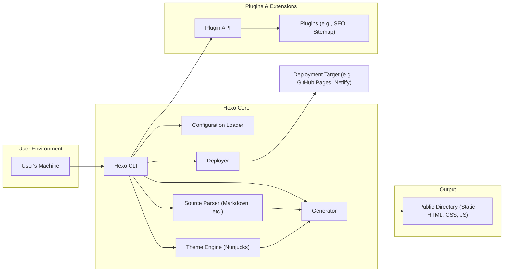

# Project Design Document: Hexo Static Site Generator

**Version:** 1.1
**Date:** October 26, 2023
**Author:** AI Software Architect

## 1. Introduction

This document provides a detailed architectural design for the Hexo static site generator project. It outlines the key components, their interactions, and the overall system architecture. This document will serve as a foundation for subsequent threat modeling activities.

## 2. Project Overview

Hexo is a fast, simple, and powerful blog framework. It allows users to write content in Markdown (or other formats) and generate static HTML websites. The core functionality revolves around transforming user-authored content and theme templates into a deployable website.

## 3. Architectural Design

### 3.1. System Architecture Diagram

### 3.2. Component Descriptions

*   **User's Machine:** The local environment where the user interacts with the Hexo CLI, writes content, and manages the Hexo project.
*   **Hexo CLI:** The command-line interface that provides users with commands to manage their Hexo site (e.g., `hexo init`, `hexo generate`, `hexo deploy`). This is the primary entry point for user interaction.
*   **Configuration Loader:** Responsible for reading and parsing the `_config.yml` file and other configuration files, providing settings for the entire Hexo process.
*   **Source Parser (Markdown, etc.):**  Parses user-authored content files (typically Markdown) into an internal representation that can be processed by the theme engine. Supports various formats through plugins.
*   **Theme Engine (Nunjucks):**  A templating engine (Nunjucks by default) that combines parsed content with theme templates to generate HTML files.
*   **Generator:** The core component responsible for orchestrating the generation process. It takes the parsed content and theme templates and produces the final static website files.
*   **Deployer:** Handles the deployment of the generated static files to a specified target (e.g., GitHub Pages, Netlify, FTP server). Deployment methods are often plugin-based.
*   **Plugin API:**  Provides a mechanism for extending Hexo's functionality. Plugins can add new features, modify existing behavior, and integrate with external services.
*   **Plugins (e.g., SEO, Sitemap):**  Independent modules that extend Hexo's capabilities. Examples include plugins for generating sitemaps, optimizing for SEO, or adding analytics.
*   **Public Directory (Static HTML, CSS, JS):** The output directory containing the generated static website files ready for deployment.
*   **Deployment Target (e.g., GitHub Pages, Netlify):** The remote server or service where the generated website is hosted.

## 4. Data Flow

The primary data flow within Hexo involves the transformation of user-authored content into a static website:

*   **Content Creation:** The user creates content files (e.g., Markdown) and configuration files on their local machine.
*   **Command Invocation:** The user executes a Hexo CLI command (e.g., `hexo generate`).
*   **Configuration Loading:** The Configuration Loader reads and parses the project's configuration files.
*   **Source Parsing:** The Source Parser reads and parses the content files, extracting metadata and content.
*   **Theme Processing:** The Theme Engine uses the parsed content and theme templates to generate HTML fragments.
*   **Website Generation:** The Generator orchestrates the process, combining the processed content and templates to create the final HTML, CSS, and JavaScript files.
*   **Output to Public Directory:** The generated files are written to the `public` directory.
*   **Deployment (Optional):** The user can invoke the `hexo deploy` command, which utilizes a Deployer plugin to transfer the contents of the `public` directory to the specified deployment target.

## 5. Trust Boundaries

Identifying trust boundaries is crucial for threat modeling. In the context of Hexo:

*   **User's Machine:** This is generally considered a lower trust environment as it's controlled by the user and potentially vulnerable to malware or misconfiguration.
*   **Hexo Core:** The core Hexo application itself. We assume a certain level of trust in the core codebase.
*   **Plugins:** Plugins represent a significant trust boundary. Hexo users install and execute third-party code, which could introduce vulnerabilities.
*   **Deployment Target:** The security of the deployment target is outside the direct control of Hexo but is a critical consideration.

## 6. Security Considerations

While Hexo generates static websites, which inherently reduces some attack vectors, there are still security considerations:

*   **Dependency Vulnerabilities:** Hexo and its plugins rely on numerous Node.js packages. Vulnerabilities in these dependencies could be exploited.
*   **Plugin Security:** Malicious or poorly written plugins can introduce vulnerabilities, such as cross-site scripting (XSS) or arbitrary code execution during the generation process.
*   **Theme Security:** Themes can also contain vulnerabilities, particularly if they involve client-side scripting or rely on external resources.
*   **Configuration Security:** Misconfigurations in `_config.yml` or plugin configurations could expose sensitive information or create security risks.
*   **Supply Chain Security:**  The process of obtaining Hexo and its dependencies (e.g., through npm) needs to be secure to prevent the introduction of malicious code.
*   **Deployment Security:**  The security of the deployment process and the target environment is critical. Compromised deployment credentials could lead to website defacement.

## 7. Future Considerations

*   **Sandboxing for Plugins:** Exploring mechanisms to sandbox plugin execution could mitigate risks associated with untrusted code.
*   **Security Audits:** Regular security audits of the Hexo core and popular plugins would help identify and address potential vulnerabilities.
*   **Content Security Policy (CSP) Generation:**  Integrating features to help users easily configure and generate CSP headers for their websites.

This document provides a comprehensive overview of the Hexo architecture, laying the groundwork for a thorough threat modeling exercise. The identified components, data flows, and trust boundaries will be essential for understanding potential attack vectors and developing appropriate security mitigations.
