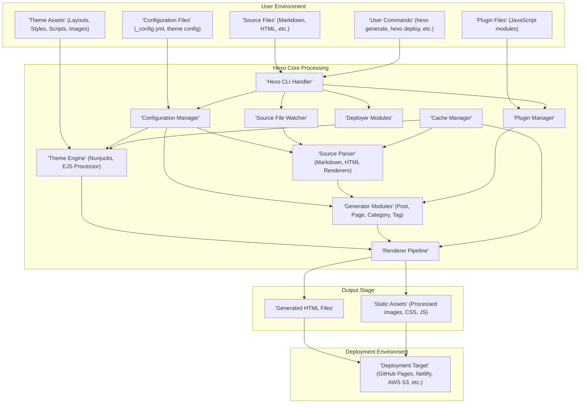

## Project Design Document: Hexo Static Site Generator (Improved)

**1. Project Overview**

This document provides a detailed design overview of Hexo, a fast, simple, and powerful blog framework. Hexo's core functionality involves transforming source files written in Markdown (or other supported formats) into static HTML websites. This document is designed to facilitate a thorough understanding of Hexo's internal structure, component interactions, and data flow, serving as a crucial resource for subsequent threat modeling activities.

**2. Goals**

* To present a clear, comprehensive, and well-structured description of Hexo's architecture and operational mechanisms.
* To precisely identify and define the roles and interactions of key software components within Hexo.
* To meticulously illustrate the flow of data through the system, highlighting transformation points and data dependencies.
* To establish a robust foundation for the identification of potential security vulnerabilities and risks during future threat modeling exercises.

**3. Target Audience**

* Security Engineers responsible for identifying and mitigating security risks.
* Software Developers involved in maintaining, extending, or integrating with Hexo.
* DevOps Engineers managing the deployment and infrastructure of Hexo-based websites.
* Technical stakeholders requiring a deep understanding of Hexo's internal workings for security assessments or architectural reviews.

**4. System Architecture**

Hexo's architecture follows a distinct pipeline, encompassing the stages of Source Processing, Content Generation, and Deployment. The following diagram illustrates the key components and their interactions:

**5. Data Flow (Detailed)**

The data flow within Hexo can be broken down into the following sequential steps:

* **Initialization:**
    * The user executes a Hexo command via the CLI (F).
    * The Configuration Manager (G) loads settings from `_config.yml` and theme configurations (B).
    * The Plugin Manager (K) loads and initializes registered plugins (D).
* **Source Processing:**
    * The Source File Watcher (H) monitors source directories for changes (A).
    * Upon detecting changes or during a `hexo generate` command, the Source Parser (I) processes source files based on their file extensions, utilizing appropriate rendering engines (e.g., Markdown parser for `.md` files).
    * Parsed source data is cached by the Cache Manager (O).
* **Content Generation:**
    * Generator Modules (L) utilize the parsed source data and configuration to generate the site structure. This includes creating lists of posts, pages, categories, and tags.
    * Theme Engine (J) processes theme layouts (C) and combines them with the generated content data.
* **Rendering:**
    * The Renderer Pipeline (M) takes the output from the Generator Modules and the Theme Engine.
    * It renders the final HTML files (P) by applying the theme's templates and injecting the content.
    * Static assets within the theme are processed and copied to the output directory (Q).
    * The Cache Manager (O) may cache rendered output for performance.
* **Output:**
    * Generated HTML files and static assets are placed in the `public` directory.
* **Deployment (Optional):**
    * When the `hexo deploy` command is executed, the Deployer Modules (N) use the configured deployment settings to transfer the contents of the `public` directory to the specified Deployment Target (R).

**6. Key Components (Detailed)**

* **Hexo CLI Handler:** The entry point for user interaction, responsible for parsing commands and invoking the appropriate Hexo modules.
* **Configuration Manager:** Loads, validates, and provides access to Hexo's configuration settings from `_config.yml` and theme-specific configurations.
* **Source File Watcher:** Monitors source file directories for changes, triggering regeneration when modifications are detected (primarily in development mode).
* **Source Parser:**  Responsible for parsing source files (Markdown, HTML, etc.) into structured data that Hexo can process. Different parsers are used based on file extensions and can be extended via plugins.
* **Theme Engine:** A templating engine (typically Nunjucks or EJS) that processes theme layouts and renders the final HTML output by combining layouts with generated content data.
* **Plugin Manager:** Loads, registers, and manages plugins, allowing developers to extend Hexo's functionality. Plugins can hook into various stages of the generation process.
* **Generator Modules:**  Modules responsible for generating the site's structure and content organization, such as creating lists of posts, pages, categories, and tags based on the parsed source data.
* **Renderer Pipeline:** Orchestrates the rendering process, taking the generated content and applying the theme's templates to produce the final HTML files and process static assets.
* **Deployer Modules:**  Handle the deployment of the generated static files to various hosting platforms. Different deployers exist for different services (e.g., GitHub Pages, Netlify, AWS S3).
* **Cache Manager:**  Implements caching mechanisms to improve performance by storing the results of computationally intensive operations (e.g., parsing, rendering) and reusing them when possible.

**7. External Dependencies**

Hexo relies on the following key external dependencies:

* **Node.js:** The JavaScript runtime environment necessary to execute Hexo.
* **npm or Yarn:** Package managers used for installing Hexo and its plugins.
* **Git (Common):** Frequently used for version control of the Hexo project and for deployment to platforms like GitHub Pages.
* **Rendering Engines (e.g., `marked`, `markdown-it`):** Libraries used to parse different markup languages into HTML.
* **Theme Engines (e.g., `nunjucks`, `ejs`):** Libraries used for templating and rendering dynamic content within themes.
* **Deployment Services (e.g., GitHub Pages, Netlify, AWS S3, Heroku):** External platforms used to host the generated website.
* **Numerous Plugins:** A vast ecosystem of community-developed plugins that extend Hexo's core functionality in various ways.

**8. Security Architecture Considerations**

Beyond the general architecture, several security-relevant aspects are worth highlighting:

* **Plugin Isolation:** While plugins extend functionality, their execution context and potential access to system resources need consideration. Lack of proper isolation could lead to vulnerabilities.
* **Theme Security Model:** Themes, often sourced externally, can introduce risks through malicious JavaScript or insecure handling of user-provided content.
* **Configuration Management Security:** Secure storage and handling of sensitive configuration data, such as deployment credentials, are critical.
* **Dependency Management:**  Regularly auditing and updating dependencies is essential to mitigate vulnerabilities in third-party libraries. Mechanisms for ensuring dependency integrity are important.
* **Content Security Policy (CSP):** The generated HTML should ideally be configured with a strong CSP to mitigate XSS attacks. This is often the responsibility of the theme developer.
* **HTTPS Enforcement:** While Hexo generates static content, ensuring that the deployed site is served over HTTPS is crucial for protecting user data in transit. This is typically a deployment environment concern.

**9. Security Considerations (Detailed)**

This section expands on potential security considerations relevant to threat modeling:

* **Dependency Vulnerabilities:**
    * Exploitable vulnerabilities in Node.js dependencies could allow attackers to compromise the Hexo build process or the generated website.
    * Outdated dependencies might contain known security flaws.
* **Plugin Security:**
    * Malicious or poorly written plugins could introduce vulnerabilities such as arbitrary code execution, data breaches, or cross-site scripting (XSS).
    * Lack of input validation in plugins could lead to security issues.
* **Configuration Security:**
    * Storing sensitive information (e.g., API keys, deployment credentials) in plain text configuration files poses a significant risk.
    * Improper file permissions on configuration files could allow unauthorized access.
* **Input Validation:**
    * While Hexo primarily processes local files, vulnerabilities could arise if plugins process external data (e.g., through APIs) without proper sanitization and validation.
    * Insecure handling of user-provided content within source files could lead to stored XSS vulnerabilities in the generated website.
* **Output Sanitization:**
    * Failure to properly sanitize user-provided content within themes could result in XSS vulnerabilities in the generated HTML.
    * Incorrectly configured theme engines might not escape user input effectively.
* **Theme Security:**
    * Malicious JavaScript code embedded within themes could compromise users' browsers.
    * Themes might include vulnerable client-side libraries.
    * Insecure handling of user-uploaded assets within themes could create security risks.
* **Deployment Security:**
    * Weak or compromised deployment credentials could allow unauthorized modification of the website.
    * Insecure deployment processes could expose sensitive information.
    * The security of the target hosting platform is paramount.

This improved design document provides a more detailed and structured understanding of Hexo, enhancing its value for subsequent threat modeling activities and security assessments.
