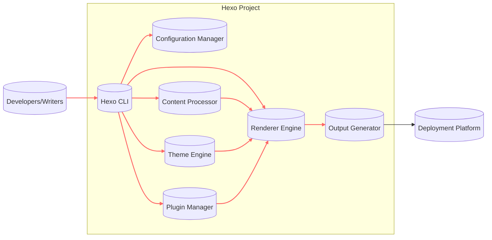

# BUSINESS POSTURE

Hexo is a static site generator designed to simplify blog creation for developers and writers. Its primary business goal is to provide a fast, efficient, and customizable platform for generating static websites, particularly blogs.

Business Priorities:
- Ease of use and setup for developers.
- Performance and speed of website generation.
- Customizability through themes and plugins.
- Extensibility and active community support.
- Stability and reliability of the core framework.

Business Risks:
- Security vulnerabilities in core framework, themes, or plugins could lead to website defacement or data breaches (if sensitive data is inadvertently included in the static site generation process).
- Lack of updates or community support could lead to stagnation and decreased adoption.
- Performance issues or complexity in customization could deter users.
- Supply chain attacks targeting dependencies used by Hexo or its plugins.
- Misconfiguration by users leading to insecure websites.

# SECURITY POSTURE

Existing Security Controls:
- security control: Dependency management using `package-lock.json` to ensure consistent and reproducible builds. (Implemented in repository and build process)
- security control: Usage of npm ecosystem for package management, which includes community-driven security scanning and reporting (npm audit). (Implemented in build process and dependency management)
- security control: Static site generation inherently reduces attack surface compared to dynamic websites with databases and server-side scripting. (Design principle)
- accepted risk: Reliance on third-party themes and plugins introduces potential security vulnerabilities. (Implicitly accepted by design, user responsibility)
- accepted risk: Security of the generated website is largely dependent on the user's configuration and hosting environment. (Implicitly accepted by design, user responsibility)

Recommended Security Controls:
- security control: Implement automated security scanning (SAST/DAST) for the core Hexo framework in the CI/CD pipeline.
- security control: Provide security guidelines and best practices documentation for users, especially regarding theme and plugin selection and website configuration.
- security control: Establish a process for reporting and addressing security vulnerabilities in the core framework and potentially in officially maintained plugins/themes.
- security control: Encourage and potentially enforce (for core and official plugins/themes) dependency vulnerability scanning and updates.

Security Requirements:
- Authentication: Not directly applicable to Hexo core as it's a static site generator. Authentication is relevant for any administrative interfaces or services built around Hexo (e.g., a CMS or plugin management dashboard, if any). For the core framework, focus is on secure development practices and supply chain security.
- Authorization: Not directly applicable to Hexo core. Authorization would be relevant in the context of administrative interfaces or services built around Hexo. For the core framework, focus is on preventing unauthorized modifications to the framework itself through secure development practices and access control to the repository.
- Input Validation: Input validation is crucial during static site generation. Hexo needs to properly handle and sanitize user-provided content (Markdown, configuration files, theme templates) to prevent injection vulnerabilities (e.g., Cross-Site Scripting - XSS) in the generated static website. This should be implemented in the rendering engine and content processing modules.
- Cryptography: Cryptography might be relevant for features like password hashing (if Hexo were to manage user accounts, which it currently doesn't in its core functionality) or secure communication (HTTPS for documentation website, secure download of dependencies). For static site generation, ensuring no accidental inclusion of sensitive cryptographic keys or data in generated output is important.

# DESIGN

## C4 CONTEXT

```mermaid
graph LR
    subgraph "Hexo Ecosystem"
        H[("Hexo Project")]
    end
    U[("Developers/Writers")] --> H
    W[("Website Visitors")] <-- H
    G[("Git Repository")] --> H
    N[("npm Registry")] --> H
    D[("Deployment Platform")] <-- H

    linkStyle 0,1,2,3,4 stroke:#f66,stroke-width:2px,color:#333
```

Context Diagram Elements:

- Name: Developers/Writers
  - Type: Person
  - Description: Users who create content, configure Hexo, and generate static websites.
  - Responsibilities: Write content in Markdown, configure Hexo settings, choose themes and plugins, initiate website generation and deployment.
  - Security controls: Responsible for choosing secure themes and plugins, properly configuring Hexo, and managing their development environment securely.

- Name: Hexo Project
  - Type: Software System
  - Description: The Hexo static site generator framework. Takes Markdown content, themes, and configurations as input and generates static HTML, CSS, and JavaScript files for a website.
  - Responsibilities: Parse Markdown content, apply themes and plugins, generate static website files, provide CLI tools for website management.
  - Security controls: Input validation of content and configurations, secure dependency management, protection against injection vulnerabilities in generated output, secure build process.

- Name: Website Visitors
  - Type: Person
  - Description: Users who access and view the websites generated by Hexo.
  - Responsibilities: Consume website content.
  - Security controls: Rely on the security of the deployed static website, which is determined by Hexo's output and the deployment platform's security.

- Name: Git Repository
  - Type: External System
  - Description: Version control system (e.g., GitHub) where Hexo project code, themes, plugins, and user content are stored.
  - Responsibilities: Store and manage source code, track changes, facilitate collaboration.
  - Security controls: Access control to the repository, secure code storage, vulnerability scanning of repository content (if applicable).

- Name: npm Registry
  - Type: External System
  - Description: Public registry for Node.js packages, used by Hexo to download dependencies (themes, plugins, libraries).
  - Responsibilities: Host and distribute npm packages.
  - Security controls: Package signing, vulnerability scanning of packages, reputation system (to some extent). Hexo relies on npm's security and user awareness of package trustworthiness.

- Name: Deployment Platform
  - Type: External System
  - Description: Hosting platform where the generated static website is deployed (e.g., Netlify, Vercel, GitHub Pages, AWS S3).
  - Responsibilities: Host and serve the static website files to website visitors.
  - Security controls: Platform-specific security controls like HTTPS, DDoS protection, access control, and infrastructure security.

## C4 CONTAINER



Container Diagram Elements:

- Name: Hexo CLI
  - Type: Container (Application)
  - Description: Command-line interface for interacting with Hexo. Provides commands for creating new projects, generating websites, managing content, themes, and plugins.
  - Responsibilities: Command parsing, orchestrating website generation process, user interaction.
  - Security controls: Input validation of CLI commands and arguments, secure handling of user credentials (if any, though typically not directly managed by core Hexo CLI).

- Name: Configuration Manager
  - Type: Container (Library/Module)
  - Description: Module responsible for loading, parsing, and managing Hexo configuration files (`_config.yml`, theme configurations, plugin configurations).
  - Responsibilities: Configuration loading, validation, and providing configuration data to other components.
  - Security controls: Input validation of configuration files to prevent injection or malicious configurations, secure file access.

- Name: Content Processor
  - Type: Container (Library/Module)
  - Description: Module responsible for parsing and processing content files (Markdown, potentially others).
  - Responsibilities: Markdown parsing, front-matter processing, content transformation.
  - Security controls: Input validation and sanitization of content to prevent injection vulnerabilities (XSS, Markdown injection), secure handling of file system operations.

- Name: Theme Engine
  - Type: Container (Library/Module)
  - Description: Module responsible for loading and managing themes. Applies themes to the generated website.
  - Responsibilities: Theme loading, template rendering, asset management (CSS, JavaScript, images from themes).
  - Security controls: Secure theme loading and processing, protection against template injection vulnerabilities, secure handling of theme assets, validation of theme structure and content.

- Name: Plugin Manager
  - Type: Container (Library/Module)
  - Description: Module responsible for loading and managing plugins. Extends Hexo functionality.
  - Responsibilities: Plugin loading, plugin execution, plugin lifecycle management.
  - Security controls: Secure plugin loading and execution, isolation of plugins (to some extent within Node.js environment), validation of plugin structure and dependencies.

- Name: Renderer Engine
  - Type: Container (Library/Module)
  - Description: Module responsible for rendering content and templates using themes and plugins to generate HTML, CSS, and JavaScript.
  - Responsibilities: Template rendering, content injection into templates, output formatting.
  - Security controls: Protection against template injection vulnerabilities, output encoding to prevent XSS, secure handling of data during rendering.

- Name: Output Generator
  - Type: Container (Library/Module)
  - Description: Module responsible for writing the generated static website files to the output directory.
  - Responsibilities: File system operations for writing output files, directory structure creation.
  - Security controls: Secure file system operations, access control to output directory (permissions).

## DEPLOYMENT

Deployment Solution: Static Site Hosting on Cloud Platform (e.g., Netlify, Vercel, GitHub Pages)

```mermaid
graph LR
    subgraph "Developer Environment"
        DEV[("Developer Machine")]
    end
    subgraph "Build Environment"
        BUILD_AGENT[("Build Agent")]
    end
    subgraph "Deployment Platform (e.g., Netlify)"
        CDN[("CDN")]
        WEB_SERVER[("Web Server")]
        STORAGE[("Object Storage")]
    end

    DEV --> BUILD_AGENT: Push Code
    BUILD_AGENT --> BUILD_AGENT: Build Hexo Site
    BUILD_AGENT --> STORAGE: Upload Static Files
    STORAGE --> CDN
    CDN --> WEB_SERVER: Serve Content
    WEB_SERVER --> W[("Website Visitors")]: HTTP/HTTPS

    linkStyle 0,1,2,3,4 stroke:#f66,stroke-width:2px,color:#333
```

Deployment Diagram Elements:

- Name: Developer Machine
  - Type: Environment
  - Description: Local development environment of developers/writers.
  - Responsibilities: Code editing, content creation, local Hexo testing.
  - Security controls: Developer machine security, code repository access control.

- Name: Build Agent
  - Type: Environment (Server/Container)
  - Description: Server or container in a CI/CD pipeline that executes the Hexo build process.
  - Responsibilities: Clone code repository, install dependencies, run Hexo to generate static website, perform build checks.
  - Security controls: Secure build environment, access control, secrets management for deployment credentials, build process security (dependency scanning, etc.).

- Name: Object Storage
  - Type: Infrastructure (Cloud Storage)
  - Description: Cloud object storage service (e.g., AWS S3, Netlify Storage) used to store the static website files.
  - Responsibilities: Storage of static files, providing access to CDN.
  - Security controls: Access control policies, data encryption at rest, versioning, backup.

- Name: CDN (Content Delivery Network)
  - Type: Infrastructure (CDN)
  - Description: Content Delivery Network to cache and serve static website content globally.
  - Responsibilities: Caching content, serving content to website visitors with low latency, DDoS protection.
  - Security controls: CDN security features, HTTPS, DDoS mitigation, access control.

- Name: Web Server
  - Type: Infrastructure (Web Server)
  - Description: Web server (often integrated with CDN) that serves the static website content to website visitors.
  - Responsibilities: Serving HTTP/HTTPS requests, routing requests to CDN or storage.
  - Security controls: Web server security configuration, HTTPS, access control, logging and monitoring.

## BUILD

```mermaid
graph LR
    subgraph "Developer"
        DEV_PC[("Developer PC")]
    end
    subgraph "Version Control"
        GIT_REPO[("Git Repository")]
    end
    subgraph "CI/CD System"
        CI_SERVER[("CI Server (e.g., GitHub Actions)")]
        BUILD_ENV[("Build Environment")]
        ARTIFACT_STORE[("Artifact Store")]
    end

    DEV_PC --> GIT_REPO: Commit & Push Code
    GIT_REPO --> CI_SERVER: Trigger Build
    CI_SERVER --> BUILD_ENV: Provision Build Environment
    BUILD_ENV --> GIT_REPO: Checkout Code
    BUILD_ENV --> NPM_REGISTRY[("npm Registry")]: Download Dependencies
    BUILD_ENV --> BUILD_ENV: Run Build Scripts (Hexo Generate)
    BUILD_ENV --> ARTIFACT_STORE: Upload Build Artifacts (Static Site)
    ARTIFACT_STORE --> DEPLOY_PLATFORM[("Deployment Platform")]: Deploy Artifacts

    style DEV_PC fill:#ccf,stroke:#333,stroke-width:2px
    style GIT_REPO fill:#ccf,stroke:#333,stroke-width:2px
    style CI_SERVER fill:#ccf,stroke:#333,stroke-width:2px
    style BUILD_ENV fill:#ccf,stroke:#333,stroke-width:2px
    style ARTIFACT_STORE fill:#ccf,stroke:#333,stroke-width:2px
    style NPM_REGISTRY fill:#eee,stroke:#333,stroke-width:2px
    style DEPLOY_PLATFORM fill:#eee,stroke:#333,stroke-width:2px

    linkStyle 0,1,2,3,4,5,6,7 stroke:#f66,stroke-width:2px,color:#333
```

Build Process Diagram Elements:

- Name: Developer PC
  - Type: Environment
  - Description: Developer's local machine where code is written and tested.
  - Responsibilities: Code development, local testing, committing and pushing code.
  - Security controls: Developer machine security, code signing (if applicable), secure development practices.

- Name: Git Repository
  - Type: System
  - Description: Version control repository (e.g., GitHub) hosting the Hexo project code.
  - Responsibilities: Source code management, version control, collaboration.
  - Security controls: Access control, branch protection, vulnerability scanning (GitHub Security Scanning), audit logs.

- Name: CI Server (e.g., GitHub Actions)
  - Type: System
  - Description: Continuous Integration/Continuous Delivery system that automates the build and deployment process.
  - Responsibilities: Build automation, testing, deployment orchestration, workflow management.
  - Security controls: Secure CI/CD pipeline configuration, secrets management, access control, audit logs, build isolation.

- Name: Build Environment
  - Type: Environment (Container/VM)
  - Description: Isolated environment provisioned by the CI/CD system to execute the build process.
  - Responsibilities: Dependency installation, code compilation (if needed), static site generation, running security checks (linters, SAST).
  - Security controls: Secure build environment configuration, minimal necessary tools, dependency scanning, SAST/DAST integration, secure access to secrets.

- Name: npm Registry
  - Type: External System
  - Description: Public npm registry for downloading Node.js dependencies.
  - Responsibilities: Hosting and distributing npm packages.
  - Security controls: Package signing, vulnerability scanning, reputation system. Hexo build process relies on npm's security and dependency integrity checks (e.g., `npm audit`).

- Name: Artifact Store
  - Type: System
  - Description: Storage for build artifacts (e.g., static website files).
  - Responsibilities: Storing build artifacts, versioning, providing access to deployment platform.
  - Security controls: Access control, artifact integrity checks, secure storage, audit logs.

- Name: Deployment Platform
  - Type: System
  - Description: Platform where the static website is deployed and hosted.
  - Responsibilities: Hosting static website, serving content to users.
  - Security controls: Platform-specific security controls (HTTPS, CDN, DDoS protection, etc.).

# RISK ASSESSMENT

Critical Business Processes:
- Website generation and publishing: Ensuring the process is reliable, efficient, and secure to maintain website availability and integrity.
- Content creation and management: Protecting the integrity and confidentiality of user-generated content (although typically not highly sensitive in public blogs, accidental exposure of drafts or private information is a risk).
- Plugin and theme ecosystem: Maintaining a secure and trustworthy ecosystem of plugins and themes to prevent supply chain attacks and vulnerabilities in user websites.

Data Sensitivity:
- User-generated content (Markdown files, configuration): Low to medium sensitivity. Public blog content is generally not sensitive, but drafts or configuration files might contain some non-public information.
- Hexo framework code: Medium sensitivity. Protecting the integrity of the core framework code is important to prevent widespread vulnerabilities.
- Website visitor data: Low sensitivity for static sites. Hexo itself doesn't directly collect visitor data, but deployed websites might use analytics or other third-party services that collect visitor data.

# QUESTIONS & ASSUMPTIONS

Questions:
- Are there any administrative interfaces or services planned around Hexo that would require authentication and authorization? (Assumption: No core administrative interface in Hexo itself, but plugins or external services might add this functionality).
- What is the process for users to report security vulnerabilities in Hexo, themes, or plugins? (Assumption: Community-driven reporting, potentially through GitHub issues or a dedicated security channel).
- Are there any specific compliance requirements or industry regulations that Hexo or websites generated by Hexo need to adhere to? (Assumption: General web security best practices are sufficient for most use cases, specific compliance depends on the website's content and target audience).

Assumptions:
- BUSINESS POSTURE: The primary goal is to provide a user-friendly and efficient static site generator for developers and writers, with a focus on ease of use, performance, and customizability. Security is important but balanced with usability and development speed.
- SECURITY POSTURE: Security is primarily focused on preventing vulnerabilities in the core framework and providing guidance to users for secure website configuration and plugin/theme selection. Users are responsible for the security of their deployed websites and content.
- DESIGN: Hexo follows a modular design with clear separation of concerns between CLI, configuration, content processing, themes, plugins, and rendering. Deployment is typically to static site hosting platforms. Build process is automated using CI/CD systems.