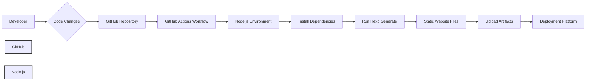

# BUSINESS POSTURE

Hexo is a static site generator designed to simplify blog creation. Its primary business priority is to provide a user-friendly, efficient, and customizable platform for individuals and organizations to publish content online.

Business Goals:
- Provide a simple and fast way to create static blogs.
- Offer a customizable and extensible platform through themes and plugins.
- Maintain an active and supportive community.
- Ensure the software is reliable and performs well.

Business Risks:
- Security vulnerabilities in the core framework or plugins could damage user websites and reputation.
- Lack of maintenance and updates could lead to software becoming outdated and insecure.
- Poor performance or complexity could drive users to alternative solutions.
- Community fragmentation or lack of support could hinder adoption and growth.

# SECURITY POSTURE

Existing Security Controls:
- security control: Dependency management using `package-lock.json` to ensure consistent dependency versions. (Implemented in repository)
- security control: Regular updates to dependencies to address known vulnerabilities. (Practiced by maintainers, visible in commit history)
- security control: Input sanitization of user-provided content within themes and plugins (Responsibility of theme and plugin developers, not explicitly enforced by core).
- accepted risk: Security vulnerabilities in user-installed themes and plugins are the responsibility of the user.
- accepted risk: Server security where the generated static site is hosted is the responsibility of the user.

Recommended Security Controls:
- security control: Implement automated security scanning (SAST/DAST) in the CI/CD pipeline for core Hexo framework.
- security control: Provide security guidelines for theme and plugin developers to encourage secure coding practices.
- security control: Establish a process for reporting and addressing security vulnerabilities in Hexo and its ecosystem.

Security Requirements:
- Authentication: Not applicable for core Hexo as it's a static site generator. Authentication is relevant for any administrative interfaces for managing Hexo configurations or plugins, which are outside the scope of the core framework itself.
- Authorization: Not applicable for core Hexo. Authorization is relevant for any administrative interfaces, which are outside the scope of the core framework itself.
- Input Validation: Hexo needs to handle various input formats (Markdown, YAML, etc.). Input validation is crucial in themes and plugins to prevent XSS and other injection attacks when rendering user-provided content. Core Hexo should ensure safe parsing of configuration and content files.
- Cryptography: Not explicitly required for core functionality of static site generation. Cryptography might be relevant for features like encrypted configuration files or secure plugin updates, which are not core features currently. HTTPS should be enforced for websites generated by Hexo, but this is deployment responsibility.

# DESIGN

## C4 CONTEXT

```mermaid
flowchart LR
    subgraph Internet
        A[User]
    end
    B[Hexo]
    C[GitHub Repository]
    D[npm Registry]
    E[Themes Repository]
    F[Plugins Repository]
    G[Deployment Platform]

    A --> B
    B --> C: Reads configuration and content
    B --> D: Downloads dependencies
    B --> E: Downloads themes
    B --> F: Downloads plugins
    B --> G: Deploys static website
    C --> B
    D --> B
    E --> B
    F --> B
    G <-- B
```

Context Diagram Elements:

- Name: User
  - Type: Person
  - Description: Individuals or organizations who use Hexo to create and manage their blogs. They interact with Hexo through command-line interface and view generated websites in web browsers.
  - Responsibilities: Create blog content, configure Hexo, choose themes and plugins, deploy generated website.
  - Security controls: Responsible for securing their local development environment and credentials used for deployment.

- Name: Hexo
  - Type: Software System
  - Description: Static site generator that takes Markdown content and configuration, applies themes and plugins, and generates a static website.
  - Responsibilities: Read configuration, parse content, apply themes and plugins, generate static HTML, CSS, and JavaScript files.
  - Security controls: Input validation during content parsing, secure dependency management, following secure coding practices.

- Name: GitHub Repository
  - Type: External System
  - Description: Hosts the source code of Hexo, issue tracking, and contribution management.
  - Responsibilities: Version control, source code management, issue tracking, pull request management.
  - Security controls: GitHub's security controls for repository access, code scanning, and vulnerability management.

- Name: npm Registry
  - Type: External System
  - Description: Public registry for Node.js packages, used to distribute Hexo and its dependencies.
  - Responsibilities: Hosting and distributing Node.js packages.
  - Security controls: npm's security controls for package integrity, malware scanning, and account security.

- Name: Themes Repository
  - Type: External System
  - Description: Repositories (often GitHub) where Hexo themes are hosted and distributed.
  - Responsibilities: Hosting and distributing Hexo themes.
  - Security controls: Security of theme repositories depends on the platform they are hosted on (e.g., GitHub). Users should choose themes from reputable sources.

- Name: Plugins Repository
  - Type: External System
  - Description: Repositories (often npm or GitHub) where Hexo plugins are hosted and distributed.
  - Responsibilities: Hosting and distributing Hexo plugins.
  - Security controls: Security of plugin repositories depends on the platform they are hosted on (e.g., npm, GitHub). Users should choose plugins from reputable sources.

- Name: Deployment Platform
  - Type: External System
  - Description: Hosting platform where the generated static website is deployed (e.g., Netlify, Vercel, AWS S3, GitHub Pages).
  - Responsibilities: Hosting and serving the static website to internet users.
  - Security controls: Security controls provided by the chosen deployment platform, including HTTPS enforcement, access control, and infrastructure security.

## C4 CONTAINER

```mermaid
flowchart LR
    subgraph User's Local Machine [User's Local Machine]
        subgraph NodeJS Environment [Node.js Environment]
            A[Hexo CLI]
            B[Hexo Core]
            C[Theme Engine]
            D[Plugin Engine]
            E[Generator]
        end
        F[Configuration Files]
        G[Content Files]
    end
    H[Static Website Files]

    A --> B: Invokes commands
    B --> C: Uses theme engine
    B --> D: Uses plugin engine
    B --> E: Uses generator
    B --> F: Reads configuration
    B --> G: Reads content
    C --> F: Reads theme configuration
    D --> F: Reads plugin configuration
    E --> G: Processes content
    E --> H: Generates static files

    style User's Local Machine fill:#f9f,stroke:#333,stroke-width:2px
    style NodeJS Environment fill:#ccf,stroke:#333,stroke-width:2px
```

Container Diagram Elements:

- Name: Hexo CLI
  - Type: Application
  - Description: Command-line interface application that users interact with to manage Hexo blogs (e.g., create new posts, generate website, deploy).
  - Responsibilities: Provide command-line interface, parse user commands, invoke Hexo core functionalities.
  - Security controls: Input validation of command-line arguments.

- Name: Hexo Core
  - Type: Library
  - Description: Core logic of Hexo, responsible for orchestrating the static site generation process.
  - Responsibilities: Manage configuration, load themes and plugins, invoke generators, handle events.
  - Security controls: Secure coding practices, input validation of configuration files, dependency management.

- Name: Theme Engine
  - Type: Library
  - Description: Renders templates using themes to generate HTML structure and styling.
  - Responsibilities: Template parsing and rendering, theme customization.
  - Security controls: Input sanitization when rendering user-provided content within templates (theme developer responsibility).

- Name: Plugin Engine
  - Type: Library
  - Description: Manages and executes plugins to extend Hexo functionality (e.g., adding new features, modifying content).
  - Responsibilities: Plugin loading and execution, plugin API management.
  - Security controls: Plugin isolation (to some extent within Node.js environment), plugin API security (plugin developer responsibility).

- Name: Generator
  - Type: Library
  - Description: Processes content files (Markdown, etc.) and generates static website files (HTML, CSS, JavaScript).
  - Responsibilities: Content parsing, Markdown rendering, static file generation.
  - Security controls: Input validation during content parsing, secure Markdown rendering.

- Name: Configuration Files
  - Type: Data Store
  - Description: YAML files that store Hexo configuration settings (e.g., site title, theme, plugins).
  - Responsibilities: Store Hexo configuration.
  - Security controls: File system permissions to protect configuration files, secure parsing of YAML files.

- Name: Content Files
  - Type: Data Store
  - Description: Markdown files that contain blog posts and pages.
  - Responsibilities: Store blog content.
  - Security controls: File system permissions to protect content files.

- Name: Static Website Files
  - Type: Data Store
  - Description: Generated HTML, CSS, JavaScript, and asset files that constitute the final static website.
  - Responsibilities: Output of the generation process, ready for deployment.
  - Security controls: File system permissions to protect generated files before deployment.

## DEPLOYMENT

Deployment Solution: Static Website Hosting on a CDN (e.g., Netlify, Vercel, Cloudflare Pages)

```mermaid
flowchart LR
    subgraph User's Local Machine [User's Local Machine]
        A[Hexo CLI]
    end
    B[Deployment Platform CLI]
    C[Git Repository]
    D[CDN Edge Network]
    E[Origin Storage (e.g., AWS S3)]
    F[Internet User]

    A --> B: Triggers deployment
    B --> C: Pushes static files
    C --> Deployment Platform: Detects changes
    Deployment Platform --> E: Stores static files
    E --> CDN Edge Network: Distributes content
    D --> F: Serves static website

    style User's Local Machine fill:#f9f,stroke:#333,stroke-width:2px
```

Deployment Diagram Elements:

- Name: Hexo CLI
  - Type: Application
  - Description: Command-line interface used by the user to trigger the deployment process.
  - Responsibilities: Initiate deployment by invoking deployment platform CLI.
  - Security controls: User authentication for deployment platform CLI.

- Name: Deployment Platform CLI
  - Type: Application
  - Description: Command-line interface provided by the deployment platform (e.g., Netlify CLI, Vercel CLI).
  - Responsibilities: Authenticate with deployment platform, upload static files, trigger deployment process.
  - Security controls: Secure authentication and authorization with deployment platform, secure file upload.

- Name: Git Repository
  - Type: Data Store
  - Description: Version control repository (e.g., GitHub, GitLab) that stores the static website files and potentially Hexo source files.
  - Responsibilities: Version control of static website files, trigger deployment pipelines on code changes.
  - Security controls: Access control to the repository, branch protection, audit logging.

- Name: CDN Edge Network
  - Type: Infrastructure
  - Description: Content Delivery Network that caches and serves the static website files to users globally.
  - Responsibilities: Caching and serving static content, DDoS protection, SSL/TLS termination.
  - Security controls: CDN provider's security controls, including DDoS protection, SSL/TLS encryption, access control.

- Name: Origin Storage (e.g., AWS S3)
  - Type: Infrastructure
  - Description: Storage service where the static website files are stored as the origin for the CDN.
  - Responsibilities: Storing static website files, providing access to CDN.
  - Security controls: Access control policies, encryption at rest, data integrity checks.

- Name: Internet User
  - Type: Person
  - Description: Users accessing the deployed static website through web browsers.
  - Responsibilities: Accessing and viewing the website.
  - Security controls: Rely on browser security and website's HTTPS configuration.

## BUILD

Build Process using GitHub Actions:



Build Diagram Elements:

- Name: Developer
  - Type: Person
  - Description: Software developer who writes code, configures Hexo, and commits changes.
  - Responsibilities: Writing code, committing changes, initiating build process through code push.
  - Security controls: Secure development environment, code review, secure coding practices.

- Name: Code Changes
  - Type: Data
  - Description: Modifications to Hexo configuration, content, themes, or plugins.
  - Responsibilities: Represent changes to the project.
  - Security controls: Version control through Git.

- Name: GitHub Repository
  - Type: Data Store
  - Description: Hosts the source code and triggers the CI/CD pipeline.
  - Responsibilities: Source code management, trigger workflow on code push.
  - Security controls: GitHub's security controls for repository access, branch protection, and workflow security.

- Name: GitHub Actions Workflow
  - Type: Application
  - Description: Automated CI/CD pipeline defined in GitHub Actions.
  - Responsibilities: Automate build, test, and deployment processes.
  - Security controls: Secure workflow definition, secrets management, access control to workflow execution.

- Name: Node.js Environment
  - Type: Environment
  - Description: Runtime environment within GitHub Actions where Hexo build process is executed.
  - Responsibilities: Provide environment to run Node.js commands, install dependencies, execute Hexo.
  - Security controls: Isolated environment provided by GitHub Actions, secure execution of build scripts.

- Name: Install Dependencies
  - Type: Process
  - Description: Step in the workflow to install Node.js dependencies using `npm install`.
  - Responsibilities: Install required npm packages.
  - Security controls: Dependency vulnerability scanning (e.g., using `npm audit`), integrity checks of downloaded packages.

- Name: Run Hexo Generate
  - Type: Process
  - Description: Step in the workflow to execute `hexo generate` command to build the static website.
  - Responsibilities: Generate static website files using Hexo.
  - Security controls: Secure execution of Hexo commands, input validation during generation.

- Name: Static Website Files
  - Type: Data
  - Description: Generated static website files produced by Hexo.
  - Responsibilities: Build artifacts to be deployed.
  - Security controls: Integrity checks of generated files.

- Name: Upload Artifacts
  - Type: Process
  - Description: Step in the workflow to upload generated static website files as artifacts.
  - Responsibilities: Package build artifacts for deployment.
  - Security controls: Secure artifact storage and transfer.

- Name: Deployment Platform
  - Type: External System
  - Description: Platform where the static website is deployed (e.g., Netlify, Vercel).
  - Responsibilities: Host and serve the static website.
  - Security controls: Deployment platform's security controls, secure deployment process.

# RISK ASSESSMENT

Critical Business Processes:
- Publishing new blog posts and updating existing content.
- Maintaining website availability and performance.
- Ensuring website security and preventing defacement or data breaches.

Data Sensitivity:
- Blog content (Markdown files): Low to Medium sensitivity. Publicly available content, but integrity is important.
- Hexo configuration files (YAML): Medium sensitivity. May contain site settings and potentially secrets if not properly managed.
- Generated static website files (HTML, CSS, JavaScript): Low sensitivity. Publicly available content.

# QUESTIONS & ASSUMPTIONS

Questions:
- Are there any specific compliance requirements (e.g., GDPR, PCI DSS) that Hexo needs to adhere to? (Assumption: No specific compliance requirements beyond general security best practices for a static website generator.)
- Are there any plans to introduce user authentication or administrative interfaces to Hexo core in the future? (Assumption: Core Hexo remains a static site generator without built-in authentication.)
- What is the process for reporting and addressing security vulnerabilities in Hexo and its ecosystem? (Assumption: Standard open-source vulnerability reporting process through GitHub issues and security advisories.)

Assumptions:
- BUSINESS POSTURE: The primary business goal is to provide a simple and efficient static site generator for blogging. Security is important for user trust and platform reliability.
- SECURITY POSTURE: Users are responsible for securing their themes, plugins, and deployment environments. Core Hexo focuses on framework security and secure dependency management. Security controls are primarily focused on preventing common web vulnerabilities in the generated static sites.
- DESIGN: Hexo follows a modular design with core, themes, and plugins. Deployment is typically to static website hosting platforms. Build process can be automated using CI/CD pipelines.