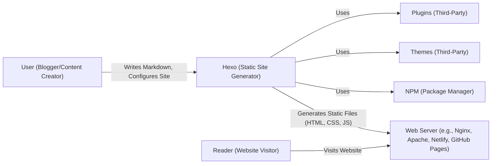
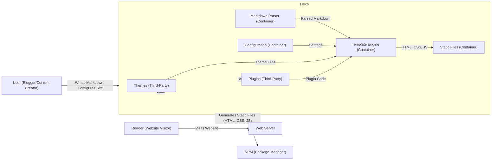
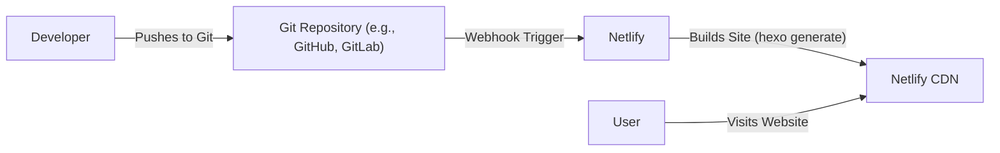

Okay, let's create a design document for the Hexo project, focusing on aspects relevant to threat modeling.

# BUSINESS POSTURE

Hexo is a static site generator.  It's primarily used by individuals and organizations to create blogs and documentation sites.  The business priorities revolve around:

*   Ease of use:  Making it simple for users, even those with limited technical expertise, to create and publish content.
*   Speed and Performance:  Generating static sites that load quickly and efficiently.
*   Extensibility:  Allowing users to customize the look and functionality of their sites through themes and plugins.
*   Community and Support:  Maintaining an active community and providing adequate documentation.
*   Reliability: Ensuring the generated sites are stable and function as expected.

Based on these priorities, the most important business risks are:

*   Compromise of the Hexo core codebase, leading to malicious code being injected into generated websites. This is a critical risk, as it could affect a large number of sites.
*   Vulnerabilities in popular themes or plugins, which could be exploited to compromise individual websites.
*   Denial of service against websites generated by Hexo (though this is more a risk for the hosting provider, it indirectly impacts Hexo's reputation).
*   Data loss or corruption due to user error or bugs in Hexo.
*   Negative impact on SEO due to poorly generated site structure or performance issues.

# SECURITY POSTURE

The following security controls and accepted risks are based on the provided GitHub repository and common practices for similar projects.

*   security control: Code Reviews: Pull requests on GitHub are subject to review before being merged. (Implemented in GitHub repository's workflow).
*   security control: Static Analysis: Some level of static analysis is likely performed, potentially through linters and basic code quality checks. (Implicit in the development process, but could be improved).
*   security control: Dependency Management: Hexo uses npm for dependency management, which includes mechanisms for tracking and updating dependencies. (Described in package.json and package-lock.json).
*   security control: Community Reporting: Vulnerabilities can be reported by the community, allowing for a response. (Implicit through GitHub Issues and community forums).
*   accepted risk: Reliance on Third-Party Themes and Plugins: Hexo's extensibility model relies heavily on third-party themes and plugins. While this provides flexibility, it also introduces a significant risk, as the security of these components is outside the direct control of the Hexo core team.
*   accepted risk: Limited Input Validation in Core: As a static site generator, Hexo's core has limited direct user input. Most input comes in the form of Markdown files and configuration settings. While Markdown parsing libraries typically handle sanitization, there's a risk of vulnerabilities in these libraries or in custom scripts.
*   accepted risk: User-Controlled Content: The content of the generated websites is entirely under the control of the user. Hexo cannot guarantee the security of the content itself.
*   accepted risk: No built-in authentication/authorization: Hexo is a static site generator, and does not have any web facing interfaces, so it does not require any authentication or authorization.

Recommended Security Controls (High Priority):

*   Implement a robust Software Composition Analysis (SCA) process to identify and track vulnerabilities in dependencies. This should include automated scanning and alerts.
*   Introduce more rigorous static analysis, including security-focused linters and SAST tools, into the CI/CD pipeline.
*   Provide clear security guidelines and best practices for theme and plugin developers.
*   Consider a bug bounty program to incentivize security researchers to find and report vulnerabilities.
*   Implement code signing for official releases to ensure integrity.

Security Requirements:

*   Authentication: Not applicable (static site generator).
*   Authorization: Not applicable (static site generator).
*   Input Validation:
    *   Markdown files should be parsed using a secure Markdown parsing library that is regularly updated to address known vulnerabilities.
    *   Configuration files should be validated to ensure they conform to expected formats and do not contain malicious values.
    *   Theme and plugin inputs (if any) should be carefully validated, although this is primarily the responsibility of the theme/plugin developer.
*   Cryptography:
    *   If Hexo is used to generate content that includes sensitive information (which is generally discouraged for static sites), users should be advised to use HTTPS for their hosting.
    *   Any cryptographic operations performed by Hexo (e.g., generating hashes for assets) should use strong, well-established algorithms.

# DESIGN

## C4 CONTEXT

C4 CONTEXT Elements Description:

*   1.  Name: User (Blogger/Content Creator)
    *   Type: Person
    *   Description: The person who uses Hexo to create and manage their website content.
    *   Responsibilities: Writes content in Markdown, configures the site settings, chooses themes and plugins, and deploys the generated site.
    *   Security controls: None directly implemented by Hexo. Relies on user's own security practices.

*   2.  Name: Hexo (Static Site Generator)
    *   Type: Software System
    *   Description: The core Hexo application, which takes Markdown files and configuration as input and generates static HTML, CSS, and JavaScript files.
    *   Responsibilities: Parsing Markdown, processing configuration, applying themes and plugins, generating static files.
    *   Security controls: Code reviews, dependency management, (limited) input validation.

*   3.  Name: Web Server (e.g., Nginx, Apache, Netlify, GitHub Pages)
    *   Type: Software System
    *   Description: The server that hosts the static files generated by Hexo and serves them to website visitors.
    *   Responsibilities: Serving static files, handling HTTP requests, potentially providing HTTPS.
    *   Security controls: Managed by the hosting provider. Should include HTTPS, WAF, DDoS protection, etc.

*   4.  Name: Reader (Website Visitor)
    *   Type: Person
    *   Description: The person who visits the website generated by Hexo.
    *   Responsibilities: Browsing the website content.
    *   Security controls: None directly implemented by Hexo. Relies on browser security and the security of the web server.

*   5.  Name: NPM (Package Manager)
    *   Type: Software System
    *   Description: The Node.js package manager, used to manage Hexo's dependencies.
    *   Responsibilities: Providing and updating dependencies.
    *   Security controls: Package signing, vulnerability scanning (by npm itself).

*   6.  Name: Themes (Third-Party)
    *   Type: Software System
    *   Description: Themes that provide the visual design and layout of the generated website.
    *   Responsibilities: Defining the look and feel of the site.
    *   Security controls: Largely the responsibility of the theme developer. Hexo core team has limited control.

*   7.  Name: Plugins (Third-Party)
    *   Type: Software System
    *   Description: Plugins that extend the functionality of Hexo.
    *   Responsibilities: Adding features and capabilities to Hexo.
    *   Security controls: Largely the responsibility of the plugin developer. Hexo core team has limited control.

## C4 CONTAINER

In this case, Hexo is relatively simple, so the container diagram is essentially an extension of the context diagram.

C4 CONTAINER Elements Description:

*   1.  Name: Markdown Parser
    *   Type: Container
    *   Description: Component responsible for parsing Markdown files.
    *   Responsibilities: Converting Markdown to HTML.
    *   Security controls: Use of a secure, up-to-date Markdown parsing library.

*   2.  Name: Template Engine
    *   Type: Container
    *   Description: Component that combines parsed Markdown with theme templates and configuration settings to generate the final HTML.
    *   Responsibilities: Applying themes, executing plugins, generating output.
    *   Security controls: Input validation (of configuration and plugin outputs), secure handling of theme templates.

*   3.  Name: Configuration
    *   Type: Container
    *   Description: Stores the site's configuration settings.
    *   Responsibilities: Providing configuration data to the template engine.
    *   Security controls: Validation of configuration values.

*   4.  Name: Static Files
    *   Type: Container
    *   Description: The generated HTML, CSS, JavaScript, and other static assets.
    *   Responsibilities: Representing the website content.
    *   Security controls: None directly. Security relies on the web server and the content itself.

*   5. Name: Themes
    *   Type: Software System
    *   Description: Themes that provide the visual design and layout of the generated website.
    *   Responsibilities: Defining the look and feel of the site.
    *   Security controls: Largely the responsibility of the theme developer. Hexo core team has limited control.

*   6. Name: Plugins
    *   Type: Software System
    *   Description: Plugins that extend the functionality of Hexo.
    *   Responsibilities: Adding features and capabilities to Hexo.
    *   Security controls: Largely the responsibility of the plugin developer. Hexo core team has limited control.

*   7. Name: NPM
    *   Type: Software System
    *   Description: The Node.js package manager, used to manage Hexo's dependencies.
    *   Responsibilities: Providing and updating dependencies.
    *   Security controls: Package signing, vulnerability scanning (by npm itself).

*   8. Name: User
    *   Type: Person
    *   Description: The person who uses Hexo to create and manage their website content.
    *   Responsibilities: Writes content in Markdown, configures the site settings, chooses themes and plugins, and deploys the generated site.
    *   Security controls: None directly implemented by Hexo. Relies on user's own security practices.

*   9. Name: Web Server
    *   Type: Software System
    *   Description: The server that hosts the static files generated by Hexo and serves them to website visitors.
    *   Responsibilities: Serving static files, handling HTTP requests, potentially providing HTTPS.
    *   Security controls: Managed by the hosting provider. Should include HTTPS, WAF, DDoS protection, etc.

*   10. Name: Reader
    *   Type: Person
    *   Description: The person who visits the website generated by Hexo.
    *   Responsibilities: Browsing the website content.
    *   Security controls: None directly implemented by Hexo. Relies on browser security and the security of the web server.

## DEPLOYMENT

Hexo generates static files, which can be deployed to a variety of hosting environments.  Here are some common options:

1.  **Static Hosting Services:** Netlify, Vercel, AWS Amplify, GitHub Pages, Cloudflare Pages. These services are specifically designed for hosting static sites and offer features like automatic deployments from Git repositories, CDN integration, and HTTPS.
2.  **Traditional Web Servers:** Apache, Nginx.  The static files can be copied to a directory on a server running a traditional web server.
3.  **Cloud Storage:** AWS S3, Google Cloud Storage, Azure Blob Storage.  These services can be configured to serve static websites directly from object storage.

We'll describe deployment to **Netlify** as a representative example, as it's a popular and well-integrated option.

DEPLOYMENT Elements Description:

*   1.  Name: Developer
    *   Type: Person
    *   Description: The person who develops and deploys the Hexo site.
    *   Responsibilities: Writing code, committing changes, pushing to the Git repository.
    *   Security controls: Uses secure coding practices, strong authentication to the Git repository.

*   2.  Name: Git Repository (e.g., GitHub, GitLab)
    *   Type: Software System
    *   Description: The repository that stores the Hexo source code.
    *   Responsibilities: Version control, collaboration, triggering deployments.
    *   Security controls: Access controls, branch protection rules, potentially code scanning.

*   3.  Name: Netlify
    *   Type: Software System
    *   Description: The static site hosting platform.
    *   Responsibilities: Building the site, deploying to CDN, providing HTTPS.
    *   Security controls: Automated builds, HTTPS by default, DDoS protection, WAF (optional).

*   4.  Name: Netlify CDN
    *   Type: Software System
    *   Description: Netlify's Content Delivery Network.
    *   Responsibilities: Serving the static files to users globally.
    *   Security controls: DDoS protection, caching, edge security features.

*   5. Name: User
    *   Type: Person
    *   Description: The person who visits the website.
    *   Responsibilities: Browsing the website content.
    *   Security controls: Relies on browser security and the security of the hosting platform.

## BUILD

Hexo's build process is relatively simple.  It primarily involves running the `hexo generate` command, which processes the Markdown files, applies the theme and plugins, and outputs the static files.  While there isn't a complex CI/CD pipeline in the core Hexo repository (as it's a tool, not a continuously deployed application), a user *would* typically use a CI/CD system for their *own* Hexo site.

Here's a description of a typical build process, including security considerations:

1.  **Developer writes code:** The developer creates or modifies Markdown files, configuration files, theme files, or plugin files.
2.  **Commit and Push:** The developer commits the changes to a local Git repository and pushes them to a remote repository (e.g., GitHub, GitLab).
3.  **CI/CD Trigger (User's Site):** A CI/CD system (e.g., Netlify, GitHub Actions, Jenkins) is triggered by the push to the remote repository.
4.  **Environment Setup:** The CI/CD environment is set up, typically involving a clean container or virtual machine.
5.  **Dependency Installation:**  `npm install` is run to install Hexo and its dependencies, including themes and plugins.
    *   **Security Control:**  Use of `npm ci` is recommended for reproducible builds and to prevent unexpected dependency updates.
    *   **Security Control:**  SCA tools (e.g., `npm audit`, Snyk, Dependabot) should be run to check for known vulnerabilities in dependencies.
6.  **Site Generation:** The `hexo generate` command is executed.
    *   **Security Control:**  Linters (e.g., ESLint, Markdownlint) can be run to check for code quality and potential security issues in theme and plugin code.
    *   **Security Control:**  If custom scripts are used, they should be carefully reviewed for security vulnerabilities.
7.  **Artifact Creation:** The generated static files (HTML, CSS, JS) are collected as build artifacts.
8.  **Deployment:** The build artifacts are deployed to the target environment (e.g., Netlify, AWS S3).

```mermaid
graph LR
    Developer["Developer"] -- "Writes Code" --> LocalGit["Local Git Repository"]
    LocalGit -- "Commit & Push" --> RemoteGit["Remote Git Repository (e.g., GitHub)"]
    RemoteGit -- "Webhook Trigger" --> CI_CD["CI/CD System (e.g., Netlify, GitHub Actions)"]
    CI_CD -- "Setup Environment" --> DependencyInstall["Dependency Installation (npm install/ci)"]
    DependencyInstall -- "Install Dependencies" --> SCA["Software Composition Analysis (npm audit, Snyk)"]
    SCA -- "Check for Vulnerabilities" --> SiteGeneration["Site Generation (hexo generate)"]
    SiteGeneration -- "Run Linters" --> Linters["Linters (ESLint, Markdownlint)"]
    Linters -- "Check Code Quality" --> SiteGeneration
    SiteGeneration -- "Generate Static Files" --> ArtifactCreation["Artifact Creation"]
    ArtifactCreation -- "Collect Artifacts" --> Deployment["Deployment (to Netlify, S3, etc.)"]
```

# RISK ASSESSMENT

*   **Critical Business Processes:**
    *   Website availability and performance: Ensuring that websites generated by Hexo are accessible and load quickly.
    *   Content integrity: Protecting the content of websites from unauthorized modification or corruption.
    *   Reputation: Maintaining the trust and confidence of users and the broader community.

*   **Data Sensitivity:**
    *   Source Code (Markdown files, configuration, themes, plugins): Generally not highly sensitive, but could contain credentials or API keys if users are not careful.
    *   Generated Static Files (HTML, CSS, JS): Publicly accessible by design. Sensitivity depends on the content of the website.
    *   Dependencies: The list of dependencies (package.json, package-lock.json) is not sensitive, but vulnerabilities in dependencies *are* a significant risk.

# QUESTIONS & ASSUMPTIONS

*   **Questions:**
    *   What is the current process for handling security vulnerability reports in Hexo and its dependencies?
    *   Are there any plans to implement more robust security testing (e.g., SAST, DAST) in the future?
    *   What is the level of security awareness and training among core contributors and maintainers?
    *   What mechanisms are in place to monitor for and respond to potential security incidents affecting Hexo-generated websites?

*   **Assumptions:**
    *   BUSINESS POSTURE: We assume that the primary users of Hexo are individuals and small organizations who prioritize ease of use and cost-effectiveness over enterprise-grade security features.
    *   SECURITY POSTURE: We assume that the Hexo core team relies primarily on community contributions and manual code reviews for security, with limited automated security testing.
    *   DESIGN: We assume that most Hexo users deploy their sites to static hosting platforms like Netlify or GitHub Pages, rather than managing their own web servers. We assume users are using CI environments to build and deploy their websites.