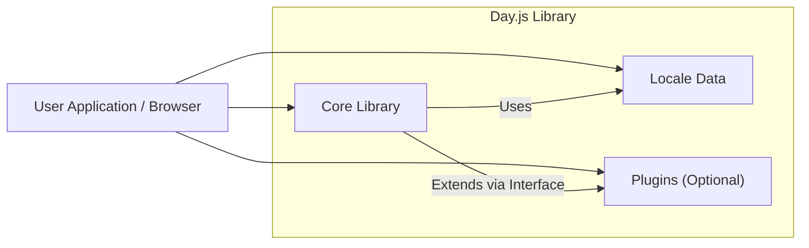
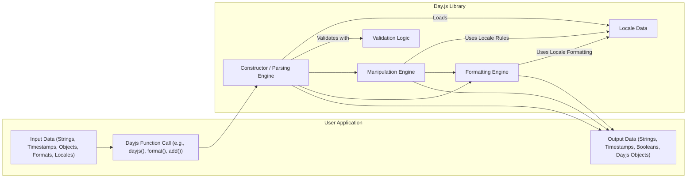

# Project Design Document: Day.js

**Version:** 1.1
**Date:** October 26, 2023
**Author:** AI Software Architect

## 1. Introduction

This document provides an enhanced design overview of the Day.js JavaScript library, intended to facilitate comprehensive threat modeling and security analysis. Building upon the previous version, this document offers more granular detail regarding the system's architecture, data flow, and key components. The aim is to provide a robust foundation for understanding the library's functionality and potential vulnerability points.

Day.js is a lightweight JavaScript library for modern browsers that offers functionalities for parsing, validating, manipulating, and displaying dates and times. Its API is largely compatible with Moment.js, making it a popular and easily adoptable alternative.

## 2. Goals and Objectives

The primary goal of this document remains to provide a detailed architectural understanding of Day.js to enable effective threat modeling. Specific objectives have been refined to include:

*   Clearly outlining the major components and their interactions with greater granularity.
*   Mapping the flow of data through the library, including specific examples for key operations.
*   Identifying potential attack surfaces and security considerations with more concrete examples.
*   Providing sufficient detail for security analysts to understand the system's internals without requiring deep code analysis, emphasizing aspects relevant to security.
*   Illustrating how different sections of this document contribute to the threat modeling process.

## 3. System Architecture

Day.js is primarily a client-side JavaScript library, with its core functionality centered around the manipulation and formatting of date and time information.

### 3.1. Major Components

*   **Core Library:** The central part of Day.js, containing the fundamental logic. It can be further broken down into:
    *   **Instantiation and Parsing Engine:** Responsible for creating `Dayjs` instances from various inputs and parsing date/time strings. This includes handling different formats and locale-specific rules.
    *   **Validation Logic:** Ensures the validity of date and time components during parsing and manipulation.
    *   **Getters and Setters:** Methods for accessing and modifying individual date and time components of a `Dayjs` object.
    *   **Manipulation Engine:** Functions for performing date and time arithmetic, such as adding or subtracting time units.
    *   **Formatting Engine:** Logic for converting `Dayjs` objects into string representations based on specified format patterns and locale settings.
    *   **Comparison Logic:** Methods for comparing `Dayjs` instances (e.g., `isBefore`, `isAfter`, `isSame`).
    *   **Locale Management:**  Handles loading, storing, and applying locale-specific data.
    *   **Plugin Interface:**  Defines the mechanism for extending Day.js functionality through plugins.

*   **Locale Data:** JSON files containing language and region-specific information for date and time formatting, including:
    *   Month and day names (in various forms).
    *   Ordinal rules.
    *   Date and time format patterns.
    *   Relative time strings.

*   **Plugins:** Optional extensions that enhance Day.js with specific features:
    *   Examples include plugins for timezone support, relative time display, duration calculations, and advanced formatting options.
    *   Plugins typically add methods to the `Dayjs` prototype.

### 3.2. High-Level Architecture Diagram

## 4. Data Flow

The primary data flow within Day.js involves the processing of date and time information through instantiation, manipulation, and formatting.

### 4.1. Input Data

*   **Date/Time Strings:** Strings representing dates and times in various formats (e.g., ISO 8601, custom formats).
*   **Unix Timestamps (Milliseconds or Seconds):** Numerical representation of a point in time.
*   **JavaScript `Date` Objects:** Native JavaScript date objects.
*   **Object Literals:** Objects containing date and time components (e.g., `{ year: 2023, month: 10, day: 26 }`).
*   **`Dayjs` Objects:** Existing `Dayjs` instances for cloning or manipulation.
*   **Locale Identifiers:** Strings specifying the desired locale (e.g., 'en-US', 'fr-CA').
*   **Format Strings:** Strings defining the desired output format for dates and times (e.g., 'YYYY-MM-DD', 'MMMM D, YYYY').
*   **Configuration Options:**  Settings passed during instantiation or through configuration methods (e.g., strict parsing mode).

### 4.2. Processing - Example: Parsing a Date String

1. **Input:** A date string and an optional format string and locale identifier are passed to the `dayjs()` constructor.
2. **Locale Loading:** The specified locale data (or the default locale) is loaded.
3. **Format Determination:** If a format string is provided, it's used. Otherwise, Day.js attempts to parse the string based on common formats and locale-specific patterns.
4. **Tokenization:** The format string (if provided) is broken down into tokens representing date and time components.
5. **String Matching:** The input string is matched against the tokens, extracting potential date and time values.
6. **Validation:** Extracted values are validated against valid ranges (e.g., month between 1 and 12, day within the month's range). Locale-specific validation rules may apply.
7. **`Dayjs` Instance Creation:** If parsing is successful, a new `Dayjs` object is created, storing the parsed date and time information internally (often as a Unix timestamp).

### 4.3. Output Data

*   **Formatted Date/Time Strings:** Strings representing dates and times in the specified format, localized according to the current locale.
*   **Unix Timestamps (Milliseconds):** Numerical representation of the `Dayjs` object's time.
*   **JavaScript `Date` Objects:** Conversion to native JavaScript `Date` objects using the `toDate()` method.
*   **Boolean Values:** Results of comparison operations (e.g., `isBefore()`, `isAfter()`, `isSame()`).
*   **Numerical Values:** Extracted date and time components (e.g., `year()`, `month()`, `date()`, `hour()`).
*   **`Dayjs` Objects:** New `Dayjs` instances resulting from manipulation operations (e.g., `add()`, `subtract()`).

### 4.4. Data Flow Diagram

## 5. Key Security Considerations (for Threat Modeling)

This section highlights potential security considerations, directly contributing to the threat modeling process by identifying attack surfaces and potential vulnerabilities.

*   **Input Validation Vulnerabilities:** Exploitable during the parsing and instantiation phase.
    *   **Malicious Format Strings:** Attackers might provide crafted format strings that exploit parsing logic flaws, potentially leading to unexpected behavior, errors, or even denial of service. For example, overly complex or deeply nested format strings could exhaust resources.
    *   **Invalid Date/Time Strings:**  Submitting intentionally invalid date/time strings could expose vulnerabilities in the validation logic, potentially causing errors that could be leveraged for further attacks or information disclosure.
    *   **Locale Injection/Manipulation:** If the application allows users to specify locales, an attacker could try to inject or manipulate locale data (if not properly handled server-side before being passed to Day.js), potentially leading to incorrect formatting or even cross-site scripting if the output is not properly sanitized by the consuming application.

*   **Prototype Pollution:** A common risk in JavaScript libraries.
    *   Malicious code could attempt to modify the prototypes of core JavaScript objects (`Object.prototype`, `Array.prototype`) or the `Dayjs.prototype`. This could have far-reaching consequences, affecting the behavior of other parts of the application that rely on these prototypes.

*   **Dependency Vulnerabilities (Primarily through Plugins):**
    *   While Day.js core has minimal dependencies, plugins can introduce their own. These dependencies might have known vulnerabilities. Regularly auditing the dependencies of any used plugins is crucial.

*   **Regular Expression Denial of Service (ReDoS):**  A risk in parsing and formatting logic.
    *   Inefficient regular expressions used in parsing or formatting could be exploited by providing specially crafted input strings that cause the regex engine to backtrack excessively, leading to significant CPU usage and potentially a denial of service.

*   **Time Zone Handling Issues:**
    *   Incorrect handling of time zones, especially in plugins that deal with time zone conversions, can lead to logical errors and inconsistencies. This could have security implications depending on how date and time information is used within the application (e.g., access control based on time).

*   **Cross-Site Scripting (XSS) via Locale Data (Mitigation Required in Consuming Application):**
    *   Although Day.js itself doesn't directly render output to the DOM, if locale data contains malicious strings and the consuming application directly renders formatted output without proper sanitization, it could lead to XSS vulnerabilities. This highlights the importance of output encoding in the application using Day.js.

## 6. Dependencies

Understanding the dependencies is crucial for a complete security assessment.

*   **Core Library:** Day.js core is designed to be dependency-free.
*   **Plugins:** Each plugin may have its own set of dependencies. It's essential to review the `package.json` file of each used plugin to identify and assess their dependencies for potential vulnerabilities. Examples of common plugin dependencies might include libraries for IANA timezone data.

## 7. Deployment Considerations

The deployment environment impacts the security considerations.

*   **Client-Side (Browser):**
    *   The primary concern is protecting the user's browser environment. Ensure Day.js and its plugins are loaded from trusted sources (e.g., using a Content Delivery Network (CDN) with Subresource Integrity (SRI) checks or bundling with the application).
    *   Be mindful of the potential for prototype pollution attacks originating from other scripts running on the same page.

*   **Server-Side (Node.js):**
    *   Security considerations extend to protecting the server environment. Keep Day.js and its plugins updated to patch any known vulnerabilities.
    *   Be cautious about accepting user-provided format strings or locale identifiers directly without proper validation and sanitization to prevent potential ReDoS or other input validation attacks.

## 8. Conclusion

This enhanced design document provides a more detailed architectural overview of the Day.js library, specifically focusing on aspects relevant to security and threat modeling. By elaborating on the components, data flow, and potential security considerations with concrete examples, this document aims to equip security analysts with the necessary information for a comprehensive security assessment. The breakdown of the core library and the detailed data flow examples should provide a clearer understanding of potential attack vectors. Remember that a thorough threat model should consider the specific context in which Day.js is being used within an application.
