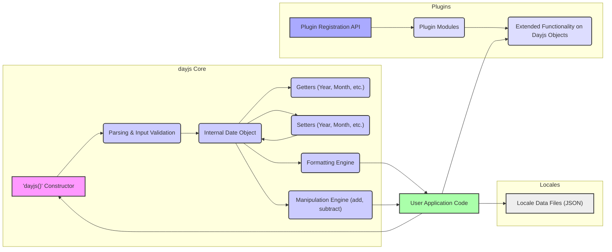
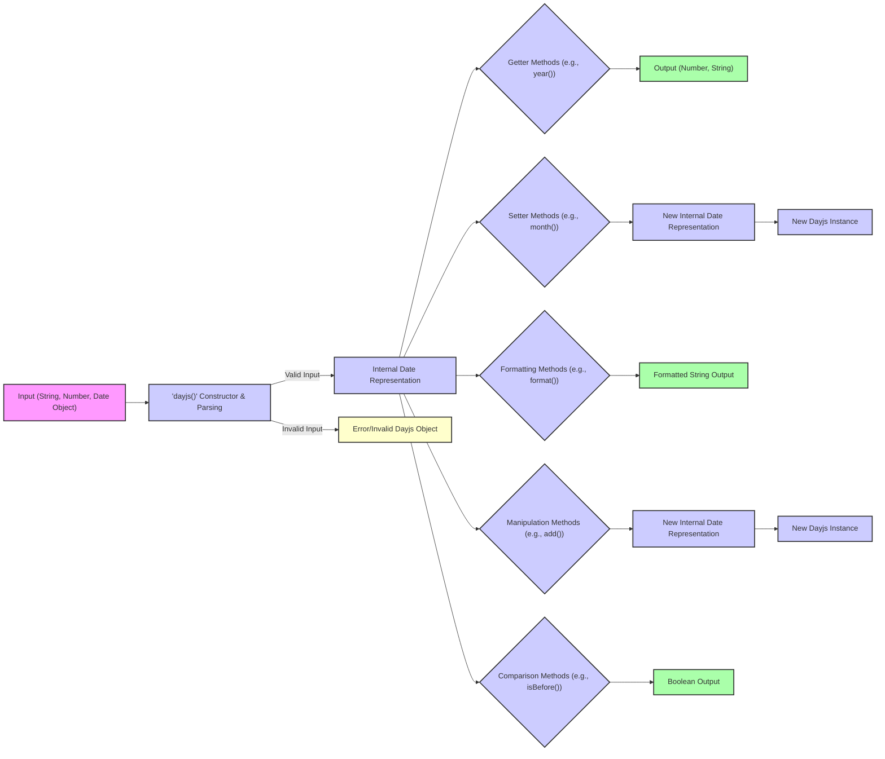

# Project Design Document: dayjs Library

**Version:** 1.1
**Date:** October 26, 2023
**Author:** AI Software Architect

## 1. Introduction

This document provides a detailed architectural design of the `dayjs` JavaScript library. This design will serve as the foundation for subsequent threat modeling activities, allowing for a comprehensive understanding of the system's components, data flow, and potential vulnerabilities. `dayjs` is a minimalist JavaScript library that parses, validates, manipulates, and displays dates and times for modern browsers with a largely Moment.js-compatible API. This document aims to provide sufficient detail for security analysis and threat identification.

## 2. Project Goals

* Provide a lightweight and immutable date/time manipulation library for JavaScript environments.
* Offer an API that is largely compatible with Moment.js to facilitate easier migration for existing projects.
* Support internationalization through a flexible locale system.
* Be easily extensible through a well-defined plugin architecture.
* Maintain a small bundle size to minimize impact on web application performance.

## 3. Non-Goals

* Providing comprehensive and built-in timezone handling within the core library. Timezone support is intended to be managed through optional plugins.
* Implementing every single feature and API method available in the Moment.js library.
* Directly managing or interacting with external services, databases, or network resources. `dayjs` focuses solely on in-memory date and time manipulation.

## 4. System Architecture

The `dayjs` library employs a modular architecture, separating core functionalities from optional extensions provided by plugins and locale data.

### 4.1. Core Functionality

The core of `dayjs` provides the essential mechanisms for date and time representation and manipulation.

*   **`dayjs()` Constructor:** The primary function used to create `dayjs` instances. It accepts various input types for date and time initialization.
*   **Parsing & Input Validation:** This component is responsible for converting input (strings, numbers, Date objects) into a consistent internal representation. It includes validation logic to ensure the input represents a valid date and time.
*   **Internal Date Object:**  A private object within each `dayjs` instance that holds the date and time information. The specific structure of this object is an implementation detail but conceptually stores year, month, day, hour, minute, second, and millisecond.
*   **Getters (Year, Month, etc.):** Methods that provide read-only access to the individual components of the internal date object (e.g., `year()`, `month()`, `date()`).
*   **Setters (Year, Month, etc.):** Methods that allow modification of the individual components of the internal date object, returning a new `dayjs` instance due to immutability (e.g., `year(2024)`, `month(0)`).
*   **Formatting Engine:**  Responsible for converting the internal date object into human-readable strings based on specified format patterns and the currently active locale.
*   **Manipulation Engine (add, subtract):**  Implements methods for performing date and time arithmetic, such as adding or subtracting days, months, years, etc. These methods also adhere to immutability, returning new `dayjs` instances.

### 4.2. Plugin System

The plugin system allows extending the core functionality of `dayjs` with optional features.

*   **Plugin Registration API:**  The `dayjs.extend()` method provides the interface for registering plugin modules.
*   **Plugin Modules:**  JavaScript modules that contain functions to extend the `dayjs` prototype or add static methods to the `dayjs` constructor.
*   **Extended Functionality on Dayjs Objects:** Plugins can add new methods to `dayjs` instances (e.g., timezone conversion, relative time calculations).

### 4.3. Locales

Internationalization is handled through separate locale data files.

*   **Locale Data Files (JSON):** JSON files containing language-specific formatting rules, month and day names, ordinal functions, and other localization data.
*   **Locale Switching Mechanism:**  Functions to set and switch the currently active locale, influencing the output of formatting methods.

### 4.4. User Application Code

This represents the external code that utilizes the `dayjs` library.

*   **Integration:** User applications import and instantiate `dayjs` objects to perform date and time operations within their logic.

## 5. Data Flow

The flow of data within `dayjs` typically follows these stages:

*   **Input:** Date and time data enters the library through the `dayjs()` constructor in various formats.
*   **`dayjs()` Constructor & Parsing:** The constructor attempts to parse the input into a valid date and time.
*   **Internal Date Representation:** Upon successful parsing, the data is stored in the internal date object.
*   **Getter Methods:**  Retrieve specific parts of the date and time information.
*   **Setter Methods:** Create new `dayjs` instances with modified date and time components.
*   **Formatting Methods:** Transform the internal date representation into formatted strings, potentially influenced by the active locale.
*   **Manipulation Methods:** Perform date and time arithmetic, resulting in new `dayjs` instances.
*   **Comparison Methods:** Compare `dayjs` instances, producing boolean results.
*   **Output:** The library returns processed data as numbers, strings, or boolean values to the user application.
*   **Error/Invalid Dayjs Object:** If parsing fails, an error might be thrown, or an "invalid" `dayjs` object might be created.

## 6. Key Components

*   **`dayjs()` Constructor and Parser:**  The core entry point and the logic responsible for interpreting various input formats (ISO 8601 strings, timestamps, native `Date` objects, etc.) and validating them. This includes regular expressions and conditional logic.
*   **Internal Date Storage Mechanism:** The specific way date and time components are stored internally within a `dayjs` object. Understanding the data types and structure is crucial for identifying potential overflow or underflow issues.
*   **Formatting Engine:**  The logic that translates the internal date representation into formatted strings. This involves pattern matching, locale-specific data lookup, and string concatenation.
*   **Manipulation Logic (Add/Subtract):**  The algorithms used to perform date and time arithmetic, taking into account complexities like leap years and varying month lengths.
*   **Comparison Logic:**  The implementation of methods for comparing `dayjs` instances, ensuring accurate comparisons across different date and time values.
*   **Plugin Registration and Management:** The API and internal mechanisms for registering and invoking plugin functionalities. This includes how plugins interact with the core `dayjs` object and its prototype.
*   **Locale Data Structures and Management:**  The format and organization of locale data files and the logic for loading and applying the correct locale settings.
*   **Immutability Implementation:** The mechanisms that ensure all manipulation methods return new `dayjs` instances, preventing unintended side effects.

## 7. Security Considerations

This section details potential security considerations relevant to `dayjs`, which will be the focus of subsequent threat modeling.

*   **Input Validation Vulnerabilities:**
    *   **Malformed Input Strings:**  Insufficient validation of input strings passed to the `dayjs()` constructor could lead to unexpected behavior, errors, or even denial-of-service if parsing logic is inefficient or vulnerable to ReDoS (Regular Expression Denial of Service).
    *   **Type Coercion Issues:**  Unexpected type coercion during parsing could lead to incorrect date interpretation or vulnerabilities.
*   **Plugin Security Risks:**
    *   **Malicious Plugins:**  If users include untrusted or malicious plugins, these plugins could execute arbitrary code within the application's context, leading to data breaches, cross-site scripting (XSS), or other security issues.
    *   **Plugin Conflicts:**  Conflicting or poorly written plugins could interfere with the core functionality of `dayjs` or introduce vulnerabilities.
    *   **Prototype Pollution via Plugins:** Plugins might inadvertently or intentionally pollute the `dayjs` prototype or built-in object prototypes, leading to application-wide vulnerabilities.
*   **Locale Data Injection Attacks:**
    *   If locale data is loaded from untrusted sources (e.g., user-provided data or external APIs without proper sanitization), malicious actors could inject code or manipulate formatting rules to cause XSS or other issues when formatting dates.
*   **Regular Expression Denial of Service (ReDoS):**
    *   The parsing and formatting engines heavily rely on regular expressions. Complex or poorly written regex patterns could be vulnerable to ReDoS attacks, where specially crafted input strings cause excessive CPU consumption, leading to denial of service.
*   **Integer Overflow/Underflow:**
    *   During date manipulation (especially when adding or subtracting large time units), there's a potential for integer overflow or underflow if the internal date representation uses fixed-size integers. This could lead to incorrect date calculations or unexpected behavior.
*   **Time Zone Handling Vulnerabilities (Plugin-Dependent):**
    *   Since timezone support is primarily handled by plugins, the security of timezone-related operations depends entirely on the security of the specific timezone plugin being used. Vulnerabilities in these plugins could lead to incorrect time conversions or security breaches.
*   **Dependency Chain Vulnerabilities:**
    *   While `dayjs` aims for minimal dependencies, any transitive dependencies could introduce vulnerabilities. Regular security audits of the dependency tree are necessary.
*   **Cross-Site Scripting (XSS) via Formatting:**
    *   If user-provided format strings are not properly sanitized before being used by the formatting engine, it might be possible to inject malicious scripts that could be executed in the user's browser.

## 8. Future Considerations

*   Explore further modularization of the core library to allow for even smaller bundle sizes and reduced attack surface.
*   Implement more robust security testing practices, including fuzzing and static analysis, to proactively identify potential vulnerabilities.
*   Develop and publish clear guidelines and security best practices for plugin developers to minimize the risk of introducing vulnerabilities through extensions.
*   Investigate mechanisms for verifying the integrity and authenticity of locale data to mitigate locale data injection attacks.
*   Consider adopting a Content Security Policy (CSP) friendly approach and documenting any potential CSP implications for applications using `dayjs`.
*   Regularly review and update dependencies to address known vulnerabilities.

This detailed design document provides a solid foundation for conducting a thorough threat model of the `dayjs` library. The identified components, data flows, and security considerations will be used to systematically identify potential threats and vulnerabilities within the system.