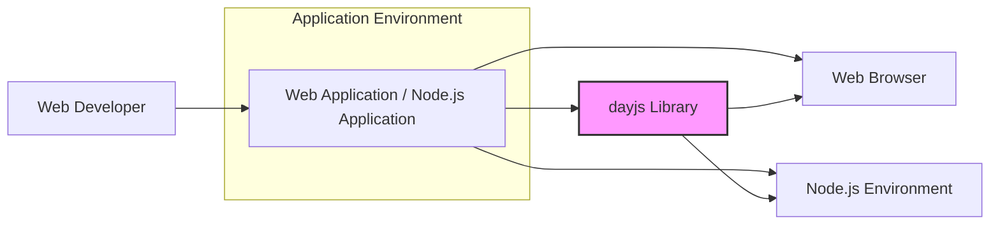
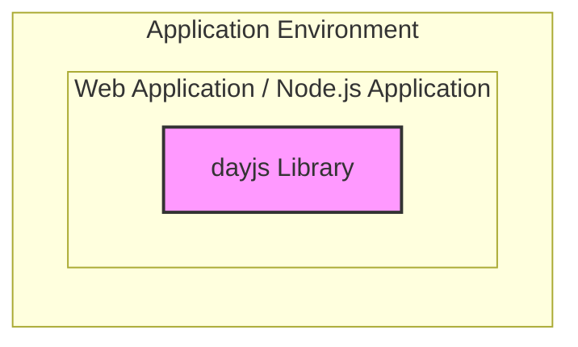

# BUSINESS POSTURE

This project, dayjs, aims to provide a minimalist JavaScript library that parses, validates, manipulates, and formats dates, offering a Moment.js-compatible API as a lighter alternative for modern browsers.

* Business Priorities:
    * Provide a lightweight and performant date manipulation library for JavaScript environments.
    * Maintain a high degree of compatibility with the Moment.js API to ease migration for existing projects.
    * Ensure ease of use and integration for web developers.

* Business Goals:
    * Become a widely adopted replacement for Moment.js in projects where bundle size and performance are critical.
    * Grow a strong community of users and contributors.
    * Offer a reliable and well-documented date/time library.

* Business Risks:
    * Risk of security vulnerabilities in the library that could be exploited in applications using dayjs.
    * Risk of incompatibility issues with Moment.js API, leading to integration challenges and developer dissatisfaction.
    * Risk of performance regressions or inefficiencies that could negate the benefits of a lightweight library.
    * Risk of insufficient community support or maintenance, leading to stagnation and security vulnerabilities not being addressed promptly.

# SECURITY POSTURE

* Security Control: Repository hosted on GitHub, leveraging GitHub's security features for access control and vulnerability scanning. Implemented by: GitHub platform.
* Security Control: Open-source project, allowing for community review and contribution to identify and fix security issues. Implemented by: Open Source nature of the project.
* Accepted Risk: Potential vulnerabilities in third-party dependencies used by dayjs.
* Accepted Risk: Risk of developers misusing the library in ways that introduce security vulnerabilities in their applications.

* Recommended Security Controls:
    * Security Control: Implement automated dependency scanning to identify and address vulnerabilities in third-party libraries.
    * Security Control: Conduct regular security audits and code reviews, focusing on potential vulnerabilities related to date parsing and manipulation.
    * Security Control: Provide clear security guidelines and best practices in the documentation for developers using dayjs, especially regarding input validation and handling of date formats from untrusted sources.

* Security Requirements:
    * Authentication: Not applicable for a JavaScript library. Dayjs itself does not handle authentication. Applications using dayjs will manage their own authentication.
    * Authorization: Not applicable for a JavaScript library. Dayjs itself does not handle authorization. Applications using dayjs will manage their own authorization.
    * Input Validation: Dayjs must robustly validate date inputs from various sources to prevent unexpected behavior or vulnerabilities due to malformed or malicious input strings. This is critical for parsing dates from user input or external APIs.
    * Cryptography: Cryptography is not a primary requirement for dayjs. However, if dayjs were to handle time zone data that is sensitive, cryptographic measures to ensure integrity and authenticity of time zone data might be considered. Currently, this is not a direct requirement.

# DESIGN

## C4 CONTEXT



* Context Diagram Elements:
    * Element:
        * Name: Web Developer
        * Type: User
        * Description: Software developers who use dayjs library to implement date and time functionality in their web or Node.js applications.
        * Responsibilities: Integrate dayjs into their projects, use dayjs API to manipulate dates and times, and ensure proper handling of date inputs and outputs in their applications.
        * Security Controls: Responsible for using dayjs securely within their applications, including validating inputs and handling potential errors.

    * Element:
        * Name: Web Application / Node.js Application
        * Type: Software System
        * Description: Applications built by web developers that utilize the dayjs library for date and time operations. These applications can run in web browsers or Node.js environments.
        * Responsibilities: Provide date and time related features to end-users, process date inputs, and display formatted dates and times.
        * Security Controls: Implement input validation for date inputs received from users or external sources, handle date and time data securely, and protect against vulnerabilities in dependencies, including dayjs.

    * Element:
        * Name: dayjs Library
        * Type: Software System
        * Description: The dayjs JavaScript library itself, providing date and time manipulation functionalities.
        * Responsibilities: Parse, validate, manipulate, and format dates and times according to the API. Provide a lightweight and efficient alternative to Moment.js.
        * Security Controls: Ensure the library is free from vulnerabilities, implement robust input validation internally, and provide secure and reliable date/time operations.

    * Element:
        * Name: Web Browser
        * Type: Environment
        * Description: The web browser environment where web applications using dayjs are executed on the client-side.
        * Responsibilities: Execute JavaScript code, including dayjs library, and render web applications.
        * Security Controls: Web browser security features, such as sandboxing and Content Security Policy (CSP), protect against malicious scripts and cross-site scripting (XSS) attacks.

    * Element:
        * Name: Node.js Environment
        * Type: Environment
        * Description: The Node.js runtime environment where server-side JavaScript applications using dayjs are executed.
        * Responsibilities: Execute JavaScript code, including dayjs library, and provide server-side functionalities.
        * Security Controls: Node.js environment security practices, including dependency management and secure coding practices, are essential for applications using dayjs on the server-side.

## C4 CONTAINER



* Container Diagram Elements:
    * Element:
        * Name: dayjs Library
        * Type: Library
        * Description: A single JavaScript library container that provides all date and time functionalities. It is designed to be lightweight and modular, but for the purpose of container diagram, it is considered as a single deployable unit.
        * Responsibilities:
            * Date parsing from various formats (strings, timestamps, Date objects).
            * Date validation to ensure input is a valid date.
            * Date manipulation (add, subtract, set, get date/time units).
            * Date formatting into various string representations.
            * Time zone and locale support (via plugins).
        * Security Controls:
            * Security Control: Input validation within parsing functions to handle invalid or malicious date strings.
            * Security Control: Code reviews and testing to identify and mitigate potential vulnerabilities in date manipulation logic.
            * Security Control: Dependency scanning for any third-party libraries used internally (though dayjs aims to be dependency-free core).

## DEPLOYMENT

Dayjs library itself is not deployed as a standalone application. It is distributed as a package that is integrated into other applications. Deployment for dayjs refers to how developers include it in their projects and how those projects are deployed. Common deployment methods for applications using dayjs include:

*   CDN (Content Delivery Network): Applications can include dayjs from a CDN for browser-based applications.
*   npm (Node Package Manager): For Node.js applications and web applications using build tools, dayjs is typically installed via npm and bundled with the application.
*   Direct Download: Developers can download dayjs files and include them directly in their projects.

Let's consider the npm deployment scenario as it is a common and representative case.

```mermaid
flowchart LR
    subgraph "Developer Environment"
        DEV["Developer Machine"]
    end
    subgraph "Build Environment"
        CI["CI/CD System (e.g., GitHub Actions)"]
    end
    subgraph "Production Environment"
        WEB["Web Server / Node.js Server"]
    end

    DEV --> CI: Code Commit
    CI --> NPM["npm Registry"]: Publish dayjs package
    CI --> WEB: Deploy Application (including dayjs)

    style DEV fill:#ccf,stroke:#333,stroke-width:1px
    style CI fill:#ccf,stroke:#333,stroke-width:1px
    style WEB fill:#ccf,stroke:#333,stroke-width:1px
    style NPM fill:#f9f,stroke:#333,stroke-width:2px
```

* Deployment Diagram Elements (npm deployment scenario):
    * Element:
        * Name: Developer Machine
        * Type: Environment
        * Description: The local development environment of a developer where they write code that uses dayjs.
        * Responsibilities: Code development, testing, and committing changes to a version control system.
        * Security Controls: Developer machine security practices, including operating system security, code editor security, and secure handling of credentials.

    * Element:
        * Name: CI/CD System (e.g., GitHub Actions)
        * Type: Environment
        * Description: Automated build and deployment system that builds, tests, and publishes the dayjs library and applications using it.
        * Responsibilities: Automated building, testing, linting, and publishing of dayjs package to npm registry. Deployment of applications that use dayjs to production environments.
        * Security Controls:
            * Security Control: Secure configuration of CI/CD pipelines to prevent unauthorized access and modifications.
            * Security Control: Use of secure credentials management for accessing npm registry and deployment environments.
            * Security Control: Automated security scans during the build process (e.g., dependency scanning, SAST).

    * Element:
        * Name: npm Registry
        * Type: Service
        * Description: Public registry for JavaScript packages, used to distribute the dayjs library.
        * Responsibilities: Hosting and distributing the dayjs package to developers.
        * Security Controls: npm registry security measures to protect against malware and supply chain attacks. npm's own security controls.

    * Element:
        * Name: Web Server / Node.js Server
        * Type: Environment
        * Description: Production server environment where web applications or Node.js applications using dayjs are deployed and run.
        * Responsibilities: Hosting and serving web applications or running Node.js applications that utilize dayjs.
        * Security Controls:
            * Security Control: Server hardening and security configuration.
            * Security Control: Regular security updates and patching of server operating system and software.
            * Security Control: Network security controls (firewalls, intrusion detection/prevention systems).

## BUILD

```mermaid
flowchart LR
    subgraph "Developer"
        DEV["Developer Machine"]
    end
    subgraph "Build System (CI/CD)"
        SRC["Source Code Repository (GitHub)"]
        BUILD["Build Server"]
        TEST["Test Environment"]
        SCAN["Security Scan (SAST, Dependency Check)"]
        PUBLISH["Package Registry (npm)"]
    end

    DEV --> SRC: Code Commit
    SRC --> BUILD: Build Trigger
    BUILD --> TEST: Run Tests
    BUILD --> SCAN: Run Security Scans
    TEST --> BUILD: Test Results
    SCAN --> BUILD: Scan Results
    BUILD --> PUBLISH: Publish Package

    style DEV fill:#ccf,stroke:#333,stroke-width:1px
    style SRC fill:#ccf,stroke:#333,stroke-width:1px
    style BUILD fill:#ccf,stroke:#333,stroke-width:1px
    style TEST fill:#ccf,stroke:#333,stroke-width:1px
    style SCAN fill:#ccf,stroke:#333,stroke-width:1px
    style PUBLISH fill:#f9f,stroke:#333,stroke-width:2px
```

* Build Process Description:
    1. Developer writes code and commits changes to the Source Code Repository (GitHub).
    2. Code commit to the repository triggers the Build System (CI/CD pipeline).
    3. Build Server fetches the latest code from the Source Code Repository.
    4. Build Server compiles and packages the dayjs library.
    5. Automated Tests are executed in the Test Environment to ensure functionality and code quality.
    6. Security Scans (SAST, Dependency Check) are performed to identify potential vulnerabilities in the code and dependencies.
    7. Build Server aggregates test and scan results. If tests and security checks pass, the build process continues.
    8. Build Server publishes the packaged dayjs library to the Package Registry (npm).

* Build Process Security Controls:
    * Security Control: Source Code Repository (GitHub) access control to ensure only authorized developers can commit code.
    * Security Control: Build Server security hardening and access control to prevent unauthorized access and modifications.
    * Security Control: Automated testing to catch functional defects and potential security issues early in the development lifecycle.
    * Security Control: Static Application Security Testing (SAST) to identify potential code-level vulnerabilities.
    * Security Control: Dependency scanning to detect known vulnerabilities in third-party dependencies.
    * Security Control: Secure publishing process to the Package Registry (npm), including using API keys and verifying package integrity.
    * Security Control: Code signing of published packages (if applicable) to ensure authenticity and integrity.

# RISK ASSESSMENT

* Critical Business Processes:
    * Applications relying on accurate date and time calculations for core functionality (e.g., scheduling, financial calculations, logging, data processing).
    * Applications where incorrect date/time handling could lead to business logic errors, data corruption, or security vulnerabilities.

* Data to Protect and Sensitivity:
    * Date and time data processed by dayjs. Sensitivity depends on the context of the application using dayjs.
        * Low Sensitivity: In many UI applications, date/time is primarily for display and user experience.
        * Medium Sensitivity: In applications dealing with scheduling or logging, incorrect date/time can lead to operational issues.
        * High Sensitivity: In financial, medical, or legal applications, incorrect date/time can have serious legal and financial consequences. Date/time data might be considered personally identifiable information (PII) in some contexts.

# QUESTIONS & ASSUMPTIONS

* Questions:
    * What are the specific compliance requirements for applications that will use dayjs (e.g., GDPR, HIPAA, PCI DSS)? This will help determine the required level of security and data protection.
    * What is the expected threat model for applications using dayjs? Are they expected to be targeted by sophisticated attackers, or are more common web application vulnerabilities the primary concern?
    * What is the process for reporting and handling security vulnerabilities in dayjs? Is there a security policy or contact information available?

* Assumptions:
    * Assumption: Dayjs is primarily used in web applications and Node.js environments.
    * Assumption: Security is a secondary concern compared to bundle size and performance for many dayjs users, but security is still important for a widely used library.
    * Assumption: Developers using dayjs are responsible for integrating it securely into their applications and validating inputs appropriately.
    * Assumption: The dayjs project follows standard open-source development practices, including code reviews and testing, but the extent of security-focused activities needs to be verified.