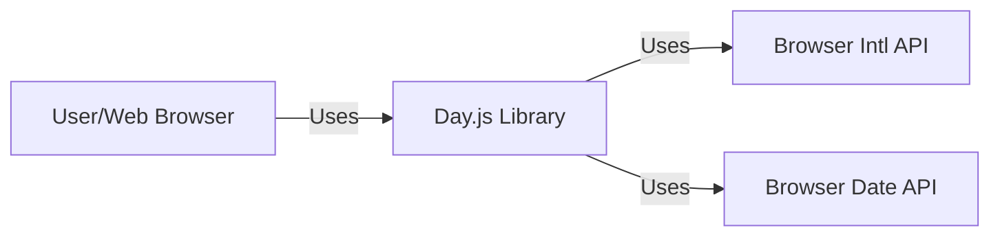
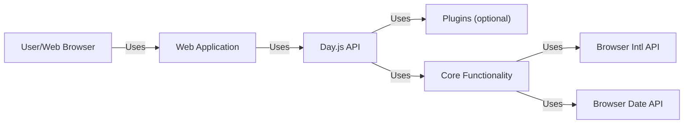
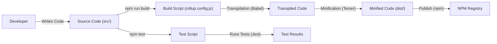

# Project Design Document: Day.js

## BUSINESS POSTURE

Day.js is a minimalist JavaScript library that parses, validates, manipulates, and displays dates and times for modern browsers with a largely Moment.js-compatible API. It's designed to be a lightweight alternative to Moment.js, addressing the issue of Moment.js's large size.

Priorities:

-   Minimize library size to reduce impact on application load times and bandwidth consumption.
-   Maintain high API compatibility with Moment.js to ease migration for existing users.
-   Ensure cross-browser compatibility and consistent behavior.
-   Provide a simple, easy-to-use API for date and time manipulation.
-   Provide high test coverage.

Goals:

-   Provide a smaller, faster alternative to Moment.js.
-   Facilitate easy date and time operations in web applications.
-   Reduce the overhead associated with date/time libraries in web projects.

Business Risks:

-   Incompatibility: Subtle differences in behavior compared to Moment.js could break existing applications that rely on precise Moment.js behavior.
-   Maintainability: As a community-maintained project, long-term maintenance and updates depend on community contributions. Lack of active maintenance could lead to security vulnerabilities or incompatibility with future browser updates.
-   Bugs and Security Vulnerabilities: Despite efforts to maintain a small codebase, undiscovered bugs or vulnerabilities could impact applications using the library, potentially leading to incorrect date/time calculations or other issues.

## SECURITY POSTURE

Existing Security Controls:

-   security control: Extensive Test Suite: The project includes a comprehensive test suite to ensure functionality and prevent regressions. Location: `/test` directory in the GitHub repository.
-   security control: Static Code Analysis: The project uses linters (like ESLint) to enforce code style and identify potential issues. Location: `.eslintrc.js` configuration file and `package.json` scripts in the GitHub repository.
-   security control: Dependency Management: The project has very few external dependencies, reducing the risk of supply chain attacks. Location: `package.json` file in the GitHub repository.
-   security control: Immutable Design: Day.js objects are immutable after creation, preventing unintended side effects from date manipulations. Location: This is a design principle described in the documentation and enforced through the library's implementation.

Accepted Risks:

-   accepted risk: Limited Time Zone Handling: While Day.js supports IANA time zones through plugins, complex time zone calculations might have edge cases or performance considerations.
-   accepted risk: Reliance on Browser APIs: The library relies on the browser's built-in `Date` object and related APIs, which may have slight variations or inconsistencies across different browsers and versions.
-   accepted risk: Community-Driven Security Updates: Vulnerability patching relies on community contributions and reporting, which may introduce delays in addressing newly discovered security issues.

Recommended Security Controls:

-   security control: Regular Dependency Audits: Implement automated dependency scanning to identify and address vulnerabilities in any (even indirect) dependencies.
-   security control: Content Security Policy (CSP) Compatibility: Ensure the library is compatible with strict CSP configurations to mitigate the risk of XSS attacks in applications using Day.js.
-   security control: Security-Focused Code Reviews: Emphasize security considerations during code reviews, particularly for changes related to parsing, formatting, and time zone handling.

Security Requirements:

-   Authentication: Not applicable, as Day.js is a client-side library and does not handle authentication.
-   Authorization: Not applicable, as Day.js is a client-side library and does not handle authorization.
-   Input Validation:
    -   Requirement: The library should gracefully handle invalid date/time inputs, returning predictable results (e.g., an "Invalid Date" object) rather than throwing errors or causing unexpected behavior.
    -   Requirement: The library should provide clear mechanisms for validating user-provided date/time strings before parsing.
-   Cryptography: Not directly applicable, as Day.js does not perform cryptographic operations. However, if used in contexts where dates/times are part of security-sensitive data, ensure that appropriate cryptographic measures are applied externally.
-   Output Encoding: Not applicable.

## DESIGN

### C4 CONTEXT

Element Description:

-   Element:
    -   Name: User/Web Browser
    -   Type: User
    -   Description: The end-user interacting with a web application that utilizes Day.js.
    -   Responsibilities: Interacts with the web application, triggering date and time operations.
    -   Security controls: Browser security features (e.g., same-origin policy, CSP).

-   Element:
    -   Name: Day.js Library
    -   Type: Software System
    -   Description: The Day.js library itself, embedded within a web application.
    -   Responsibilities: Provides date and time parsing, manipulation, validation, and formatting functionalities.
    -   Security controls: Immutable objects, input validation, extensive test suite.

-   Element:
    -   Name: Intl API
    -   Type: External Dependency
    -   Description: The browser's built-in Internationalization API, used for locale-aware formatting.
    -   Responsibilities: Provides locale-specific date and time formatting capabilities.
    -   Security controls: Relies on browser's implementation, assumed to be secure.

-   Element:
    -   Name: Date API
    -   Type: External Dependency
    -   Description: The browser build-in Date API.
    -   Responsibilities: Provides date and time objects.
    -   Security controls: Relies on browser's implementation, assumed to be secure.

### C4 CONTAINER

Element Description:

-   Element:
    -   Name: User/Web Browser
    -   Type: User
    -   Description: The end-user interacting with the web application.
    -   Responsibilities: Interacts with the web application, triggering date and time operations.
    -   Security controls: Browser security features (e.g., same-origin policy, CSP).

-   Element:
    -   Name: Web Application
    -   Type: Container
    -   Description: The web application that integrates Day.js.
    -   Responsibilities: Uses Day.js for date and time related operations within its logic.
    -   Security controls: Application-specific security controls (e.g., input validation, output encoding, authentication, authorization).

-   Element:
    -   Name: Day.js API
    -   Type: Container
    -   Description: The public API exposed by Day.js.
    -   Responsibilities: Provides methods for parsing, manipulating, validating, and formatting dates and times.
    -   Security controls: Input validation, consistent error handling.

-   Element:
    -   Name: Plugins (optional)
    -   Type: Container
    -   Description: Optional plugins that extend Day.js functionality (e.g., time zone support, advanced formatting).
    -   Responsibilities: Provide additional features beyond the core library.
    -   Security controls: Plugin-specific security controls, code reviews.

-   Element:
    -   Name: Core Functionality
    -   Type: Container
    -   Description: The core logic of Day.js.
    -   Responsibilities: Implements the core date/time operations and interacts with the browser's `Date` object.
    -   Security controls: Immutable objects, internal validation checks.

-   Element:
    -   Name: Intl API
    -   Type: External Dependency
    -   Description: The browser's built-in Internationalization API.
    -   Responsibilities: Provides locale-specific date and time formatting capabilities.
    -   Security controls: Relies on browser's implementation, assumed to be secure.

-   Element:
    -   Name: Date API
    -   Type: External Dependency
    -   Description: The browser build-in Date API.
    -   Responsibilities: Provides date and time objects.
    -   Security controls: Relies on browser's implementation, assumed to be secure.

### DEPLOYMENT

Day.js is a client-side JavaScript library, and therefore, it doesn't have a traditional "deployment" in the sense of server-side applications. Instead, it's *distributed* and *integrated* into web applications.

Possible Distribution/Integration Methods:

1.  **NPM/Yarn:**  Installed as a package dependency via npm or yarn and bundled into the application's JavaScript code using a module bundler (e.g., Webpack, Parcel, Rollup).
2.  **CDN:** Included directly in the HTML using a `<script>` tag pointing to a CDN (e.g., jsDelivr, unpkg).
3.  **Direct Download:** Downloaded from the GitHub repository and included as a static asset in the web application.

Chosen Method (for detailed description): **NPM/Yarn + Module Bundler**

This is the most common and recommended approach for modern web development.

```mermaid
graph LR
    DevMachine["Developer Machine"] -- "npm install dayjs" --> NodeModules["node_modules"]
    NodeModules -- "Bundling (Webpack/Parcel/etc.)" --> BundledJS["Bundled JavaScript File(s)"]
    BundledJS -- "Deployment (e.g., to CDN, Web Server)" --> WebServer["Web Server/CDN"]
    WebServer -- "HTTP Request" --> UserBrowser["User's Browser"]
    UserBrowser -- "Executes JavaScript" --> DayJSExecution["Day.js Execution"]

```

Element Description:

-   Element:
    -   Name: Developer Machine
    -   Type: Environment
    -   Description: The developer's local development environment.
    -   Responsibilities: Writing code, managing dependencies, building the application.
    -   Security controls: Local development environment security best practices.

-   Element:
    -   Name: node_modules
    -   Type: Directory
    -   Description: Local directory where npm/yarn install project dependencies.
    -   Responsibilities: Contains all project dependencies, including Day.js.
    -   Security controls: Dependency management tools, vulnerability scanning.

-   Element:
    -   Name: Bundled JavaScript File(s)
    -   Type: Artifact
    -   Description: The output of the module bundler, containing the application code and Day.js.
    -   Responsibilities: Delivered to the user's browser to execute the application.
    -   Security controls: Minification, obfuscation (optional), integrity checks (Subresource Integrity - SRI).

-   Element:
    -   Name: Web Server/CDN
    -   Type: Infrastructure
    -   Description: The server or CDN that hosts the bundled JavaScript file(s).
    -   Responsibilities: Serves the application files to the user's browser.
    -   Security controls: HTTPS, appropriate caching headers, WAF (Web Application Firewall).

-   Element:
    -   Name: User's Browser
    -   Type: Environment
    -   Description: The user's web browser.
    -   Responsibilities: Downloads and executes the JavaScript code, including Day.js.
    -   Security controls: Browser security features (e.g., same-origin policy, CSP).

-   Element:
    -   Name: Day.js Execution
    -   Type: Process
    -   Description: The execution of Day.js code within the browser.
    -   Responsibilities: Performing date/time operations as requested by the application.
    -   Security controls: Relies on the security of the browser's JavaScript engine and Day.js's internal security measures.

### BUILD

Day.js uses a build process to create different distribution files (e.g., minified versions, UMD modules, ES modules) and to run tests.

Security Controls in the Build Process:

-   security control: Linting: ESLint is used to enforce code style and identify potential errors, including some security-related issues.
-   security control: Testing: A comprehensive test suite (using Jest) is run as part of the build process to ensure code correctness and prevent regressions.
-   security control: Dependency Management: `package-lock.json` or `yarn.lock` are used to ensure consistent and reproducible builds, reducing the risk of unexpected dependency changes.
-   security control: Build Script: The build process is automated using Rollup, a module bundler, which helps ensure consistency and reduces the risk of manual errors.
-   security control: Transpilation: Babel is used to transpile the code to support older browsers, ensuring wider compatibility and reducing the risk of vulnerabilities in older JavaScript engines.
-   security control: Minification: Terser is used to minify the code, reducing the file size and making it slightly more difficult to reverse engineer (though this is not a primary security measure).

## RISK ASSESSMENT

Critical Business Processes:

-   Accurate Date/Time Display: Displaying correct dates and times to users is crucial for many applications, especially those dealing with scheduling, events, financial transactions, or any time-sensitive data.
-   Consistent Date/Time Handling: Ensuring consistent behavior across different browsers and time zones is essential for data integrity and user experience.
-   Efficient Date/Time Operations: Performing date/time calculations efficiently is important for application performance, especially in applications that handle large amounts of date/time data.

Data Sensitivity:

-   Day.js itself does not handle sensitive data directly. It primarily deals with date and time values, which are generally not considered sensitive in isolation.
-   However, the *context* in which Day.js is used might involve sensitive data. For example:
    -   Financial applications: Dates and times of transactions.
    -   Healthcare applications: Dates and times of appointments, medical records.
    -   Authentication systems: Timestamps for login attempts, password resets.
-   Therefore, while Day.js itself doesn't handle sensitive data, applications using it *must* implement appropriate security measures to protect any sensitive data that includes date/time information.

## QUESTIONS & ASSUMPTIONS

Questions:

-   Are there any specific compliance requirements (e.g., GDPR, HIPAA) that the applications using Day.js need to adhere to? This would influence how date/time data is stored and processed.
-   Are there any specific performance requirements for date/time operations? This might influence the choice of Day.js plugins or the need for custom date/time handling logic.
-   What level of browser support is required? This will determine the necessary transpilation steps in the build process.
-   Are there any plans to add new features or plugins to Day.js? This could impact the security posture and require further analysis.

Assumptions:

-   BUSINESS POSTURE: It is assumed that the primary goal is to provide a lightweight and Moment.js-compatible date/time library.
-   BUSINESS POSTURE: It is assumed that the project is community-maintained and relies on contributions for updates and security patches.
-   SECURITY POSTURE: It is assumed that the browser's built-in `Date` object and related APIs are reasonably secure and reliable.
-   SECURITY POSTURE: It is assumed that developers using Day.js will implement appropriate security measures in their applications to protect any sensitive data that includes date/time information.
-   DESIGN: It is assumed that the NPM/Yarn + Module Bundler distribution method is the primary way Day.js will be integrated into web applications.
-   DESIGN: It is assumed that developers will use the provided plugins for features like time zone support, rather than implementing custom solutions.