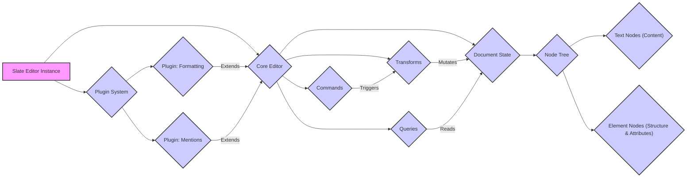

# Project Design Document: Slate Rich Text Editor Framework (Improved)

**Document Version:** 1.1
**Date:** October 26, 2023
**Author:** AI Software Architect

## 1. Introduction

This document provides an enhanced architectural design for the Slate rich text editor framework (as represented by the GitHub repository: [https://github.com/ianstormtaylor/slate](https://github.com/ianstormtaylor/slate)). This iteration aims to provide a more granular and detailed view of the system's components, data flow, and interactions, specifically tailored for effective threat modeling. It focuses on the core concepts and architecture of the framework itself, rather than specific implementations built using Slate, and emphasizes potential security implications at each stage.

## 2. Goals and Objectives

The primary goal of this document remains to provide a comprehensive architectural overview of the Slate framework to facilitate effective threat modeling. The enhanced objectives include:

*   Clearly defining the major components of the Slate framework with greater detail on their responsibilities.
*   Illustrating the data flow within the framework, highlighting data transformations and key interaction points.
*   Identifying key interaction points, trust boundaries, and potential attack surfaces.
*   Providing a robust foundation for understanding potential threats and vulnerabilities.
*   Using clear, concise language, and providing more specific examples where applicable.

## 3. Architectural Overview

Slate is a framework for building rich text editors. Its strength lies in its flexible and extensible architecture, allowing developers to create highly customized editing experiences. The core of Slate revolves around the concept of a mutable "document model" and a declarative approach to defining "operations" that modify this model.

### 3.1. High-Level Architecture with Trust Zones

```mermaid
graph LR
    subgraph "Client-Side (User's Browser)"
        A["Web Browser Environment"] --> B{"Slate Editor Instance"};
        B --> C{"Core Editor Logic"};
        B --> D{"Plugins"};
        C --> E{"Document Model"};
        E --> F{"Rendering Engine"};
        F --> A;
        D --> C;
        style A fill:#f9f,stroke:#333,stroke-width:2px
        style B fill:#ccf,stroke:#333,stroke-width:2px
        style C fill:#ccf,stroke:#333,stroke-width:2px
        style D fill:#ccf,stroke:#333,stroke-width:2px
        style E fill:#ccf,stroke:#333,stroke-width:2px
        style F fill:#ccf,stroke:#333,stroke-width:2px
    end
    style "Client-Side (User's Browser)" fill:#e0ffe0,stroke:#333,stroke-dasharray: 5 5

    subgraph "Potential Backend Services (Out of Scope)"
        Z["Backend API"]
    end

    B --> Z{"Backend API (Optional Interaction)"}
    style "Potential Backend Services (Out of Scope)" fill:#f0f0f0,stroke:#333,stroke-dasharray: 5 5
```

*   **Web Browser Environment:** The untrusted environment where the Slate editor executes. This is a primary attack surface.
*   **Slate Editor Instance:** A specific instantiation of the Slate editor within a web application. It acts as the central orchestrator and boundary between the application and the Slate framework.
*   **Core Editor Logic:** The trusted core of the Slate framework, responsible for maintaining the integrity of the document model and applying operations.
*   **Plugins:**  Extensions that operate within the same trust zone as the core editor but represent a potential point of vulnerability if not carefully vetted.
*   **Document Model:**  The in-memory representation of the rich text content. Its integrity is crucial.
*   **Rendering Engine:** Responsible for displaying the document model in the browser. Vulnerabilities here can lead to XSS.
*   **Backend API (Optional Interaction):** Represents potential server-side services that the Slate editor might interact with for saving, collaboration, etc. This interaction introduces new trust boundaries.

### 3.2. Detailed Component Architecture with Data Flow Emphasis



*   **Slate Editor Instance:**  Manages the lifecycle of the editor and acts as the primary interface for interacting with it.
*   **Core Editor:** The engine of Slate, responsible for:
    *   **Document State:** Holds the immutable snapshot of the document. Modifications create new state.
    *   **Transforms:** Pure functions that take a document state and return a new, modified state. They are the only way to change the document.
    *   **Queries:** Functions for efficiently retrieving information from the document state without side effects.
    *   **Commands:**  Higher-level, user-facing actions that orchestrate sequences of transforms. They represent the intent of an edit.
*   **Plugin System:** Facilitates the addition of custom functionality:
    *   **Plugin: Formatting:** An example plugin adding specific formatting options (bold, italic).
    *   **Plugin: Mentions:** An example plugin adding support for mentioning users. Plugins can introduce their own commands, transforms, and rendering logic.
*   **Node Tree:** The hierarchical data structure representing the document:
    *   **Text Nodes (Content):** Contain the actual text content and associated formatting marks.
    *   **Element Nodes (Structure & Attributes):** Define the structure (paragraphs, headings, lists) and metadata of the document.

## 4. Data Flow with Security Implications

The data flow within Slate involves a cycle of user interaction, command execution, state transformation, and rendering. Each stage presents potential security considerations.

```mermaid
graph LR
    subgraph "User Interaction & Input Handling"
        A["User Input (Keyboard, Mouse, Paste)"] -- "Untrusted Data" --> B{"Input Handlers (Slate Editor)"}
        style A fill:#ffeeee,stroke:#333,stroke-width:2px
        style B fill:#ffdddd,stroke:#333,stroke-width:2px
    end

    subgraph "Command & Transform Execution"
        B -- "Triggers" --> C{"Commands"}
        C -- "Orchestrates" --> D{"Transforms"}
        D -- "Applies" --> E["Document State (New Immutable State)"]
        style C fill:#ccf,stroke:#333,stroke-width:2px
        style D fill:#ccf,stroke:#333,stroke-width:2px
        style E fill:#ccf,stroke:#333,stroke-width:2px
    end

    subgraph "Rendering & Output"
        E -- "Provides Data To" --> F{"Rendering Engine"}
        F -- "Generates" --> G["Updated DOM in Web Browser"]
        G -- "Displayed To" --> H["User View"]
        style F fill:#ccf,stroke:#333,stroke-width:2px
        style G fill:#ddffdd,stroke:#333,stroke-width:2px
        style H fill:#eeffee,stroke:#333,stroke-width:2px
    end

    B -- "May Invoke Plugin Logic" --> I["Plugins"]
    I -- "Can Introduce Custom Commands/Transforms" --> C

    style "User Interaction & Input Handling" fill:#f0f0f0,stroke:#333,stroke-dasharray: 5 5
    style "Command & Transform Execution" fill:#f0f0f0,stroke:#333,stroke-dasharray: 5 5
    style "Rendering & Output" fill:#f0f0f0,stroke:#333,stroke-dasharray: 5 5
```

1. **User Input (Untrusted Data):** User interactions are the initial source of data and should be treated as untrusted. Malicious input could be crafted to exploit vulnerabilities.
2. **Input Handlers (Slate Editor):** These components interpret user input and translate it into editor commands. Improper handling can lead to vulnerabilities.
3. **Commands:** Represent the intended action. Security considerations involve ensuring commands only perform intended operations and don't allow for unintended side effects.
4. **Transforms:**  The core logic for modifying the document state. Vulnerabilities here could lead to data corruption or unexpected behavior. The immutability of the document state helps with reasoning about changes but doesn't eliminate all risks.
5. **Document State (New Immutable State):** The updated representation of the document. Its integrity is paramount.
6. **Rendering Engine:** Responsible for displaying the document. XSS vulnerabilities can arise if the rendering engine doesn't properly sanitize the document content.
7. **Updated DOM in Web Browser:** The browser's representation of the document.
8. **User View:** The final output seen by the user.
9. **Plugins:** Can intercept input, introduce new commands and transforms, and modify rendering. This extensibility introduces potential security risks if plugins are not trustworthy.

## 5. Components with Detailed Responsibilities and Security Notes

This section provides a more detailed breakdown of the components, highlighting their responsibilities and potential security implications.

*   **Core Editor:**
    *   **Responsibilities:** Manages the document state, applies transforms, executes commands, handles selection, and coordinates with plugins. Enforces the integrity of the document model.
    *   **Security Notes:** Vulnerabilities in the core editor could have widespread impact. Proper input validation within commands and transforms is crucial. The immutability of the document state helps prevent accidental modification but doesn't prevent malicious transforms.
*   **Document State:**
    *   **Responsibilities:**  Stores the current representation of the document as an immutable data structure. Provides methods for accessing and traversing the document.
    *   **Security Notes:** While immutable, the data it contains can be influenced by potentially malicious transforms. The structure and content of the document state should be designed to minimize the risk of storing or rendering malicious content.
*   **Transforms:**
    *   **Responsibilities:**  Perform atomic modifications to the document state. They are pure functions, ensuring predictable state transitions.
    *   **Security Notes:**  Carefully designed transforms are essential to prevent unintended or malicious modifications to the document. Input validation should occur before transforms are applied.
*   **Queries:**
    *   **Responsibilities:**  Provide read-only access to the document state. Used for retrieving information without modifying the document.
    *   **Security Notes:** Generally less prone to direct security vulnerabilities than transforms, but inefficient or poorly designed queries could lead to performance issues (DoS).
*   **Commands:**
    *   **Responsibilities:**  Represent high-level editing actions. They orchestrate sequences of transforms to achieve a desired outcome.
    *   **Security Notes:**  Commands should be carefully designed to prevent unintended side effects or the execution of malicious operations. Input validation should occur at the command level.
*   **Plugin System:**
    *   **Responsibilities:**  Provides a mechanism for extending the functionality of the editor. Manages the lifecycle and interaction of plugins.
    *   **Security Notes:**  Plugins operate within the same trust zone as the core editor and have significant access. Untrusted or poorly written plugins can introduce various vulnerabilities, including XSS, data injection, and DoS. Consider implementing mechanisms for plugin sandboxing or permission management.
*   **Input Handlers:**
    *   **Responsibilities:**  Intercept and process user input events. Translate user actions into editor commands.
    *   **Security Notes:**  A critical point for input validation and sanitization. Improper handling of user input can lead to XSS or other injection attacks. Be wary of unexpected input sequences or malformed data.
*   **Rendering Engine:**
    *   **Responsibilities:**  Converts the document model into a visual representation in the browser's DOM.
    *   **Security Notes:**  The primary area for XSS vulnerabilities. Must properly sanitize and escape content before rendering it to prevent the execution of malicious scripts embedded in the document.

## 6. Security Considerations (Detailed)

This section expands on the preliminary security considerations, providing more specific examples and focusing on potential attack vectors.

*   **Cross-Site Scripting (XSS):**
    *   **Attack Vector:** Malicious scripts injected into the document content (e.g., through pasting or malicious plugins) are executed when the document is rendered.
    *   **Mitigation:** Strict output encoding and sanitization within the rendering engine. Content Security Policy (CSP) can provide an additional layer of defense. Careful vetting of plugins.
*   **Plugin Security:**
    *   **Attack Vector:** Malicious plugins could introduce arbitrary code execution, modify the document state in unintended ways, or exfiltrate data.
    *   **Mitigation:**  Code reviews for plugins, consider a plugin permission system, and potentially sandboxing plugin execution.
*   **Data Injection:**
    *   **Attack Vector:** If Slate is used to collect data that is later processed on a server, vulnerabilities in input handling or serialization could allow attackers to inject malicious data (e.g., SQL injection payloads).
    *   **Mitigation:**  Server-side input validation and sanitization. Secure serialization practices.
*   **Denial of Service (DoS):**
    *   **Attack Vector:**  Crafting documents with extremely complex structures or triggering resource-intensive operations could overwhelm the client's browser or backend services.
    *   **Mitigation:**  Implement limits on document size and complexity. Optimize rendering and processing logic.
*   **Cross-Site Request Forgery (CSRF):**
    *   **Attack Vector:** If Slate interacts with backend services, ensure proper CSRF protection mechanisms are in place to prevent unauthorized actions on behalf of a user.
    *   **Mitigation:**  Use anti-CSRF tokens or other appropriate measures.
*   **Serialization and Deserialization Attacks:**
    *   **Attack Vector:** If the document model is serialized and stored or transmitted, vulnerabilities in the deserialization process could allow for arbitrary code execution.
    *   **Mitigation:**  Use secure serialization formats and libraries. Implement integrity checks to ensure the serialized data hasn't been tampered with.

## 7. Assumptions and Constraints

*   This design document focuses on the core architectural principles of the Slate framework. Specific implementations might introduce additional complexities.
*   The primary deployment environment is assumed to be a modern web browser.
*   The security of the embedding application plays a significant role in the overall security posture.
*   The effectiveness of security mitigations depends on their correct implementation and ongoing maintenance.

## 8. Future Considerations

*   **Fine-grained Plugin Permissions:** Implementing a system where plugins request and are granted specific permissions could enhance security.
*   **Formal Security Audits:**  Regular security audits of the core framework and popular plugins are crucial.
*   **Subresource Integrity (SRI):**  Using SRI for external dependencies can help prevent the loading of compromised scripts.
*   **Integration with Security Scanning Tools:**  Ensuring the framework is compatible with static and dynamic analysis security tools.

This improved document provides a more detailed and security-focused view of the Slate framework's architecture, making it a more effective resource for threat modeling.
