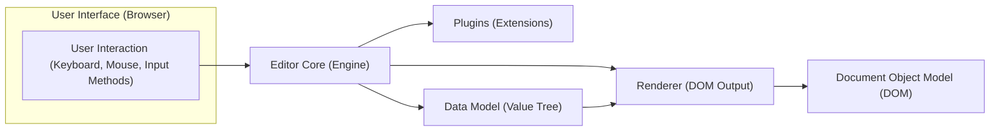
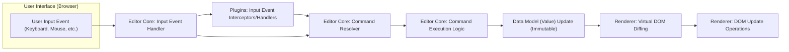

# Project Design Document: Slate Rich Text Editor Framework

**Document Version:** 1.1
**Date:** October 26, 2023
**Prepared By:** AI Software Architect

## 1. Introduction

This document provides an enhanced design overview of the Slate rich text editor framework (as represented by the GitHub repository: [https://github.com/ianstormtaylor/slate](https://github.com/ianstormtaylor/slate)). This revised design document builds upon the previous version to provide greater clarity and detail, serving as a robust foundation for subsequent threat modeling activities and a deeper understanding of the system.

Slate is a highly customizable and extensible rich text editor framework for building bespoke web-based text editors. It offers a granular set of low-level primitives, empowering developers to construct editors with precise behaviors and unique features tailored to specific application needs.

## 2. Goals and Objectives

The core goals underpinning the Slate project are:

* To furnish a versatile and potent framework for the development of rich text editors.
* To present a modular architecture facilitating straightforward customization and extension.
* To empower developers to craft editors possessing specialized and distinctive functionalities.
* To abstract the intricacies arising from browser inconsistencies and the inherent complexities of `contentEditable` behavior.
* To deliver a high-performance and dependable editing experience for end-users.

## 3. High-Level Architecture

The architectural design of Slate centers around a collection of fundamental concepts and interconnected components. The subsequent diagram illustrates the overarching structure of the framework:

* **User Interaction (Keyboard, Mouse, Input Methods):** Encompasses all forms of user interaction with the editor interface within the browser, including keyboard input, mouse clicks, and input from accessibility tools or IME (Input Method Editor).
* **Editor Core (Engine):** This is the central processing unit of Slate, responsible for managing the editor's internal state, interpreting user input, and coordinating interactions among the various components. It acts as the orchestrator of the editing process.
* **Plugins (Extensions):** These are self-contained, modular units that augment the base functionality of the editor. They provide a mechanism for adding custom behaviors, handling specific formatting, or integrating external services.
* **Renderer (DOM Output):** This component takes the abstract representation of the document from the Data Model and translates it into the concrete HTML elements that are displayed in the browser. It handles the visual presentation of the editor's content.
* **Data Model (Value Tree):** This represents the editor's content in a structured, programmatic way. It's typically an immutable tree structure composed of nodes and marks, providing an abstract representation of the document's content and formatting.
* **Document Object Model (DOM):** The actual HTML structure rendered by the browser that the user directly interacts with. The Renderer ensures the DOM reflects the current state of the Data Model.

## 4. Detailed Design

This section provides a more granular examination of the key components and their respective roles within the Slate framework.

### 4.1. Editor Core (Engine)

The Editor Core is the foundational element of Slate. Its key responsibilities include:

* **Centralized State Management:**  Maintaining the single source of truth for the editor's state, encompassing the document content (the "Value"), the current selection, editor focus, and potentially other transient states.
* **Comprehensive Input Handling:** Intercepting and meticulously processing a wide range of user input events originating from the browser, including keyboard events (keypress, keydown, keyup), mouse events (click, drag, select), and input method events.
* **Orchestration of Command Execution:**  Interpreting user actions and triggering the execution of commands that effect changes to the editor's state. These commands are the fundamental units of modification within Slate.
* **Dynamic Plugin Management:**  Handling the lifecycle of plugins, including loading, initialization, activation, and the coordination of their execution in response to editor events.
* **Precise Selection Management:**  Maintaining and manipulating the user's selection within the document, handling complex selection scenarios and providing APIs for programmatic selection manipulation.
* **Robust History Management (Undo/Redo Stack):**  Implementing a mechanism for tracking changes to the editor's state, enabling undo and redo operations by maintaining a history of past states.
* **Data Model Normalization and Validation:** Enforcing consistency and validity within the Data Model by applying predefined rules and transformations to ensure the document structure remains correct and adheres to the expected schema.
* **Event Emission and Handling:** Providing a mechanism for components and plugins to communicate by emitting and subscribing to various editor events.

### 4.2. Plugins (Extensions)

Plugins are the primary means of extending and customizing Slate's capabilities. They are modular units that can:

* **Define Custom Keybindings and Hotkeys:**  Map specific key combinations to custom editor actions, allowing for tailored keyboard shortcuts.
* **Implement Rendering Logic for Custom Elements and Leaves:**  Provide the instructions for how specific types of content within the Data Model (custom nodes or inline elements) should be rendered into the DOM.
* **Intercept and Modify Core Editor Behavior:** Tap into the editor's event lifecycle to intercept and potentially alter the default behavior of the Editor Core in response to specific events.
* **Introduce Arbitrary Custom Logic and Features:** Add any desired functionality to the editor, such as integration with external services, custom formatting options, or specialized content handling.
* **Enforce Schema Rules and Constraints:** Define rules that govern the structure and content of the Data Model, ensuring data integrity and consistency.
* **Contribute Custom Editor Commands:** Introduce new commands that can be executed by the Editor Core to modify the editor's state.

### 4.3. Renderer (DOM Output)

The Renderer is responsible for the crucial task of translating the abstract Data Model into a tangible DOM representation that users can see and interact with. Key aspects of the Renderer include:

* **Recursive Node Rendering:**  Traversing the tree structure of the Data Model and recursively rendering each node into corresponding DOM elements.
* **Inline Leaf Rendering with Mark Application:** Rendering individual text "leaves" within nodes and applying the associated formatting "marks" (e.g., bold, italic) by generating appropriate DOM elements or styles.
* **Dynamic Decoration Rendering:** Applying visual decorations to the editor content based on dynamic criteria, such as highlighting search results or indicating errors.
* **Efficient and Optimized DOM Updates:** Implementing strategies to minimize direct DOM manipulation and optimize updates to ensure a smooth and responsive editing experience, often leveraging techniques like virtual DOM diffing.
* **Handling Browser Compatibility for Rendering:** Abstracting away browser-specific rendering quirks and ensuring consistent visual output across different browsers.

### 4.4. Data Model (Value Tree)

The Data Model, often referred to as the "Value," is the structured representation of the editor's content in memory. Its key characteristics include:

* **Hierarchical Tree Structure:** The content is organized as a tree, with a root node and nested child nodes representing structural elements like paragraphs, headings, lists, and custom block types.
* **Nodes as Structural Units:**  Nodes represent distinct structural elements within the document, each potentially having properties and child nodes. Examples include paragraph nodes, heading nodes, list nodes, and image nodes.
* **Leaves as Textual Content with Formatting:** Leaves represent contiguous sequences of text within a node, along with associated inline formatting information stored as "marks."
* **Marks for Inline Formatting:** Marks are attributes applied to leaves to indicate formatting such as bold, italic, underline, code, or custom styles.
* **Immutability for Efficient Updates:**  Changes to the Data Model typically result in the creation of new, immutable versions of the affected parts of the tree. This immutability facilitates efficient change detection, rendering optimizations, and implementation of undo/redo functionality.
* **Schema Definition and Enforcement:**  The structure and content of the Data Model are often governed by a schema, which defines the allowed node types, their properties, and the relationships between them.

## 5. Data Flow

The following diagram provides a more detailed illustration of the typical data flow within the Slate editor during a user interaction:

1. **User Input Event (Keyboard, Mouse, etc.):** The user initiates an action within the editor, such as typing, clicking, or using a keyboard shortcut.
2. **Editor Core: Input Event Handler:** The Editor Core receives the raw input event from the browser and begins processing it.
3. **Plugins: Input Event Interceptors/Handlers:** Registered plugins have the opportunity to intercept and handle the input event, potentially modifying it or preventing default behavior.
4. **Editor Core: Command Resolver:** Based on the input event and any plugin handling, the Editor Core determines the appropriate command to execute.
5. **Editor Core: Command Execution Logic:** The specific logic for the identified command is executed, which will ultimately result in a modification to the editor's state.
6. **Data Model (Value) Update (Immutable):** The Data Model is updated by creating a new, immutable version reflecting the changes resulting from the command execution.
7. **Renderer: Virtual DOM Diffing:** The Renderer compares the previous and current versions of the Data Model (or a virtual representation thereof) to identify the minimal set of changes required in the DOM.
8. **Renderer: DOM Update Operations:** The Renderer applies the necessary changes to the actual DOM, updating only the elements that have been modified, ensuring efficient rendering.

## 6. Key Technologies

The Slate framework leverages the following core technologies:

* **JavaScript (ES6+ with Modern Features):** The primary programming language used for all core logic and plugin development.
* **React (with Hooks API):** A declarative JavaScript library for building user interfaces, providing the foundation for rendering the editor and managing UI updates. The use of React Hooks is prevalent for managing state and side effects.
* **Immutable Data Structures (Libraries like Immutable.js or Immer):**  Often employs libraries or patterns for managing immutable data, which is crucial for efficient change detection, rendering optimizations, and implementing undo/redo functionality.
* **DOM APIs:** Direct interaction with the browser's Document Object Model is necessary for rendering and handling user interactions.

## 7. Security Considerations (Pre-Threat Modeling)

Building upon the initial security considerations, here are more specific potential areas of concern:

* **Cross-Site Scripting (XSS) Vulnerabilities:**
    * **Pasting Unsafe Content:**  Insufficient sanitization of content pasted from external sources (e.g., websites, documents) could allow the injection of malicious scripts. Mitigation involves rigorous input sanitization using libraries designed for this purpose.
    * **Insecure Plugin Development:**  Plugins that directly manipulate the DOM without proper encoding or that handle user input unsafely can introduce XSS vulnerabilities. Secure plugin development practices and code reviews are essential.
    * **Server-Side Rendering (SSR) Context:** If Slate is used in an SSR context, ensuring proper output encoding to prevent XSS is critical.
* **Data Integrity Compromises:**
    * **Schema Validation Bypass:**  Circumventing schema validation could lead to the introduction of invalid data into the model, potentially causing unexpected behavior or application errors. Robust schema enforcement is necessary.
    * **Undo/Redo Manipulation:**  Vulnerabilities in the history management system could be exploited to corrupt the document history or lead to unintended data loss. Secure implementation of the undo/redo mechanism is important.
* **Denial of Service (DoS) Attacks:**
    * **Payloads Causing Excessive Processing:**  Crafted input with deeply nested structures or excessively long strings could consume significant processing resources, leading to performance degradation or DoS. Input validation and resource limits can help mitigate this.
    * **Resource-Intensive Plugins:**  Poorly designed plugins that perform computationally expensive operations or leak memory could lead to DoS. Plugin performance monitoring and resource management are important.
* **Code Injection Risks:**
    * **Dynamic Plugin Loading Vulnerabilities:** If the mechanism for loading plugins is not secure, it could be exploited to load malicious code into the editor. Secure plugin loading and verification processes are crucial.
    * **Server-Side Integrations:** If Slate interacts with server-side components, vulnerabilities in these integrations could lead to code injection on the server. Secure API design and input validation on the server-side are necessary.
* **Dependency Chain Vulnerabilities:**
    * **Outdated Dependencies:** Using outdated versions of React or other dependencies with known security vulnerabilities can expose the application to risks. Regular dependency updates and security audits are essential.
* **Client-Side Data Tampering:**
    * **Manipulation of Editor State:** While client-side, vulnerabilities could allow malicious actors to manipulate the editor's state in unexpected ways, potentially leading to data corruption or unintended actions.

## 8. Assumptions and Constraints

The following assumptions and constraints are pertinent to this design:

* **Primarily Client-Side Execution within Web Browsers:**  The core functionality of Slate is designed for execution within the user's web browser.
* **Strong Dependency on the React Library:** Slate's rendering and component model are tightly integrated with React.
* **Plugin Architecture as a Core Extensibility Mechanism:**  The plugin system is a fundamental aspect of Slate's design, enabling customization and feature extension.
* **Targeting Modern Web Browsers:**  Development assumes compatibility with contemporary web browsers adhering to modern web standards.

## 9. Future Considerations

Potential future directions and enhancements for the Slate framework include:

* **Enhanced Real-time Collaborative Editing Features:**  Deepening support for collaborative editing scenarios with features like operational transformation (OT) or conflict-free replicated data types (CRDTs).
* **Improved Accessibility Compliance:**  Continuously enhancing the editor's adherence to accessibility standards (WCAG) to ensure usability for users with disabilities.
* **Performance Optimizations for Large Documents:**  Further optimizing performance for handling very large documents and complex editing scenarios.
* **Expansion of the Plugin Ecosystem and Tooling:**  Fostering a more robust ecosystem of community-developed plugins and providing better tooling for plugin development and management.
* **Native Mobile Support or Framework Integrations:** Exploring possibilities for native mobile implementations or tighter integrations with mobile development frameworks.

This enhanced design document provides a more in-depth understanding of the Slate rich text editor framework's architecture, components, and potential security considerations. This detailed information is crucial for conducting comprehensive threat modeling and ensuring the security and robustness of applications built with Slate.
