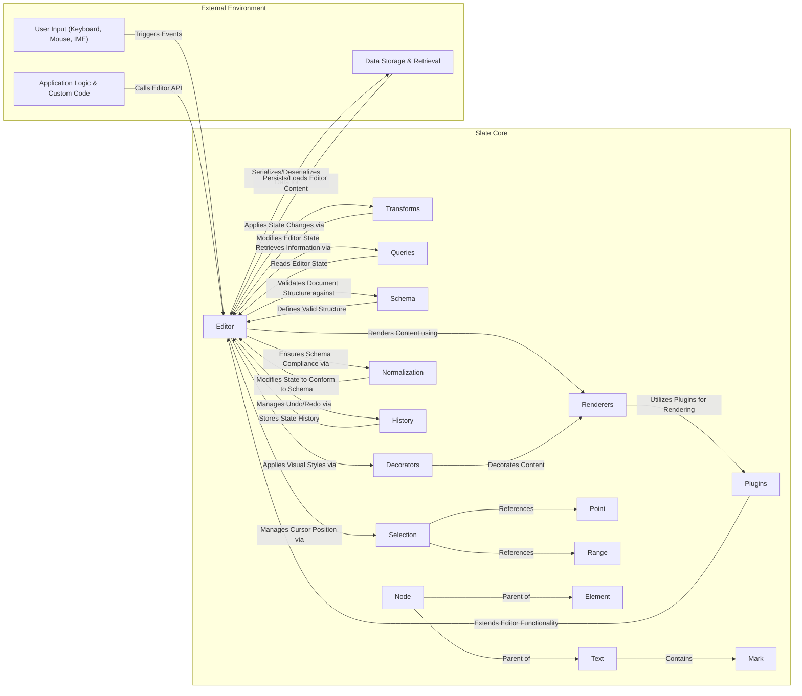
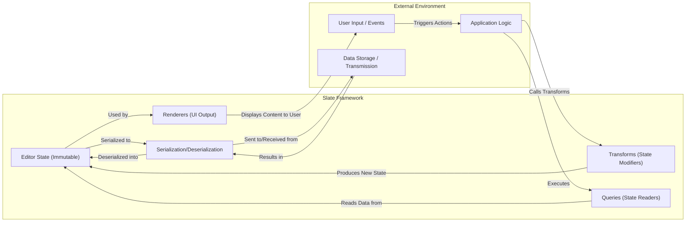

# Project Design Document: Slate Rich Text Editor Framework

**Version:** 1.1
**Date:** October 26, 2023
**Author:** AI Software Architect

## 1. Introduction

This document provides an enhanced and more detailed design overview of the Slate rich text editor framework (as found on [https://github.com/ianstormtaylor/slate](https://github.com/ianstormtaylor/slate)). Building upon the previous version, this iteration aims to provide an even clearer articulation of the system's architecture, components, data flow, and critically, more specific considerations relevant for subsequent threat modeling activities. The focus remains on the core concepts and functionalities of the framework itself, rather than specific implementations built using Slate.

## 2. Goals and Objectives

The primary goal of this document remains to provide a comprehensive architectural understanding of the Slate framework to facilitate effective threat modeling. Improved specific objectives include:

*   Clearly identifying and describing key components and their specific interactions, emphasizing potential security boundaries.
*   Precisely mapping the flow of data within the framework, highlighting data transformation points and potential injection/manipulation locations.
*   Elaborating on potential areas of security concern with more specific examples and threat scenarios.
*   Providing a highly clear and concise representation of the system's design, optimized for security analysis.

## 3. System Architecture

Slate is a highly flexible *framework* for constructing custom rich text editors. Its architecture is designed around a composable and extensible core, allowing developers significant control over the editor's behavior and appearance.

### 3.1. Core Components

*   **`Editor`:** The central orchestrator, managing the editor's immutable state, current selection, and the application of operations. It exposes the primary API for interacting with the editor instance. *Security Relevance:*  As the central point of interaction, vulnerabilities here could have widespread impact.
*   **`Transforms`:** A collection of pure functions that produce new editor states based on the current state and a specific transformation. Transforms are the *only* recommended way to modify the editor's document structure and properties, ensuring predictable state changes. *Security Relevance:*  Improperly implemented or chained transforms could lead to unexpected state, potentially exploitable.
*   **`Queries`:** Functions used to retrieve information about the editor's current state without modifying it. Queries provide a read-only interface to the editor's data. *Security Relevance:* While read-only, inefficient or poorly designed queries could lead to performance issues (DoS).
*   **`Renderers`:** React components responsible for translating the editor's abstract data model into a visible user interface. Slate employs a plugin-based rendering system, allowing for highly customized rendering of different node types and marks. *Security Relevance:* Custom renderers are a prime location for introducing Cross-Site Scripting (XSS) vulnerabilities if not implemented with proper sanitization.
*   **`Plugins`:** A powerful mechanism for extending and customizing the editor's functionality. Plugins can introduce new behaviors (e.g., handling specific keybindings), custom rendering logic, and integrations with external services. *Security Relevance:* Plugins represent a significant attack surface, as they can introduce arbitrary code and potentially bypass core security mechanisms. Untrusted plugins should be treated with extreme caution.
*   **`Schema`:** Defines the valid structure and constraints of the document, including allowed node types, attributes, nesting rules, and mark combinations. The schema enforces data integrity and consistency. *Security Relevance:* A poorly defined or unenforced schema can lead to unexpected data structures that might be exploitable.
*   **`Decorators`:** Functions that apply visual styling or annotations to specific ranges of text based on the editor's state or external factors. Decorators enhance the visual presentation without altering the underlying data. *Security Relevance:* While primarily visual, improperly implemented decorators could potentially leak information or cause performance issues.
*   **`Normalization`:** A process that automatically ensures the document structure adheres to the defined `Schema`. Normalization functions correct inconsistencies and enforce the defined rules. *Security Relevance:*  Normalization helps maintain data integrity and can prevent the editor from entering invalid states that might be exploitable. However, overly complex normalization logic could introduce performance vulnerabilities.
*   **`History`:** Manages the undo/redo stack by tracking changes made to the editor's state through `Transforms`. This allows users to revert or reapply actions. *Security Relevance:*  While not directly a security concern, the history mechanism needs to be robust to prevent data loss or corruption.
*   **`Selection`:** Represents the user's current cursor position or selected range within the document. The selection is a key part of user interaction and command execution. *Security Relevance:*  Careless handling of selection data in custom logic could potentially lead to unexpected behavior or information disclosure.
*   **`Point` and `Range`:** Data structures used to define precise locations (`Point`) and spans (`Range`) within the document's text and structure. These are fundamental for operations like selection and text manipulation. *Security Relevance:*  Incorrectly calculated or manipulated `Point` and `Range` values could lead to out-of-bounds errors or unexpected data access.
*   **`Node` and `Element`:** Represent the fundamental building blocks of the document's abstract syntax tree (AST). `Node` is the base class, and `Element` represents container nodes that can have child nodes. *Security Relevance:*  The structure and attributes of `Node` and `Element` objects are crucial for security. Unexpected or malformed nodes could indicate an attack.
*   **`Text`:** Represents a sequence of textual content within the document, potentially with associated formatting `Mark`s. *Security Relevance:*  `Text` nodes are the primary carriers of user-provided content and are therefore a key target for XSS attacks. Proper sanitization is essential.
*   **`Mark`:** Represents formatting applied to `Text` nodes, such as bold, italic, or underline. Marks are metadata associated with text. *Security Relevance:* While seemingly benign, the rendering of marks needs to be carefully considered to prevent unexpected visual rendering or the injection of malicious styles.

### 3.2. Component Interactions

### 3.3. Data Flow

The fundamental data flow within Slate centers around the immutable `Editor` state and the controlled manner in which it is updated. Understanding this flow is crucial for identifying potential points of data manipulation or injection.

1. **User Input & Application Logic:** User interactions (keystrokes, mouse events, input from IME) are captured by the application embedding Slate. Application-specific logic might also initiate changes.
2. **Event Handling & API Calls:** The application translates these interactions or internal logic into calls to the `Editor`'s API, often triggering specific actions or requesting state modifications.
3. **Transforms Application (The Gatekeeper):**  Crucially, state changes are primarily enacted through `Transforms`. The application or plugins specify the desired transformation, and the `Editor` applies it, producing a *new* immutable state. This controlled mutation is a key security feature.
4. **State Update (Immutable):** The `Editor` updates its internal state with the newly generated state. Because the state is immutable, previous states are preserved, aiding in undo/redo functionality and potentially simplifying debugging and security analysis.
5. **Rendering (Potential XSS Vector):** The `Renderers` component uses the updated state to generate the visual representation of the editor's content in the user interface. This is a critical point for security, as unsanitized content from the state could lead to XSS vulnerabilities. Plugins can heavily customize this rendering process, increasing the potential attack surface.
6. **Queries (Read-Only Access):** The application or plugins can use `Queries` to retrieve information about the current editor state. While not modifying the state, inefficient queries could lead to performance issues.
7. **Serialization/Deserialization (Data Integrity Risk):** The editor's content can be serialized into a data format (e.g., JSON) for storage or transmission and deserialized back into the editor. Vulnerabilities can arise if the serialization format is insecure or if deserialization is not handled carefully, potentially allowing for data manipulation or even code injection (depending on the format and implementation).

## 4. Security Considerations

Understanding Slate's architecture is paramount for identifying potential vulnerabilities in applications built upon it. The framework's flexibility, while powerful, also introduces potential security risks if not handled carefully.

*   **Cross-Site Scripting (XSS) - A Primary Threat:**  Given that Slate deals with user-generated content, XSS is a major concern.
    *   **Vulnerability Point:** Primarily within custom `Renderers` and plugins responsible for rendering `Text` nodes and `Mark`s. If these components do not properly sanitize or escape user-provided text and attributes, malicious scripts can be injected and executed in the user's browser.
    *   **Mitigation:**  Strict output encoding and sanitization within renderers. Utilizing browser APIs for safe HTML construction. Regularly auditing custom rendering logic.
*   **Input Validation and Sanitization - Essential at the Application Level:** While Slate provides a `Schema`, the application embedding Slate is responsible for initial input validation.
    *   **Vulnerability Point:** Before data is passed to the `Editor` or when data is loaded from external sources. Maliciously crafted input, even if conforming to a basic schema, could exploit vulnerabilities in custom logic or overwhelm the editor.
    *   **Mitigation:** Implement robust server-side and client-side input validation. Sanitize data before loading it into the editor. Adhere to the principle of least privilege when handling external data.
*   **Plugin Security - A Significant Attack Surface:** Plugins, by their nature, introduce external code into the editor's execution environment.
    *   **Vulnerability Point:** Untrusted or poorly developed plugins can introduce arbitrary code execution vulnerabilities, bypass security measures, or leak sensitive information.
    *   **Mitigation:**  Only use trusted and well-vetted plugins. Implement a plugin security model with clear permissions and restrictions. Regularly audit plugin code. Consider sandboxing plugin execution.
*   **Serialization/Deserialization Vulnerabilities - Data Integrity and Potential Code Execution:** The process of converting the editor's state to and from a persistent format can introduce risks.
    *   **Vulnerability Point:** If using language-specific serialization formats (e.g., `eval()` in JavaScript or pickle in Python on the server-side), deserialization of untrusted data can lead to arbitrary code execution. Even with safer formats like JSON, vulnerabilities can arise from improper handling of the deserialized data.
    *   **Mitigation:**  Prefer secure and well-defined serialization formats like JSON. Thoroughly validate and sanitize data after deserialization. Avoid deserializing data from untrusted sources without careful inspection.
*   **Denial of Service (DoS) - Resource Exhaustion:** Maliciously crafted content can be designed to consume excessive resources.
    *   **Vulnerability Point:**  Deeply nested structures, excessively large amounts of text, or complex mark combinations can strain the browser's rendering engine or the editor's internal processing.
    *   **Mitigation:** Implement limits on document size and complexity. Employ techniques like virtualized rendering for large documents. Implement rate limiting or input throttling if the editor accepts external input.
*   **Data Integrity - Maintaining Consistency:** Ensuring that the editor's state and the underlying data model remain consistent is crucial.
    *   **Vulnerability Point:** Bugs in custom transforms or normalization logic could lead to data corruption or inconsistencies.
    *   **Mitigation:** Thoroughly test custom transforms and normalization functions. Implement data integrity checks and validation routines. Utilize version control for document history.

## 5. Deployment Considerations

Deploying applications built with Slate requires careful consideration of security best practices.

*   **Content Security Policy (CSP) - Mitigating XSS:** Implementing a strict CSP is crucial to mitigate XSS vulnerabilities by controlling the sources from which the browser is allowed to load resources. This helps limit the impact of injected malicious scripts.
*   **Secure Transport (HTTPS) - Protecting Data in Transit:**  Ensuring that the application is served over HTTPS is fundamental to protect data exchanged between the client and the server, including the editor's content.
*   **Regular Updates - Patching Known Vulnerabilities:** Keeping Slate and all its dependencies (including React and any used plugins) up-to-date is essential to patch known security vulnerabilities. Regularly monitor for security advisories.
*   **Server-Side Security - A Critical Component:** While Slate is a client-side framework, the server-side components responsible for storing, retrieving, and processing the editor's content must be secured against common web application vulnerabilities (e.g., SQL injection, authentication bypass).

## 6. Technologies Used

*   **JavaScript/TypeScript:** The primary language for Slate development, requiring careful attention to secure coding practices.
*   **React:** A common UI library used with Slate, necessitating awareness of React-specific security considerations.
*   **Immutable Data Structures:**  While beneficial for state management, understanding their implications for security (e.g., how changes are tracked and persisted) is important.

## 7. Future Considerations

*   **Collaboration Features Security:** If the application built with Slate incorporates real-time collaborative editing, additional security considerations are paramount. This includes secure data synchronization, robust access control mechanisms, conflict resolution strategies that prevent data loss or manipulation, and secure communication channels (e.g., WebSockets with TLS).
*   **Accessibility and Security:**  Ensuring the editor is accessible to users with disabilities should not compromise security. Care must be taken to avoid introducing vulnerabilities through accessibility features.

This enhanced document provides a more detailed and security-focused understanding of the Slate framework's architecture. This information is crucial for conducting a comprehensive threat model to identify potential security vulnerabilities and design appropriate mitigations at both the framework usage level and within custom application implementations.