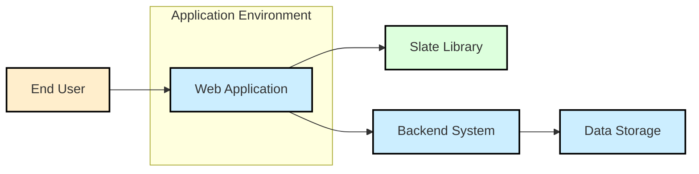
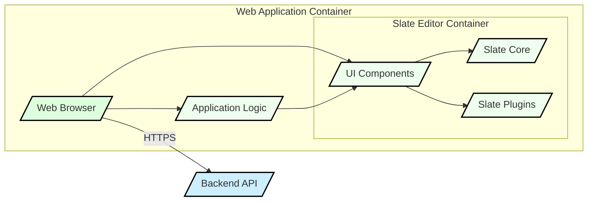
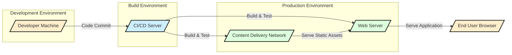

# BUSINESS POSTURE

Slate is a framework for building rich text editors. Its primary business goal is to provide developers with a highly customizable and flexible tool to create rich text editing experiences in web applications.

Business priorities for projects using Slate would likely include:

- Enhancing user experience by providing rich text editing capabilities.
- Enabling content creation and management within applications.
- Customizing editor functionality to meet specific application needs.
- Ensuring the editor is performant and reliable.
- Maintaining compatibility and ease of integration with existing web application frameworks.

Most important business risks that need to be addressed:

- Data loss or corruption due to editor instability or bugs.
- Security vulnerabilities in the editor leading to cross-site scripting (XSS) or other attacks.
- Performance issues impacting user experience and application responsiveness.
- Compatibility issues with different browsers or devices.
- Difficulty in customizing or extending the editor to meet evolving business requirements.

# SECURITY POSTURE

Existing security controls:

- security control: As a front-end library, Slate's security relies heavily on the security practices of the applications that integrate it.
- security control: Input validation and sanitization are expected to be implemented by the developers using Slate to handle the editor's output.
- security control: Dependency management using `npm` or `yarn` helps in managing third-party library vulnerabilities.

Accepted risks:

- accepted risk: Vulnerabilities in third-party dependencies used by Slate.
- accepted risk: Misuse of Slate by developers leading to insecure configurations or integrations.
- accepted risk: Client-side vulnerabilities inherent in JavaScript-based applications.

Recommended security controls:

- recommended security control: Implement automated security scanning of dependencies to identify and address known vulnerabilities.
- recommended security control: Provide clear guidelines and best practices for developers on secure integration and usage of Slate, especially regarding output sanitization and handling user-generated content.
- recommended security control: Conduct regular security audits and penetration testing of applications using Slate to identify and remediate potential vulnerabilities.

Security requirements:

- Authentication: Not directly applicable to Slate itself, as it's a front-end library. Authentication is handled by the applications using Slate.
- Authorization: Not directly applicable to Slate itself. Authorization is handled by the applications using Slate to control access to content and editor functionalities.
- Input validation: Crucial for applications using Slate. Developers must sanitize and validate the output from Slate before storing or displaying it to prevent XSS and other injection attacks. This should be implemented in the application backend and potentially on the frontend as well for immediate feedback.
- Cryptography: Not directly applicable to Slate itself in terms of encrypting editor content within Slate. However, applications using Slate might need to encrypt data at rest or in transit, which is handled outside of Slate's scope. If sensitive data is handled within the editor, consider client-side encryption before sending data to the backend.

# DESIGN

## C4 CONTEXT



Elements of context diagram:

- Name: End User
  - Type: Person
  - Description: Users who interact with the web application and use the rich text editor powered by Slate to create and edit content.
  - Responsibilities: Create and edit content using the rich text editor.
  - Security controls: User authentication and authorization are handled by the Web Application and Backend System, not directly by the End User.

- Name: Web Application
  - Type: Software System
  - Description: The web application that integrates the Slate library to provide rich text editing functionality to end users. This application is responsible for rendering the user interface, handling user interactions, and communicating with the backend system.
  - Responsibilities:
    - Integrate and initialize the Slate library.
    - Provide a user interface for interacting with the Slate editor.
    - Handle user input and editor events.
    - Send and receive data to/from the Backend System.
    - Implement input validation and output sanitization for content from Slate.
    - Implement user authentication and authorization.
  - Security controls:
    - security control: Input validation and output sanitization to prevent XSS.
    - security control: Session management to maintain user sessions securely.
    - security control: Implementation of Content Security Policy (CSP) to mitigate XSS risks.

- Name: Slate Library
  - Type: Software System
  - Description: The Slate JavaScript library, a framework for building rich text editors. It provides the core editing engine, data model, and plugin architecture.
  - Responsibilities:
    - Provide a framework for building rich text editors.
    - Manage the editor's data model and state.
    - Handle user input and editing commands.
    - Provide a plugin system for extending editor functionality.
  - Security controls:
    - security control: Reliance on the security of the underlying JavaScript environment and browser.
    - security control: Dependency management to ensure secure third-party libraries.

- Name: Backend System
  - Type: Software System
  - Description: The backend system that stores and manages the content created using the Slate editor. It provides APIs for the Web Application to interact with data storage.
  - Responsibilities:
    - Store and retrieve content created with Slate.
    - Implement business logic and data processing.
    - Enforce data access controls and authorization.
    - Provide APIs for the Web Application.
  - Security controls:
    - security control: Authentication and authorization to control access to data and APIs.
    - security control: Database security measures to protect stored content.
    - security control: Input validation on data received from the Web Application.

- Name: Data Storage
  - Type: Data Store
  - Description: The database or storage system where content created using Slate is persisted.
  - Responsibilities:
    - Persistently store content data.
    - Provide data retrieval and storage mechanisms.
    - Ensure data integrity and availability.
  - Security controls:
    - security control: Access control lists (ACLs) to restrict access to data.
    - security control: Encryption at rest to protect sensitive data.
    - security control: Regular backups and disaster recovery mechanisms.

## C4 CONTAINER



Elements of container diagram:

- Name: Web Browser
  - Type: Container
  - Description: The web browser running on the end user's device. It executes the JavaScript code of the Web Application and renders the user interface.
  - Responsibilities:
    - Execute JavaScript code.
    - Render HTML, CSS, and JavaScript.
    - Provide a user interface for interacting with the Web Application.
    - Communicate with the Backend API over HTTPS.
  - Security controls:
    - security control: Browser security features (e.g., same-origin policy, sandboxing).
    - security control: User-installed browser extensions and security settings.

- Name: Slate Core
  - Type: Container
  - Description: The core engine of the Slate library, responsible for managing the editor's data model, handling editing commands, and providing the base functionality of the rich text editor.
  - Responsibilities:
    - Manage the editor's document model.
    - Handle user input and editing operations.
    - Provide APIs for interacting with the editor state.
  - Security controls:
    - security control: Input validation within the Slate core to handle unexpected or malicious input.
    - security control: Memory management to prevent memory leaks or buffer overflows.

- Name: Slate Plugins
  - Type: Container
  - Description: A collection of plugins that extend the functionality of the Slate editor. Plugins can add new features, customize behavior, and integrate with other systems.
  - Responsibilities:
    - Extend the functionality of the Slate editor.
    - Provide custom features and integrations.
    - Modify editor behavior and UI.
  - Security controls:
    - security control: Plugin isolation to prevent malicious plugins from compromising the core editor or application.
    - security control: Code review and security audits of plugins, especially if developed by third parties.

- Name: UI Components
  - Type: Container
  - Description: React components that provide the user interface for the Slate editor, including toolbars, menus, and other interactive elements. These components interact with the Slate Core and Plugins to render the editor and handle user interactions.
  - Responsibilities:
    - Render the user interface of the Slate editor.
    - Handle user interactions and events.
    - Communicate with Slate Core and Plugins to update the editor state.
  - Security controls:
    - security control: Secure coding practices to prevent UI-related vulnerabilities (e.g., DOM-based XSS).
    - security control: Input sanitization for user-provided data displayed in UI components.

- Name: Application Logic
  - Type: Container
  - Description: Custom JavaScript code within the Web Application that integrates Slate, handles application-specific logic, and interacts with the Backend API. This includes initialization of Slate, handling editor events, and managing data flow between the editor and the backend.
  - Responsibilities:
    - Integrate and initialize Slate in the Web Application.
    - Implement application-specific logic related to content editing.
    - Handle communication with the Backend API.
    - Implement input validation and output sanitization.
    - Manage user authentication and authorization within the application context.
  - Security controls:
    - security control: Secure coding practices to prevent application-level vulnerabilities.
    - security control: Input validation and output sanitization to protect against injection attacks.
    - security control: Proper session management and authentication/authorization mechanisms.

- Name: Backend API
  - Type: Container
  - Description: The backend API server that provides endpoints for the Web Application to store and retrieve content, manage users, and perform other backend operations.
  - Responsibilities:
    - Provide APIs for content management and other backend functionalities.
    - Authenticate and authorize requests from the Web Application.
    - Interact with the Data Storage.
    - Enforce business logic and data validation on the backend.
  - Security controls:
    - security control: API authentication and authorization (e.g., OAuth 2.0, JWT).
    - security control: Input validation and output encoding on API endpoints.
    - security control: Rate limiting and DDoS protection for API endpoints.
    - security control: Secure logging and monitoring of API requests.

## DEPLOYMENT

Deployment architecture: Client-side library integration.

Slate is primarily a front-end library, so its deployment is centered around being included in web applications. The typical deployment model is to include Slate as a dependency in a web application project, bundle it with the application's frontend code, and deploy the application to a web server or CDN.



Elements of deployment diagram:

- Name: Developer Machine
  - Type: Infrastructure
  - Description: The local development environment used by developers to write code, test, and commit changes.
  - Responsibilities:
    - Code development and testing.
    - Version control using Git.
    - Local build and testing of the application.
  - Security controls:
    - security control: Developer workstation security practices (e.g., OS hardening, antivirus).
    - security control: Secure code storage and version control (e.g., Git with SSH).

- Name: CI/CD Server
  - Type: Infrastructure
  - Description: Continuous Integration and Continuous Delivery server (e.g., GitHub Actions, Jenkins) that automates the build, test, and deployment process.
  - Responsibilities:
    - Automated build process.
    - Automated testing (unit, integration, security).
    - Package and publish build artifacts.
    - Deploy application to CDN and Web Server.
  - Security controls:
    - security control: Secure configuration of CI/CD pipelines.
    - security control: Access control to CI/CD server and pipelines.
    - security control: Secrets management for credentials used in deployment.
    - security control: Security scanning during the build process.

- Name: Content Delivery Network (CDN)
  - Type: Infrastructure
  - Description: A CDN to host and serve static assets of the web application, including JavaScript bundles, CSS, and images.
  - Responsibilities:
    - Host and serve static assets.
    - Improve application performance through caching and content distribution.
    - Reduce load on the Web Server.
  - Security controls:
    - security control: CDN security features (e.g., DDoS protection, WAF).
    - security control: HTTPS for secure content delivery.
    - security control: Access control to CDN configuration and content.

- Name: Web Server
  - Type: Infrastructure
  - Description: Web server (e.g., Nginx, Apache) that hosts the web application and serves dynamic content.
  - Responsibilities:
    - Serve the web application.
    - Handle dynamic requests and routing.
    - Communicate with the Backend API.
    - Serve static assets (optionally, if CDN is not used for all assets).
  - Security controls:
    - security control: Web server hardening and secure configuration.
    - security control: HTTPS for secure communication.
    - security control: Web Application Firewall (WAF) to protect against web attacks.
    - security control: Intrusion Detection/Prevention System (IDS/IPS).

- Name: End User Browser
  - Type: Infrastructure
  - Description: The web browser used by end users to access the web application.
  - Responsibilities:
    - Request and render the web application.
    - Execute JavaScript code.
    - Interact with the application.
  - Security controls:
    - security control: Browser security features.
    - security control: End-user security practices (e.g., browser updates, antivirus).

## BUILD

```mermaid
flowchart LR
    DEV[/"Developer"/] -->|Code Changes| VCS[/"Version Control System (e.g., GitHub)"/]
    VCS -->|Webhook Trigger| CI[/"CI/CD System (e.g., GitHub Actions)"/]
    CI -->|Checkout Code| BA[/"Build Agent"/]
    BA -->|Install Dependencies (npm install, yarn install)| BA
    BA -->|Run Linters & SAST| BA
    BA -->|Build Application (webpack, rollup)| BA
    BA -->|Run Tests| BA
    BA -->|Package Artifacts| BA
    BA -->|Publish Artifacts| AR[/"Artifact Repository (e.g., npm registry, CDN)"/]

    style DEV fill:#FFEECC,stroke:#000,stroke-width:2px
    style VCS fill:#CCEEFF,stroke:#000,stroke-width:2px
    style CI fill:#CCEEFF,stroke:#000,stroke-width:2px
    style BA fill:#DDFFDD,stroke:#000,stroke-width:2px
    style AR fill:#DDFFDD,stroke:#000,stroke-width:2px
```

Elements of build diagram:

- Name: Developer
  - Type: Person
  - Description: Software developers who write and maintain the code for the application using Slate.
  - Responsibilities:
    - Write and commit code changes.
    - Perform local testing.
    - Participate in code reviews.
  - Security controls:
    - security control: Secure coding practices.
    - security control: Code review process.
    - security control: Access control to code repositories.

- Name: Version Control System (VCS)
  - Type: Tool
  - Description: System like GitHub, GitLab, or Bitbucket used to manage source code, track changes, and collaborate on development.
  - Responsibilities:
    - Store and manage source code.
    - Track code changes and versions.
    - Facilitate collaboration among developers.
  - Security controls:
    - security control: Access control to code repositories.
    - security control: Branch protection and code review requirements.
    - security control: Audit logging of code changes.

- Name: CI/CD System
  - Type: Tool
  - Description: Continuous Integration and Continuous Delivery system that automates the build, test, and deployment pipeline.
  - Responsibilities:
    - Automate the build process.
    - Run automated tests.
    - Package and publish build artifacts.
    - Trigger deployments.
  - Security controls:
    - security control: Secure configuration of CI/CD pipelines.
    - security control: Access control to CI/CD system and pipelines.
    - security control: Secrets management for build and deployment credentials.

- Name: Build Agent
  - Type: Infrastructure
  - Description: Server or virtual machine that executes the build steps defined in the CI/CD pipeline.
  - Responsibilities:
    - Execute build scripts and commands.
    - Install dependencies.
    - Run linters and SAST scanners.
    - Compile and build the application.
    - Run tests.
    - Package build artifacts.
  - Security controls:
    - security control: Hardened build agent environment.
    - security control: Regular patching and updates of build agent OS and tools.
    - security control: Isolation of build environments.

- Name: Artifact Repository
  - Type: Tool
  - Description: Repository (e.g., npm registry, CDN, internal artifact storage) where build artifacts (e.g., JavaScript bundles, packages) are stored and published.
  - Responsibilities:
    - Store and manage build artifacts.
    - Provide access to build artifacts for deployment.
    - Versioning of artifacts.
  - Security controls:
    - security control: Access control to artifact repository.
    - security control: Integrity checks for published artifacts (e.g., checksums, signatures).
    - security control: Vulnerability scanning of published artifacts.

# RISK ASSESSMENT

Critical business process we are trying to protect:

- Content creation and management within web applications. Disruption or compromise of this process can impact user productivity, data integrity, and application functionality.

Data we are trying to protect and their sensitivity:

- Content created by users using the Slate editor. Sensitivity depends on the application context. It can range from public blog posts to sensitive internal documents.
- User input data within the editor. This data is generally considered user-generated content and its sensitivity depends on the application and user context.

Data sensitivity levels can be categorized as:

- Public: Content intended for public consumption (e.g., blog posts, public documentation). Low sensitivity.
- Internal: Content intended for internal use within an organization (e.g., internal wikis, documentation). Medium sensitivity.
- Confidential: Sensitive content that requires strict access control (e.g., financial reports, personal data). High sensitivity.

The risk assessment should be tailored to the specific application using Slate and the sensitivity of the data it handles. For applications handling sensitive data, more stringent security controls are required.

# QUESTIONS & ASSUMPTIONS

Questions:

- What type of applications will be using Slate? (e.g., public facing websites, internal tools, applications handling sensitive data).
- What is the sensitivity of the data that will be created and managed using Slate in target applications?
- What are the specific security requirements and compliance standards that the applications using Slate must adhere to?
- Are there any existing security policies or guidelines within the organization that need to be considered?
- What is the risk appetite of the organization regarding the use of third-party libraries like Slate?

Assumptions:

- Assumption: Slate will be integrated into web applications that handle user-generated content.
- Assumption: Developers integrating Slate are responsible for implementing necessary security controls in their applications, especially input validation and output sanitization.
- Assumption: The build and deployment processes for applications using Slate will follow standard web application development practices.
- Assumption: Security is a shared responsibility between the Slate library itself and the applications that integrate it.
- Assumption: The primary security concerns are related to client-side vulnerabilities, especially XSS, and supply chain security of dependencies.