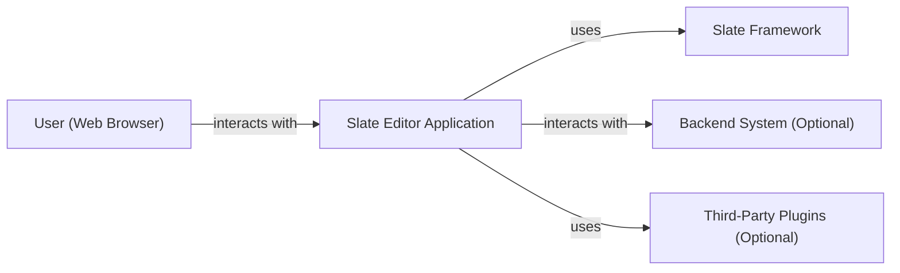
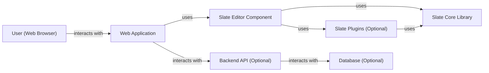
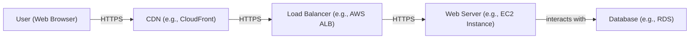
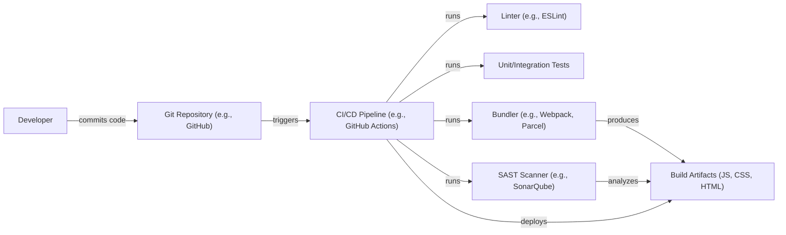

Okay, let's create a design document for the Slate project, a rich text editor framework.

# BUSINESS POSTURE

Slate is a framework for building rich-text editors. It's not a ready-to-use editor, but a highly customizable foundation. This suggests a business posture focused on developers and organizations needing very specific editor behaviors and integrations, rather than end-users looking for a drop-in solution.

Priorities:

*   Flexibility and Customizability:  The core value proposition is the ability to tailor the editor to precise needs.
*   Developer Experience:  Ease of use for developers integrating and extending Slate is crucial.  Good documentation, clear APIs, and a supportive community are vital.
*   Maintainability and Extensibility: The project must be designed to evolve and adapt to new requirements and community contributions.
*   Performance:  The editor must be responsive and handle large documents efficiently, especially given its use in potentially complex applications.
*   Cross-browser Compatibility:  As a web-based framework, it must function correctly across major browsers.

Business Risks:

*   Complexity Overwhelm:  The high degree of customization could make the framework difficult to learn and use, hindering adoption.
*   Maintenance Burden:  Supporting a wide range of customizations and browser compatibility could strain maintainers.
*   Security Vulnerabilities:  As a rich-text editor handling user input, incorrect handling of data could lead to XSS or other injection vulnerabilities.  This is a *major* risk.
*   Competition:  Other rich-text editor frameworks exist, so Slate needs to maintain a competitive edge.
*   Lack of Standardization: Since it's a framework, implementations can vary wildly, making consistent security and behavior across different Slate-based editors difficult to guarantee.

# SECURITY POSTURE

Existing Security Controls (based on the GitHub repository and general knowledge of similar projects):

*   security control: Input Sanitization: Slate likely includes mechanisms to sanitize user input and prevent cross-site scripting (XSS) vulnerabilities. This is crucial for any rich-text editor. (Implicit in the nature of the project, needs verification in code/documentation).
*   security control: Schema Validation: Slate probably uses a schema to define valid document structures and prevent the insertion of malicious content. (Mentioned in documentation, needs detailed review).
*   security control: Community Scrutiny: Being an open-source project, Slate benefits from community review and contributions, potentially identifying and fixing security issues. (Implicit in open-source nature).
*   security control: Regular Updates: The project appears actively maintained, suggesting ongoing bug fixes and security patches. (Observed from commit history).

Accepted Risks:

*   accepted risk: Third-Party Plugin Vulnerabilities: Slate's plugin architecture introduces the risk of vulnerabilities in third-party plugins. Users are responsible for vetting the security of any plugins they use.
*   accepted risk: Implementation-Specific Vulnerabilities: Because Slate is a framework, the ultimate security of any editor built with it depends heavily on the specific implementation. Slate itself cannot guarantee the security of all applications built upon it.
*   accepted risk: Evolving Threat Landscape: New web vulnerabilities are constantly discovered. Continuous monitoring and updates are necessary.

Recommended Security Controls:

*   security control: Content Security Policy (CSP) Guidance: Provide clear guidance and examples for implementing a strong CSP in applications using Slate.
*   security control: Input Validation and Sanitization Examples: Offer comprehensive documentation and examples demonstrating secure input handling practices within Slate.
*   security control: Security Audits: Conduct regular security audits, both internal and external, to identify and address potential vulnerabilities.
*   security control: Dependency Management: Implement robust dependency management practices to minimize the risk of supply chain attacks. Use tools like Dependabot.
*   security control: Security-focused Examples: Create and maintain a set of examples showcasing secure configurations and best practices.

Security Requirements:

*   Authentication: Not directly applicable to Slate itself, as it's a client-side framework. Authentication is the responsibility of the embedding application.
*   Authorization: Similarly, authorization is handled by the embedding application. Slate might provide hooks for integrating with authorization systems, but it doesn't manage authorization itself.
*   Input Validation: *Crucial*. Slate must provide robust mechanisms for validating and sanitizing all user input to prevent XSS and other injection attacks. This includes handling pasted content, drag-and-drop operations, and direct keyboard input. The schema validation should be configurable and enforce strict rules.
*   Cryptography: Not directly applicable in most cases. If Slate is used to handle sensitive data, the embedding application should implement appropriate encryption at rest and in transit. Slate itself doesn't manage data storage or transmission.

# DESIGN

## C4 CONTEXT

Element Descriptions:

*   Element:
    *   Name: User (Web Browser)
    *   Type: Person
    *   Description: A person interacting with a web application that embeds the Slate editor.
    *   Responsibilities: Provides input to the editor, views and interacts with the content.
    *   Security controls: Browser security features (e.g., same-origin policy, CSP).

*   Element:
    *   Name: Slate Editor Application
    *   Type: Software System
    *   Description: A web application that integrates the Slate framework to provide rich-text editing capabilities.
    *   Responsibilities: Integrates Slate, handles user interactions, manages data persistence (potentially), implements application-specific logic.
    *   Security controls: Input validation, output encoding, CSP, application-specific security measures.

*   Element:
    *   Name: Slate Framework
    *   Type: Software System (Library)
    *   Description: The core Slate framework, providing the building blocks for creating rich-text editors.
    *   Responsibilities: Provides APIs for manipulating the editor's content and behavior, manages the editor's internal state, handles rendering.
    *   Security controls: Input sanitization, schema validation.

*   Element:
    *   Name: Backend System (Optional)
    *   Type: Software System
    *   Description: A backend system that the Slate Editor Application might interact with for data persistence, user authentication, or other services.
    *   Responsibilities: Stores and retrieves editor content, manages user accounts, provides other backend services.
    *   Security controls: Authentication, authorization, data validation, secure storage, network security.

*   Element:
    *   Name: Third-Party Plugins (Optional)
    *   Type: Software System (Library)
    *   Description: Optional plugins that extend Slate's functionality.
    *   Responsibilities: Provide additional features and customizations to the editor.
    *   Security controls: Depend on the specific plugin; developers must vet plugins for security.

## C4 CONTAINER

Element Descriptions:

*   Element:
    *   Name: User (Web Browser)
    *   Type: Person
    *   Description: A person interacting with the web application.
    *   Responsibilities: Provides input, views output.
    *   Security controls: Browser security features.

*   Element:
    *   Name: Web Application
    *   Type: Container (Web Application)
    *   Description: The main web application that embeds the Slate editor.
    *   Responsibilities: Handles user interface, integrates the Slate component, communicates with the backend (if any).
    *   Security controls: CSP, input validation, output encoding, application-specific security.

*   Element:
    *   Name: Slate Editor Component
    *   Type: Container (JavaScript Component)
    *   Description: A component within the web application that wraps the Slate framework.
    *   Responsibilities: Integrates Slate with the web application, handles events, manages data flow.
    *   Security controls: Input validation, integration with application security.

*   Element:
    *   Name: Slate Core Library
    *   Type: Container (JavaScript Library)
    *   Description: The core Slate framework code.
    *   Responsibilities: Provides the core editing functionality, manages the editor's internal state.
    *   Security controls: Input sanitization, schema validation.

*   Element:
    *   Name: Slate Plugins (Optional)
    *   Type: Container (JavaScript Library)
    *   Description: Optional plugins extending Slate's functionality.
    *   Responsibilities: Provide additional features.
    *   Security controls: Depend on the plugin; developers must vet plugins.

*   Element:
    *   Name: Backend API (Optional)
    *   Type: Container (API)
    *   Description: An API for interacting with backend services.
    *   Responsibilities: Handles data persistence, authentication, etc.
    *   Security controls: Authentication, authorization, input validation.

*   Element:
    *   Name: Database (Optional)
    *   Type: Container (Database)
    *   Description: A database for storing editor content and other data.
    *   Responsibilities: Stores and retrieves data.
    *   Security controls: Access controls, encryption, data validation.

## DEPLOYMENT

Possible Deployment Solutions:

1.  **Static Website Hosting (e.g., Netlify, AWS S3, GitHub Pages):**  Suitable for simple applications or demos where the Slate editor is part of a static website.
2.  **Cloud-Based Web Application Hosting (e.g., AWS Elastic Beanstalk, Google App Engine, Azure App Service):**  Suitable for more complex applications with backend services.
3.  **Containerized Deployment (e.g., Docker, Kubernetes):**  Suitable for applications requiring scalability, resilience, and complex infrastructure.
4.  **Serverless Deployment (e.g., AWS Lambda, Google Cloud Functions, Azure Functions):** Suitable for backend services supporting the Slate editor, especially for event-driven or API-based interactions.

Chosen Solution (for detailed description): Cloud-Based Web Application Hosting (e.g., AWS Elastic Beanstalk)

Element Descriptions:

*   Element:
    *   Name: User (Web Browser)
    *   Type: Person
    *   Description: End-user accessing the application.
    *   Responsibilities: Initiates requests to the application.
    *   Security controls: Browser security features, HTTPS.

*   Element:
    *   Name: CDN (e.g., CloudFront)
    *   Type: Infrastructure Node
    *   Description: Content Delivery Network for caching static assets.
    *   Responsibilities: Serves static content, reduces latency.
    *   Security controls: HTTPS, WAF (Web Application Firewall) integration.

*   Element:
    *   Name: Load Balancer (e.g., AWS ALB)
    *   Type: Infrastructure Node
    *   Description: Distributes traffic across multiple web servers.
    *   Responsibilities: Distributes load, improves availability.
    *   Security controls: HTTPS termination, SSL/TLS configuration, health checks.

*   Element:
    *   Name: Web Server (e.g., EC2 Instance)
    *   Type: Infrastructure Node
    *   Description: Hosts the web application code.
    *   Responsibilities: Executes application logic, serves dynamic content.
    *   Security controls: OS hardening, firewall, intrusion detection/prevention, regular patching.

*   Element:
    *   Name: Database (e.g., RDS)
    *   Type: Infrastructure Node
    *   Description: Stores application data.
    *   Responsibilities: Provides data persistence.
    *   Security controls: Access controls, encryption at rest and in transit, regular backups, database firewall.

## BUILD

The build process for a Slate-based application typically involves several steps, focusing on JavaScript bundling and potentially backend service compilation.

Build Process Description:
1.  **Code Commit:** A developer commits code changes to the Git repository.
2.  **CI/CD Trigger:** The commit triggers a CI/CD pipeline (e.g., GitHub Actions, Jenkins, CircleCI).
3.  **Linting:** A linter (e.g., ESLint) checks the code for style and potential errors.
4.  **Testing:** Unit and integration tests are executed to ensure code quality.
5.  **Bundling:** A bundler (e.g., Webpack, Parcel) packages the JavaScript, CSS, and HTML files into optimized bundles for deployment.
6.  **SAST Scanning:** A Static Application Security Testing (SAST) tool (e.g., SonarQube, Snyk) scans the code for potential security vulnerabilities.
7.  **Artifact Creation:** The bundler produces build artifacts (JS, CSS, HTML files).
8.  **Deployment:** The CI/CD pipeline deploys the build artifacts to the target environment (e.g., AWS S3, Netlify, a web server).

Security Controls in Build Process:

*   security control: Linting: Enforces coding standards and helps prevent common errors.
*   security control: Automated Testing: Detects bugs and regressions early in the development cycle.
*   security control: SAST Scanning: Identifies potential security vulnerabilities in the code.
*   security control: Dependency Management: Tools like npm audit or Dependabot help manage dependencies and identify known vulnerabilities in third-party libraries.
*   security control: Code Reviews: Manual code reviews provide an additional layer of security scrutiny.
*   security control: Infrastructure as Code (IaC): If using IaC (e.g., Terraform, CloudFormation), security configurations for the deployment environment are defined in code and can be version-controlled and reviewed.

# RISK ASSESSMENT

Critical Business Processes:

*   Content Creation and Editing: The core functionality of the editor must be reliable and secure.
*   Collaboration (if applicable): If the application supports collaborative editing, the integrity and confidentiality of the shared content must be protected.
*   Data Persistence (if applicable): If the application stores data, the storage mechanism must be secure and reliable.

Data Sensitivity:

*   User-Generated Content: The sensitivity of the content created within the Slate editor depends entirely on the application's use case. It could range from public blog posts to highly confidential documents. The application embedding Slate *must* handle data appropriately based on its sensitivity.
*   User Authentication Data (if applicable): If the application handles user authentication, credentials and related data must be protected with strong security measures. This is *not* Slate's responsibility.
*   Application Configuration Data: Configuration data, such as API keys or database credentials, must be stored securely and not exposed in the client-side code.

# QUESTIONS & ASSUMPTIONS

Questions:

*   What specific types of content will be created with Slate in this particular application? (This is crucial for determining data sensitivity and appropriate security measures.)
*   Will the application support collaborative editing? If so, what are the requirements for real-time collaboration and conflict resolution?
*   What is the expected scale of the application (number of users, amount of data)?
*   What are the specific compliance requirements (e.g., GDPR, HIPAA) that the application must meet?
*   Are there any existing security policies or guidelines that the application must adhere to?
*   What level of detail is available regarding input sanitization and schema validation within the Slate framework itself? (Requires deeper code/documentation review).
*   What is the process for reporting and addressing security vulnerabilities discovered in Slate or its dependencies?

Assumptions:

*   BUSINESS POSTURE: The primary users of Slate are developers building applications, not end-users.
*   BUSINESS POSTURE: The application embedding Slate will handle user authentication and authorization.
*   SECURITY POSTURE: Slate provides some level of input sanitization and schema validation, but the embedding application is ultimately responsible for ensuring security.
*   SECURITY POSTURE: Third-party plugins are the responsibility of the application developer to vet and secure.
*   DESIGN: The application will likely use a backend system for data persistence, but this is optional.
*   DESIGN: The deployment environment will be a cloud-based platform, but other options are possible.
*   DESIGN: The build process will include automated testing and security scanning.
*   DESIGN: The application developer is responsible for implementing appropriate security measures based on the sensitivity of the data being handled.