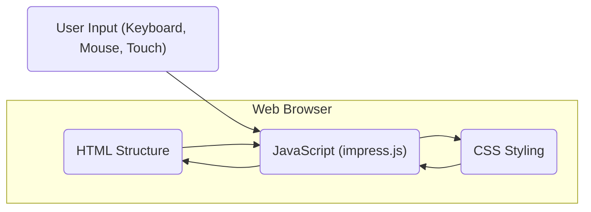
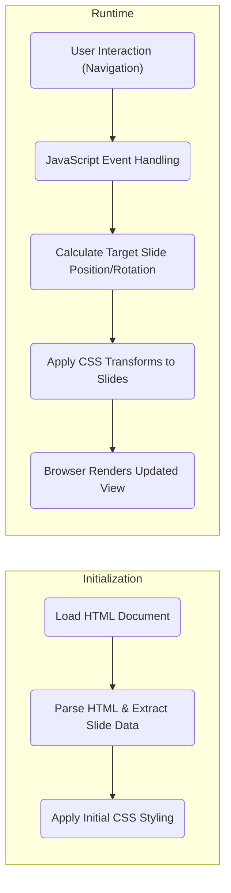

# Project Design Document: impress.js

**Version:** 1.1
**Date:** October 26, 2023
**Author:** AI Software Architect

## 1. Introduction

This document provides a detailed architectural design of the impress.js project, a client-side JavaScript library enabling the creation of compelling presentation websites. It leverages CSS3 transformations and transitions within modern web browsers to deliver a dynamic and engaging user experience. This document serves as a foundational resource for understanding the system's constituent parts, their interactions, and inherent security considerations, specifically tailored for subsequent threat modeling activities.

## 2. Goals and Non-Goals

**Goals:**

*   Articulate a clear and comprehensive architectural overview of impress.js.
*   Pinpoint the essential components and delineate their respective responsibilities.
*   Illustrate the flow of data within the system's operation.
*   Highlight potential security considerations arising from the architectural design.
*   Establish a solid basis for conducting thorough threat modeling exercises.

**Non-Goals:**

*   Provide granular, code-level implementation specifics.
*   Offer concrete security hardening recommendations (these will be addressed during the dedicated threat modeling phase).
*   Document the project's historical evolution or track specific version changes.
*   Conduct a comparative analysis of impress.js against alternative presentation frameworks.

## 3. System Architecture

impress.js is fundamentally a client-side JavaScript library, meaning it executes entirely within the user's web browser. Its core functionality revolves around manipulating HTML elements (representing slides) in a 3D space using CSS transformations. The library intercepts user input to facilitate navigation between these slides, creating a dynamic presentation experience.

### 3.1. High-Level Overview

At its core, impress.js functions by transforming and positioning HTML elements, designated as slides, within a conceptual 3D environment. This manipulation, driven by user interaction, creates visually rich presentation sequences. The library listens for and responds to user input events (keyboard strokes, mouse actions, touch gestures) to transition between these defined slides.

### 3.2. Component Breakdown

*   **HTML Structure:**
    *   Serves as the blueprint for the presentation's content, with individual slides marked up as distinct HTML elements, typically `
` elements.
    *   Employs specific `data-*` attributes on these slide elements (`data-x`, `data-y`, `data-z` for positioning; `data-rotate-x`, `data-rotate-y`, `data-rotate-z` for rotation; `data-scale` for scaling) to define their spatial properties in the 3D space.
    *   Includes a designated root element, conventionally assigned the ID `impress`, which acts as the overarching container for all presentation slides.
    *   References the `impress.js` script file and may include links to custom CSS stylesheets for visual styling.

*   **CSS Styling:**
    *   Dictates the visual presentation of the slides, encompassing aspects like typography, color palettes, and overall layout.
    *   Defines CSS transitions and transforms that `impress.js` dynamically manipulates to animate the transitions between slides, providing a smooth visual flow.
    *   May incorporate custom CSS rules to further tailor the presentation's aesthetic appearance.

*   **JavaScript (impress.js):**
    *   This is the central component, the core library responsible for the dynamic behavior of the presentation. Its key responsibilities include:
        *   **HTML Parsing and Data Extraction:** Analyzing the HTML structure to identify slide elements and extracting their positioning, rotation, and scaling information from the `data-*` attributes.
        *   **State Management:** Maintaining the current state of the presentation, specifically tracking the currently active slide.
        *   **User Input Handling:**  Listening for and processing user input events originating from keyboard interactions, mouse clicks, and touch gestures to facilitate navigation between slides.
        *   **CSS Transformation Application:**  Dynamically applying CSS `transform` properties to the slide elements to orchestrate the animated transitions and positioning effects.
        *   **API Provision:** Offering a JavaScript API that allows developers to programmatically interact with and control the presentation's behavior.
        *   **Plugin Support:**  Potentially incorporating and managing plugins that extend the core functionality of impress.js.

*   **Web Browser:**
    *   Acts as the runtime environment where impress.js is executed. It is responsible for:
        *   Rendering the HTML structure and applying the defined CSS styles to visually present the content.
        *   Executing the JavaScript code provided by the `impress.js` library.
        *   Providing essential browser APIs, including the Document Object Model (DOM) for manipulating HTML elements, the CSS Object Model (CSSOM) for interacting with styles, event listeners for capturing user interactions, and `requestAnimationFrame` for smooth animations.

### 3.3. Component Interactions

*   **User Input -> JavaScript:** User interactions are initially captured by the web browser and subsequently handled by event listeners registered within the `impress.js` library.
*   **HTML Structure -> JavaScript:** `impress.js` parses the HTML document to identify elements designated as slides and extract their associated attributes, particularly the `data-*` attributes defining their spatial properties.
*   **CSS Styling -> JavaScript:** While `impress.js` doesn't directly modify the CSS files themselves, it relies heavily on the CSS definitions for styling and, crucially, manipulates CSS `transform` properties to achieve the animation effects.
*   **JavaScript -> HTML Structure:** `impress.js` dynamically modifies the Document Object Model (DOM) by applying inline `style` attributes, specifically setting the `transform` property on slide elements to control their position, rotation, and scale.
*   **JavaScript -> CSS Styling:**  As mentioned, `impress.js` leverages the existing CSS definitions for transitions and visual styling, ensuring a consistent and visually appealing presentation.

## 4. Data Flow

The primary data flow within an impress.js presentation centers around the interpretation of the HTML structure and the processing of user input to dynamically manipulate the visual presentation of the slides.

1. **Initialization:**
    *   The web browser initiates the process by loading the HTML document that constitutes the impress.js presentation.
    *   The `impress.js` library then parses the loaded HTML, specifically identifying elements designated as slides and extracting their positioning and transformation data from the embedded `data-*` attributes.
    *   The web browser applies the initial CSS styling rules as defined in the linked stylesheets, setting the visual foundation for the presentation.

2. **Runtime:**
    *   The user interacts with the presentation, for example, by pressing arrow keys on the keyboard or clicking on navigation elements within the presentation.
    *   The web browser captures these user-initiated events, and the corresponding event handlers within the `impress.js` library are triggered.
    *   Based on the specific user input and the current state of the presentation (i.e., the currently active slide), `impress.js` calculates the target position, rotation, and scale for the next slide to be displayed.
    *   `impress.js` then updates the inline `transform` styles of the relevant slide elements. This modification triggers the CSS transitions defined in the stylesheets, creating the animated effect of moving between slides.
    *   Finally, the web browser re-renders the view, displaying the updated presentation with the animated transition to the next slide.

## 5. Security Considerations

Being a client-side library, impress.js inherently has a relatively limited attack surface compared to server-side applications. However, potential security vulnerabilities can still arise from how the library is implemented and the context in which it is used.

*   **Cross-Site Scripting (XSS):**
    *   A significant risk arises if the content displayed within the impress.js presentation originates from untrusted sources. Malicious scripts embedded within this content could be executed within the user's browser, potentially leading to various security breaches.
    *   This is a primary concern due to impress.js's fundamental role in rendering arbitrary HTML content.

*   **Content Security Policy (CSP) Misconfiguration:**
    *   An improperly configured CSP can create security vulnerabilities. A CSP that is too restrictive might inadvertently block legitimate impress.js functionality, while an overly permissive CSP could fail to adequately prevent XSS attacks.

*   **Dependency Vulnerabilities:**
    *   While impress.js itself has few direct dependencies, any dependencies it might have (or that are introduced through plugins) could contain known vulnerabilities. Exploiting these vulnerabilities could compromise the security of the presentation.

*   **Clickjacking:**
    *   An attacker could potentially embed an impress.js presentation within a malicious website using techniques like iframes. By overlaying deceptive interactive elements, the attacker could trick users into performing unintended actions within the embedded presentation.

*   **Data Exposure (within presentation content):**
    *   Sensitive information should never be directly embedded within the client-side HTML of an impress.js presentation. The entire HTML source code is readily accessible to anyone viewing the page, making any embedded sensitive data easily exposed.

*   **Third-Party Plugin Vulnerabilities:**
    *   If the impress.js implementation utilizes third-party plugins to extend its functionality, vulnerabilities present within those plugins could introduce security risks to the presentation. The security of these external components is crucial.

## 6. Deployment Considerations

impress.js presentations are typically deployed as static websites, commonly hosted on standard web servers or distributed via Content Delivery Networks (CDNs).

*   **Static Hosting:** The most prevalent deployment method involves serving the static HTML, CSS, and JavaScript files directly from a web server. Key security considerations for static hosting include:
    *   **Proper Server Configuration:** Ensuring the web server is securely configured to prevent unauthorized access and information disclosure.
    *   **Access Controls:** Implementing appropriate access controls to restrict who can modify the presentation files.
    *   **HTTPS Enforcement:** Serving the presentation over HTTPS to encrypt communication and protect against eavesdropping and man-in-the-middle attacks.

*   **Content Delivery Networks (CDNs):** Utilizing a CDN can significantly improve performance by distributing the presentation files across geographically diverse servers. However, this introduces a dependency on the CDN provider. Security considerations when using CDNs include:
    *   **CDN Security Practices:** Trusting the CDN provider to maintain the security and integrity of the hosted files.
    *   **Subresource Integrity (SRI):** Implementing SRI tags in the HTML to ensure that the browser only executes JavaScript or CSS files from the CDN if the fetched files match a known cryptographic hash, mitigating the risk of compromised CDN content.

*   **Embedding in Web Applications:** impress.js presentations can be embedded within larger, more complex web applications. In such scenarios, it's crucial to consider the security context of the encompassing web application. Potential issues include:
    *   **Integration Vulnerabilities:** Ensuring that the integration between the impress.js presentation and the parent application does not introduce new security vulnerabilities.
    *   **Contextual Security Policies:** Adhering to the security policies and practices of the parent web application.

## 7. Future Considerations

*   **Potential for Server-Side Rendering (SSR):** While currently a purely client-side library, future developments or extensions of impress.js might explore incorporating server-side rendering techniques. This could potentially improve Search Engine Optimization (SEO) and initial page load performance but would introduce new architectural components and associated security considerations.

*   **Enhanced Plugin Architecture:** Developing a more robust and extensible plugin architecture could allow for greater customization and functionality. However, this would also necessitate careful management of plugin security to prevent the introduction of vulnerabilities.

*   **Accessibility Improvements:** Future development efforts might focus on enhancing the accessibility features of impress.js presentations, making them more usable for individuals with disabilities. This could involve modifications to the underlying HTML structure and JavaScript logic.

This document provides a detailed and improved overview of the impress.js architecture, serving as a solid foundation for conducting a thorough and effective threat modeling exercise. By clearly understanding the components, data flow, and potential security considerations inherent in the design, we can proactively identify and mitigate potential risks associated with the use of impress.js.