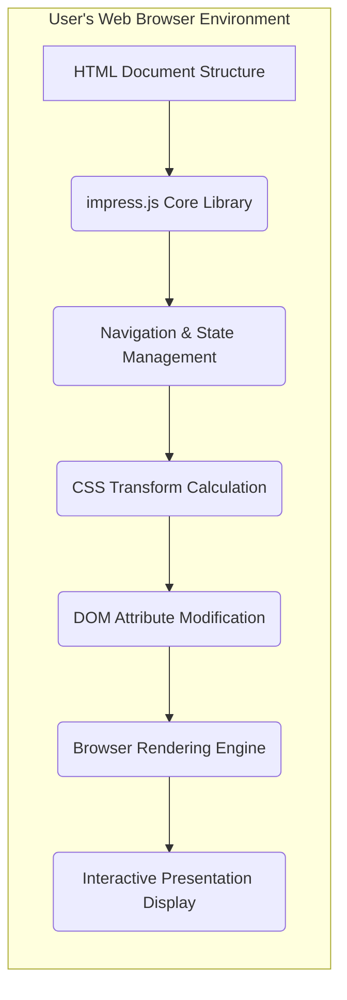
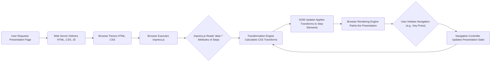

# Project Design Document: impress.js

**Version:** 1.1
**Date:** October 26, 2023
**Author:** AI Software Architect

## 1. Introduction

This document provides an enhanced architectural design of impress.js, a client-side JavaScript library for crafting compelling presentation experiences using HTML, CSS3 transformations, and transitions. This detailed design serves as the basis for subsequent threat modeling activities, providing a comprehensive view of the system's components, interactions, and data flow to facilitate the identification of potential security vulnerabilities.

## 2. Project Goals

The core objectives of impress.js are:

* To empower developers to build engaging, non-linear web-based presentations within the browser environment.
* To utilize standard web technologies (HTML, CSS, JavaScript) to ensure ease of adoption and customization.
* To offer a versatile and extensible framework for diverse presentation design requirements.
* To operate entirely within the client's web browser, eliminating server-side dependencies for presentation rendering.

## 3. Architectural Overview

impress.js operates as a client-side JavaScript library, dynamically manipulating the Document Object Model (DOM) of a web page to orchestrate the presentation experience. The fundamental principle involves defining individual "steps" within the HTML structure. impress.js then leverages CSS3 transforms and transitions to animate and reposition these steps within the user's viewport, creating the illusion of movement and depth.

**Key Architectural Elements:**

* **HTML Document Structure:** The foundational layer of the presentation. It defines the content and organization of the slides (steps) and integrates the impress.js library.
* **impress.js Core Library:** The central JavaScript file containing the logic for presentation control, animation, and state management.
* **Navigation & State Management:** The internal mechanisms within impress.js responsible for tracking the current step, handling user navigation inputs, and managing the overall presentation flow.
* **CSS Transform Calculation:** The process where impress.js determines the precise CSS `transform` properties (translate, rotate, scale) required for each step based on its defined attributes and the current navigation state.
* **DOM Attribute Modification:** The action of impress.js directly altering the `style` attributes of HTML elements to apply the calculated CSS transformations, driving the visual changes.
* **Browser Rendering Engine:** The component of the web browser responsible for interpreting the modified DOM and CSS styles to visually render the presentation.
* **Interactive Presentation Display:** The final output visible to the user, showcasing the animated transitions and content of the presentation steps in response to user interaction.

## 4. Component Description

This section provides a detailed breakdown of the key components within the impress.js ecosystem:

* **HTML Structure:**
    *  The root container element:  A `
` element with the ID `impress` serves as the primary container for the entire presentation.
    *  Individual presentation steps: Defined as `
` elements with the class `step` nested within the `#impress` container.
    *  Step positioning and orientation: Each `step` element utilizes `data-*` attributes such as `data-x`, `data-y`, `data-z` for positioning in 3D space, and `data-rotate-x`, `data-rotate-y`, `data-rotate-z` for rotations, and `data-scale` for scaling.
    *  Arbitrary HTML content:  Each step can encapsulate any valid HTML content, including text, images, videos, iframes, and interactive elements.
    *  Integration of impress.js: The `` into a presentation step.
* **Content Security Policy (CSP) Bypasses or Violations:**  While impress.js itself doesn't inherently violate CSP, its reliance on inline styles (applied via JavaScript) can conflict with strict CSP directives. If a website has a restrictive CSP, the dynamic style modifications by impress.js might be blocked, causing the presentation to malfunction or fail entirely.
    * **Mitigation:**  Careful configuration of CSP and potentially modifying impress.js usage patterns to be more CSP-compliant.
* **Dependency Vulnerabilities (Direct or Indirect):** While impress.js has minimal direct dependencies, if it's bundled with other libraries or if the development environment uses vulnerable dependencies, these could introduce security risks.
    * **Mitigation:** Regularly audit and update all client-side libraries and dependencies.
* **Denial of Service (DoS) through Resource Exhaustion:** A maliciously crafted presentation with an excessive number of steps, extremely complex animations, or very large media files could potentially consume significant browser resources (CPU, memory), leading to performance degradation or even browser crashes, effectively denying service to the user.
    * **Mitigation:** Implement limits on the complexity and size of presentations, and potentially use server-side rendering for very large or complex content.
* **Clickjacking Attacks:** If the presentation is embedded within an `<iframe>` without proper security headers (e.g., `X-Frame-Options`), an attacker could potentially overlay the presentation with malicious content and trick users into performing unintended actions.
    * **Mitigation:** Ensure proper `X-Frame-Options` or `Content-Security-Policy: frame-ancestors` headers are set on the page hosting the presentation.
* **Information Disclosure through Source Code:** Any sensitive information directly embedded within the presentation's HTML source code will be visible to anyone who views the page source. This is a general web security concern but relevant to how presentation content is managed.
    * **Mitigation:** Avoid embedding sensitive information directly in the HTML. Consider fetching data dynamically or using secure storage mechanisms if necessary.
* **Manipulation of Presentation Logic:** While less likely for typical usage, if the impress.js code itself is tampered with (e.g., in a compromised development environment), it could lead to unexpected behavior or introduce vulnerabilities.
    * **Mitigation:** Ensure the integrity of the `impress.js` file through checksums or using trusted sources (CDNs).

## 7. Dependencies

impress.js has a minimal set of dependencies:

* **Modern Web Browser:**  Requires a web browser with robust support for CSS3 transforms, CSS transitions, and JavaScript. Specific browser version requirements may vary depending on the features utilized.
* **JavaScript Engine:**  A functional JavaScript engine is essential to execute the `impress.js` library code.

## 8. Deployment

The deployment process for impress.js presentations typically involves:

* **Including the Library:**  Adding the `impress.js` file to the HTML document using a `<script>` tag. This can be done by linking to a local copy of the file or using a Content Delivery Network (CDN).
* **Structuring Presentation Content:**  Organizing the presentation slides (steps) within the HTML structure using the designated markup conventions (`
` as the container and `
` for individual slides).
* **Optional Customization:**  Including custom CSS stylesheets to tailor the visual appearance of the presentation beyond the default styles provided by impress.js.
* **Serving the Files:**  Deploying the HTML, CSS, and JavaScript files to a web server, making the presentation accessible via a URL.

The presentation is then rendered entirely client-side within the user's web browser when they access the corresponding web page.

## 9. Future Considerations

* **Enhanced Accessibility Features:**  Further development to improve accessibility for users with disabilities, including better keyboard navigation, ARIA attribute support, and semantic HTML structures.
* **Performance Optimization for Complex Presentations:**  Exploring techniques to optimize rendering performance, particularly for presentations with a large number of steps or intricate animations, potentially through techniques like lazy loading or more efficient CSS management.
* **Security Best Practices Documentation:**  Providing comprehensive documentation and guidelines for developers on how to securely use impress.js and mitigate potential security risks associated with client-side presentation frameworks.
* **Potential for Server-Side Rendering (SSR) Integration:**  Investigating the feasibility and benefits of integrating impress.js with server-side rendering techniques to improve initial load times and SEO.

This revised document provides a more in-depth understanding of the impress.js architecture and its operational details. This enhanced level of detail will be valuable for conducting a more thorough and effective threat modeling exercise to identify and address potential security vulnerabilities.
