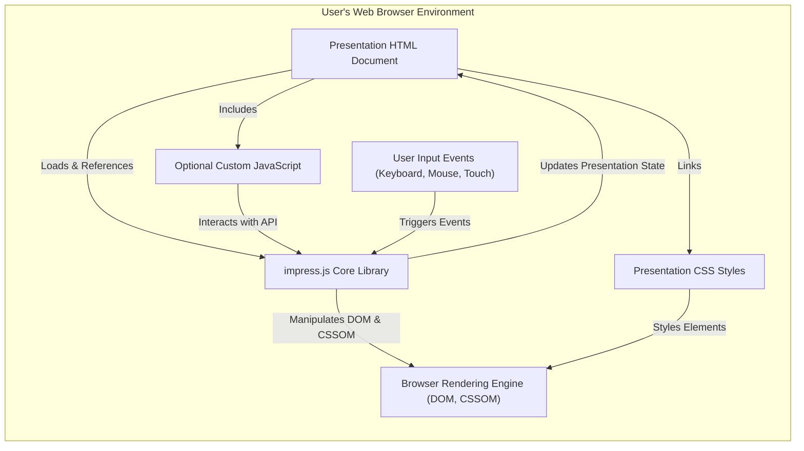
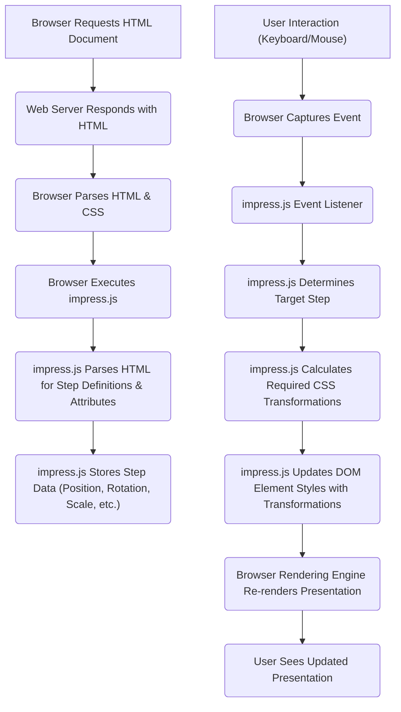

## Project Design Document: impress.js (Improved)

**1. Introduction**

This document provides an enhanced design overview of the impress.js project, a client-side JavaScript library enabling the creation of dynamic, presentation-like web experiences using CSS3 transformations and transitions. This document is specifically tailored to facilitate comprehensive threat modeling activities. It offers a detailed examination of the architecture, key components, and data flow within the impress.js ecosystem, with a strong emphasis on potential security implications.

**2. Goals and Objectives**

*   Deliver a refined and more detailed description of the impress.js project's architecture and functionality.
*   Provide a clearer understanding of the interactions between key components.
*   Offer a more granular depiction of the data flow, highlighting potential security-sensitive points.
*   Establish a robust foundation for effective and targeted threat modeling exercises.
*   Serve as an improved reference for security assessments, development planning, and ongoing maintenance.

**3. Project Overview**

impress.js is a front-end JavaScript library that empowers developers to build visually compelling presentations directly within the web browser. Unlike traditional slide-based approaches, impress.js leverages CSS3 transformations (translate, rotate, scale) and transitions to animate HTML elements, creating a more engaging and spatial presentation experience. Presentations are self-contained within a single HTML document, where individual "steps" (representing slides or points of focus) are defined as HTML elements. These elements utilize `data-*` attributes to specify their position, orientation, and size in a 3D space, which impress.js then manipulates to create the presentation flow. The library operates entirely on the client-side, requiring no server-side processing for its core functionality.

**4. Architecture**

The architectural design of impress.js is fundamentally client-side, operating entirely within the user's web browser. The core interaction revolves around the browser interpreting and manipulating the provided HTML, CSS, and JavaScript.

**5. Detailed Component Description**

*   **Presentation HTML Document:**
    *   Serves as the primary container and definition of the presentation's structure and content.
    *   Defines individual presentation steps using HTML elements (typically `
` or similar).
    *   Crucially, utilizes `data-x`, `data-y`, `data-z`, `data-rotate-x`, `data-rotate-y`, `data-rotate-z`, and `data-scale` attributes to define the 3D positioning and scaling of each step.
    *   Includes the `<script>` tag to load and execute the `impress.js` library.
    *   May contain links to external CSS stylesheets for styling.
    *   Can embed inline CSS styles.
    *   May include inline JavaScript or links to external JavaScript files for custom behavior.

*   **impress.js Core Library:**
    *   The central JavaScript file (`impress.js`) responsible for the core presentation logic.
    *   On initialization, it parses the HTML document to identify elements designated as presentation steps based on specific CSS selectors or attributes.
    *   It reads and interprets the `data-*` attributes associated with each step to determine its position, rotation, and scale in 3D space.
    *   Manages the current state of the presentation, including the active step.
    *   Handles navigation between steps, typically triggered by user input events.
    *   Dynamically applies CSS transformations and transitions to the step elements to create the animated presentation flow.
    *   Provides a JavaScript API that allows developers to programmatically control the presentation, navigate between steps, and interact with the library's functionality.

*   **Presentation CSS Styles:**
    *   CSS files (external or inline) are used to style the visual appearance of the presentation elements.
    *   This includes styling the individual steps, defining transition effects (though impress.js handles the core transformations), and controlling the overall layout and aesthetics.
    *   Can be used to customize the default look and feel provided by impress.js.

*   **Optional Custom JavaScript:**
    *   Developers can include custom JavaScript code to enhance the presentation's functionality and interactivity.
    *   This code can interact with the impress.js API to implement custom navigation logic, add dynamic content updates, integrate with external services, or create interactive elements within the presentation steps.
    *   May involve the use of external JavaScript libraries or frameworks.

*   **Browser Rendering Engine (DOM, CSSOM):**
    *   The web browser's rendering engine is responsible for interpreting the HTML (Document Object Model), CSS (CSS Object Model), and JavaScript.
    *   It applies the CSS transformations and transitions calculated by impress.js to the DOM elements, rendering the visual output of the presentation.
    *   Handles the compositing and painting of the different layers and elements to create the final visual experience.

*   **User Input Events (Keyboard, Mouse, Touch):**
    *   Users interact with the presentation primarily through keyboard events (e.g., arrow keys, spacebar, Page Up/Down), mouse clicks, and touch gestures (on touch-enabled devices).
    *   These events are captured by the browser and passed to the `impress.js` library's event listeners.
    *   `impress.js` interprets these events to determine the desired navigation action (e.g., moving to the next or previous step).

**6. Data Flow (Detailed)**

The data flow within an impress.js presentation involves the browser loading and processing the presentation files and responding to user interactions.

*   **Browser Requests HTML Document:** The user navigates to the URL of the impress.js presentation, and the browser sends a request to the web server.
*   **Web Server Responds with HTML:** The web server serves the HTML document containing the presentation structure, CSS links, and the `impress.js` script.
*   **Browser Parses HTML & CSS:** The browser parses the HTML to build the DOM and the CSS to build the CSSOM.
*   **Browser Executes impress.js:** The browser executes the `impress.js` JavaScript code.
*   **impress.js Parses HTML for Step Definitions & Attributes:**  `impress.js` analyzes the DOM to identify elements marked as presentation steps and extracts their `data-*` attributes.
*   **impress.js Stores Step Data:** The extracted positioning and transformation data for each step is stored in the library's internal state.
*   **User Interaction (Keyboard/Mouse):** The user interacts with the presentation (e.g., presses an arrow key).
*   **Browser Captures Event:** The browser captures the user input event.
*   **impress.js Event Listener:** `impress.js` has event listeners attached to the document to intercept relevant user input events.
*   **impress.js Determines Target Step:** Based on the captured event, `impress.js` determines the next step to navigate to.
*   **impress.js Calculates Required CSS Transformations:** `impress.js` calculates the necessary CSS `transform` property values to smoothly transition from the current step to the target step.
*   **impress.js Updates DOM Element Styles with Transformations:** `impress.js` directly manipulates the `style` attribute or CSS classes of the relevant HTML elements to apply the calculated transformations.
*   **Browser Rendering Engine Re-renders Presentation:** The browser's rendering engine detects the changes to the DOM and CSSOM and re-renders the presentation, applying the CSS transformations and transitions.
*   **User Sees Updated Presentation:** The user observes the animated transition to the next step of the presentation.

**7. Key Components for Threat Modeling (Expanded)**

This section highlights the key components that require careful consideration during threat modeling, along with specific examples of potential threats:

*   **Presentation HTML Document:**
    *   **Cross-Site Scripting (XSS):** If the HTML document includes user-generated content or data from untrusted sources without proper sanitization, malicious scripts could be injected and executed in the user's browser.
    *   **Inclusion of Malicious Scripts/Links:**  The HTML could intentionally or unintentionally include links to malicious websites or embed harmful scripts.
    *   **Sensitive Information Exposure:**  Directly embedding sensitive data within the HTML source code makes it vulnerable to unauthorized access.
    *   **Clickjacking:** The presentation could be framed within a malicious website, tricking users into performing unintended actions.

*   **impress.js Core Library:**
    *   **Client-Side Logic Vulnerabilities:** Potential flaws in the library's JavaScript code could be exploited to manipulate the presentation flow, execute arbitrary code, or cause denial-of-service.
    *   **DOM Manipulation Vulnerabilities:**  Improper handling of DOM manipulation could lead to XSS vulnerabilities or unexpected behavior.
    *   **Dependency Vulnerabilities:** If `impress.js` relies on other client-side libraries, vulnerabilities in those dependencies could affect the security of the presentation.
    *   **Version Vulnerabilities:** Using an outdated version of `impress.js` with known security flaws exposes the presentation to those vulnerabilities.

*   **Presentation CSS Styles:**
    *   **CSS Injection Attacks:** While less common, malicious CSS could potentially be injected to alter the presentation's appearance in a way that tricks users or attempts to exfiltrate data (e.g., through CSS attribute selectors and timing attacks).
    *   **Denial of Service (CSS Bomb):**  Extremely complex or inefficient CSS could potentially cause the browser to become unresponsive.

*   **Optional Custom JavaScript:**
    *   **Cross-Site Scripting (XSS):** Custom JavaScript code is a common source of XSS vulnerabilities if it handles user input or data from external sources without proper sanitization.
    *   **Insecure API Calls:** Custom JavaScript might make insecure calls to external APIs, potentially exposing sensitive data or allowing unauthorized actions.
    *   **Logic Errors:** Flaws in the custom JavaScript logic could lead to unexpected behavior or security vulnerabilities.
    *   **Dependency Vulnerabilities:**  External JavaScript libraries used in custom code could introduce vulnerabilities.

*   **User Interaction:**
    *   **Input Validation Issues:** If user input is used to control aspects of the presentation (e.g., through custom JavaScript), lack of proper validation could lead to vulnerabilities.
    *   **Event Handling Vulnerabilities:**  Improper handling of user input events could potentially be exploited.

**8. Security Considerations (Detailed)**

This section expands on the initial security considerations, providing more context and specific examples:

*   **Cross-Site Scripting (XSS) Prevention:**
    *   Strictly sanitize any user-generated content or data from untrusted sources before including it in the presentation.
    *   Utilize a Content Security Policy (CSP) to restrict the sources from which the browser is allowed to load resources, mitigating the impact of XSS attacks.
    *   Avoid using inline JavaScript event handlers (e.g., `onclick=""`) as they are more susceptible to XSS.

*   **Dependency Management and Vulnerability Scanning:**
    *   Keep the `impress.js` library and any other client-side dependencies up-to-date to patch known security vulnerabilities.
    *   Utilize tools and processes for scanning dependencies for known vulnerabilities.
    *   Implement Subresource Integrity (SRI) for external resources (including `impress.js` and other libraries) to ensure that the files loaded have not been tampered with.

*   **Content Security Policy (CSP) Implementation:**
    *   Implement a restrictive CSP that allows only necessary resources to be loaded.
    *   Carefully configure directives like `script-src`, `style-src`, `img-src`, and `connect-src` to minimize the attack surface.

*   **Subresource Integrity (SRI):**
    *   Use SRI tags for all external JavaScript and CSS files to ensure their integrity and prevent the loading of compromised resources.

*   **Sensitive Data Handling:**
    *   Avoid embedding sensitive information directly in the HTML, CSS, or client-side JavaScript code.
    *   If sensitive data is absolutely necessary, consider retrieving it securely from a backend server only when needed and for the shortest possible duration.

*   **Clickjacking Mitigation:**
    *   Implement frame busting techniques or use HTTP headers like `X-Frame-Options` or the `Content-Security-Policy` `frame-ancestors` directive to prevent the presentation from being embedded in malicious iframes.

*   **Input Validation and Sanitization:**
    *   If custom JavaScript code handles user input, rigorously validate and sanitize that input to prevent injection attacks.

*   **Regular Security Audits and Testing:**
    *   Conduct regular security audits and penetration testing of presentations, especially those that handle sensitive data or are publicly accessible.

**9. Future Considerations**

*   Exploration of server-side rendering or pre-rendering techniques to improve initial load times and SEO, while carefully considering the security implications of introducing server-side components.
*   Potential integration with backend authentication and authorization systems for presentations that require restricted access.
*   Further development of the impress.js API to provide more secure and controlled ways for developers to extend its functionality.

This improved design document provides a more detailed and security-focused overview of the impress.js project. It serves as a more robust foundation for conducting thorough threat modeling and developing effective security mitigation strategies.