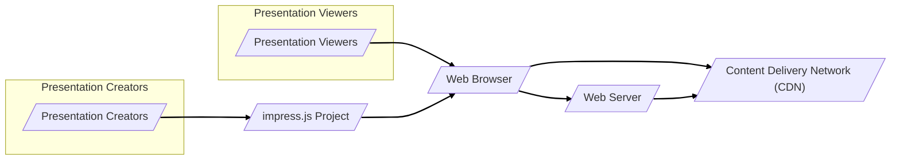
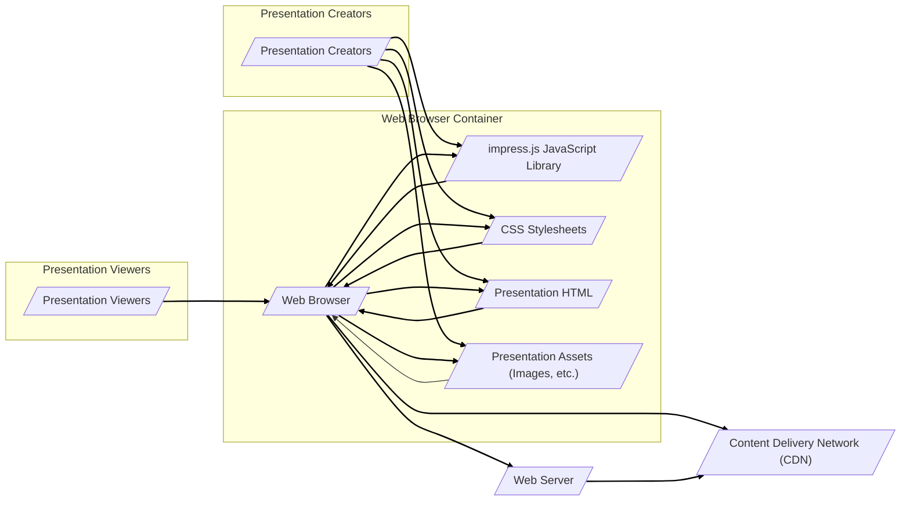
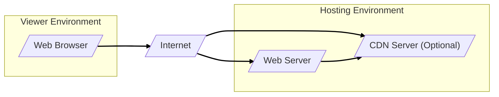
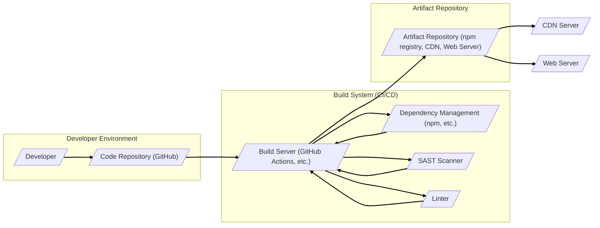

# BUSINESS POSTURE

This project, impress.js, is a JavaScript presentation framework that allows users to create visually engaging presentations using CSS3 transforms and transitions.

- Business Priorities and Goals:
  - Enable users to create dynamic and visually appealing presentations.
  - Provide an open-source, customizable alternative to traditional slide-based presentation software.
  - Foster a community around creative web-based presentations.
  - Offer a lightweight and flexible solution for web-based presentations.

- Business Risks:
  - Reputational damage if the framework is found to have security vulnerabilities that lead to website compromise or user data exposure (if presentations handle user data).
  - Risk of supply chain attacks if dependencies are compromised, affecting users who rely on the framework.
  - Risk of reduced adoption if the framework is perceived as insecure or unreliable.
  - Risk of intellectual property infringement if the framework incorporates code or concepts that violate existing patents or copyrights.

# SECURITY POSTURE

- Existing Security Controls:
  - security control: Open Source Review - The project is open source, allowing for community review of the code. Implemented: GitHub repository and community contributions.
  - security control: Dependency Management - Project uses standard JavaScript dependency management practices (likely npm or similar). Implemented: package.json and build process.
  - security control: Client-Side Execution - The framework runs entirely client-side, reducing server-side attack surface. Implemented: Design of impress.js as a client-side library.

- Accepted Risks:
  - accepted risk: Client-Side Vulnerabilities - As a client-side JavaScript framework, it is inherently susceptible to client-side vulnerabilities such as Cross-Site Scripting (XSS) if used improperly or if vulnerabilities are discovered in the framework itself.
  - accepted risk: Browser Security Reliance - Security relies heavily on the security features and policies of modern web browsers.
  - accepted risk: Third-Party Dependency Vulnerabilities - Vulnerabilities in third-party dependencies could be introduced into the framework.

- Recommended Security Controls:
  - security control: Dependency Scanning - Implement automated dependency scanning to identify and address known vulnerabilities in third-party libraries.
  - security control: Static Application Security Testing (SAST) - Integrate SAST tools into the build process to automatically scan the codebase for potential security vulnerabilities.
  - security control: Content Security Policy (CSP) - Encourage users to implement CSP in websites embedding impress.js presentations to mitigate XSS risks.
  - security control: Subresource Integrity (SRI) - Recommend and potentially provide SRI hashes for impress.js and its dependencies when served from CDNs to ensure integrity and prevent tampering.

- Security Requirements:
  - Authentication: Not directly applicable to impress.js itself as it is a client-side framework. Authentication might be relevant for systems that manage or host impress.js presentations, but not for the core library.
  - Authorization: Not directly applicable to impress.js itself. Authorization would be relevant for systems managing access to presentations created with impress.js.
  - Input Validation: While impress.js primarily renders HTML and CSS, if there are any features that accept user input (e.g., through JavaScript APIs), proper input validation is crucial to prevent injection attacks. Users of impress.js should be educated on the importance of sanitizing any user-provided content they incorporate into their presentations.
  - Cryptography: Cryptography is not a core requirement for impress.js functionality. However, if presentations handle sensitive data, encryption in transit (HTTPS) and potentially encryption at rest (if presentations are stored) would be relevant considerations for the hosting environment, not impress.js itself.

# DESIGN

## C4 CONTEXT

- Context Diagram Elements:
  - Element:
    - Name: Presentation Viewers
    - Type: Person
    - Description: Individuals who view presentations created with impress.js.
    - Responsibilities: View presentations in a web browser.
    - Security controls: Web browser security controls (e.g., same-origin policy, CSP enforcement).

  - Element:
    - Name: Presentation Creators
    - Type: Person
    - Description: Individuals who develop and create presentations using impress.js.
    - Responsibilities: Write HTML, CSS, and JavaScript to build impress.js presentations.
    - Security controls: Secure coding practices, local development environment security.

  - Element:
    - Name: impress.js Project
    - Type: Software System
    - Description: The impress.js open-source JavaScript library for creating web-based presentations.
    - Responsibilities: Provide the core JavaScript framework for creating dynamic presentations.
    - Security controls: Code reviews, dependency scanning, SAST, release integrity (e.g., signed releases).

  - Element:
    - Name: Web Browser
    - Type: Software System
    - Description: Modern web browsers (Chrome, Firefox, Safari, Edge, etc.) used to render and display impress.js presentations.
    - Responsibilities: Execute JavaScript code, render HTML and CSS, enforce web security policies.
    - Security controls: Browser security features (e.g., sandboxing, same-origin policy, CSP enforcement, XSS filters).

  - Element:
    - Name: Content Delivery Network (CDN)
    - Type: Infrastructure
    - Description: Optional CDN used to host and deliver impress.js library files and potentially presentation assets to viewers.
    - Responsibilities: Provide fast and reliable delivery of static files globally.
    - Security controls: CDN security features (e.g., DDoS protection, access controls, HTTPS).

  - Element:
    - Name: Web Server
    - Type: Infrastructure
    - Description: Optional web server used to host and serve impress.js presentations and related assets.
    - Responsibilities: Host and serve presentation files to web browsers.
    - Security controls: Web server security configuration (e.g., HTTPS, access controls, security patching).

## C4 CONTAINER

- Container Diagram Elements:
  - Element:
    - Name: Web Browser
    - Type: Container
    - Description: The web browser environment where impress.js and presentations are executed.
    - Responsibilities: Execute JavaScript, render HTML and CSS, manage presentation state, interact with the user.
    - Security controls: Browser security sandbox, JavaScript engine security, CSP enforcement.

  - Element:
    - Name: impress.js JavaScript Library
    - Type: Container
    - Description: The core JavaScript files of the impress.js framework.
    - Responsibilities: Provide the logic for presentation transitions, step management, and API for presentation creation.
    - Security controls: SAST, dependency scanning, code reviews, minimized code complexity.

  - Element:
    - Name: CSS Stylesheets
    - Type: Container
    - Description: CSS files defining the visual styling and layout of impress.js presentations.
    - Responsibilities: Control the look and feel of presentations, define animations and transitions.
    - Security controls: CSS linting, review for malicious CSS (e.g., exfiltration attempts via CSS injection, though less common).

  - Element:
    - Name: Presentation HTML
    - Type: Container
    - Description: HTML structure of the presentation, defining slides and content.
    - Responsibilities: Structure the presentation content, link to impress.js and CSS, define presentation steps.
    - Security controls: Input validation and sanitization of any user-provided content within the HTML, CSP to restrict inline scripts and styles if necessary.

  - Element:
    - Name: Presentation Assets (Images, etc.)
    - Type: Container
    - Description:  Images, fonts, and other static assets used in the presentation.
    - Responsibilities: Provide visual and media elements for the presentation.
    - Security controls:  Scanning assets for malware (less critical for static assets but good practice), ensuring assets are served over HTTPS.

  - Element:
    - Name: Content Delivery Network (CDN)
    - Type: Container
    - Description: Optional CDN for hosting and delivering static files (impress.js, CSS, assets).
    - Responsibilities:  Efficiently deliver static content to viewers globally.
    - Security controls: CDN security configurations, access controls, HTTPS, DDoS protection.

  - Element:
    - Name: Web Server
    - Type: Container
    - Description: Optional web server hosting presentation HTML and assets.
    - Responsibilities: Serve presentation files to web browsers.
    - Security controls: Web server hardening, HTTPS configuration, access controls, security patching.

## DEPLOYMENT

For a typical use case where impress.js is used to create presentations hosted on a website:

- Deployment Diagram Elements:
  - Element:
    - Name: Web Browser
    - Type: Node
    - Description: User's web browser accessing the presentation.
    - Responsibilities: Rendering and executing the presentation.
    - Security controls: Browser security features.

  - Element:
    - Name: Internet
    - Type: Boundary
    - Description: Public network connecting viewers to the hosting environment.
    - Responsibilities: Network connectivity.
    - Security controls:  General internet security considerations (DDoS mitigation at hosting provider level).

  - Element:
    - Name: Web Server
    - Type: Node
    - Description: Server hosting the presentation HTML, CSS, and JavaScript files.
    - Responsibilities: Serving presentation files over HTTP/HTTPS.
    - Security controls: Web server hardening, HTTPS configuration, access controls, security patching, rate limiting.

  - Element:
    - Name: CDN Server (Optional)
    - Type: Node
    - Description: Content Delivery Network server for caching and delivering static assets (impress.js, CSS, images).
    - Responsibilities:  Fast and efficient delivery of static content.
    - Security controls: CDN security features, access controls, HTTPS, DDoS protection.

## BUILD

- Build Diagram Elements:
  - Element:
    - Name: Developer
    - Type: Person
    - Description: Software developer contributing to the impress.js project.
    - Responsibilities: Writing code, committing changes to the code repository.
    - Security controls: Secure development practices, code review.

  - Element:
    - Name: Code Repository (GitHub)
    - Type: System
    - Description: Git repository hosted on GitHub, storing the source code of impress.js.
    - Responsibilities: Version control, code collaboration, source code integrity.
    - Security controls: Access controls, branch protection, audit logs, vulnerability scanning (GitHub Dependabot).

  - Element:
    - Name: Build Server (GitHub Actions, etc.)
    - Type: System
    - Description: Automated build system used for CI/CD (Continuous Integration/Continuous Delivery).
    - Responsibilities: Automating build, test, and release processes.
    - Security controls: Secure build environment, access controls, audit logs, secrets management, build pipeline security.

  - Element:
    - Name: Dependency Management (npm, etc.)
    - Type: System
    - Description: Package manager used to manage project dependencies.
    - Responsibilities: Resolving and downloading dependencies, managing package versions.
    - Security controls: Dependency vulnerability scanning, using trusted package registries, verifying package integrity (checksums).

  - Element:
    - Name: SAST Scanner
    - Type: System
    - Description: Static Application Security Testing tool used to analyze source code for vulnerabilities.
    - Responsibilities: Automated code analysis for security flaws.
    - Security controls: SAST tool configuration, vulnerability reporting, integration into build pipeline.

  - Element:
    - Name: Linter
    - Type: System
    - Description: Code linting tool used to enforce code style and quality.
    - Responsibilities: Automated code quality checks, identifying potential code defects.
    - Security controls: Linter configuration to include security-related checks.

  - Element:
    - Name: Artifact Repository (npm registry, CDN, Web Server)
    - Type: System
    - Description: Repository where build artifacts (compiled JavaScript, CSS, distribution packages) are stored and published.
    - Responsibilities: Storing and distributing release artifacts.
    - Security controls: Access controls, artifact integrity verification (signing, checksums), secure artifact storage.

# RISK ASSESSMENT

- Critical Business Processes:
  - Development and maintenance of the impress.js library.
  - Distribution of the impress.js library to users.
  - Usage of impress.js to create and deliver presentations.

- Data to Protect and Sensitivity:
  - Source code of impress.js: High sensitivity (confidentiality and integrity). Compromise could lead to vulnerabilities in the framework.
  - Build artifacts (JavaScript, CSS): Medium sensitivity (integrity and availability). Compromise could lead to distribution of malicious code.
  - Project infrastructure (build systems, repositories): High sensitivity (confidentiality, integrity, and availability). Compromise could disrupt development and distribution.
  - Presentation content created by users: Sensitivity varies depending on the content. Could range from public information to confidential business data. Security of presentation content is primarily the responsibility of the users and hosting providers, not the impress.js project itself.

# QUESTIONS & ASSUMPTIONS

- BUSINESS POSTURE Questions:
  - What is the primary target audience for impress.js? (Developers, designers, general public?)
  - What are the key performance indicators (KPIs) for the success of impress.js? (Downloads, usage statistics, community contributions?)
  - Are there any specific compliance requirements relevant to impress.js or its users? (e.g., accessibility standards)

- BUSINESS POSTURE Assumptions:
  - The primary goal is to provide a useful and widely adopted open-source presentation framework.
  - Reputational risk associated with security vulnerabilities is a significant concern.
  - The project relies on community contributions and open-source principles.

- SECURITY POSTURE Questions:
  - Are there any existing security policies or guidelines that the impress.js project adheres to?
  - Is there a dedicated security team or individual responsible for security aspects of the project?
  - What is the process for handling security vulnerability reports?

- SECURITY POSTURE Assumptions:
  - Security is considered important for the project's success and user trust.
  - Basic security best practices are followed in development and deployment.
  - The project benefits from community security reviews due to its open-source nature.

- DESIGN Questions:
  - Are there any plans to introduce server-side components or features in the future?
  - Are there any specific integrations with other systems or platforms planned? (e.g., CMS integrations)
  - What are the performance and scalability requirements for impress.js?

- DESIGN Assumptions:
  - impress.js will remain primarily a client-side JavaScript framework.
  - Deployment will typically involve web servers and potentially CDNs for hosting presentations.
  - The project aims for broad compatibility with modern web browsers.