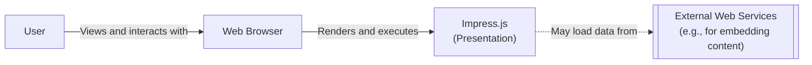
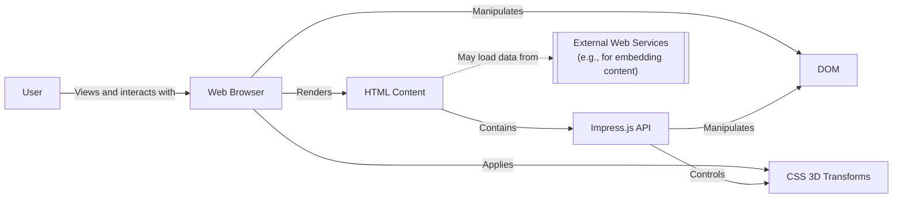
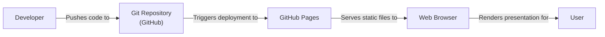
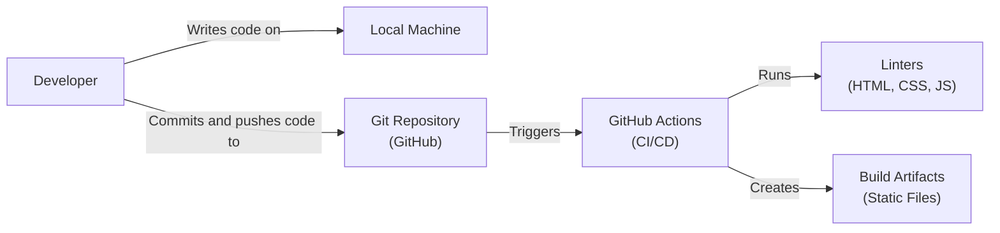

# BUSINESS POSTURE

Business Priorities and Goals:

*   Provide a JavaScript library for creating presentations using HTML and CSS3 features.
*   Offer a more visually engaging and dynamic alternative to traditional slide-based presentations.
*   Enable developers and designers to leverage their existing web development skills.
*   Maintain a lightweight and performant library.
*   Foster an open-source community around the project.
*   Ensure cross-browser compatibility.

Business Risks:

*   **Data Integrity:** Since the library processes user-provided HTML and CSS, there's a risk of malicious code injection if not properly handled. This could lead to data breaches or website defacement if presentations are displayed online.
*   **Reputation:** Vulnerabilities in the library could be exploited, leading to negative publicity and loss of trust in the project and its maintainers.
*   **Availability:** If the library has bugs or performance issues, it could lead to presentations failing to load or render correctly, impacting the user experience.
*   **Intellectual Property:** While the project is open-source, there's a minor risk of copyright infringement if external code is incorporated without proper attribution.
*   **Compliance:** Depending on how and where the presentations created with impress.js are used, there might be compliance requirements related to data privacy (e.g., GDPR) or accessibility (e.g., WCAG).

# SECURITY POSTURE

Existing Security Controls:

*   security control: The project is open-source, allowing for community review and contributions to identify and fix security issues. (Described in the GitHub repository's README and contribution guidelines).
*   security control: The library relies on the browser's built-in security mechanisms for handling HTML and CSS. (Implicit in the design, as it's a JavaScript library running in the browser).
*   security control: The project uses a Content Security Policy (CSP) to mitigate the risk of XSS attacks. (Described in documentation and examples).

Accepted Risks:

*   accepted risk: The library does not perform server-side sanitization of user input. It relies on the user to provide safe HTML and CSS.
*   accepted risk: The library may be vulnerable to browser-specific quirks or vulnerabilities that are outside the project's control.

Recommended Security Controls:

*   security control: Implement input validation and sanitization on the client-side to prevent XSS vulnerabilities. This should be done before the content is processed by the library.
*   security control: Provide clear documentation and examples on how to use the library securely, including best practices for handling user-generated content.
*   security control: Regularly update dependencies to address any known vulnerabilities.
*   security control: Consider integrating with a static analysis tool to automatically scan for potential security issues during development.
*   security control: Provide a security.md file with vulnerability reporting instructions.

Security Requirements:

*   Authentication: Not directly applicable to the library itself, but authentication may be required for accessing or editing presentations depending on the hosting environment.
*   Authorization: Not directly applicable to the library itself, but authorization may be required for accessing or editing presentations depending on the hosting environment.
*   Input Validation:
    *   The library should provide guidance and examples on how to validate and sanitize user-provided HTML and CSS to prevent XSS attacks.
    *   Consider offering built-in functions or options for sanitizing input, although this should be optional to avoid breaking existing presentations.
*   Cryptography: Not directly applicable, as the library primarily deals with presentation logic and rendering. However, if presentations contain sensitive data, users should be advised to use HTTPS for transport encryption.

# DESIGN

## C4 CONTEXT

Element Descriptions:

*   Element:
    *   Name: User
    *   Type: Person
    *   Description: The person viewing or interacting with the presentation.
    *   Responsibilities: Viewing the presentation, navigating through steps, interacting with embedded content.
    *   Security controls: None directly implemented by the user. Relies on browser security and any security measures implemented by the presentation host.

*   Element:
    *   Name: Impress.js (Presentation)
    *   Type: Software System
    *   Description: The presentation created using the impress.js library.
    *   Responsibilities: Defining the presentation structure, content, and styling. Controlling the flow and transitions between steps.
    *   Security controls: Relies on browser security and user-provided input sanitization. CSP can be implemented.

*   Element:
    *   Name: Web Browser
    *   Type: Software System
    *   Description: The web browser used to render and display the presentation.
    *   Responsibilities: Rendering HTML, CSS, and JavaScript. Handling user input and events. Enforcing browser security policies.
    *   Security controls: Built-in browser security mechanisms (e.g., same-origin policy, XSS protection).

*   Element:
    *   Name: External Web Services
    *   Type: Software System
    *   Description: External services that may be used to embed content within the presentation (e.g., YouTube videos, Google Maps).
    *   Responsibilities: Providing the embedded content.
    *   Security controls: Dependent on the specific web service. Impress.js presentations should only embed content from trusted sources.

## C4 CONTAINER

Element Descriptions:

*   Element:
    *   Name: User
    *   Type: Person
    *   Description: The person viewing or interacting with the presentation.
    *   Responsibilities: Viewing the presentation, navigating through steps, interacting with embedded content.
    *   Security controls: None directly implemented by the user. Relies on browser security and any security measures implemented by the presentation host.

*   Element:
    *   Name: Web Browser
    *   Type: Software System
    *   Description: The web browser used to render and display the presentation.
    *   Responsibilities: Rendering HTML, CSS, and JavaScript. Handling user input and events. Enforcing browser security policies.
    *   Security controls: Built-in browser security mechanisms (e.g., same-origin policy, XSS protection).

*   Element:
    *   Name: Impress.js API
    *   Type: JavaScript Library
    *   Description: The core JavaScript code of the impress.js library.
    *   Responsibilities: Providing functions for creating and controlling presentations. Handling user input and events. Manipulating the DOM and CSS 3D Transforms.
    *   Security controls: Should include input validation and sanitization to prevent XSS. Relies on browser security for other aspects.

*   Element:
    *   Name: DOM
    *   Type: Data
    *   Description: The Document Object Model, a tree-like representation of the HTML document.
    *   Responsibilities: Representing the structure of the presentation.
    *   Security controls: None directly. Relies on browser security and proper sanitization of HTML content.

*   Element:
    *   Name: CSS 3D Transforms
    *   Type: Browser Feature
    *   Description: CSS features used to create the 3D effects and transitions in impress.js.
    *   Responsibilities: Providing the visual effects and animations.
    *   Security controls: None directly. Relies on browser security.

*   Element:
    *   Name: HTML Content
    *   Type: Data
    *   Description: The HTML content of the presentation, including the steps and any embedded content.
    *   Responsibilities: Defining the content and structure of the presentation.
    *   Security controls: Must be properly sanitized to prevent XSS vulnerabilities.

*   Element:
    *   Name: External Web Services
    *   Type: Software System
    *   Description: External services that may be used to embed content within the presentation (e.g., YouTube videos, Google Maps).
    *   Responsibilities: Providing the embedded content.
    *   Security controls: Dependent on the specific web service. Impress.js presentations should only embed content from trusted sources.

## DEPLOYMENT

Possible Deployment Solutions:

1.  Static Website Hosting (e.g., GitHub Pages, Netlify, AWS S3, Azure Blob Storage): This is the most common and recommended approach for deploying impress.js presentations.
2.  Web Server (e.g., Apache, Nginx): Presentations can be deployed on a traditional web server.
3.  Content Management System (CMS) (e.g., WordPress, Drupal): Presentations can be embedded within a CMS, although this may require custom plugins or modules.
4.  Electron App: For offline use, the presentation can be packaged as a desktop application using Electron.

Chosen Deployment Solution: Static Website Hosting (GitHub Pages)

Element Descriptions:

*   Element:
    *   Name: Developer
    *   Type: Person
    *   Description: The person creating and deploying the impress.js presentation.
    *   Responsibilities: Writing the HTML, CSS, and JavaScript code. Pushing the code to the Git repository.
    *   Security controls: Should follow secure coding practices and use strong passwords for their GitHub account.

*   Element:
    *   Name: Git Repository (GitHub)
    *   Type: Version Control System
    *   Description: The Git repository hosted on GitHub, containing the presentation files.
    *   Responsibilities: Storing the presentation code and tracking changes.
    *   Security controls: GitHub provides security features such as access controls, two-factor authentication, and vulnerability scanning.

*   Element:
    *   Name: GitHub Pages
    *   Type: Static Website Hosting Service
    *   Description: The static website hosting service provided by GitHub.
    *   Responsibilities: Serving the presentation files to web browsers.
    *   Security controls: GitHub Pages provides HTTPS by default, ensuring secure communication between the browser and the server.

*   Element:
    *   Name: Web Browser
    *   Type: Software System
    *   Description: The web browser used to access and view the presentation.
    *   Responsibilities: Rendering the HTML, CSS, and JavaScript. Handling user input.
    *   Security controls: Built-in browser security mechanisms.

*   Element:
    *   Name: User
    *   Type: Person
    *   Description: The person viewing the presentation.
    *   Responsibilities: Viewing and interacting with the presentation.
    *   Security controls: Relies on browser security and any security measures implemented by the presentation host (GitHub Pages).

## BUILD

Build Process Description:

1.  **Development:** The developer writes the HTML, CSS, and JavaScript code for the presentation on their local machine.
2.  **Commit and Push:** The developer commits the code changes and pushes them to the Git repository (GitHub).
3.  **CI/CD Trigger:** The push to the repository triggers a GitHub Actions workflow.
4.  **Linting:** The workflow runs linters (e.g., HTMLHint, CSSLint, ESLint) to check for code quality and potential errors.
5.  **Build Artifacts:** If the linters pass, the workflow creates the build artifacts, which are simply the static HTML, CSS, and JavaScript files. No compilation or bundling is required for impress.js itself, as it's a client-side library.
6.  **Deployment (not shown in diagram, but part of the build process):** The workflow then deploys the build artifacts to the chosen hosting environment (e.g., GitHub Pages).

Security Controls in Build Process:

*   security control: **Linters:** Linters help to identify potential coding errors and style issues, which can indirectly improve security by reducing the likelihood of vulnerabilities.
*   security control: **GitHub Actions:** Using a CI/CD pipeline like GitHub Actions ensures that the build process is automated and consistent, reducing the risk of manual errors.
*   security control: **Dependency Management:** If the project has external dependencies (although impress.js itself has minimal dependencies), a dependency management tool (e.g., npm, yarn) should be used to keep them up-to-date and address any known vulnerabilities. GitHub's Dependabot can be used for automated dependency updates.
*   security control: **Code Review:** Although not explicitly part of the automated build process, code reviews are a crucial security control to ensure that code changes are reviewed by another developer before being merged.

# RISK ASSESSMENT

Critical Business Processes:

*   **Presentation Delivery:** The primary business process is the ability to create and deliver visually engaging presentations.
*   **Content Creation:** Enabling users to easily create and customize presentations using their existing web development skills.
*   **Community Engagement:** Maintaining an active open-source community around the project.

Data to Protect and Sensitivity:

*   **Presentation Content:** The content of the presentations themselves may contain sensitive information, depending on the user and the purpose of the presentation. Sensitivity can range from low (public presentations) to high (confidential business information).
*   **User Data:** If presentations are hosted on a platform that requires user accounts, user data (e.g., usernames, passwords, email addresses) needs to be protected. However, impress.js itself does not handle user data.
*   **Source Code:** The source code of the impress.js library is publicly available, but protecting its integrity is important to prevent malicious modifications.

# QUESTIONS & ASSUMPTIONS

Questions:

*   Are there any specific compliance requirements (e.g., GDPR, WCAG) that need to be considered for presentations created with impress.js?
*   Will presentations be hosted on a platform that requires user authentication and authorization?
*   Are there any plans to add features that might introduce new security risks (e.g., server-side rendering, user input forms)?
*   What is the expected level of technical expertise of the users creating presentations with impress.js?

Assumptions:

*   BUSINESS POSTURE: The primary goal is to provide a free and open-source tool for creating presentations. Revenue generation is not a primary concern.
*   SECURITY POSTURE: Users are expected to have a basic understanding of web security and will take responsibility for sanitizing any user-generated content included in their presentations. The project maintainers will address any reported security vulnerabilities in the library itself.
*   DESIGN: The library will remain primarily client-side, with no server-side components. The focus will be on leveraging browser features for rendering and animation.