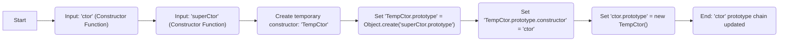

# Project Design Document: inherits - v1.1

**Project Repository:** https://github.com/isaacs/inherits

**Version:** 1.1

**Date:** October 26, 2023

**Author:** Gemini (AI Language Model)

## 1. Introduction

This document provides an enhanced design overview of the `inherits` project, a foundational Node.js module facilitating prototypal inheritance. This document serves as a basis for threat modeling, detailing the project's functionality, architecture, data flow, and key security considerations.

## 2. Goals and Objectives

The primary goal of the `inherits` module is to offer a straightforward and dependable mechanism for implementing prototypal inheritance in JavaScript, specifically within Node.js environments. Key objectives include:

*   **Simplicity:** To provide an easily understandable function for establishing inheritance relationships between JavaScript constructor functions.
*   **Reliability:** To ensure consistent and predictable behavior across different Node.js and JavaScript environments.
*   **Efficiency:** To maintain a minimal footprint and avoid unnecessary performance overhead.
*   **Clarity:** To offer a transparent and well-defined implementation of JavaScript's prototypal inheritance pattern.

## 3. System Architecture and Design

The `inherits` module features a remarkably simple architecture, centered around a single JavaScript function responsible for modifying the prototype chain of constructor functions.

*   **Core Component:** The `inherits` function.

    *   **Input:**
        *   `ctor`: The constructor function that will inherit properties and methods (the child constructor).
        *   `superCtor`: The constructor function to inherit from (the parent constructor).
    *   **Functionality:**
        1. Creates a temporary, intermediary constructor.
        2. Sets the prototype of this temporary constructor to an object created from the `superCtor.prototype` using `Object.create()`. This establishes the inheritance link.
        3. Sets the `constructor` property of the temporary constructor's prototype back to the `ctor`. This ensures that instances of `ctor` correctly identify their constructor.
        4. Sets the prototype of the `ctor` to a new instance of the temporary constructor. This effectively links the `ctor`'s prototype chain to the `superCtor`'s prototype.
    *   **Output:** Modifies the prototype chain of the `ctor` function in place. Returns `undefined`.

*   **Execution Environment:** Typically executed within a Node.js runtime environment or a web browser supporting standard JavaScript features.

*   **Deployment:** Distributed as a package via the npm registry, intended for inclusion as a dependency in other JavaScript projects.

## 4. Data Flow

The data flow within the `inherits` module is direct and focused on manipulating the prototype objects of the provided constructor functions.



**Detailed Steps:**

1. The `inherits` function is invoked with the child constructor (`ctor`) and the parent constructor (`superCtor`) as arguments.
2. A temporary constructor (`TempCtor`) is conceptually created within the function's scope.
3. The prototype of `TempCtor` is set to a newly created object. This object inherits directly from the `superCtor.prototype`, ensuring that instances of `ctor` will inherit properties and methods from `superCtor.prototype`. The `Object.create()` method is crucial here for establishing proper prototypal inheritance.
4. The `constructor` property of `TempCtor.prototype` is explicitly set back to `ctor`. This step is essential for maintaining the correct `constructor` reference for objects created using `ctor`. Without this, the `constructor` property would point to the `superCtor`.
5. Finally, the prototype of `ctor` is set to a new instance of `TempCtor`. This action completes the inheritance setup, linking `ctor.prototype` to the prototypal chain of `superCtor`.

## 5. Security Considerations

While the `inherits` module itself is simple, security considerations primarily stem from its widespread use and its role as a dependency in numerous projects.

*   **Supply Chain Security:**

    *   **Dependency Vulnerabilities (Indirect):** Although `inherits` has no direct dependencies, projects relying on it may have vulnerabilities in their other dependencies. A compromise in a downstream dependency could potentially affect projects using `inherits`. For example, a vulnerable utility library used alongside a class inheriting via `inherits` could be exploited.
    *   **Malicious Package Injection:** A critical risk is the potential compromise of the `inherits` package on the npm registry. If a malicious actor gained control and injected harmful code, any project updating to the compromised version would be vulnerable. This highlights the importance of registry security and package integrity checks.

*   **Misuse of Inheritance Patterns:**

    *   **Incorrect Prototype Manipulation (Downstream):** While `inherits` simplifies inheritance, improper use of inheritance in consuming applications can lead to unexpected behavior or security vulnerabilities. For instance, if a child class incorrectly overrides a parent class method without proper sanitization, it could introduce vulnerabilities.
    *   **Prototype Pollution (Indirect Risk):** While `inherits` itself doesn't directly cause prototype pollution, if the constructor functions passed to `inherits` are susceptible to prototype pollution attacks, this could indirectly impact the application. For example, if user-controlled input is used to define properties on the prototype of a constructor used with `inherits`, it could lead to pollution.

*   **Denial of Service (DoS) Considerations:**

    *   **Resource Exhaustion (Unlikely):** Due to its lightweight nature, `inherits` is highly unlikely to be a direct cause of DoS attacks. However, in extremely resource-constrained environments or within very complex inheritance hierarchies, the cumulative effect of prototype chain lookups could theoretically contribute to performance degradation, though this is improbable in most scenarios.

## 6. Dependencies

The `inherits` module has **zero external dependencies**. It relies exclusively on built-in JavaScript language features. This lack of dependencies significantly simplifies its maintenance and reduces the potential attack surface associated with third-party libraries.

## 7. Deployment

The `inherits` module is deployed as a standard npm package. Developers typically install it using npm or yarn:

*   `npm install inherits`
*   `yarn add inherits`
*   `pnpm add inherits`

Once installed, it can be imported and utilized within Node.js modules using the `require` statement:

```javascript
const inherits = require('inherits');

function EventEmitter() {
  // ...
}

EventEmitter.prototype.emit = function(event) {
  // ...
};

function MyCustomEmitter() {
  EventEmitter.call(this); // Call the parent constructor
}

inherits(MyCustomEmitter, EventEmitter);

MyCustomEmitter.prototype.customMethod = function() {
  // ...
};

module.exports = MyCustomEmitter;
```

## 8. Future Considerations

Given the maturity and stability of the `inherits` module, significant functional changes are not anticipated. However, potential future considerations might include:

*   **TypeScript Definitions:** Providing official TypeScript declaration files (`.d.ts`) to enhance type safety and developer experience in TypeScript projects.
*   **ES Module Support:** Offering a native ES module version of the package for projects adopting modern JavaScript module syntax.
*   **Performance Audits (Periodic):** While already efficient, periodic performance audits could ensure the module remains optimized for current JavaScript engines.

This revised document provides a more detailed and nuanced design overview of the `inherits` project, with a stronger emphasis on security considerations relevant for threat modeling. Understanding the module's function, its role in the dependency chain, and potential misuse scenarios is crucial for assessing the overall security posture of applications that rely on it.