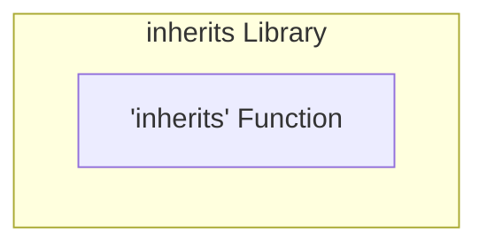
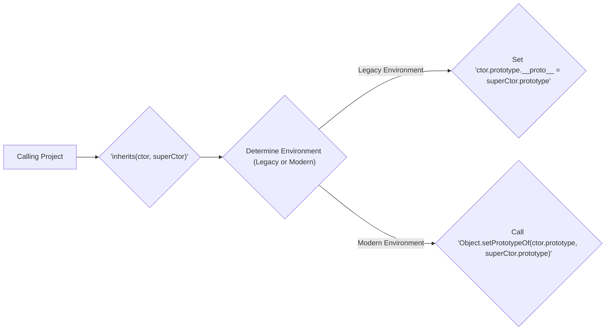

# Project Design Document: `inherits` Library

**Version:** 1.1
**Date:** October 26, 2023
**Author:** AI Software Architect

## 1. Introduction

This document provides an enhanced design overview of the `inherits` JavaScript library, located at [https://github.com/isaacs/inherits](https://github.com/isaacs/inherits). This revision aims to provide even greater clarity and detail regarding the library's functionality, architecture, and crucial security considerations for subsequent threat modeling activities. This document serves as a robust foundational resource for security analysts, developers, and anyone interacting with or relying upon this fundamental library.

## 2. Goals and Objectives

The primary goals of this design document are:

*   To furnish a comprehensive and easily understandable explanation of the `inherits` library's purpose and operational mechanics.
*   To meticulously outline the library's architecture, highlighting its core component and its function.
*   To explicitly identify potential areas of security concern, providing detailed context for future threat modeling exercises.
*   To act as a definitive reference for developers integrating the library and security analysts evaluating systems that depend on it.

## 3. Scope

This document comprehensively covers the design of the `inherits` JavaScript library as it is implemented within the specified GitHub repository. The focus is on the library's core functionality, its intended application, and potential security ramifications stemming from its design and implementation.

The following aspects are explicitly within the scope of this document:

*   The precise behavior of the core `inherits` function, including its handling of different JavaScript environments.
*   Detailed descriptions of the intended use cases for the library within JavaScript projects.
*   A thorough examination of the library's dependencies, specifically noting its lack of external dependencies.
*   In-depth analysis of potential security considerations directly and indirectly related to the library's functionality and its role in the JavaScript ecosystem.

The following aspects are explicitly outside the scope of this document:

*   Detailed security assessments of specific projects that incorporate `inherits` as a dependency.
*   Analysis of specific vulnerabilities present within the Node.js runtime environment or web browsers where `inherits` might be utilized.
*   Performance evaluations, benchmarking data, or optimization strategies related to the `inherits` library's execution.
*   Discussions on alternative approaches to inheritance in JavaScript beyond the scope of what `inherits` provides.

## 4. System Architecture

The `inherits` library is fundamentally a single, self-contained JavaScript function whose sole purpose is to implement classical-like prototypal inheritance within JavaScript. It offers a standardized and cross-environment compatible method for establishing an inheritance relationship between two JavaScript constructor functions.

Here's a detailed component diagram illustrating the library's architecture:

### 4.1. Component Description

*   **`inherits` Function:** This is the singular, central component of the library. It accepts two arguments, both expected to be JavaScript constructor functions: `ctor` (the constructor function that will inherit properties and methods) and `superCtor` (the constructor function representing the superclass). The function's primary action is to modify the prototype of `ctor` to inherit from the prototype of `superCtor`.

### 4.2. Data Flow

The data flow within the `inherits` library is concise and focused on manipulating the prototype chain:

**Detailed Data Flow:**

*   A JavaScript project requiring inheritance invokes the `inherits` function, providing the inheriting constructor (`ctor`) and the superclass constructor (`superCtor`).
*   The `inherits` function internally checks the JavaScript environment to determine the appropriate method for setting the prototype. This check is crucial for cross-environment compatibility.
*   In older JavaScript environments lacking `Object.setPrototypeOf`, the function directly manipulates the `__proto__` property of the `ctor.prototype`, setting it to the `superCtor.prototype`. It's important to note the potential security implications of directly manipulating `__proto__` in certain contexts, although `inherits` uses it for its intended purpose.
*   In modern JavaScript environments supporting `Object.setPrototypeOf`, this method is used to establish the prototype inheritance. This is the more standardized and recommended approach.

## 5. Security Considerations

While the `inherits` library itself is relatively small and focused, its pervasive use across the JavaScript ecosystem introduces several indirect security considerations that are crucial for threat modeling.

Here's a more detailed breakdown of potential security considerations:

*   **Prototype Pollution (Indirect):** Although `inherits`'s direct function is to set up inheritance, it doesn't inherently introduce prototype pollution vulnerabilities. However, if the `superCtor.prototype` is modified maliciously *before* being passed to `inherits`, all constructor functions inheriting from it (via `inherits`) will be affected. This highlights the importance of securing the prototypes of base classes. Threat modeling should consider scenarios where an attacker could influence the `superCtor.prototype` before `inherits` is called.
*   **Supply Chain Vulnerabilities:** Given its widespread adoption, `inherits` represents a significant point in the JavaScript supply chain. If the library's npm package were compromised (through account takeover, malicious contributions, etc.), a malicious version could be injected, impacting a vast number of dependent projects. This underscores the necessity for robust supply chain security practices, including verifying package integrity and provenance.
*   **Misuse and Unexpected Inheritance:**  While not a vulnerability in `inherits` itself, developers' misunderstanding of prototypal inheritance, or incorrect application of `inherits`, can lead to unexpected behavior and potential security flaws in the inheriting classes. For example, accidentally inheriting from a class that exposes sensitive data or methods could create vulnerabilities. Training and clear documentation are essential to mitigate this risk.
*   **Dependency on JavaScript Engine Integrity:** The correct functioning of `inherits` relies entirely on the underlying JavaScript engine's faithful implementation of prototypal inheritance mechanisms (`__proto__` and `Object.setPrototypeOf`). Any vulnerabilities or bugs within the JavaScript engine itself that affect these mechanisms could indirectly impact the behavior of `inherits` and potentially introduce security issues in dependent applications. While less likely, this highlights the importance of keeping JavaScript runtimes updated.
*   **Denial of Service (Indirect):** In highly unusual and contrived scenarios, if `inherits` were used in a way that created excessively deep prototype chains, it *could* theoretically lead to performance issues or even stack overflow errors, potentially causing a denial of service. However, this is highly improbable in typical usage.

## 6. Deployment Model

The `inherits` library is predominantly deployed as a fundamental dependency within Node.js projects through the npm registry. Its inclusion is managed via the `package.json` file, and the library is installed using standard npm or yarn commands.

Detailed Deployment Steps:

*   Explicitly declare `inherits` as a dependency within the `dependencies` or `devDependencies` section of the project's `package.json` file.
*   Execute the command `npm install` or `yarn install` within the project's root directory. This will download the `inherits` library from the npm registry and place it within the `node_modules` directory.
*   Within the project's JavaScript code, import the `inherits` function using `require('inherits');`.

## 7. Dependencies

Crucially, the `inherits` library has **zero external runtime dependencies**. This lack of dependencies simplifies its integration into projects and reduces the overall dependency footprint, minimizing potential supply chain risks associated with transitive dependencies.

## 8. Assumptions

This design document operates under the following assumptions:

*   The GitHub repository at `https://github.com/isaacs/inherits` serves as the authoritative and current source of the library's code.
*   The primary use case for the library is within Node.js environments, although its functionality is also applicable in browser environments.
*   Developers utilizing the `inherits` library possess a foundational understanding of JavaScript's prototypal inheritance model and its implications.

## 9. Out of Scope

The following items are explicitly excluded from the scope of this document:

*   Detailed performance benchmarking and optimization strategies specifically for the `inherits` library's execution speed or memory usage.
*   A granular, line-by-line code walkthrough or in-depth analysis of the library's internal implementation details.
*   Specific security audits or penetration testing results of individual projects that depend on the `inherits` library.
*   Comparative analysis with alternative JavaScript inheritance patterns, such as ES6 classes, or other inheritance utility libraries.

## 10. Future Considerations

While `inherits` is a well-established and stable library, potential future considerations might involve:

*   **Provision of TypeScript Declaration Files:**  Offering official TypeScript declaration files (`.d.ts`) would enhance type safety and improve the development experience for TypeScript-based projects utilizing `inherits`.
*   **Evaluation of Modern JavaScript Alternatives:**  A periodic review of whether modern JavaScript language features, particularly ES6 classes, adequately address the use cases for which `inherits` is commonly employed. This is less about replacing `inherits` and more about understanding its continued relevance in the evolving JavaScript landscape.

This enhanced design document provides a more detailed and nuanced understanding of the `inherits` library, particularly focusing on aspects relevant to threat modeling and security analysis. The identified security considerations should be thoroughly examined within the context of specific applications that rely on this foundational library.
