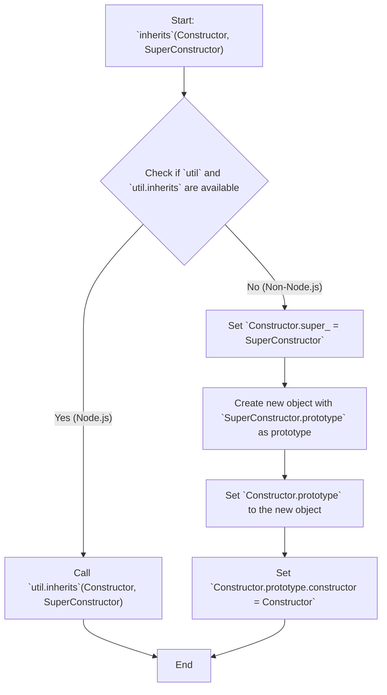

# Project Design Document: inherits

**Version:** 1.1
**Date:** October 26, 2023
**Author:** AI Software Architect

## 1. Introduction

This document provides an enhanced and detailed design overview of the `inherits` project, a fundamental utility in Node.js for establishing prototypal inheritance in JavaScript. This document is intended to serve as a comprehensive resource for understanding the project's architecture, its core components, and the flow of data within it. This deep understanding is crucial for effectively conducting threat modeling activities.

### 1.1. Purpose

The primary objective of this document is to provide a clear, concise, and technically accurate description of the `inherits` library's design. This detailed explanation will empower stakeholders, particularly security analysts and developers, to thoroughly understand the system's inner workings, facilitating the identification and mitigation of potential security vulnerabilities.

### 1.2. Scope

This document comprehensively covers the design of the `inherits` library as it is implemented in the provided GitHub repository: [https://github.com/isaacs/inherits](https://github.com/isaacs/inherits). The focus is on the library's core functionality in setting up prototypal inheritance and its interaction within both Node.js and general JavaScript environments.

### 1.3. Goals

*   To present a clear and unambiguous description of the `inherits` library's architecture and operational logic.
*   To precisely identify the key components of the library and elucidate their interactions.
*   To visually and textually illustrate the flow of data within the library's execution.
*   To serve as a robust and reliable foundation for conducting comprehensive threat modeling exercises.

## 2. System Overview

The `inherits` library is a compact, self-contained JavaScript module specifically designed to streamline the implementation of prototypal inheritance in JavaScript. It offers a single function that accepts two constructor functions as input and establishes the inheritance relationship between them by manipulating their prototype chains. Its behavior adapts slightly depending on whether it's running within a Node.js environment.

### 2.1. High-Level Architecture

The library consists of a single JavaScript file (`inherits.js`) that exports a function. This function's core responsibility is to modify the prototype chain of the designated constructor function to inherit from the prototype of the super constructor.

*   The library exposes a single function named `inherits`.
*   This function takes two arguments: the constructor and the super constructor.
*   Internally, it manipulates the `prototype` property of the constructor.

```mermaid
graph TD
    A["`require('inherits')`"] --> B("`inherits` Function");
    B --> C("`Constructor`");
    B --> D("`SuperConstructor`");
    C -- "Prototype Chain Modification" --> D;
```

### 2.2. Key Components

*   **`inherits` Function:** This is the central and only exported function of the library. Its role is to establish the inheritance relationship.
    *   It accepts two JavaScript functions as arguments.
    *   It modifies the prototype of the first argument to inherit from the second.

### 2.3. Core Functionality

The `inherits` function orchestrates the following actions to establish inheritance:

*   **Conditional Logic:** It first checks if the `util` module is available, which is specific to Node.js environments.
*   **Node.js Environment:** If `util.inherits` is available, it delegates the inheritance setup to this built-in Node.js function for potential performance benefits.
*   **Non-Node.js Environment:** If `util.inherits` is not available, it manually sets up the prototype chain. This involves:
    *   Setting the `prototype` of the `Constructor` to a new object derived from the `SuperConstructor`'s `prototype`.
    *   Ensuring the `constructor` property of the `Constructor`'s `prototype` correctly points back to the `Constructor` function.

## 3. Component Details

This section delves deeper into the implementation details of the key components and their behavior in different environments.

### 3.1. `inherits` Function Implementation Details

The internal logic of the `inherits` function can be broken down into these distinct execution paths:

1. **Availability Check:** The function begins by checking for the presence of the `util` module and its `inherits` function. This check determines the subsequent execution path.
2. **Node.js Path (`util.inherits` Available):**
    *   The function directly invokes `util.inherits(Constructor, SuperConstructor)`.
    *   This leverages the potentially optimized native implementation of inheritance provided by Node.js.
3. **Non-Node.js Path (`util.inherits` Not Available):**
    *   `Constructor.super_ = SuperConstructor;`: A `super_` property is added to the `Constructor` function, providing a reference to the `SuperConstructor`. This is a common pattern for accessing the parent class.
    *   `Constructor.prototype = Object.create(SuperConstructor.prototype, { constructor: { value: Constructor, enumerable: false, writable: true, configurable: true } });`:
        *   `Object.create(SuperConstructor.prototype)`: A new object is created whose prototype is `SuperConstructor.prototype`. This establishes the inheritance link.
        *   The second argument to `Object.create` defines properties to be added to the newly created object. In this case, it sets the `constructor` property to point back to the `Constructor` function. The `enumerable`, `writable`, and `configurable` attributes are set to control the behavior of this property.

### 3.2. Input Parameters Explained

*   **`Constructor`:** This parameter represents the JavaScript function that will inherit properties and methods from the `SuperConstructor`. Its prototype will be modified by the `inherits` function.
*   **`SuperConstructor`:** This parameter represents the JavaScript function whose prototype will be inherited by the `Constructor`. It serves as the base or parent class in the inheritance relationship.

### 3.3. Output and Side Effects

The `inherits` function does not explicitly return a value (`undefined`). Its primary effect is a side effect: the modification of the `Constructor` function's prototype. This modification enables instances of `Constructor` to access properties and methods defined on the `SuperConstructor`'s prototype, effectively establishing the inheritance relationship.

## 4. Data Flow

The data flow within the `inherits` library is focused on the manipulation of object prototypes. The function takes constructor functions as input and alters their internal prototype linkages.



**Detailed Breakdown of Data Flow:**

1. The `inherits` function is invoked with the `Constructor` and `SuperConstructor` functions as arguments.
2. The function checks the execution environment for the availability of Node.js's `util.inherits`.
3. **Node.js Environment Path:** If available, the `Constructor` and `SuperConstructor` are passed directly to `util.inherits`, which handles the underlying prototype manipulation.
4. **Non-Node.js Environment Path:**
    *   A reference to the `SuperConstructor` is stored in the `Constructor.super_` property.
    *   A new object is created. The prototype of this new object is set to `SuperConstructor.prototype`, establishing the inheritance link.
    *   The `Constructor.prototype` is then set to this newly created object.
    *   Finally, the `constructor` property of the newly assigned `Constructor.prototype` is explicitly set back to the `Constructor` function to ensure correct instance creation and type checking.

## 5. Security Considerations

While the `inherits` library is a relatively simple utility, its role in establishing inheritance makes it a point of interest for security considerations, particularly in the context of JavaScript's prototype-based nature.

### 5.1. Prototype Pollution Vulnerabilities

A significant security concern related to prototype manipulation in JavaScript is prototype pollution. If the `SuperConstructor.prototype` is maliciously modified *before* being passed to the `inherits` function, this could inject unintended properties into the prototype chain of the `Constructor` and any objects inheriting from it. This could lead to unexpected behavior or even security vulnerabilities in the application.

*   **Attack Vector:** Malicious code could modify the prototype of a seemingly benign `SuperConstructor` before it's used with `inherits`.
*   **Impact:**  Injected properties could override existing methods or properties, leading to code execution or data manipulation.

**Mitigation Strategies:**

*   **Trust Boundaries:** Ensure that `SuperConstructor` functions and their prototypes originate from trusted sources and are not susceptible to external manipulation.
*   **Object Freezing:** Consider using `Object.freeze()` to prevent modifications to the prototypes of trusted constructor functions before they are used with `inherits`.

### 5.2. Supply Chain Security Risks

As a widely used dependency, `inherits` is a potential target for supply chain attacks. If the `inherits` package on a package registry (like npm) were compromised, a malicious version of the library could be distributed to numerous projects.

*   **Attack Vector:** A compromised package could contain malicious code that is executed when the dependency is installed or used.
*   **Impact:**  This could range from information theft to complete control over the application or system.

**Mitigation Strategies:**

*   **Dependency Scanning:** Utilize software composition analysis (SCA) tools to scan project dependencies for known vulnerabilities.
*   **Package Integrity Verification:** Verify the integrity of downloaded packages using checksums or signatures.
*   **Lock Files:** Employ package lock files (e.g., `package-lock.json`, `yarn.lock`) to ensure consistent dependency versions across environments.

### 5.3. Type Confusion and Unexpected Behavior

If the `Constructor` or `SuperConstructor` arguments passed to `inherits` are not valid JavaScript functions, the function might throw errors or exhibit unexpected behavior. While not a direct security vulnerability in itself, this could lead to application instability or denial-of-service scenarios.

*   **Attack Vector:** An attacker might try to pass non-function values to `inherits` to cause errors.
*   **Impact:** Application crashes or unexpected program flow.

**Mitigation Strategies:**

*   **Input Validation:** Implement robust input validation to ensure that the arguments passed to `inherits` are indeed constructor functions.
*   **Type Checking:** Use type checking mechanisms (e.g., TypeScript, PropTypes) to enforce the expected types of the arguments.

## 6. Deployment

The `inherits` library is typically deployed as a dependency within other JavaScript projects, primarily in Node.js environments. Its deployment is managed through package managers.

**Deployment Procedure:**

*   **Dependency Declaration:** Add `inherits` as a dependency in the `package.json` file of the consuming project.
*   **Installation:** Execute `npm install` or `yarn install` to download and install the library and its dependencies.
*   **Usage:**  Require the `inherits` function in the relevant JavaScript modules using `const inherits = require('inherits');`.
*   **Integration:** Utilize the `inherits` function to establish inheritance relationships between constructor functions within the project's codebase.

## 7. Future Considerations

While `inherits` is a mature and widely adopted library, potential future considerations might include:

*   **TypeScript Definitions:** Providing official and up-to-date TypeScript definition files (`.d.ts`) would enhance type safety and developer experience for TypeScript users.
*   **Modern JavaScript Alternatives:**  Evaluate the extent to which modern JavaScript class syntax and related features can replace the need for this utility in contemporary JavaScript development.
*   **Potential for ES Module Support:**  Exploring the possibility of providing an ES module version of the library for better integration with modern JavaScript module systems.

This revised document provides a more in-depth and nuanced design overview of the `inherits` project. The enhanced details, particularly in the security considerations section, aim to provide a stronger foundation for effective threat modeling and a deeper understanding of the library's role within the JavaScript ecosystem.