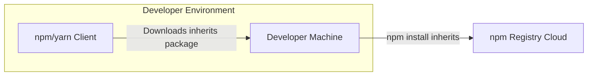

# BUSINESS POSTURE

This project, `inherits`, is a Javascript library designed to provide a utility function for prototypal inheritance in Node.js and browser environments.

- Business priorities and goals:
  - Provide a reliable and efficient mechanism for prototypal inheritance in Javascript.
  - Simplify code reuse and maintainability for developers using Javascript.
  - Ensure compatibility across different Javascript environments (Node.js and browsers).
  - Maintain a small footprint and minimal dependencies to avoid bloating projects that use it.

- Most important business risks:
  - Defects in the `inherits` library could introduce bugs into dependent projects, impacting their functionality and reliability.
  - Security vulnerabilities in the `inherits` library, though less likely in a utility library, could be exploited if present, potentially affecting dependent applications.
  - Poor performance of the `inherits` function could negatively impact the performance of applications that rely on it.
  - Lack of maintenance or updates could lead to incompatibility with newer Javascript environments or security issues remaining unpatched.
  - Supply chain risks if the library is compromised during development or distribution.

# SECURITY POSTURE

- Security controls:
  - security control: Code is hosted on GitHub, providing version control and transparency. (Implemented: GitHub repository)
  - security control: npm registry is used for distribution, providing a standard and widely used distribution channel. (Implemented: npm registry)

- Accepted risks:
  - accepted risk: Reliance on the security of GitHub and npm infrastructure.
  - accepted risk: Open source nature means code is publicly accessible, but also auditable.
  - accepted risk: Limited formal security testing or dedicated security team for this small utility library.

- Recommended security controls:
  - security control: Implement automated security scanning (e.g., using GitHub Actions and linters) to detect potential code quality and security issues during development.
  - security control: Establish a process for reporting and addressing security vulnerabilities, even for a small library.
  - security control: Consider signing releases to enhance supply chain security and verify the integrity of the distributed package.

- Security requirements:
  - Authentication: Not directly applicable to a library. Authentication is relevant for the development and publishing process (GitHub, npm).
  - Authorization: Not directly applicable to a library. Authorization is relevant for controlling access to the repository and publishing rights on npm.
  - Input validation: Not directly applicable as a core requirement for this specific library, as it's a utility function and doesn't directly handle external user input. However, internal input validation within the function itself should be considered for robustness.
  - Cryptography: Not directly applicable to this library, as it does not handle sensitive data or require encryption.

# DESIGN

## C4 CONTEXT

```mermaid
flowchart LR
    subgraph "Organization"
      direction TB
      User["Developer"]
    end
    SystemBoundary["inherits Library"]
    PackageManager["npm Registry"]

    User --> SystemBoundary: Uses
    SystemBoundary --> PackageManager: Published to / Downloaded from
```

- Elements of context diagram:
  - - Name: Developer
    - Type: Person
    - Description: Software developers who use the `inherits` library in their Javascript projects.
    - Responsibilities: Integrate the `inherits` library into their projects to implement prototypal inheritance.
    - Security controls: Developers are responsible for using the library correctly and securely within their own applications. Security controls are primarily on the developer's application side, not directly on the library itself.
  - - Name: inherits Library
    - Type: Software System
    - Description: A Javascript library providing a utility function for prototypal inheritance.
    - Responsibilities: Provide a reliable and efficient `inherits` function. Be compatible with Node.js and browser environments.
    - Security controls: Code hosted on GitHub, distributed via npm. Limited direct security controls within the library itself, focus is on code quality and minimal attack surface.
  - - Name: npm Registry
    - Type: External System
    - Description: The Node Package Manager registry, a public repository for Javascript packages.
    - Responsibilities: Host and distribute the `inherits` library. Provide package management functionalities.
    - Security controls: npm registry implements its own security controls for package integrity, user authentication, and vulnerability scanning.

## C4 CONTAINER

```mermaid
flowchart LR
    subgraph "Organization"
      direction TB
      Developer["Developer"]
    end
    ContainerBoundary["inherits Library Container"]
    subgraph "inherits Library Container"
      direction TB
      InheritsModule["inherits Module (Javascript)"]
    end
    PackageManager["npm Registry"]

    Developer --> ContainerBoundary: Uses
    ContainerBoundary --> PackageManager: Published to / Downloaded from
```

- Elements of container diagram:
  - - Name: Developer
    - Type: Person
    - Description: Software developers who use the `inherits` library in their Javascript projects.
    - Responsibilities: Integrate the `inherits` library into their projects to implement prototypal inheritance.
    - Security controls: Developers are responsible for using the library correctly and securely within their own applications. Security controls are primarily on the developer's application side.
  - - Name: inherits Library Container
    - Type: Container (Javascript Library)
    - Description: Represents the `inherits` library as a deployable unit, consisting of Javascript code.
    - Responsibilities: Encapsulate the `inherits` function. Be distributed as an npm package.
    - Security controls: Source code hosted on GitHub. Package distributed via npm registry. Focus on code quality and minimal dependencies.
  - - Name: inherits Module (Javascript)
    - Type: Component (Javascript Module)
    - Description: The core Javascript module containing the `inherits` function implementation.
    - Responsibilities: Implement the prototypal inheritance logic.
    - Security controls: Code review, static analysis (linters), unit testing.
  - - Name: npm Registry
    - Type: External System
    - Description: The Node Package Manager registry, a public repository for Javascript packages.
    - Responsibilities: Host and distribute the `inherits` library. Provide package management functionalities.
    - Security controls: npm registry implements its own security controls for package integrity, user authentication, and vulnerability scanning.

## DEPLOYMENT

- Deployment solutions:
  - Solution 1: Public npm Registry Deployment (Chosen for detailed description)
  - Solution 2: Private npm Registry Deployment (For internal organizational use)
  - Solution 3: Direct Source Code Inclusion (Developers directly include source code in their projects)

- Detailed Deployment Description (Solution 1: Public npm Registry Deployment):
  The `inherits` library is deployed to the public npm registry, making it accessible to any developer with internet access. Developers install the library using npm or yarn package managers.



- Elements of deployment diagram:
  - - Name: Developer Machine
    - Type: Infrastructure (Laptop/Desktop)
    - Description: The local machine used by a developer to build and run Javascript applications.
    - Responsibilities: Development environment for applications using `inherits`.
    - Security controls: Developer machine security controls (OS hardening, antivirus, etc.) are relevant for protecting the developer's environment, but not directly for the library itself.
  - - Name: npm/yarn Client
    - Type: Software (Package Manager Client)
    - Description: Command-line tools used by developers to interact with the npm registry and manage packages.
    - Responsibilities: Download and install packages from npm registry.
    - Security controls: Relies on the security of the npm registry for package integrity. Developers should use trusted package manager clients.
  - - Name: npm Registry Cloud
    - Type: Infrastructure (Cloud Service)
    - Description: The cloud infrastructure hosting the npm registry.
    - Responsibilities: Host and distribute npm packages. Ensure availability and integrity of packages.
    - Security controls: npm registry implements comprehensive security controls for its infrastructure and the packages it hosts.

## BUILD

- Build process description:
  The build process for `inherits` is relatively simple, typical for a Javascript library. It likely involves:
  1. Developer writes and tests code locally.
  2. Code is pushed to GitHub repository.
  3. (Potentially) Automated tests run via CI (e.g., GitHub Actions).
  4. Developer manually or via CI publishes the package to npm registry using `npm publish`.

```mermaid
flowchart LR
    Developer["Developer"] --> CodeRepository["GitHub Repository"]: Push Code
    CodeRepository --> CI["CI System (Optional)"]: Trigger Build & Tests
    CI --> Artifacts["Build Artifacts (npm package)"]: Build & Test
    Artifacts --> PackageRegistry["npm Registry"]: Publish Package
```

- Elements of build diagram:
  - - Name: Developer
    - Type: Person
    - Description: The developer who writes and maintains the `inherits` library.
    - Responsibilities: Write code, run tests, and publish the library.
    - Security controls: Developer's local environment security, secure coding practices, and secure handling of npm credentials.
  - - Name: GitHub Repository
    - Type: Code Repository (Cloud Service)
    - Description: Hosts the source code of the `inherits` library.
    - Responsibilities: Version control, code storage, collaboration.
    - Security controls: GitHub's security controls for repository access, branch protection, and audit logs.
  - - Name: CI System (Optional)
    - Type: Automation System (Cloud Service or Self-hosted)
    - Description: Continuous Integration system (e.g., GitHub Actions) that automates build and testing.
    - Responsibilities: Automated testing, code linting, build process.
    - Security controls: CI system security, secure configuration of CI pipelines, secrets management for npm publishing credentials.
  - - Name: Build Artifacts (npm package)
    - Type: File (npm package)
    - Description: The packaged `inherits` library ready for distribution.
    - Responsibilities: Contain the distributable code of the library.
    - Security controls: Package integrity checks (e.g., checksums), potentially package signing.
  - - Name: npm Registry
    - Type: Package Registry (Cloud Service)
    - Description: The npm registry where the `inherits` package is published.
    - Responsibilities: Host and distribute the `inherits` package.
    - Security controls: npm registry's security controls for package uploads, integrity checks, and vulnerability scanning.

# RISK ASSESSMENT

- Critical business process:
  - Providing a reliable and functional prototypal inheritance utility for Javascript developers.
  - Ensuring the library is available and accessible through the npm registry.

- Data we are trying to protect:
  - Source code of the `inherits` library.
  - Integrity of the published npm package.

- Data sensitivity:
  - Low to Medium. The source code is publicly available on GitHub. However, maintaining the integrity of the published package is important to prevent supply chain attacks and ensure developers are using a safe and unmodified library. Compromise could lead to malicious code injection into dependent projects.

# QUESTIONS & ASSUMPTIONS

- BUSINESS POSTURE:
  - Assumption: The primary goal is to provide a generally useful and reliable utility library for the Javascript community.
  - Question: Are there specific performance requirements or target environments beyond general Node.js and browser compatibility?
  - Question: Is there a dedicated team or individual responsible for the long-term maintenance and security of this library?

- SECURITY POSTURE:
  - Assumption: Security considerations are important, but for a small utility library, the focus is on basic secure development practices and supply chain security rather than extensive security features within the library itself.
  - Question: Are there any specific security compliance requirements or industry standards that this library needs to adhere to?
  - Question: Is there a formal process for security vulnerability reporting and response for this library?

- DESIGN:
  - Assumption: The design is intentionally simple and focused on providing a single, well-defined function.
  - Question: Are there any plans to expand the functionality of this library in the future?
  - Question: Are there specific dependencies or compatibility requirements with other libraries or frameworks that need to be considered in the design?