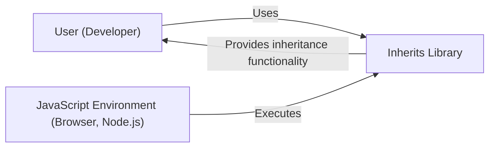
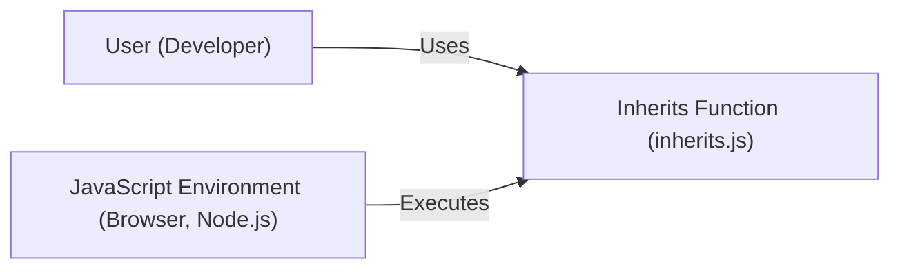
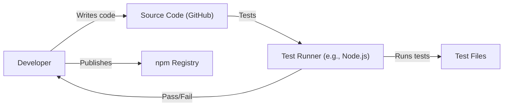

# BUSINESS POSTURE

Business Priorities and Goals:

The "inherits" project is a small, focused utility library designed to provide a clean and consistent way to handle prototypal inheritance in JavaScript. Its primary goal is to simplify and standardize a common pattern in JavaScript development, making code more readable, maintainable, and less prone to errors related to inheritance.  The project prioritizes simplicity, broad compatibility (across different JavaScript environments, including older browsers), and minimal overhead.

Business Risks:

-   Incorrect Implementation:  If the `inherits` function itself contains bugs, it could lead to subtle but significant errors in any application that uses it.  Since inheritance is a fundamental concept, these errors could manifest in unexpected ways and be difficult to debug.
-   Compatibility Issues:  While the project aims for broad compatibility, there's a risk that it might not function correctly in all target environments (e.g., very old browsers, specific JavaScript engines, or environments with unusual configurations).
-   Security Vulnerabilities (Indirect): While the library itself is unlikely to be a direct target for attacks, incorrect usage or vulnerabilities *within* the library could potentially be exploited in larger applications.  For example, if the library somehow allowed prototype pollution, it could be a serious issue.
-   Maintenance Overhead: As a foundational, widely-used library, even small changes or bug fixes could have a large impact.  The project needs to be carefully maintained to avoid introducing regressions.
-   Obsolescence: With the introduction of ES6 classes, the need for a library like `inherits` is reduced. The risk is that the library becomes obsolete and unused, although many legacy systems may still rely on it.

# SECURITY POSTURE

Existing Security Controls:

-   security control: Code Reviews: The GitHub repository shows a history of commits and pull requests, suggesting that some level of code review is likely taking place, although the extent and rigor are unknown. (Inferred from the GitHub repository structure).
-   security control: Testing: The repository includes a `test` directory with JavaScript test files. This indicates that unit tests are used to verify the functionality of the `inherits` function. (Located in the `test` directory).
-   security control: Simplicity: The library's small size and focused scope inherently reduce the attack surface. (Inherent to the project's design).
-   security control: Public Scrutiny: Being an open-source project on GitHub, the code is subject to public scrutiny, which can help identify potential vulnerabilities. (Inherent to the open-source nature).

Accepted Risks:

-   accepted risk: Limited Formal Security Audits: There's no indication of formal security audits or penetration testing.
-   accepted risk: Reliance on Community Reporting: The project likely relies on the community to report security issues.
-   accepted risk: Compatibility Trade-offs:  Prioritizing broad compatibility might mean that some newer security features or best practices are not implemented.
-   accepted risk: No explicit input validation: The library itself doesn't perform explicit input validation, as it expects correct usage by developers.

Recommended Security Controls:

-   security control: Static Analysis: Integrate static analysis tools (e.g., ESLint with security plugins) into the development workflow to automatically detect potential security issues and coding errors.
-   security control: Fuzz Testing: Implement fuzz testing to provide a wide range of unexpected inputs to the `inherits` function and identify potential edge cases or vulnerabilities.
-   security control: Dependency Management: Regularly review and update any dependencies (although this project appears to have none) to mitigate supply chain risks.
-   security control: Security Documentation: Add a `SECURITY.md` file to the repository to provide clear instructions on how to report security vulnerabilities.

Security Requirements:

-   Authentication: Not applicable, as this is a utility library, not a service or application that requires authentication.
-   Authorization: Not applicable, as the library does not manage access control.
-   Input Validation: While the library itself doesn't handle user input directly, it's crucial that developers using the library properly validate input in their own applications to prevent prototype pollution or other injection vulnerabilities. The library should *not* introduce any vulnerabilities related to how it handles its arguments (the constructor functions).
-   Cryptography: Not applicable, as the library does not deal with cryptographic operations.

# DESIGN

## C4 CONTEXT

Element Description:

-   Element:
    -   Name: User (Developer)
    -   Type: Person
    -   Description: A software developer who uses the `inherits` library in their JavaScript code.
    -   Responsibilities:
        -   Integrates the `inherits` library into their application.
        -   Uses the `inherits` function correctly to implement inheritance.
        -   Ensures proper input validation and secure coding practices in their application.
    -   Security controls:
        -   Follows secure coding practices.
        -   Performs input validation.

-   Element:
    -   Name: Inherits Library
    -   Type: Software System
    -   Description: The `inherits` library, a small JavaScript utility for prototypal inheritance.
    -   Responsibilities:
        -   Provides a single function, `inherits`, for setting up inheritance between JavaScript constructors.
        -   Ensures correct and consistent behavior across different JavaScript environments.
    -   Security controls:
        -   Code reviews.
        -   Unit testing.
        -   Simplicity of design.
        -   Public scrutiny (open-source).

-   Element:
    -   Name: JavaScript Environment (Browser, Node.js)
    -   Type: Software System
    -   Description: The runtime environment where the JavaScript code (including the `inherits` library and the developer's application) is executed.
    -   Responsibilities:
        -   Provides the JavaScript engine to execute the code.
        -   Manages memory and other resources.
        -   Provides APIs for interacting with the environment (e.g., DOM in a browser).
    -   Security controls:
        -   Built-in security features of the JavaScript engine (e.g., sandboxing, same-origin policy).
        -   Regular security updates and patches.

## C4 CONTAINER

Element Description:

-   Element:
    -   Name: User (Developer)
    -   Type: Person
    -   Description: A software developer who uses the `inherits` library in their JavaScript code.
    -   Responsibilities:
        -   Integrates the `inherits` library into their application.
        -   Uses the `inherits` function correctly to implement inheritance.
        -   Ensures proper input validation and secure coding practices in their application.
    -   Security controls:
        -   Follows secure coding practices.
        -   Performs input validation.

-   Element:
    -   Name: Inherits Function (inherits.js)
    -   Type: Container (JavaScript Module)
    -   Description: The single module containing the `inherits` function.
    -   Responsibilities:
        -   Provides the `inherits` function for setting up inheritance.
    -   Security controls:
        -   Code reviews.
        -   Unit testing.
        -   Simplicity of design.

-   Element:
    -   Name: JavaScript Environment (Browser, Node.js)
    -   Type: Software System
    -   Description: The runtime environment where the JavaScript code (including the `inherits` library and the developer's application) is executed.
    -   Responsibilities:
        -   Provides the JavaScript engine to execute the code.
        -   Manages memory and other resources.
        -   Provides APIs for interacting with the environment (e.g., DOM in a browser).
    -   Security controls:
        -   Built-in security features of the JavaScript engine (e.g., sandboxing, same-origin policy).
        -   Regular security updates and patches.

## DEPLOYMENT

Deployment Solutions:

1.  **npm Package:** The primary deployment method is as an npm package. Developers install it using `npm install inherits`.
2.  **Direct Inclusion:** Developers can also download the `inherits.js` file directly and include it in their project.
3.  **Bundled with Applications:** The library might be bundled directly into larger applications using tools like Webpack or Browserify.

Chosen Solution (npm Package):

Element Description:

-   Element:
    -   Name: Developer
    -   Type: Person
    -   Description: A software developer.
    -   Responsibilities: Installs and uses the inherits library.
    -   Security controls: Uses trusted package managers.

-   Element:
    -   Name: npm Registry
    -   Type: Software System
    -   Description: The public npm registry, a repository for JavaScript packages.
    -   Responsibilities: Hosts and serves the `inherits` package.
    -   Security controls:
        -   npm's built-in security features (e.g., two-factor authentication, package signing).
        -   Regular security audits and vulnerability scanning.

-   Element:
    -   Name: Developer's Codebase
    -   Type: Code Repository
    -   Description: The developer's project where the `inherits` library is used.
    -   Responsibilities: Contains the application code and its dependencies.
    -   Security controls:
        -   Secure coding practices.
        -   Dependency management.

-   Element:
    -   Name: Application
    -   Type: Software System
    -   Description: The final application that uses the `inherits` library.
    -   Responsibilities: Performs the application's intended functionality.
    -   Security controls:
        -   Application-specific security controls.

-   Element:
    -   Name: JavaScript Environment (Browser, Node.js)
    -   Type: Software System
    -   Description: The runtime environment where the application runs.
    -   Responsibilities: Executes the JavaScript code.
    -   Security controls:
        -   Built-in security features of the JavaScript engine.

## BUILD

Build Process Description:

1.  **Code Development:** The developer writes the code for the `inherits` library and its tests.
2.  **Source Control:** The code is stored in a Git repository on GitHub.
3.  **Testing:**  The developer runs the tests locally using a test runner (likely Node.js, based on the `package.json` and test files).  The tests are located in the `test` directory.
4.  **Publication:**  The developer publishes the package to the npm registry using the `npm publish` command.  This makes the library available for others to install.

Security Controls in Build Process:

-   security control: Code Reviews:  (Inferred) Code reviews on GitHub can help catch errors and potential vulnerabilities before they are merged into the main branch.
-   security control: Testing:  Automated tests help ensure the correctness of the code and prevent regressions.
-   security control: npm Security Features:  npm provides features like two-factor authentication for publishing packages, which helps prevent unauthorized modifications.

# RISK ASSESSMENT

Critical Business Processes:

-   Providing a reliable and consistent mechanism for JavaScript inheritance. This is critical for developers building applications that rely on prototypal inheritance.

Data Protection:

-   The library itself does not handle any sensitive data directly.  It's a utility function, not a data storage or processing component. Therefore, there is no data sensitivity to consider *within* the library itself. However, the *misuse* of the library could potentially lead to vulnerabilities in applications that *do* handle sensitive data.

# QUESTIONS & ASSUMPTIONS

Questions:

-   What is the specific process for handling security vulnerability reports? Is there a dedicated security contact or process?
-   Are there any plans to formally deprecate the library in favor of ES6 classes, or is long-term maintenance planned?
-   What specific test runner and testing framework are used?
-   Are there any known compatibility issues with specific JavaScript environments?
-   Are there any linters or static analysis tools currently used in the development process?

Assumptions:

-   BUSINESS POSTURE: The project prioritizes simplicity, correctness, and broad compatibility over adding new features.
-   SECURITY POSTURE: The project relies primarily on code reviews, testing, and the open-source nature of the project for security. There are no formal security audits.
-   DESIGN: The library consists of a single, small JavaScript file with a single exported function. It has no external dependencies. The deployment process relies on the npm registry. The build process is simple, involving local testing and then publishing to npm.